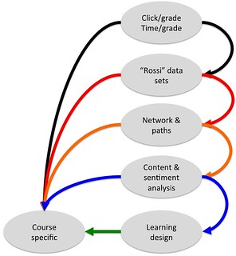

---
categories:
- indicators
date: 2017-03-10 15:31:23+10:00
next:
  text: Playing with Python and Jupyter notebooks for analytics
  url: /blog2/2017/03/12/playing-with-python-and-jupyter-notebooks-for-analytics/
previous:
  text: How we are rethinking L&T grants, awards and professional learning
  url: /blog2/2017/03/09/how-we-are-rethinking-lt-grants-awards-and-professional-learning/
title: Reflecting on playing with learning analytics
type: post
template: blog-post.html
---
This is the 2nd in 3 posts thinking about learning analytics and how we might engage with it better. [The first](http://djon.es/blog/2017/03/08/thinking-about-more-reproducible-research-and-learning-analytics/) rambled on about reproducible research and hunted for what we might do.

This post is an attempt to reflect on some work I did last year trying to [design a collection of analytics to explore engagement](http://djon.es/blog/2016/04/14/designing-a-collection-of-analytics-to-explore-engagement/). The aim is to remind myself what was done and try to distill what worked and what didn't. Hopefully to inform what we might do this year.

## Background

[The work last year](http://djon.es/blog/2016/04/14/designing-a-collection-of-analytics-to-explore-engagement/) was trying to work

> with a group of fellow teacher educators here at USQ to explore what is happening around student engagement with our online courses

The aim was to generate a range of different engagement related analytics, show them to the teacher educators, explore what if anything was revealed about our courses and think about what that might mean for the courses, but also the exploration of analytics. The hope was that the cycle would help identify more contextually useful analytics that could actually reveal something interesting.

## What was done

[](https://www.flickr.com/photos/david_jones/26380443975/in/dateposted-public/ "Version 1 of process")
<script async src="//embedr.flickr.com/assets/client-code.js" charset="utf-8"></script>

The aim was to generate and share analytics based on the diagram to the right (click on it the diagram to expand). The aim was to generate a website where those involved could see the different analytics applied to their respective courses (and each others). This was intended to drive discussion.

A website was generated to do this. Access was limited to those involved in the project. The following links illustrate the generated analytics using a course I taught.

You may see some menus with other course codes, there won't be any data for other courses. The menus - at times - don't work all that well.

- click/grade and other basic indicators
    - [average clicks grouped by grade](http://djon.es/EDC3100/2015_1/clickGrades/) - with different views for different cohorts
        
        Ignore the explanation at the bottom, also a broken link with one of the modes
        
    - Split between clicks on forums versus content [2015 S1](http://djon.es/qilters/EDC3100/2015_1/dhits/) and [2015 S2](http://djon.es/qilters/EDC3100/2015_1/dhits/)
        
        Compare the distribution for: [all students](http://djon.es/qilters/EDC3100/2015_1/dhits/index.html), [just online students](http://djon.es/qilters/EDC3100/2015_1/dhits/mode=Online.html), [students from one campus](http://djon.es/qilters/EDC3100/2015_1/dhits/mode=Springfield.html) and [the staff](http://djon.es/qilters/EDC3100/2015_1/dhits/staff.html)
        
    - Group by grade and show # hits divided into content and forum clicks: [Semester 1](http://djon.es/qilters/EDC3100/2015_1/dhitsGrades/) and Semester 2
        
        Roll your mouse over a bar to get the counts for clicks.
        
- time/grade - nada
- networks & paths
    
    - Replies to posts network - [normal Q&A forum](http://djon.es/qilters/EDC3100/2015_1/postsNetwork/) or [announcements forum](http://djon.es/qilters/EDC3100/2015_1/postsNetwork/forum=49765.html) or [ice-breaker activity](http://djon.es/qilters/EDC3100/2015_1/postsNetwork/forum=49752.html)
        
        You can zoom in and out with trackpad. Click on network map to move it around.
        
        Click on the red (or any) hexagon and move it around to more clearly see the number of connections.
        
        Should be able to see a significant difference between the different types of forums.
        
    - content & sentiment analysis - nada
    - learning design - not a chance
    
    So only the simple ones done.
    
    The educators involved could navigate through the generated site and compare their course with others. This was scafolded lightly using a blog with links to specific analytics and questions. It was never done well or in a concerted manner.
    
    ## How was it done
    
    At a high level, I had a perl script that would loop through an array that specified which type of analytic to perform (e.g. _clickGrades_, _dhits_, _dhitsGrades_) and for which course offerings and modes. The array looked a bit like this
    
    ```
    EDC3100 => {
      "2015_1" => {
        clickGrades => [ qw/ all mode=Online mode=Springfield mode=Toowoomba 
    mode=Fraser_Coast / ],
        dhits => [ qw/ all mode=Online mode=Springfield mode=Toowoomba mode=F
    raser_Coast staff / ],
        dhitsGrades => [ qw/ all mode=Online mode=Springfield mode=Toowoomba 
    mode=Fraser_Coast staff / ],
    
    ```
    
    The script would loop through these entries and execute the following code (modified just a little for clarity/space)
    
    ```
    my $model = $factory->getModel( OFFERING => "${course}_$offering",
                                    ANALYTIC => $analytic );
    
    my $view = $factory->getView( MODEL => $model, VIEW => $analytic );
    
    my $string = $view->Display( SUBSET => $subset, COURSE => $course, 
                                 OFFERING => $offering, ANALYTIC => $analytic );
    
    writePage( OFFERING => "${course}_$offering",
               ANALYTIC => $analytic, SUBSET => $subset,
               STRING => $string );
    
    ```
    
    ### Analytics classes
    
    Underpinning the above were a collection of analytics classes that could also be called directly. For example, the following.
    
    ```
    my $model = QILTers::Analytics::dhits->new( OFFERING => "EDC3100_2015_1" );
    
    my $view  = QILTers::Analytics::dhits_View->new( MODEL => $model );
    
    my $string = $view->Display(
                    COURSE => "EDC3100", OFFERING => "2015_1",
                                SUBSET => "mode=Toowoomba,grade=F" );
    print $string;
    
    ```
    
    This type of [MVC architecture](https://en.wikipedia.org/wiki/Model%E2%80%93view%E2%80%93controller) was used largely because I had a large code-base (and related experience) from my PhD.
    
    In this context, the model classes converted institutional specific notions. This included
    
    - that EDC3100\_2015\_1 could be used to identify a course
    - access to additional information about users (gpa, grade etc) not stored in Moodle.
    - support the _SUBSET_ mechanism to allow focus on particular campuses, grades etc.
    
    The view classes were responsible for translating the gathered data into a format that could be handed over to a couple of different client libraries ([plotly](http://plot.ly/) and [cytoscape](http://js.cytoscape.org/))
    
    ## Reflections and lessons learned
    
    Misc reflections include
    
    - It took time to get all this set up, hence the lack of progress.
    - The _subset_ functionality was useful.
    - The production of the web pages was all a bit kludgy
    - Need better support for integrating the analysis into discussions with others.
    - Tightly integrating the navigation with the content was a mistake.
    - The client libraries were quite useful, but required some familiarisation.
    - The code here relies on quite out dated technologies.
    - Once the structure was in place, different analysis could be done fairly quickly (given time)
    - Exploration of different analytics or modes, still required intervention by a coder
    
    Next step, what are others doing in this area? What might be a better way to do this?