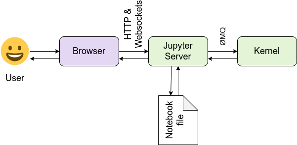
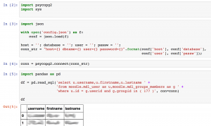

See also: [[blog-home | Home]]

This is the third in a series of posts documenting "thinking" and progress around the next step of some bricolage with learning analytics and attempts to make some progress with the [Indicators project](http://indicatorsproject.wordpress.com/).

The [last post](http://djon.es/blog/2017/03/10/reflecting-on-playing-with-analytics/) in this series revisited some work I did last year. The aim of this post is to consider and perhaps start playing with what's next. At this stage, I think that's Python and Jupyter notebooks, but I could be wrong.

Actually, nope. Jupyter notebooks appear to be the way to go. At least worth of a bit more exploration and experimentation. The following explains and documents the process toward a Jupyter notebook that is actually accessing a reasonable Moodle database on postgresql. The main data source I'll be working with. It seems possible.

**Notes to self:**

- Defining indicators and connection with the literature.
    
    Remember to revisit and explore further the literature mentioned in section 1.4 of [this report on teaching culture indicators](http://scholar.uwindsor.ca/ctlreports/5). There is literature defining and expanding the conception of _indicators_
    
- How does this nascent approach fit with ["learning analytics in Australia"](http://he-analytics.com/au/)
    
    This project has a number of frameworks/ways of thinking about learning analytics, especially within institutions. How does some of the early thinking driving this work fit within/contradict those? What can we learn?
    
    e.g. we obviously fit within [cluster 2 - focus on pedagogy, curriculum, learning](http://he-analytics.com/au/about-the-project/the-findings/patterns-learning-analytics-implementations/), but how well does what we're doing fit within the pattern and what impact will that have on outcomes?
    
- What can be borrowed/copied from the Loop tool?
    
    [The Loop Tool](http://melbourne-cshe.unimelb.edu.au/research/edutech/completing-the-loop) is the product from an OLTC funded project. It's [open source](https://github.com/looptool/download), works with Blackboard and Moodle, and I believe uses Python.
    
    It includes a "data warehouse", which I assume brings together Blackboard/Moodle data. This could provide a great platform upon which to build this work. Not only leverage work done by smart people, but also provide a cross-platform foundation.
    
    Only question is what limitations exist in this data because they couldn't get direct access to the database. Appears it relies on csv and course export files. And some of the code still seems a little less than portable (hard coded paths with specific user home directories). **Perhaps** indicating a need to look for other cross-platform solutions.
    
    Beyond code re-use, some of the indicatores/patterns/visualiations generated by that tool might serve as useful things to re-create.
    
- How does Data Carpentry link with Software Carpentry and which is applicable to the institution?
- Four facets of reproducibility as a tool to evaluate approaches to learning analytics.
    
    e.g. how well does a data warehouse informed approach meet these.
    
- Link to intelligence amplification.
    
    A focus on helping people collaborate around the indicators, rather than simple accept or use.
    

## Options?

When "learning analytics" is mentioned within an institution, it seems people are always looking for an application (usually an existing one) such as a data warehouse or tools such as Open Refine or [Trifacta](https://www.trifacta.com/). That seems like a combination of [Kaplan's law of instrument](http://djon.es/blog/2008/11/19/tool-users-research-hammers-and-the-law-of-instrument/) and a tendency for most people to see themselves as users of digital technology. That is, to do something with digital technology there must be an application designed specifically to help them with that task, rather than writing code.

[This post](http://simplystatistics.org/2014/09/04/why-the-three-biggest-positive-contributions-to-reproducible-research-are-the-ipython-notebook-knitr-and-galaxy/) seeks to argue that "the three biggest positive contributions to reproducible research are iPython ([Jupyter](http://jupyter.org)) Notebook, [knitr](http://yihui.name/knitr/), and [Galaxy](http://galaxyproject.org/). It positions Juypter and knitr as fitting with those with scripting (coding) experience. While Galaxy are for those who script not so much. Personally (and perhaps self-servingly), I see significant value in being able to script to provide more flexibility and broaden possibilities. Without scripting you are stuck with the model and capabilities of the chosen tool.

[](https://www.flickr.com/photos/generated/8031816100/)  
"[dreaming](https://www.flickr.com/photos/generated/8031816100/)" ([CC BY 2.0](https://creativecommons.org/licenses/by/2.0/)) by [jared](https://www.flickr.com/people/generated/)

This leaves the question to be whether to use Jupyter notebooks or R/knitr. Tony Hirst has [begun thinking](https://blog.ouseful.info/2017/02/23/reporting-in-a-repeatable-parameterised-transparent-way/) about comparing these, but still early days. Given I have no real experience with either, it's difficult to come to a meaningful decision. Suggesting that I'll tend toward the option that appears most familiar - Jupyter notebooks/Python.

Longer term, there is a glimmer of a hope that using Python to generate the indicators/patterns, might enable later integration of such indicators into [a MAV-like tool](http://djon.es/blog/2014/09/21/breaking-bad-to-bridge-the-realityrhetoric-chasm/#MAV). This would enable these indicators/patterns to be visible within the learning environment.

As it happens, the argument around Jupyter versus R might not be an argument after all. Apparently - [at least at some stage](https://blog.ouseful.info/2014/02/26/time-to-drop-calculators-in-favour-of-notebook-programming/) - it is possible to include R code in iPython notebooks. [But apparently](https://blog.ouseful.info/2015/06/06/ipython-markdown-opportunities/), Knitr can also include Python code. The comments of [that last post](https://blog.ouseful.info/2015/06/06/ipython-markdown-opportunities/) reveal a native R kernel for iPython.

Below you will learn how I now know that Jupyter is actually an acronym of the three core languages that the Jupyter notebook approach was designed to support - **JU**lia, **PYT**hon and **R**. (it also supports 40 other programming languages)

## Getting set up: Python and Juypter

To know I've been relying largely on Tony Hirst's blog posts about his experiences for information on Juypter notebooks. Time to check out other resources.

### Jupyter.org

[This appears](http://jupyter.org) to be the home for Jupyter notebooks and offers the following definition

> The Jupyter Notebook is an open-source web application that allows you to create and share documents that contain live code, equations, visualizations and explanatory text. Uses include: data cleaning and transformation, numerical simulation, statistical modeling, machine learning and much more.

It also points to [JupyterHub](https://jupyterhub.readthedocs.io/en/latest/) as a mechanism to multiple single user Jupyter notebook servers. This might be interesting for sharing within an institution. For later consideration.

It also offers advice on [installing Jupyter](http://jupyter.org/install.html). I'd played with anaconda/jupyter previously, so a quick test and I'm ready to go. Nothing to install.

Follow the instructions on [running the notebook](https://jupyter.readthedocs.io/en/latest/running.html#running) and I'm away.

[Installing python](https://github.com/Reproducible-Science-Curriculum/introduction-RR-Jupyter/blob/master/notebooks/Installation.ipynb) from the course below.

### Reproducible research and Jupyter Notebooks

Thanks again to Tony Hirst, I'm aware of [the curriculum](https://reproducible-science-curriculum.github.io/rr-jupyter-workshop/) for a workshop titled "Reproducible Research using Jupyter Notebooks. This seems a perfect resource for us to get started.

At this stage, I think I'll turn this into a diary of my attempts to work through this curriculum (without the facilitated workshop). There are 5 modules, each of the following link to the git repo that contains the materials. Sadly, it appears that there isn't a consistent format for each.

- [Introduction](https://github.com/Reproducible-Science-Curriculum/introduction-RR-Jupyter)
    
    Reasonably accessible from the github site.
    
    Can find slides that provide a gentle into to using notebooks.
    
- [Data and Project Organization](https://github.com/Reproducible-Science-Curriculum/organization-RR-Jupyter)
    
    Different format, more use of Jeckyl and markdown. Not immediately obvious how to use. Based on [previous version](https://github.com/datacarpentry/rr-organization1), which is a bit more usable. [Google doc](https://docs.google.com/document/d/1d3Cv4b31xskUVz60Y72VeOspg2rnBKeVZ2yV9o7bt9U/edit) that documents additional thinking moving beyond the previous version. Appears that the final version is incomplete
    
    Some of it is focused on data coming in files. Section on how to structure notebooks.
    
- [Data Exploration](https://reproducible-science-curriculum.github.io/rr-jupyter-workshop/#iii-data-exploration)
    
    Here's the [notebook](https://github.com/Reproducible-Science-Curriculum/data-exploration-RR-Jupyter/blob/master/Data%20exploration.ipynb) with the content.
    
- [Automation](https://reproducible-science-curriculum.github.io/rr-jupyter-workshop/#iv-automation)
    
    Links to [brainstorming Google doc](https://docs.google.com/document/d/1umz_cpC5APu2GPXDPtczWMFlYNdDaht3CBgWNbm_XsI/edit#heading=h.fmhbi0en7at9) and links to lesson notebooks: [one](https://github.com/Reproducible-Science-Curriculum/automation-RR-Jupyter/blob/master/Automation_Lesson1_Intro_InstructorNotes.ipynb), there's a second but it's currently basically empty. The first is not much better
    
    References the software carpentry resource on [Programming with Python](http://swcarpentry.github.io/python-novice-inflammation/)
    
- [Publication and Sharing](https://reproducible-science-curriculum.github.io/rr-jupyter-workshop/#v-publication-and-sharing)
    
    Covers a few interesting topics, has some content, but incomplete.
    

[The documentation lesson](https://github.com/Reproducible-Science-Curriculum/publication-RR-Jupyter/blob/master/documentation.md) includes mention of a [gallery of notebooks](https://github.com/jupyter/jupyter/wiki/A-gallery-of-interesting-Jupyter-Notebooks), including

- [Collection of notebooks on stats, machine learning and data science](https://github.com/jupyter/jupyter/wiki/A-gallery-of-interesting-Jupyter-Notebooks#statistics-machine-learning-and-data-science)
- [Data science and big data with python](https://github.com/phelps-sg/python-bigdata/blob/master/README.md)
    
    Some [Python basics](http://nbviewer.jupyter.org/github/phelps-sg/python-bigdata/blob/master/src/main/ipynb/intro-python.ipynb)
    
- [data visualisation and plotting](https://github.com/jupyter/jupyter/wiki/A-gallery-of-interesting-Jupyter-Notebooks#data-visualization-and-plotting)

Other resources

- [Pandas cheatsheet](https://github.com/pandas-dev/pandas/blob/master/doc/cheatsheet/Pandas_Cheat_Sheet.pdf)

## Learning about reproducible research with Jupyter notebooks

Starting with [this slide-deck](https://reproducible-science-curriculum.github.io/introduction-RR-Jupyter/slides/Jupyter_Intro_Background.slides.html#/), which is linked from the [git repository](https://github.com/Reproducible-Science-Curriculum/introduction-RR-Jupyter) for the first module in the workshop.

A jupyter notebook can be thought of as a lab/field diary.

### Architecture

- front-end
    - _Web application_ to develop notebook documents
    - _Notebook document_ representation of the content, including I/O of computations, explanatory text, images, etc.
        
        These are JSON files saved with .ipynb extension.
        
- back-end
    - _Notebook server_ \- communication between the kernal and the web browser
    - _Kernel_ responsible for executing the code, different kernels support different languages.



### [Espoused benefits](https://reproducible-science-curriculum.github.io/introduction-RR-Jupyter/slides/Jupyter_Intro_Background.slides.html#/3): Jupyter notebooks for reproducible research

Documentation/literate programming. Exploration and development. Communication and collaboration. Publishing.

### Working with notebooks

[This slide deck](https://reproducible-science-curriculum.github.io/introduction-RR-Jupyter/slides/Workshop%20slides%20-%20using%20the%20notebooks.slides.html#/) assumes you have Jupyter notebooks installed.

And I've created my first notebook. Hello world, ahh markdown how I love you.

A notebook consists of a sequence of cells. Each cell has a type. The default types are: code, markdown, heading and "Raw NBConvert". Not sure on the last one, but there others a fairly self-explanatory.

_NBConvert_ mechanism to convert notebook into other formats. Can also be included within the python code to allow output to be downloaded as other formats. **Explore this more**

_Important:_ If the last line of a code cell produces output, then the output is embedded in the notebook just below the cell. If the last line is a variable, then the value of the variable is displayed, including rich output. As long as the semi-colon is not added to the last line. A semi-colon will prevent output generation.

Add a **!** to the start of cell and you have a command-line prompt.

And there a nifty macros/shortcut keys - ESC-L - turn on line numbering

Slight problem with the workshop examples and my install. The example that I thought would be interactive, isn't. The server, however is generating an error that I've just spotted

```
[IPKernelApp] WARNING | Widget Javascript not detected.  It may not be installed properly. Did you enable the widgetsnbextension? If not, then run "jupyter nbextension enable --py --sys-prefix widgetsnbextension"

```

Mm, nice, the Jupyter notebook itself provides support for checkpoints. Simple, embedded version control? There's also auto-complete.

Save, run the command suggested, restart and all is fixed and working.

The basic of Jupyter look fine. Doable. Need to upskill on Python, translate existing practices into Python and think about the processes.

### Intro to reproducible research with Jupyter

[This](https://github.com/Reproducible-Science-Curriculum/introduction-RR-Jupyter/blob/master/notebooks/Intro-to-reproducible-research.ipynb) was meant to be the first of the "sessions" in the workshop. The neat thing that this illustrates is that github will render Jupyter notebooks. Actually, thinking about the above, that's obvious, but also limited. Notebooks = code + markdown. Github won't render the code, but it will the markdown, as github uses markdown.

[Viewing the raw source](https://raw.githubusercontent.com/Reproducible-Science-Curriculum/introduction-RR-Jupyter/master/notebooks/Intro-to-reproducible-research.ipynb) of the notebook reveals that it's a little more complex than that. Remember, notebooks are json. One cell = one json element (whatever it's called in json). Most of the cells in this notebook are markdown. The markdown is rendered.

**Four facets of reproducibility**

1. Documentation
2. Organisation
3. Automation
4. Dissemination

This aren't a bad set of principles for promoting learning analytics. Also points to some weaknesses in standard organisational practices.

### Data exploration

[The module's notebook](https://github.com/Reproducible-Science-Curriculum/data-exploration-RR-Jupyter/blob/master/Data%20exploration.ipynb) starts with basics of Python libraries, dataframes. Includes sections on

- assessing structure and cleanliness of data
- data cleaning
- tidy data
- merging data
- ..
- visualisation with matplotlib and [seaborn](http://seaborn.pydata.org/examples/)

Given the data we're working with is largely from a database and is reasonably clean, this isn't likely to be directly useful. The examples using dataframes could be.

Visualisation with Seaborn could also be useful.

### Automation

[The lesson](https://github.com/Reproducible-Science-Curriculum/automation-RR-Jupyter/blob/master/Automation_Lesson1_Intro_InstructorNotes.ipynb) covers

- review of good practices - naming conventions...and basic

Not much else.

## The model

An early start at grouping what I've derived from the above and apply to how we might work.

Jupyter notebooks are created via a web interface. As such, they are stored in a web server's file space. It can have folders etc, it can link etc. On a laptop this is local. This could be managed using git.

Could try the following

1. create new directory - Indicators
2. create a index.pynb
    
    This becomes the default notebook. Do some initial testing. It could point off to other pynbs
    
    Initially, could use very basic python. Eventually evolve.
    
3. Create a github repo and save it there.
4. Others could make use of it and contribute
5. Could export the notebooks as HTML etc and place online? maybe.

http://stackoverflow.com/questions/18734739/using-ipython-notebooks-under-version-control

## Getting started

### Accessing postgresql from Python

Possible options

- [pscopg2](http://support.datascientistworkbench.com/knowledgebase/articles/835206-access-postgresql-from-python-using-pscopg2).
    
    Only problem is that the connection details are hard-coded into the notebook. Not great security in sharing environment.
    
    **Need:** to find a way to support local (secret) database configuration
    

- [doing it with Jupyter](http://jgardiner.co.uk/blog/read_sql_pandas)
    
    This explicitly mentions the config file idea and then connects it with psycopg2 and proceeds to show some good examples specific to pandas
    

Let's try it. Mmm, psycogp2 not installed. [This](https://anaconda.org/anaconda/psycopg2) works.

```
conda install -c anaconda psycopg2

```

A bit of playing with the example and that is working. Success!!!

That's working. A screen shot of the Jupyter notebook is shown below (data blurred out).

There remain a couple of problems with this in terms of abstraction, but I can see how it might work.

[](http://djon.es/blog/wp-content/uploads/2017/03/new.png)