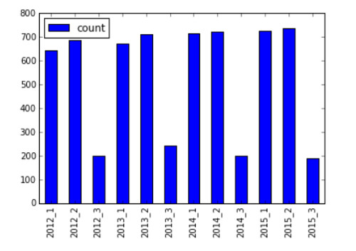

---
categories:
- indicators
date: 2017-03-16 08:05:25+10:00
next:
  text: Observations on university L&T portals
  url: /blog/2017/03/17/observations-on-university-lt-portals/
previous:
  text: Sharing "indicators platform" via github
  url: /blog/2017/03/13/sharing-indicators-platform-via-github/
title: Adding a custom library and a semi-real application - Indicators notebook(s)
type: post
template: blog-post.html
---
So the [indicators notebooks/platform](http://djon.es/blog/2017/03/13/sharing-indicators-platform-via-github/) is on github. The one and only bit of analysis is almost completely useless and still requires a fair bit of set up code. The aims in this post are

1. Add in a custom library for connecting to the data source.
2. Add an indicator/notebook that does something kind of useful.

Hopefully, this will lay the ground work to start converting [old Perl-based stuff](http://djon.es/blog/2017/03/10/reflecting-on-playing-with-analytics/) into this new environment and start doing something more useful.

## Custom library

The aim here is to replace all of the following

```
import json

with open('../config.json') as f:
    conf = json.load(f)

from sqlalchemy.engine.url import URL 
from sqlalchemy import create_engine

engine = create_engine(URL(**conf))

```

To something like

```
import Indicators

Indicators.connect();

```

or something slightly more in the correct Python idiom.

[That's done](https://github.com/djplaner/Indicators/blob/ab114701c168d17f9b60723819d46ccf788dfcd4/Home.ipynb). Will still need to be refined

1. Better way to specify the path of the config file.
    
    Hard coded in a file in git is not a great start.
    
2. Does it fit with the Python idiom/approach?

## Something a little real

Aim here is to do something a little useful to people (or at least me) and to start playing with the visualisation options.

A need I've identified in my new role is to have some overall idea of the number of courses, number of teaching staff, number of students etc at my institution. There doesn't seem to be any easy way to find out and nobody I talk to knows (with a few exceptions).

Aim here is to develop a notebook that shows the number of courses in Moodle per semester.

_Lesson learned:_ In Python, when doing SQL using like and a wildcard - typically % - you need to use %%. As Python reads % [as string formatting](http://stackoverflow.com/questions/8657508/strange-sqlalchemy-error-message-typeerror-dict-object-does-not-support-inde) i.e.

```
shortname like 'EDC3100_2015_%%'
```

### Years and terms

The first question is how to capture the individual years and terms that I might want to capture individual data for.

I could hard-code this into the notebook, but it will be different at another insitution - or a different data set. So I'm going to try a kludge, add the data to the JSON config file. Like this

```
  "allYears" : [ 2012, 2013, 2014, 2015 ],
  "allTerms" : [ "2012_1", "2012_2", "2012_3", 
                 "2013_1", "2013_2", "2013_3",
                 "2014_1", "2014_2", "2014_3",
                 "2015_1", "2015_2", "2015_3" ]

```

This is ugly and will need to be revised, but I'm in a hurry.

Though this raises the question as to whether or not I can access the data now it's in the _Indicators_ module.

That exploration leads to an additional function in Indicators module to get this variable. This is probably how the problem with moodle prefixes will get fixed.

Yep done. Able to include a _prefix_ in queries. The value is defined in a new config file _lms.conf_ which look slike

```
{
  "allYears" : [ 2012, 2013, 2014, 2015 ],
  "allTerms" : [ "2012_1", "2012_2", "2012_3",
                 "2013_1", "2013_2", "2013_3",
                 "2014_1", "2014_2", "2014_3",
                 "2015_1", "2015_2", "2015_3" ],
  "mdl_prefix" : "moodle.mdl_"
}
```

Using the prefix in code looks like

```
import Indicators
import pandas as pd

engine = Indicators.connect()
configuration = Indicators.config()
prefix = configuration['mdl_prefix']

query = "select id,username,firstname,lastname from " + prefix + "user where id<30 "
df = pd.read_sql(query,engine)

```

### Segue - groking data frames

I'm still very new to Python and tend to bring my Perl/PHP frames to programming. Need to spend some time groking "the Python way". In writing this script it's become obvious I haven't yet grokked data frames. Hence reading [this on data frames](https://www.datacamp.com/community/tutorials/pandas-tutorial-dataframe-python#gs.4B4S7Kc) and the following.

Actually, I found [this](https://www.datacamp.com/community/tutorials/pandas-tutorial-dataframe-python#gs.4B4S7Kc) from datacamp.com not at all easily accessible, but there are some nuggets there.

Indexing of data frames has a number of different ways to access elements. _iloc_ is the standard array approach i.e. based on position. indexes can also be more hash like.

Mmmm, more work to do.

### The kludgy solution

Have added [a Course Offerings notebook](https://github.com/djplaner/Indicators/blob/618f6d2e5170b892ab12db0cb8bb276d86e9d9bc/Course%20offerings.ipynb) that includes code like the following that will produce a simple histogram showing number of courses for each year/term within the database.

This code is the year portion. The term graph is almost identical

```
yearCounts = {}

for year in configuration['allYears']:
    query = "select count(id) from " + prefix + "course where " +\
             " shortname like '%%_" + str(year) + "_%%'"
    df = pd.read_sql( query, engine)
    yearCounts[year] = df.loc[0]

counts = pd.DataFrame.from_dict( yearCounts,orient='index')

counts.plot(kind='bar')
```

The code for terms generates output like the following

[](https://www.flickr.com/photos/david_jones/33422301436/in/dateposted-public/ "Course per term")
<script async src="//embedr.flickr.com/assets/client-code.js" charset="utf-8"></script>

Still quite ugly, there are [ways to improve](https://datasciencelab.wordpress.com/tag/pandas/) the output. A later task. Along with much more learning about Python etc.