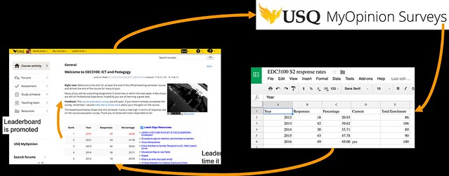

See also: [[blog-home | Home]]

The following information is taken from and adds to the contents of [a poster](http://djon.es/Leaderboard/June2017Poster.pdf) by [Alice Brown](https://staffprofile.usq.edu.au/Profile/Alice-Brown) and I for a USQ L&T Celebration Event. It describes the need for a Student Evaluation of Teaching leaderboard, how it works, and the results of some early applications (12 to 15% increases in response rates in individual courses, resulting in response rates that are double the institutional average - around 50%, rather than 25%).

## Challenge – Course evaluation 'buy-in' and responding to MyOpinion

Many academics struggle with getting 'buy-in' from students in terms of providing feedback to institutional Student Evaluation of Teaching (SET) surveys (labelled MyOpinion at USQ). While efforts to prompt students to respond might include: various forms of communication, announcements, reference to how a course has reflected and acted on feedback in future updates, and the other promotion features (including USQ’s use of a big yellow button), increasing the percentage of response rates still tends to be a challenge (average response rates in SET fluctuating between 30% and 50%) (Bennett & De Bellis, 2010; Spooren et al, 2013).

## Nudging, gamification & leaderboards

- Nudge - "any aspect of the choice architecture that alters people’s behaviour in a predictable way without forbidding any options or significantly changing their economic incentives" (Thaler & Sunstein, 2008, p. 6).
- Deterding et al (2011) define gamification as "the use of game design elements in non-game contexts" (p. 10) with the intent to "motivate and increase user activity" (p. 9)
- Leaderboards are amongst the most popular of games mechanics found in case studies using gamification in education (Dicheva et al, 2015).

> A leaderboard is a game design element consisting of a visual display that ranks players according to their accomplishments; when used in an educational setting it serves as a way for students to directly compare their own performance with that of others (Christy & Fox, 2014, p. 67)

## Question - Can a MyOpinion leaderboard help increase student response rates?

Initially trialled in 2015 in the course EDC3100, and then extended into several other courses in 2016, two academics wanted to explore whether providing a 'nudge' through the integration of a MyOpinion leaderboard could increase response rates.

## How does a MyOpinion leaderboard work?

The following image (click on it to see a bigger version) illustrates how the leaderboard works. See below for more explanation.

The MyOpinion leaderboard works like this:

1. **Course examiner checks response rates.**
    
    While the MyOpinion survey is live, the course examiner checks the MyOpinion site every day or so. At this stage, the course examiner can only see the number of responses. Nothing more.
    
2. **Course examiner updates a Google spreadsheet**
    
    If the current response rate increases, the course examiner updates a previously configured Google spreadsheet. The spreadsheet contains data about all the relevant offerings of the courses, including: the number of enrolled students; and, the number of MyOpinion responses. The spreadsheet automatically calculates the percentage response rate. The current course offering is indicated by a _yes_ in the appropriate column.
    
3. **Visitors to the course home page see the leaderboard**
    
    Every time someone visits the course home page, the data in the Google Spreadsheet is transformed into a table that ranks different course offerings based on the percentage response rate. This is done via a small bit of common Javascript that can be embedded into almost any web page.
    
4. **Additional nudges are employed**
    
    The visibility of the leaderboard may not be sufficient. Typically course examiners have used other means to nudge students to complete MyOpinion. Often using the leaderboard data to spark any 'competitive nature'.
    
5. **Students complete the MyOpinion survey**
    
    Thereby changing the response rate and starting the cycle all over again.
    

## Results

As the graphs below show, each of the courses that have trialled the leaderboard have:

1. Increased response rates by at least 12-15%; and,
2. Have achieved response rates around or more than double the institutional average.
    
    (Institutional average currently only available for 2015 and 2016)
    

Roll your mouse pointer over the graph elements to see additional information.

\[plotly\] {"data": \[{"type": "bar", "name": "EDC3100", "x": \["2014", "2015", "2016"\], "y": \[33.71, 47.78, 49\]}, {"type": "scatter", "name": "USQ average", "x": \["2015", "2016"\], "y": \[26.83, 23.52\]}\], "layout": {"yaxis": {"range": \[0, 100\], "title": "% response rate"}, "title": "EDC3100 Semester 2 MyOpinion % Response Rate", "xaxis": {"ticktext": \["2014 (n=106)", "2015 (n=88)  
Leaderboard", "2016 (n=100)  
Leaderboard"\], "title": "Year", "tickvals": \["2014", "2015", "2016"\]}}} \[/plotly\]

\[plotly\] {"data": \[{"type": "bar", "name": "EDE2101", "x": \["2015", "2016"\], "y": \[36, 52\]}, {"type": "scatter", "name": "USQ avge S2", "x": \["2015", "2016"\], "y": \[26.83, 23.52\]}\], "layout": {"yaxis": {"range": \[0, 100\], "title": "% response rate"}, "title": "EDE2101 Semester 2 MyOpinion Response Rate", "xaxis": {"ticktext": \["2015 (n=74)", "2016 (n=102)  
Leaderboard"\], "tickvals": \["2015", "2016"\]}}} \[/plotly\]

\[plotly\] {"data": \[{"type": "bar", "name": "EDE4010", "x": \["2014", "2015", "2016"\], "y": \[29, 35.5, 41\]}, {"type": "scatter", "name": "USQ avge S2", "x": \["2015", "2016"\], "y": \[26.83, 23.52\]}\], "layout": {"yaxis": {"range": \[0, 100\], "title": "% response rate"}, "title": "EDE4010 Semester 2 MyOpinion Response Rate", "xaxis": {"ticktext": \["2014 (n=82)", "2015 (n=76)", "2016 (n=97)  
Leaderboard"\], "tickvals": \["2014", "2015", "2016"\]}}} \[/plotly\]

## What's next?

- Improve support for other types of leaderboard.
    
    A single USQ course may have 3 or 4 different groups of students based on campus. At least one staff member has experimented with use the leadboard to rank response rates from different student groups within the current offering of the course.
    
- Improve advice for using the leaderboard
    
    Current advice is accessible via the _more information_ section below. There are a number of ways this could be improved.
    
- Promote more broadly to academics
    
    Currently the leaderboard has largely been promoted within School of Teacher Education and Early Childhood.
    
- Explore options to automate leaderboard updating
    
    In theory, if an API were available for MyOpinion response rates, there would be no need for manual updating of the Google spreadsheet (or the Google spreadsheet).
    
- Integrate a range of other communication strategies
- Evaluate

## More information

- **How to implement the leaderboard in your USQ course?**
    - There are [instructions](http://djon.es/blog/creating-a-set-leaderboard/) that USQ course examiners can use to implement a MyOpinion leaderboard.
    - There is also [a video](https://lor.usq.edu.au/usq/file/eb733b3c-8ed5-4463-a7cb-85b641acaa51/1/David_Jones_leader_board_-_20170420_062339_6.html) (only visible to USQ staff) where Alice and I walk through the process of setting up the leaderboard in her course.
- **Background on the origins of the leaderboard**
    
    [This post](http://djon.es/blog/2016/05/23/automating-a-set-leaderboard/) provides some background on how and why the semi-automated leaderboard approach was created.
    

## References

Bennett, T., & De Bellis, D. (2010). The Move to a System of Flexible Delivery Mode (Online v Paper) Unit of Study Student Evaluations at Flinders University. Management Issues and the Study of Initial Changes in Survey Volume, Response Rate and Response Level. Journal of Institutional Research, 15(1), 41–53.

Christy, K. R., & Fox, J. (2014). Leaderboards in a virtual classroom: A test of stereotype threat and social comparison explanations for women’s math performance. Computers & Education, 78, 66–77. https://doi.org/10.1016/j.compedu.2014.05.005

Deterding, S., Dixon, D., Khaled, R., & Nacke, L. (2011). From Game Design Elements to Gamefulness: Defining “Gamification.” In Proceedings of the 15th International Academic MindTrek Conference: Envisioning Future Media Environments (pp. 9–15). New York, NY, USA: ACM. https://doi.org/10.1145/2181037.2181040

Dicheva, D., Dichev, C., Agre, G., & Angelova, G. (2015). Gamification in Education: A Systematic Mapping Study. Journal of Educational Technology & Society, 18(3), 75–88.

Spooren, P., Brockx, B., & Mortelmans, D. (2013). On the Validity of Student Evaluation of Teaching: The State of the Art. Review of Educational Research, 83(4), 598–642. https://doi.org/10.3102/0034654313496870

Thaler, R., & Sunstein, C. (2008). Nudge: Improving decisions about health, wealth and happiness. New York: Penguin.

Thaler, R., & Sunstein, C. (2008). Nudge: Improving decisions about health, wealth and happiness. New York: Penguin.