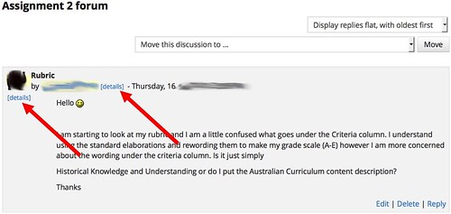
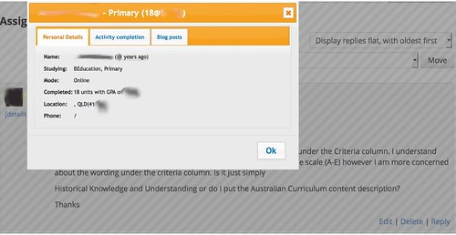
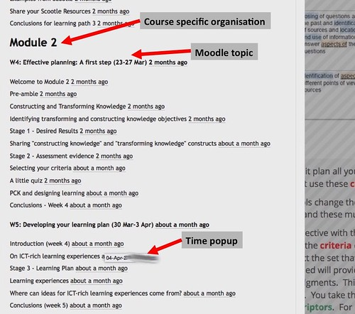
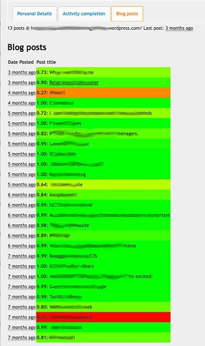

David Jones, Hazel Jones, Colin Beer, Celeste Lawson, Implications and questions for institutional learning analytics implementation arising from teacher DIY learning analytics, To appear in the proceedings of the [2017 Australian Learning Analytics Summer Institute (ALASI 2017)](http://itali.uq.edu.au/alasi2017)

## Abstract

Learning analytics promises to provide insights that can help improve the quality of learning experiences. Since the late 2000s it has inspired significant investments in time and resources by researchers and institutions to identify and implement successful applications of learning analytics. However, there is limited evidence of successful at scale implementation, somewhat limited empirical research investigating the deployment of learning analytics, and subsequently concerns about the insight that guides the institutional implementation of learning analytics. This paper describes and examines the rationale, implementation and use of a single example of teacher do-it-yourself (DIY) learning analytics to add a different perspective. It identifies three implications and three questions about the institutional implementation of learning analytics that appear to generate interesting research questions for further investigation.

## Introduction

Learning analytics has been receiving attention since the late noughties. The promise of data driven decision making and the nature of the higher education environment – decreasing funding, increasing focus on quality, increasing use of technology enhanced learning (TEL) – is seen as making the institutional adoption of learning analytics an imperative for institutions of higher education (Macfadyen, Dawson, Pardo, & Gasevic, 2014, p. 17). By 2017, there appears to have been sufficient time and resources invested to realise the affordances learning analytics offers to education at the whole-of-institution scale (Colvin, Dawson, Wade, & Gašević, 2017), especially given predictions in 2012 that it was one year away from mainstream adoption within the Australian Higher Education sector (Johnson, Adams, & Cummins, 2012). However, there are only a small number of institutions that have demonstrated impact on learning and teaching outcomes through large-scale learning analytics programs (Ferguson, Clow, et al., 2014) and there are concerns that there remains limited evidence of the effectiveness of learning analytics at scale, or sufficient understanding to guide successful implementation (Colvin et al., 2017; Ferguson, Macfadyen, et al., 2014).

To address this concern there is a growing conceptual literature offering various models and frameworks to guide learning analytics adoption. Colvin et. al (2017) categorise and analyse this literature and argue that “while the models afford insight, they do not capture the breadth of factors that shape LA implementations” (p. 284). As a result these models are unable to provide those responsible for institutional implementation of learning analytics “the nuanced, situated, fine-grained insight they require to guide them through learning analytics implementation” (Colvin et al., 2017, p. 284). Such a restriction could be addressed through empirical research that examines the “burgeoning, albeit nascent implementations found across higher education institutions” (Colvin et al., 2017, p. 285). Research by Colvin et al (2015) offers one valuable contribution, however, there are limitations. One such limitation is the focus on the perspectives from one set of participants involved in learning analytics projects: senior leaders charged with responsibility for implementation. While an important source of insight, this focus perhaps echoes the lack of human-centeredness that pervades learning analytics implementation (Liu, Bartimote-Aufflick, Pardo, & Bridgeman, 2017) and tends “to privilege the administrator rather than the student – or even the instructor” (Kruse & Pongsajapan, 2012, p. 4). This limitation raises questions such as:

> What is the experience of students and teachers using institutional learning analytics? How might an understanding of their experience inform the institutional implementation of learning analytics?

It is these questions that this paper seeks to explore, with a particular focus on the experience of teaching staff. To do this, it describes a single teacher’s experience developing and using a do-it-yourself (DIY) approach to learning analytics. The paper starts by describing this approach and then draws from it three implications and three questions for institutional implementation of learning analytics.

## Know thy student

During 2015 and 2016 one of the authors developed and used a DIY learning analytics tool (Know thy student) within a third-year Bachelor of Education course. Offered twice a year, the course had an annual enrolment of 400+ students. Two-thirds of these students studied via online only, and less than 15% were ever likely meet the course examiner in person. The design of the course focused explicitly on making significant use of a Moodle course site and sought to encourage: significant active student online engagement; formative assessment; student reflection via individual blogs; and, use of social bookmarking. Know thy student was developed to address limitations in existing institutional systems and enable more meaningful responses to student queries. The tool was inspired by and built on top of [the Moodle Activity Viewer (MAV)](https://github.com/damoclark/mav) developed at CQUniversity (Jones and Clark, 2014). While the tool interacted with, and extracted information from a number of institutional systems, it could only be used via the implementer’s laptop to interact with the specific course site.

When in use, Know thy student modified every page of the course site viewed by the teacher. It added a **\[details\]** link where ever a link to a user profile appeared, as illustrated in Figure 1.

Figure 1 - Modified course page

Clicking on one of the **\[details\]** link would open a new pop up window (Figure 2) to provide access to information about the student. The pop-up window provided information in three separate tabs, including: personal details (Figure 2); activity completion (Figure 3); and, blog posts (Figure 4). Know thy student provided the examiner with ubiquitous and embedded access to course specific information about each student enrolled in the course.

Figure 2 - Personal details

Across four offerings of the course in 2015 and 2016 the teacher used the tool 3,100 separate times to access information on 761 different students. Representing 89.5% of the enrolled students. For one student, the tool was used 32 separate times. The median number of uses per student was three.

Initially, most of this use was generated when answering student questions on course discussion forums. However, the embedded and ubiquitous availability of the **\[details\]** link enabled other unplanned uses. For example, the course home page provided a list of all course participants who had been recently logged into the course site. As designed, Know thy students would add a **\[details\]** link to this list. This modification to the learning environment encouraged the development of a practice where the teacher would use that link to proactively learn more about students. In turn, this led to an increase in engaging with students via their blog posts and other means. Since the tool was simple and easily within grasp it provided a platform that encouraged more meaningful and unexpected connections with hundreds of students.

## Implications and questions for learning analytics implementation

Analysis and discussion about the case have led the authors to suggest three implications about and three questions for the institutional implementation of learning analytics. Given the exploratory nature of this research there are tenative suggestions and each implication and question in turn generates additional questions for further investigation.

### Implication #1: Institutional learning analytics currently falls short of an important goal

Baker (2016) identifies a common goal shared by learning analytics systems, that “of getting key information to a human being who can use it” (p. 607). This case shows that at least one institution’s approach to learning analytics is falling short of this goal, and there are indications that this problem is not limited to a single institution. Almost 10 years ago, Dawson & McWilliam (2008) comment on how poor the LMS data aggregation and visualisation tools of the day were in helping academics understand student learning behaviour. In 2013, focus groups of academics from the University of Melbourne identified a common need to be better able to correlate from different institutional systems (Corrin, Kennedy, & Mulder, 2013). A recent unpublished experiment at another institution by one of the co-authors of this paper identified that gathering relevant information for ten post-graduate students took over an hour and required the use of five separate information systems owned by three separate institutional departments. This reinforces the observation from Liu (2017) that academics “rarely have the data that they actually want in a place and form where it can actually be used”.

How widespread is this apparent failure? What are the factors contributing to this apparent failure? What can be done to address it?

Figure 3 - Activity completion

### Implication #2: Embedded, ubiquitous, contextual learning analytics enable emergent practice

Experience from this case suggests that providing useful contextual data appropriately embedded ubiquitously throughout the learning environment can enable unplanned and effective interventions. In this case, being able to access student and course specific information throughout the learning environment enabled the teacher to adopt the unplanned practice of proactively connecting with students. Arguably, this may fit with characterisations of teachers as bricoleurs focused on making do with and creatively repurposing the tools that are at hand (Hatton, 1989). Providing contextually appropriate tools, however, is difficult given the sheer diversity involved in education where “there is no single technological solution that applies for every teacher, every course, or every view of teaching” (Mishra & Koehler, 2006, p. 1029).

Does the provision of embedded, ubiquitous and contextual learning analytics increase and encourage greater adoption and bricolage by teachers with learning analytics? What impact would that have on the learning experience? Given the inherent diversity in education, how can institutional learning analytics provide contextually appropriate learning analytics?

Figure 4 - Sentiment analysis of blog posts

### Implication #3: Teacher DIY learning analytics is possible

This case shows that technically literate academics are able to leverage available technologies to implement and use teacher DIY learning analytics. The notion of end-user development is not new with “\[m\]ost programs today … written not by professional software developers, but by people with expertise in other domains working towards goals for which they need computational support” (Ko et al., 2011, p. 21). Such work can be seen as undesirable due to concerns about inefficiency, error, support, scalability, privacy and security. However, it can also address limitations and flaws in provided systems (Koopman & Hoffman, 2003).

How is DIY learning analytics viewed in relation to the institutional implementation of learning analytics? Is it something to be prevented, or enabled and encouraged? Given technology trends, can it be prevented?

### Question #1: Does institutional learning analytics have an incomplete focus?

The common response to seeing the Know thy student tool is to ask if and how it can be reused in other courses. Such a response aims to understand if and how this particular learning analytics tool can “make the leap from the focused and particular to the broad and general” (Lonn et al., 2013, p. 235). This echoes what is seen as the core goal for most learning analytics project “to move from small-scale research towards broader institutional implementation” (Ferguson, Macfadyen, et al., 2014, p. 120). However, if “there is no single technological solution that applies for every teacher, every course, or every view of teaching” (Mishra & Koehler, 2006, p. 1029), then how can a broad and general focus effectively respond to diverse contextual requirements? How can the institutional implementation of learning analytics address concerns that it is focused at an “institutional scale rather than a human scale” (Kruse & Pongsajapan, 2012)? Should and can its focus be expanded to include both the human and institutional scale?

### Question #2: Does the institutional implementation of learning analytics have an indefinite postponement problem?

In seeking to move learning analytics beyond a research project to institutional scale Lonn et al ( 2013) partnered with a university’s Information Technology (IT) service. A first step in their project involved the IT service performing a feasibility of the project and placing “it in their timeline of priorities” (p. 236) and subsequently the project “was delayed due to existing projects … that were a higher priority for the institution” (Lonn et al., 2013, p. 238). Given the typical prioritisation scheme used by a university IT service, a tool like Know thy student which focuses on a need from a single course is unlikely to ever be of sufficient priority to be actioned at the institutional level. It will be indefinitely postponed.

Would learning analytics that are specific to the learning designs within a single course ever be implemented by institutional IT? Would such a project be indefinitely postponed? What impact does this have on the institutional implementation of learning analytics? Should and can this problem be addressed?

### Question #3: If and how do we enable teacher DIY learning analytics?

The above has suggested that teacher (and perhaps student) DIY learning analytics may make a useful contribution to institutional learning analytics implementation. However, there are numerous significant questions around if and how it can be achieved, including: whether or not it can be integrated sustainably into institutional implementation. and whether or not teaching staff have sufficient data and technical literacy to effective contribute?

In terms of institutional implementation, Colvin et al (2017) provide recommendations necessary for sustainable learning analytics adoption that could offer useful guidance. In addition, there are projects like that described by Liu et al (2017) that are actively using such recommendations to support a level of teacher DIY learning analytics. The challenge is that enabling and encouraging teacher DIY learning analytics appears to represent a mindset that is incommensurable with the assumptions underpinning the majority of contemporary institutional practices (Jones & Clark, 2014). There is also research suggesting that the convergent and generative characteristics of pervasive digital technology requires the development of radically different approaches to corporate IT infrastructures and organisational strategic frameworks (Yoo, Boland, Lyytinen, & Majchrzak, 2012).

The low digital fluency of teaching staff has been identified as a significant challenge impeding the adoption of digital technology within higher education (Johnson, Adams Becker, Estrada, & Freeman, 2014). If low digital fluency is challenging the effective use of digital technologies by teaching staff, then it does raise questions about the likelihood of teacher DIY learning analytics. However, research in end user development suggests that such DIY practices are already happening and that such practices have positive impacts on the quantity and quality of adoption of digital technologies (Ko et al., 2011; Koopman & Hoffman, 2003). Finally, Scanlon et al (2013) observes that the complexity of technology-enhanced learning – such as learning analytics - means that accepting “’user-driven’ contributions from both teachers and students” (p. 34) may be necessary “to allow for effective intervention” and in order to understand the complexity of practices that is the “context for any particular TEL innovation” (p. 34).

## Conclusion

This paper has briefly described a single case of teacher DIY learning analytics, which raises a number of implications and questions for the institutional implementation of learning analytics. It is suggested that empirical research moving beyond those in charge of the institutional implementation of learning analytics to those living with such systems can deepen the understanding of current experience with such systems and subsequently contribute improvements. From this case it appears that current approaches are failing to meet a potentially important goal of “getting key information to a human being who can use it” (Baker, 2016, p. 607). The paper has asked whether or not this may be due to learning analytics over-emphasising the broad at the expense of the specific or contextual. It may also be due to the nature of how institutional IT projects are prioritised leading to indefinite postponement of contextually specific projects. The case illustrates that technological trends are making teacher DIY learning analytics are possible, if only in very limited situations, and has provided an indication that ubiquitous, embedded and contextual learning analytics can enable and encourage positive and unplanned usage. Suggesting that enabling and encouraging teacher DIY learning analytics in the form of more generative institutional learning analytics implementations may offer an interesting and fruitful direction.

## References

Baker, R. (2016). Stupid Tutoring Systems, Intelligent Humans. International Journal of Artificial Intelligence in Education, 26(2), 600–614. https://doi.org/10.1007/s40593-016-0105-0

Colvin, C., Dawson, S., Wade, A., & Gašević, D. (2017). [Addressing the Challenges of Institutional Adoption](http://solaresearch.org/hla-17/hla17-chapter1). In C. Lang, G. Siemens, A. F. Wise, & D. Gaševic (Eds.), The Handbook of Learning Analytics (1st ed., pp. 281–289). Alberta, Canada: Society for Learning Analytics Research (SoLAR).

Corrin, L., Kennedy, G., & Mulder, R. (2013). Enhancing learning analytics by understanding the needs of teachers. In Electric Dreams. Proceedings ascilite 2013 (pp. 201–205).

Dawson, S., & McWilliam, E. (2008). Investigating the application of IT generated data as an indicator of learning and teaching performance, 41–41.

Ferguson, R., Macfadyen, L. P., Clow, D., Tynan, B., Alexander, S., & Dawson, S. (2014). Setting Learning Analytics in Context: Overcoming the Barriers to Large-Scale Adoption. Journal of Learning Analytics, 1(3), 120–144. https://doi.org/10.18608/jla.2014.13.7

Hatton, E. (1989). Levi-Strauss’s Bricolage and Theorizing Teachers’ Work. Anthropology and Education Quarterly, 20(2), 74–96.

Johnson, L., Adams Becker, S., Estrada, V., & Freeman, A. (2014). [NMC Horizon Report: 2014 Higher Education Edition](http://www.nmc.org/publications/2014-horizon-report-higher-ed) (No. 9780989733557). Austin, Texas.

Johnson, L., Adams, S., & Cummins, M. (2012). [Technology Outlook for Australian Tertiary Education 2012-2017: An NMC Horizon Report Regional Analysis](http://www.nmc.org/publications/2012-technology-outlook-au) (No. 9780984660155). Austin, Texas.

Jones, D., & Clark, D. (2014). [Breaking BAD to bridge the reality/rhetoric chasm](/blog2/2014/09/21/breaking-bad-to-bridge-the-realityrhetoric-chasm/). In B. Hegarty, J. McDonald, & S. Loke (Eds.), Rhetoric and Reality: Critical perspectives on educational technology. Proceedings ascilite Dunedin 2014 (pp. 262–272).

Ko, A. J., Abraham, R., Beckwith, L., Blackwell, A., Burnett, M., Erwig, M., … Wiedenbeck, S. (2011). The State of the Art in End-user Software Engineering. ACM Computing Surveys, 43(3), 21:1–21:44. https://doi.org/10.1145/1922649.1922658

Koopman, P., & Hoffman, R. (2003). Work-arounds, make-work and kludges. Intelligent Systems, IEEE, 18(6), 70–75.

Kruse, A., & Pongsajapan, R. (2012). [Student-Centered Learning Analytics](https://cndls.georgetown.edu/m/documents/thoughtpaper-krusepongsajapan.pdf) (CNDLS Thought Papers). Georgetown University.

Liu, D. Y.-T. (2017). [What do Academics really want out of Learning Analytics?](http://blog.ascilite.org/what-academics-really-want-out-of-learning-analytics/) – ASCILITE TELall Blog. Retrieved August 27, 2017

Liu, D. Y.-T., Bartimote-Aufflick, K., Pardo, A., & Bridgeman, A. J. (2017). Data-Driven Personalization of Student Learning Support in Higher Education. In A. Peña-Ayala (Ed.), Learning Analytics: Fundaments, Applications, and Trends (pp. 143–169). Springer International Publishing. https://doi.org/10.1007/978-3-319-52977-6\_5

Lonn, S., Aguilar, S., & Teasley, S. D. (2013). Issues, Challenges, and Lessons Learned when Scaling Up a Learning Analytics Intervention. In Proceedings of the Third International Conference on Learning Analytics and Knowledge (pp. 235–239). New York, NY, USA: ACM. https://doi.org/10.1145/2460296.2460343

Macfadyen, L. P., Dawson, S., Pardo, A., & Gasevic, D. (2014). Embracing big data in complex educational systems: The learning analytics imperative and the policy challenge. Research and Practice in Assessment, 9(Winter), 17–28.

Mishra, P., & Koehler, M. (2006). Technological pedagogical content knowledge: A framework for teacher knowledge. Teachers College Record, 108(6), 1017–1054.

Scanlon, E., Sharples, M., Fenton-O’Creevy, M., Fleck, J., Cooban, C., Ferguson, R., … Waterhouse, P. (2013). [Beyond prototypes: Enabling innovation in technology‐enhanced learning](http://tel.ioe.ac.uk/wpcontent/%0Duploads/2013/11/BeyondPrototypes.pdf). London.

Yoo, Y., Boland, R. J., Lyytinen, K., & Majchrzak, A. (2012). Organizing for Innovation in the Digitized World. Organization Science, 23(5), 1398–1408.