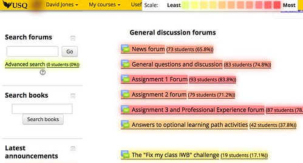
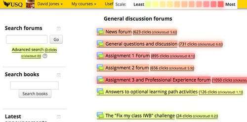
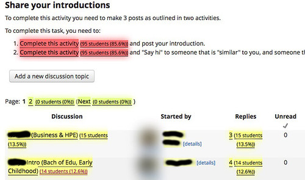
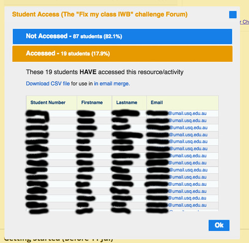

See also: [[blog-home | Home]]

The following post contains the content from [a poster](https://drive.google.com/file/d/1bQYs3_I6npq1uLT260EPDqG9a6nicg4w/view?usp=sharing) designed for the [2017 USQ Toowoomba L&T celebration event](http://bit.ly/twceleb2017). It provides some rationale for [a technology demonstrator](http://tiny.cc/techdem) at USQ based on the Moodle Activity Viewer.

## What is the problem?

Learner engagement is a key to learner success. Most definitions of learner engagement include “actively participating, interacting, and collaborating with students, faculty, course content and members of the community” (Angelino & Natvig, 2009, p. 3).

70% of USQ students study online. By mid-November 2017, 26,754 students had been active in USQ’s Moodle LMS.

In online learning, the absence of visual cues makes teacher awareness of student activity difficult (Govaerts, Verbert, & Duval, 2011).  Richardson (2011) identifies “the role which teaching staff play in inspiring, challenging and engaging students” as “perhaps the most woefully neglected aspect of quality in higher education” (p. 2)

Learning analytics (LA) is the “use of (big) data to provide actionable intelligence for learners and teachers” (Ferguson, 2014). However, current tools provide poor data aggregation, poor visualisation capabilities and have other limitations that inhibit teachers’ ability to: understand student activity; respond appropriately; and, reflect on course design (Dawson & McWilliam, 2008; Corrin et al, 2013; Jones, & Clark, 2014).

## How will it be addressed?

Teachers can be supported through tools that help them “analyse, appraise and improve practices in their everyday activity systems” (Knight et al, 2016, p. 337).

This [Technology Demonstrator](http://tiny.cc/techdem) has implemented and will customise and scaffold the use of the Moodle Activity Viewer (MAV) within the USQ activity system.

The MAV provides a useful and easy to use tool that provides representations of student activity from within all Moodle learning spaces. It provides affordances to support teacher intervention and further analysis.

MAV’s overlay answering the question how many and what percentage of students have accessed each Moodle activity & resource?

## What are the expected outcomes?

The project aims to explore two questions:

1. If and how does the provision of contextual, useful, and easy to use representations of online learner activity help teachers analyse, appraise and improve their practices?
2. If and how does this change in teacher activity influence learner activity and learning outcomes?

MAV’s overlay answering the question how many times have those students clicked on each Moodle activity & resource?

## Want to learn more?

Ask for a demostration of MAV during [the poster session](http://bit.ly/twceleb2017).

USQ staff can learn more**\*** about and start using MAV from [http://tiny.cc/aboutmav](http://tiny.cc/aboutmav) and [http://tiny.cc/installmav](http://tiny.cc/installmav)

\* (Only from a USQ campus or via the USQ VPN)

MAV’s overlay answering the question how many and what percentage of students have read posts in this introductory activity?

MAV’s student access dialog providing details of and enabling teacher contact with the students who have accessed the “Fix my class IWB” forum?

## References

Angelino, L. M., & Natvig, D. (2009). A Conceptual Model for Engagement of the Online Learner. Journal of Educators Online, 6(1), 1–19.

Corrin, L., Kennedy, G., & Mulder, R. (2013). Enhancing learning analytics by understanding the needs of teachers. In Electric Dreams. Proceedings ascilite 2013 (pp. 201–205).

Dawson, S., & McWilliam, E. (2008). Investigating the application of IT generated data as an indicators of learning and teaching performance. Queensland University of Technology and the University of British Columbia.

Ferguson, R. (2014). Learning analytics FAQs. Education. Retrieved from [https://www.slideshare.net/R3beccaF/learning-analytics-fa-qs](https://www.slideshare.net/R3beccaF/learning-analytics-fa-qs)

Govaerts, S., Verbert, K., & Duval, E. (2011). Evaluating the Student Activity Meter: Two Case Studies. In Advances in Web-Based Learning - ICWL 2011 (pp. 188–197). Springer, Berlin, Heidelberg. https://doi.org/10.1007/978-3-642-25813-8\_20

Jones, D., & Clark, D. (2014). [Breaking BAD to bridge the reality/rhetoric chasm](http://tiny.cc/breakingBad). In B. Hegarty, J. McDonald, & S.-K. Loke (Eds.), Proceedings of the 31st Annual Conference of the Australasian Society for Computers in Learning in Tertiary Education (ASCILITE 2014) (pp. 262–272). Sydney, Australia: Macquarie University.

Knight, P., Tait, J., & Yorke, M. (2006). The professional learning of teachers in higher education. Studies in Higher Education, 31(3), 319–339. https://doi.org/10.1080/03075070600680786