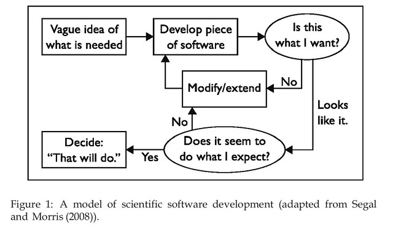

Following is a summary of [Johanson and Hasselbring (2018)](https://ieeexplore.ieee.org/abstract/document/8254315/) and an exploration of what, if anything, it might suggest for learning design and learning analytics. Johanson and Hasselbring (2018) explore why scientists whom have been developing software to do science (computational science) haven't been using principles and practices from software engineering to develop this software. The idea is that such an understanding will help frame advice for how computational science can be improved through application of appropriate software engineering practice (\*\*assumption\*\*).

This is interesting because of potential similarities between learning analytics (and perhaps even learning design in our now digitally rich learning environments) and computational science. Subsequently, lessons about if and how computational science has/hasn't been using software engineering principles might provide useful insights for the implementation of learning analytics and the support of learning design. I'm especially interested due to my observation that both practice and research around learning analytics implementation isn't necessarily exploring all of the possibilities.

In particular, Johanson and Hasselbring (2018) argue that it is necessary to examine the nature of computational science and subsequently select and adapt software engineering techniques that are better suited to the needs of computational scientists. For me, this generates questions such as:

1. What is the nature of learning analytics?
2. What is the nature of learning design?
3. What happens to the combination of both?
    
    Increasingly it is seen as necessary that learning analytics be tightly aligned with learning design. Is the nature/outcome/practice of this combination different? Does it require different types of support?
    
4. For all of the above is there a difference between the nature espoused in the research literature and the nature experienced by the majority of practitioners?
5. What types and combination of software engineering/development principles and practices are best suited to the nature of learning analytics and learning design?

## Summary of the paper

- **Question of problem**
    
    The development of software with which to do science is increasing, but this practice isn't using software engineering practices. Why? What are the underlying causes? How can it be changed?
    
- **Method**
    
    Survey of relevant literature examining software development in computational science. About 50 publications examined. A majority case studies, but some surveys.
    
- **Findings**
    
    Identify 13 key characteristics (divided into 3 groups) of computational science that should be considered (see table below) when thinking about which software engineering knowledge might apply and be adapted.
    
    Examines some examples of how software engineering principles might be/are being adapted.
    

## Implications for learning analytics

[Johanson and Hasselbring (2018)](https://ieeexplore.ieee.org/abstract/document/8254315/) argue that the chasm between computational scientists and software engineering researchers arose from the rush on the part of computer scientists and then software engineers to avoid the "stigma of all things applied". The search for general principles that applied in all places. Leading to this problem

> Because of this ideal of generality, the question of how specifically computational scientists should develop their software in a well-engineered way, would probably have perplexed a software engineer and the answer might have been: “Well, just like any other application software.

In learning analytics there are people offering more LA specific advice. For example, [Wise & Vytasek (2017)](http://solaresearch.org/hla-17/hla17-chapter1) and just this morning via Twitter [this pre-print](https://drive.google.com/file/d/1aCKgTzOQBZ8lltUoWHdnrBrpIJWUX-0Z/view) of looming BJET article. Both focused on providing advice that links learning analytics and learning design.

But I wonder if this is the only way to look at learning analytics? What about learning analytics for reflection and exploration? Does the learning design perspective cover it?

But perhaps a more interesting question might be whether or not it is assumed that the learning analytics/learning design principles identified by these authors should then be implemented using traditional software engineering practices?

 
|   Category   |   Characteristics   |
| --- | --- |
|   Nature of scientific challenges   |   1. **Requirements are not known up front**     - uses software to make novel discoveries and further understanding, software is “deeply embedded” in an **exploratory process**              - to produce software but to obtain scientific results”. Segal (2005) scientific people say they are “programming experimentally”              - design and requirements rarely seen as distinct steps          2. **Verification and validation is difficult and strictly scientific**       - _verification_ demonstrate that the implementation of models is correct      - _validation_ demonstrate software captures the real world      - Validation is hard because models are being used “precisely because the subject at hand is ‘too complex, too large, too small, too dangerous, or too expensive to explore in the real world’ (Segal and Morris, 2008)      - Problems arise from four different dimensions/combinations (Carver et al, 2007)          - Model of reality is insufficient              - Algorithm used to discretise the mathematical problem can be inadquate              - Implementation of the algorithm is wrong              - Combination of models can propagate errors          - Testing methods could help, but rarely used       2. **Overly formal software processes restrict research**       - Easterbrook and Johns (2009) big up front design “poor fit” for computational science – deeply embedded in the scientifical model      - there is a need for the flexibility to quickly experiment with different solution approaches (Carver et al, 2007)      - Use a very iterative process, iterating over both the software and the underlying scientific theory      - Explicit connections with agile software development established in the literature but even those lightweight processes are largely rejected       Representation shown in figure   |
|   Limitations of computers   |   1. **Development is driven and limited by hardware**       - scientific software not limited by the science theory, but by the available computing resources      - Computationl power is an issue       3. **Use of “old” programming languages and technologies**  - Some communities moving toward python, but typically non-technical disciplines (biology/psychology) and only for small scale projects       3. **Intermingling of domain logica and implementation details**      4. **Conflicting software quality requirements (performance, portability and maintainability)**       - interviews of scientific developers rank requirements as          - Functional correctness              - Performance              - Portability           Maintainability   |
|   Cultural environment   |   1. **Few scientists are trained in software engineering**       - Segal (2007) describe them am “professional end user developers”...develop software to advance their own professional goals      - “In contrast to most conventional end user developers, however, computational scientists rarely experience any difficulties learning general-purpose languages”      - But keeping up with sw eng is just too much for people who are already busy writing grants etc.      - Didn’t want to delegate development as often required a PhD in the discipline to be able to understand and implement the softare       2. **Different terminology**       - e.g. computational scientists speak of “code” not “software”       3. **Scientific software in itself has no value but still it is long-lived**       - Code is valued because of the domain knowledge captured within it       4. **Creating a shared understanding of a “code” is difficult**       - preference for informal, collegial ways of knowledge transfer, not documentation      - “scientists find it harder to read and understand documentation artifacts than to contact the author and discuss”       5. **Little code re-use**       Disregard of most modern software engineering methods   |

## A model of scientific software development

Johanson and Hasselbring (2018) include the following figure as a representation of how scientific software is developed. They note its connections with agile software development, but also describe how computational scientists find even the light weight discipline of agile software development as not a good fit.

Anecdotally, I'd suggest that the above representation would offer a good description of much of the "learning design" undertaken in universities. Though with some replacements (e.g. "develop piece of software" replaced with "develop learning resource/experience/event").

If this is the case, then how well does the software engineering approach to the development and implementation of learning analytics (whether it follows the [old SDLC](https://en.wikipedia.org/wiki/Systems_development_life_cycle) or agile practices) fit with this nature of learning design?

## References

Johanson, A., & Hasselbring, W. (2018). Software Engineering for Computational Science: Past, Present, Future. Computing in Science & Engineering. https://doi.org/10.1109/MCSE.2018.108162940

Wise, A., & Vytasek, J. (2017). Learning Analytics Implementation Design. In C. Lang, G. Siemens, A. F. Wise, & D. Gaševic (Eds.), The Handbook of Learning Analytics (1st ed., pp. 151–160). Alberta, Canada: Society for Learning Analytics Research (SoLAR). Retrieved from http://solaresearch.org/hla-17/hla17-chapter1