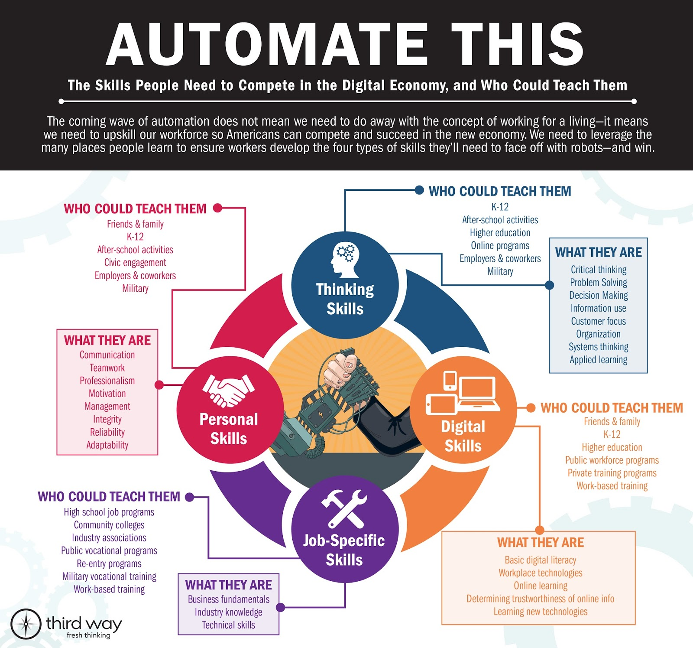

---
categories:
- bad
- digitalignorance
date: 2018-05-26 10:53:44+10:00
next:
  text: Explaining ISDT and its place in the research process
  url: /blog2/2018/06/12/explaining-isdt-and-its-place-in-the-research-process/
previous:
  text: 'Software engineering for computational science : past, present, future'
  url: /blog2/2018/05/10/software-engineering-for-computational-science-past-present-future/
title: Random meandering notes on "digital" and the fourth industrial revolution
type: post
template: blog-post.html
---
In the absence of an established workflow for curating thoughts and resources I am using this blog post to save links to some resources. It's also being used as an initial attempt to write down some thoughts on these resources and beyond. All very rough.

### Fourth industrial revolution

[This](https://www.weforum.org/agenda/2016/01/the-fourth-industrial-revolution-what-it-means-and-how-to-respond/) from the world economic forum (authored by [Klaus Schwab](https://www.weforum.org/about/klaus-schwab), ahh, who is author of two books on [shaping](http://www.penguinrandomhouse.com/books/551710/the-fourth-industrial-revolution-by-klaus-schwab/9781524758868identifying</a> and <a href=) the fourth industrial revolution) aims to explain "The Fourth Industrial Revolution: what it means, how to respond". If offers the following description of the "generations" of revolution

> The First Industrial Revolution used water and steam power to mechanize production. The Second used electric power to create mass production. The Third used electronics and information technology to automate production. Now a Fourth Industrial Revolution is building on the Third, the digital revolution that has been occurring since the middle of the last century. It is characterized by a fusion of technologies that is blurring the lines between the physical, digital, and biological spheres.

Immediate reaction to that is that the 3rd revolution - with its focus on electronics and information technology - missed a trick with digital technology. It didn't understand and leverage [the nature of digital technologies](http://djon.es/blog/2016/06/27/what-is-the-nature-of-digital-technology-part-1/) sufficiently. In part, this was due to the limited nature of the available digital technology, but also perhaps due to the failure of a connection between the folk who really knew this and the folk trying to do stuff with digital technology.

The WEF post argues that "velocity, scope and systems impact" are why this fourth generation is distinct from the third. They could be right, but again I wonder if ignorance of the nature of digital technology might be a factor?

The WEF argues about the rapid pace of change and how everything is being disrupted. Which brings to mind arguments from [Audrey Watters](http://hackeducation.com/2016/07/13/memory-machines) (and I assume others) about how, actually, it's not all that rapid.

It identifies the possibility/likelihood of inequality. Proposes that the largest benefits of this new revolution (as with others?) accrues to the "providers of intellectual and physical capital - the innovators, shareholders and investors".

Points to disquiet caused by social media and says more than 30% of the population accesses social media. However, the current social media is [largely flawed and ill-designed](https://hapgood.us/2017/02/24/against-expressive-social-media/), it can be done better.

_Question:_ does an understanding of the nature of digital technology help (or is it even required) for that notion of "better"? Can't be an explanation for all of it, but some? Perhaps the idea is not that you need only to truly know the nature of digital technology, or know only the details of the better learning, business, etc you want to create. You need to know both (with a healthy critical perspective) and be able to fruitfully combine.

Overall, much of this appears to be standard Harvard MBA/Business school like.

The platform economy - technology-enabled platforms - get a mention which also gets a mention in the nascent nature of digital technology stuff I worked on a couple of years ago. Platforms are something the critical perspective has examined, so I wonder if this belongs in the NoDT stuff?

### Links to learning etc.

I came to this idea from [this post](http://esheninger.blogspot.com.au/2018/04/preparing-learners-for-fourth.html) from a principal come consultant/researcher around leading in schools. It's a post that references [this](https://www.thirdway.org/report/automate-this-building-the-perfect-21st-century-worker) on building the perfect 21st Century worker as apparently captured in the following infographic.

Which includes the obligatory _Digital skills_ which are listed in [article](https://www.thirdway.org/report/automate-this-building-the-perfect-21st-century-worker) as (emphasis added)

> - Basic digital literacy - ability to **use** computers and Internet for common tasks, like emailing
> - Workplace technology - **using** technologies required by the job
> - Digital learning - **using** software or online tools to learn new skills or information
> - Confidence and facility learning and using new technologies
> - Determining trustworthiness of online information

Talk about setting the bar low and providing a horrendous example of digital literacy, but then it does tend to capture the standard nature of most attempts at digital literacy I've seen, including:

- A focus on **using** technology as is, rather than being able to renovate and manipulate it.
- Revealing a ignorance of basic understanding. e.g. "software or online tools", aren't the "online tools" also software?
- Continuing the medium divide, i.e. online information or online tools are somehow different from all the other information and tools I use?

(Not to mention that the article uses an image to display the bulleted list above, not text)