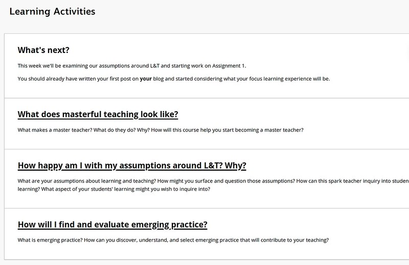
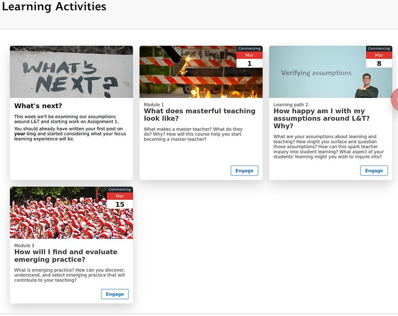

---
categories:
- eei
coverImage: 3311829635_0080586412_o-scaled-e1601494373689.jpg
date: 2019-01-03 10:02:28+10:00
next:
  text: '"Trying out" needs agency and control'
  url: /blog/2019/01/18/trying-out-needs-agency-and-control/
previous:
  text: Testing h5p
  url: /blog/2018/12/11/testing-h5p/
title: Meso-level practitioners and generative technologies?
type: post
template: blog-post.html
---
Happy to see the end of 2018. Time to figure out what 2019 holds. This is a first step.

I start 2019 as a meso-level practitioner in a new university. Hannon (2013) describes meso-level practitioners as the “teaching academics, learning technologists, and academic developers” (p. 175) working between the learning and teaching coal-face and the institutional context defined by an institution’s policies and technological systems. In my case, the institutional/technological vision (macro-level) that has decided to shift to Blackboard Ultra and to push the broader concept of a broader ecosystem of applications (Pebble Pad, Microsoft Office,...). i.e. it's not just the LMS anymore, there's a raft of technologies that can be drawn upon.

My position is meant to be focused on helping the micro-level make the transition to this new vision and hopefully improve the quality of learning and teaching. In the few months I've observed how a diverse collection of different actors - including existing meso-level practitioners - are working to understand how and what can be done to help.

My big question is what is it that we can be doing that will actually help make this transition into something that will actually help enhance or perhaps transform the quality of learning and teaching? Is it even possible? Perhaps a good starting point is simply observing and understanding what is currently being done?

### Generative versus sterile technologies

A lot of the concern about the shift from Blackboard 9.1 (Learn) to Blackboard Ultra appears to arise from the shift from a generative technology (Blackboard Learn) to a sterile technology (Blackboard Ultra).

Zittrain (2008) defines a generative system as having the “capacity to produce unanticipated change through unfiltered contributions from broad and varied audiences” (p. 70). How generative a system is depends on five principal factors: (1) leverage; (2) adaptation; (3) ease of mastery; (4) accessibility; and (5) transferability (Zittrain, 2008). A sterile technology is closed and cannot be modified.

#### Blackboard Learn as generative

A significant part of Blackboard Learn's generativity arises from it's reliance on web technologies. Meaning it is possible to embed HTML, Javascript and CSS into Blackboard course sites. This makes it possible to modify the appearance of a page in Blackboard from the following.

Into something a little more contemporary.

The above just happens to be one of my tasks over recent weeks. You can find [the code here](https://github.com/djplaner/Card-Interface-Tweak).

And it's not just me. This approach is inspired by work at QUT to develop a building block for Blackboard Learn that implements ["Blackboard Tweaks Tools for Academics, Designers and Programmers"](http://tweaks.github.io/Tweaks/). A tool that uses another main generative capability of Blackboard Learning - building blocks - to simplify this process of transforming the standard Blackboard interface into something a little more useful. Blackboard Tweaks uses the building blocks to spread the ability to use the generative capability of HTML, CSS and Javascript.

The Blackboard Tweaks building block is something quite liked by other meso-level practitioners around here.

#### Blackboard Ultra as Sterile

[Blackboard Ultra](https://help.blackboard.com/Learn/Instructor/Getting_Started/What_Is_Ultra) is meant to provide a contemporary, mobile first interface. But at the same time it removes any capability to use HTML within that interface. Let alone use CSS or Javascript. Removing the generative capability.

### Bridging the gap through generative technology?

Hannon (2013) identifies a gap between technology and pedagogy that needs resolving. The absence of such resolution is likely to lead to problems that result in limited improvement in learning and teaching. Offering professional development opportunities to academics (micro-level) is one of the methods of doing this. Another is using technologies to fill those gaps. Having appropriate access to generative technologies seems to be one way of doing this.

However, as Zittrain (2008) argues the very capabilities that make a technology generative also create problems. The open nature of the Internet creates issues from a security perspective. [This thread](https://community.blackboard.com/ideas/2483-allow-html-code-insertion-in-ultra-course-content-editor) on the Blackboard Community site discusses Ultra's lack of HTML generativity. It includes numerous folk - largely meso-level practitioners - bemoaning this absence. A few provide examples - much like my work above- about how they've used this generativity. However, the thread also includes discussion of the "monstrosities" that are produced by some people who get their hands on HTML's generative capabilities. Capabilities that are said to have done "more bad than good" and which have led Blackboard to explain that they've gone the more sterile route in order to address some of this "bad". Other contributions to the thread suggest a middle ground by providing the ability in Blackboard to give appropriately trained and trusted users with the ability to use HTML.

I also observe a fair bit of other software development occuring outside of Blackboard. Increasingly digitally capable people using the generative nature of contemporary technologies (Excel, Amazon Web Services etc) to develop software to bridge the gap. Development that would incite condemnation from central Information Technology folk if they became more aware of it because of concerns about sustainability, scalability, security etc. Again the tension between generative and sterile

IMHO, generative technologies appear to be necessary to be able to bridge the gap, but also to enable innovation to arise. But they do have their challenges, especially in an increasingly corporatised university. How can they be used effectively?

### Needed more in a distributed ecosystem?

But that's just the LMS. The institution is also pushing the idea of a distributed ecosystem of learning tools that can be selected for use. In essence the institution is moving from a single, integrated system model (the old LMS provides all the tools) to a best-of-breed model (choose the best tool for a specific purpose). Light et al (2001) provide a comparion of these two architectures, a comparison that is explained in more detail in [this blog post](/blog/2009/08/31/product-models-lms-bob-and-alternatives/).

One of the identified challenges with the best-of-breed model is that integration between applications from different vendors is time consuming. Rather than having a single system already integrated, time and effort has to be expended ensuring that each of the separate components work together. While standards and technologies like LTI and xAPI help enable this integration, they don't make integration easy or seamless. There are often gaps in functionality. For example, I know of one academic who has refused to adopt an external tool that provides an educationally effective feature because the integration with the marking system places too much of a load on causual teaching staff.

Suggesting that the gap is going to be larger.

### References

Hannon, J. (2013). Incommensurate practices: sociomaterial entanglements of learning technology implementation. _Journal of Computer Assisted Learning_, _29_(2), 168–178. [https://doi.org/10.1111/j.1365-2729.2012.00480.x](https://doi.org/10.1111/j.1365-2729.2012.00480.x)

Light, B., C. Holland, et al. (2001). "ERP and best of breed: a comparative analysis." Business Process Management Journal **7**(3): 216-224.

Zittrain, J. (2008). The Future of the Internet–And How to Stop It. Yale University Press.