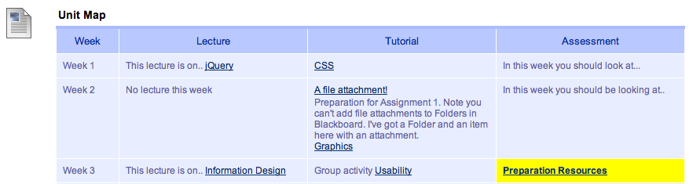

---
categories:
- casa
date: 2019-01-30 14:17:10+10:00
next:
  text: "Digital learning templates \u2013 adding context and configuration"
  url: /blog/2019/02/10/digital-learning-templates-adding-context-and-configuration/
previous:
  text: '"Trying out" needs agency and control'
  url: /blog/2019/01/18/trying-out-needs-agency-and-control/
title: Improving reuse of design knowledge in a LMS
type: post
template: blog-post.html
---
In October last year I started a new position at Griffith University. A role designed to help improve the quality and quantity of use of the institutional learning ecosystem. An ecosystem that includes Blackboard (both 9.1 and soon Ultra), Office365, PebblePad, Echo360 etc. Pretty early on it became apparent that there was some problems with reusing design knowledge. A problem that had some initial solutions. But these solutions weren't built upon. The following tells the story of those problems and how I've be playing with an old idea of [scaffolding, context sensitive conglomerations](/blog/2010/11/09/scaffolding-context-sensitive-conglomerations-v2-0/) (aka constructive templates) to help.

The example itself is not earth shattering. However, IMHO it does identify the long-term inability of higher education to create a teaching environment that actively helps improve the quality of learning and teaching while reducing the cost of doing so (you/I could argue institutions have been better at/focused on solving the latter by cost shifting, than the former).

### The initial problem - "ugly" text

Most of the current digital course learning environments are in Blackboard Learn (9.1). The Blackboard interface hasn't changed much since I last played with it in 2007. Institutional practice is such that most course sites have a menu option _Course Content_ that links to what Blackboard calls a _Content Area_  where students are meant to be able to find the main learning resources and activities for the whole course. At best (arguably), most courses have a _Content Area_ that looks like the following.

https://www.flickr.com/photos/david\_jones/46279789112/

This is from a test course I've set up. A page like this consists of a list of items (four in the above) of various types. Each item has a heading and some HTML text. Depending on the type of item the heading might be a link to another resource/service.

#### "Boring" versus "bad"

The image above shows an interface that is perhaps more boring and old school than bad. However, there are many examples of pages like this that break basic web design principles (e.g. many different font types and size due to copy and paste, reliance on some truly horrendous colour choices etc). For old timers like me these bring back memories of geocities. (If that and the image below don't mean anything to you have [a read of this)](https://mashable.com/2009/10/25/geocities-xkcd/#1eTSXIPHPiqx)

[](https://www.flickr.com/photos/secretlondon/4046983331/)  
"[xkcd commemorates the end of Geocities](https://www.flickr.com/photos/secretlondon/4046983331/)" ([CC BY-SA 2.0](https://creativecommons.org/licenses/by-sa/2.0/)) by [secretlondon123](https://www.flickr.com/people/secretlondon/)

While perhaps not as bad as many Geocities sites what has been done with HTML within Blackboard (as with many other LMSes) leans in that direction. It's so common that [this thread](https://community.blackboard.com/ideas/2483-allow-html-code-insertion-in-ultra-course-content-editor) in the Blackboard Community site contains quotes from around the world that include words such as "monstrosities".

Note: the thread mentioned explains how Blackboard's "next gen" environment - Ultra - prevents the monstrosities by preventing the use of HTML, let alone Javascript etc. While this solves the monstrosity problem, it also means that none of the solutions and innovations discussed below are possible in Ultra.

#### Generic versus specific

The _Content Area_ feature from Blackboard provides a flexible tool that can be used to implement a variety of designs (i.e. anything HTML). It's that flexibility that causes the "geocities" problem. But there comes a time when you need something more specific. At all the universities at which I've worked the idea of a course site has included a feature going under labels such as study schedule, course map or course overview. The following is an example from a course I taught in Moodle

https://www.flickr.com/photos/david\_jones/16135176729

This type of interface is intended to help the learner (and teacher) understand the shape of the semester. What will be happening and when will it be happening.

Blackboard doesn't provide any specific support for this type of resource. Hence it is left to the course teaching team to develop something. As a result, many do not.

Those that do are typically creating the study schedule in Word and either: uploading the Word document into the course site; converting it to a PDF; or, copying and pasting the Word document. None of which works all that well. One of the problems with this is that such tables typically include mention of _Lecture 1_ but rarely actually link to _Lecture 1_ resources. i.e. [it's only](/blog/2012/09/07/one-example-of-industrial-e-learning-as-on-the-web-not-of-the-web/) **[on](/blog/2012/09/07/one-example-of-industrial-e-learning-as-on-the-web-not-of-the-web/)** [the web, not](/blog/2012/09/07/one-example-of-industrial-e-learning-as-on-the-web-not-of-the-web/) **[of](/blog/2012/09/07/one-example-of-industrial-e-learning-as-on-the-web-not-of-the-web/)** [the web](/blog/2012/09/07/one-example-of-industrial-e-learning-as-on-the-web-not-of-the-web/) (at a very simple level).

The other alternative, is that they have some specialist design the study schedule themselves. This approach raises questions of sustainability (not many institutions have the resources for this) and turn-around time (any change typically requires the services of the specialist).

Surprisingly, my current institution actually had another solution to this (and related) problems.

### Tweaks and the course theme table

The solution is called [Blackboard Tweaks](http://tweaks.github.io/Tweaks/). A building block for Blackboard written by folk from the [Queensland University of Technology](http://www.qut.edu.au). Once the building block is installed in a version of Blackboard you are able to choose from a [range of tweaks](http://tweaks.github.io/Tweaks/description.html) that will modify your normal Blackboard _Content Area_. For example, the _Dynamic Unit/Course Map Table_ can be used to generate a course map/study schedule that looks like the following.

<figure markdown>



<caption>

Sample Unit Map produced by Blackboard Tweaks ([source](http://tweaks.github.io/Tweaks/description.html)).  

</caption>

</figure>

This Tweak allows you to supply part of the table above as one of the items in a Content Area. Some of the elements in the table can be left blank. You then make sure that other items in the Content Area (e.g. lecture resources) are named a specific way. When someone views the Content Area, the Tweak uses Javascript to read the other content items and populate the table with appropriate vales.

This tool has been quite successful. A fairly large number of the courses that I've seen make use of this functionality.

But...

### Contemporary, responsive and mobile?

But it's still so old school. Tables? Ugly HTML? Responsive? [Web design](https://www.webalive.com.au/web-design-trends/) is evolving.

One of the tasks I was allocated was to help with the design of the digital learning environment for a brand new program launching this year. This program is focused on helping develop creative entrepreneurs. The program is edgy, innovative and creative. IMHO, a 90s/00s table doesn't align real well with that intent. What to do?

#### Designers design - the wrong approach

Sounds like a job for a web/graphic designer. Get a designer in to talk to the clients and then go away and design a bespoke and beautiful course map. Draw on the design knowledge of the designer to provide something breath taking.

There is nothing wrong with this approach in terms of the quality of what is produced. The problem is that it's not scalable. The group I work with (one of five at the institution) has hundreds of courses. Even if you take a program approach the numbers are still significant. Especially if you factor in consideration that a course map is at its most useful when it is an appropriately live and dynamic document. A document that can respond quickly to changes in the learning design and intent of the course. i.e. an approach that supports the teacher(s) to re-configure the course map easily and quickly.

#### Constructive templates - a better approach

This was exactly the problem facing the hypermedia community back in the 1990s. Nanard, Nanard and Kahn (1998) suggest that

> Reducing the design and development cost of new hypermedia documents while improving their quality is an important challenge for the information industry.
> 
> (p. 11)

One of the solutions that Nanard, Nanard and Kahn (1998) talk about is _constructive templates_. A concept developed in response to the difficulty faced by content providers in developing hypermedia structures that followed the known principles of interface and hypermedia design. Constructive templates helped content experts to create well designed hypermedia by capturing and reusing design knowledge (Catlin, Garret et al. 1991). By separating content from hypermedia structure and presentation constructive templates allow the content area expert to provide and change content without needing to understand the the specifics of structure and presentation.

The Blackboard Tweaks approach a form of constructive template. The tweaks allow the teaching staff to provide content in a fairly simple form. The tweaks then use Javascript to transform that into a more appropriate structure and interface.

The problem we face is that they haven't been updated, suggesting that...

### Introducing the Card Interface Tweak

Inspired by the Blackboard Tweaks I've written the [Card Interface Tweak](https://github.com/djplaner/Card-Interface-Tweak). A bit of Javascript+HTML that when inserted into a Blackboard Content Area with specific content will translate this "boring" content

https://www.flickr.com/photos/david\_jones/46279789112/

Into the following responsive and somewhat contemporary interface.

https://www.flickr.com/photos/david\_jones/46280738772/

Or perhaps you're on your mobile phone doing a bit of learning

https://www.flickr.com/photos/david\_jones/46871123302/

Or perhaps you'd like the cards to be arranged vertically.

https://www.flickr.com/photos/david\_jones/46008974515/

This is what the Card Interface Tweak helps you do.

#### How do you do it?

Well, all you do is (see the README[https://github.com/djplaner/Card-Interface-Tweak/blob/master/README.md](https://github.com/djplaner/Card-Interface-Tweak/blob/master/README.md) for some more up-to-date detail)

1. Add an item to your existing Blackboard content area and copy and paste into it [s](https://raw.githubusercontent.com/djplaner/Card-Interface-Tweak/master/cards.js)[ome Javascript](https://raw.githubusercontent.com/djplaner/Card-Interface-Tweak/master/tweak.js).
2. Add another item to your content area called _Card Interface_.
3. For each of the existing or new content items you'd like to turn into a card, you add a line that contains

```
Card Interface:
```

Once that's done the Javascript will insert into the _Card Interface_ cards for each of the content items you've so identified. (While this will work at the moment. It does rely on another [Javascript file](https://github.com/djplaner/Card-Interface-Tweak/blob/master/cards.js) currently residing on my server. If you use this tweak in anger, then you should stick this file on your own server and modify the initial Javascript).

If you'd like to add an image, associate a date etc with a card. You can add a couple of other lines. For example, here's one content item that will be converted into a card.

https://www.flickr.com/photos/david\_jones/46564373241/

The Javascript will convert this into the following card.

https://www.flickr.com/photos/david\_jones/45650359455/

#### Early experiences

While this is not an earth shatteringly innovative application of educational technology destined to transform learning, it's gone down well so far. The program I'm working with seem to like it. Other members of the group I work with like it. Someone with only the barest of introductions to the earliest iterations of the tweak has been able to use it. It's also been possible to modify this Tweak to provide new features quite quickly.

As of yet, no students have had this interface inflicted upon them. Their experience will be key. But what else is missing

## What's missing?

As it stands this is a very simple and limited example of constructive template. It is limited in terms of support for

1. A more pedagogical important learning design (more learning, less content).
2. Distribution across multiple systems.
3. A more forward-oriented notion of design for learning.

#### More learning, less content

The course map example is pretty much focused on information distribution. On giving an overview of a course and its contents. It's not likely to have a huge direct impact on student learning outcomes, but perhaps may have some affective benefits.

What would be interesting is to see if and how this approach could be used for a specific learning design. For example, wrapped around a Blackboard discussion forum to support use of the forum for a debate (or role-play etc).

#### Distribution across multiple systems

As it stands this works in Blackboard. My current institution - as with many others - no longer use a single application (the LMS) for its digital learning environment. We live in a brave new [Next Generation Digital Learning Environment (NGDLE)](https://library.educause.edu/resources/2018/1/7-things-you-should-read-about-ngdle) world. In this world, learning/teaching won't be occurring in a single application. It will be spread across multiple. This will raise new challenges.

Way back Light et al (2001) identified the differences this type of change would generate. For example, they identify that "Integration of applications is time consuming" (Light et al, 2001). It's important to realise that their focus was largely on the efforts required by the IT professionals supporting an organisation's systems. This will be a difficulty faced in developing something like the tweaks that bridge across systems.

But at the same time, it's possible that such tweaks will become even more needed because in an NGDLE world designing learning experiences will require the ability to integrate across different systems. This will be much more difficult than designing learning experiences within a single system, suggesting that the need for constructive templates will be required all the more

#### A forward-oriented approach to design for learning

Dimitriadis and Goodyear (2013) argue that design for learning needs to be more forward-oriented. This means that when engaged in designing for learning proactive thought needs to be given to what features will be required configuration, orchestration, reflection and re-design.

For example, _orchestration_ is seen as "providing support for the teacher's work at learntime" (Goodyear and Dimitriadis, 2013, pp 4). In the context of the Card Interface Tweak it could be useful for the teaching staff to be aware of who is accessing the different cards or perhaps their progress through the activities within those cards. To support this, the Card Interface tweak could be linked with the analytics and when cards are viewed by teaching staff display an appropriate representation of use.

For example, _redesign_ is thinking about what changes will need to be made at a later date. In a university context teaching typically occurs within a semester, trimester, quarter or other fixed time frame. These time frames are defined. Courses are often taught in multiple periods. The card interface includes dates. Teaching a course in a new period will involve changing the dates. Rather than have someone manually change the dates, it should be possible to offer the change to map cards to specific times in a period and [automatically change the specific dates](http://djon.es/blog/2015/06/26/and-the-little-one-said-roll-over-roll-over/) based on the defined period.

## References

Catlin, K. S., & Garrett, L. N. (1991). Hypermedia Templates: an author’s tool (pp. 147–160). Presented at the Proceedings of the third annual ACM conference on Hypertext, ACM. [https://doi.org/10.1145/122974.122990](https://doi.org/10.1145/122974.122990)

Dimitriadis, Y., & Goodyear, P. (2013). Forward-oriented design for learning : illustrating the approach. _Research in Learning Technology_, _21_, 1–13.

Goodyear, P., & Dimitriadis, Y. (2013). In medias res: reframing design for learning. _Research in Learning Technology_, _21_, 1–13. [https://doi.org/10.3402/rlt.v21i0.19909](https://doi.org/10.3402/rlt.v21i0.19909)

Light, B., Holland, C. P., & Wills, K. (2001). ERP and best of breed: a comparative analysis. _Business Process Management Journal_, _7_(3), 216–224.

Nanard, M., Nanard, J., & Kahn, P. (1998). Pushing Reuse in Hypermedia Design: Golden Rules, Design Patterns and Constructive Templates (pp. 11–20). ACM.