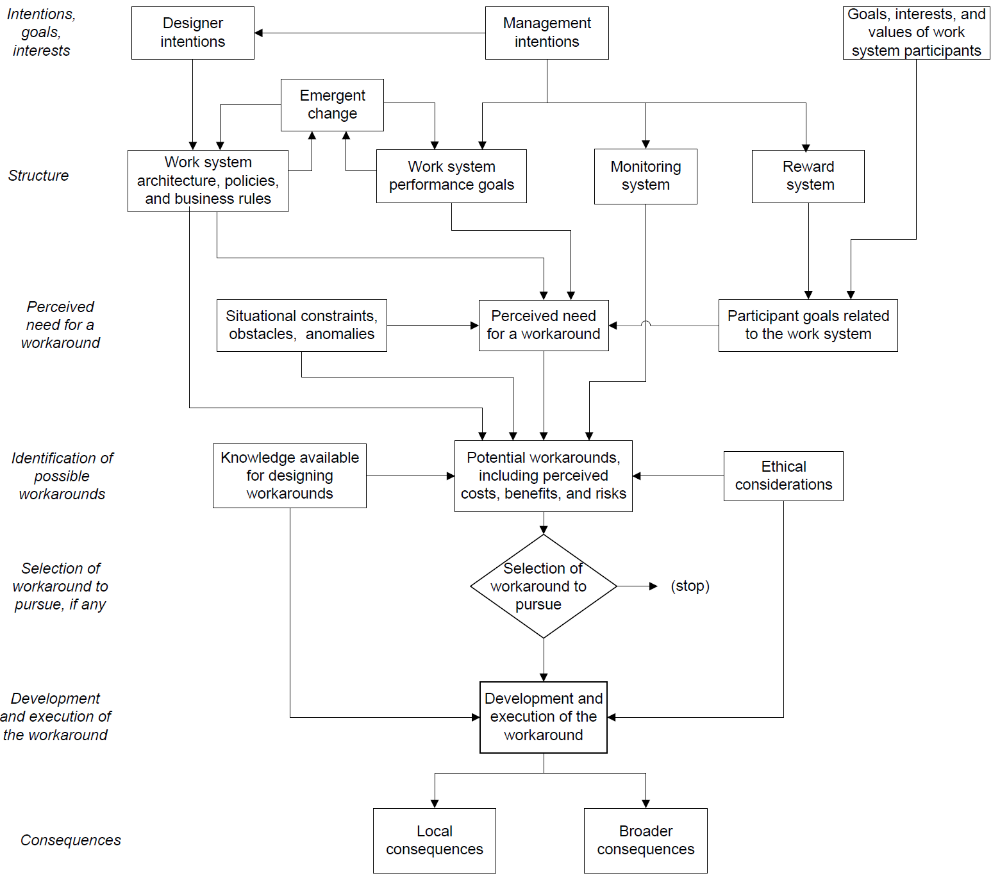
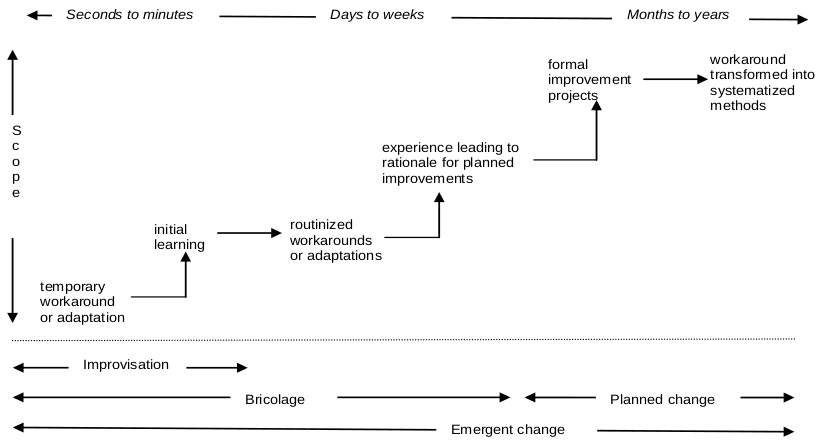

## Introduction

The following is a summary of the paper _Theory of Workarounds_.

> Alter, S. (2014). Theory of Workarounds. _Communications of the Association for Information Systems_, _34_(1). [https://doi.org/10.17705/1CAIS.03455](https://doi.org/10.17705/1CAIS.03455)

The paper provides “an integrated theory of workarounds that describes how and why” they are created. It is a process theory “driven by the interaction of key factors that determine whether possible workarounds are considerd and how they are executed” and is seen as useful for

- classifying workarounds and analysing how they occur;
- understanding compliance and noncompliance to management mandates;
- figuring how to consider possible workarounds as part of systems development;
- studying how workarounds may lead to larger planned changes.

### My interest – digital learning and teaching

I’m interested in workarounds as a way to better understanding what’s happening around higher education’s use of digital technology to support learning and teaching, and identifying ways to improve it.

## Definition and theory of workarounds

Alter (2014) offers the following definition of workarounds

> A workaround is a goal-driven adaptation, improvisation, or other change to one or more aspects of an existing work system in order to overcome, bypass, or minimize the impact of obstacles, exceptions, anomalies, mishaps, established practices, management expectations, or structural constraints that are perceived as preventing that work system or its participants from achieving a desired level of efficiency, effectiveness, or other organizational or personal goals. (p. 1044)Comparisons between this and related definitions suggest this is a broader definition, including additional factors such as

- workarounds don’t need to use digital technology;
- workarounds may include work not formally recognised by the organisation;
- workarounds don’t always compensate for or bypass system deficiencies;
- workarounds may not be temporary;
- workarounds are not necessarily examples of noncompliance;

Alter’s (2014) definition of workarounds does rely on it occuring within a _work system_. Another theoretical concept developed by Alter (2002). See [this section](/blog2/2019/12/19/the-conceptualisation-of-e-learning-lessons-and-implications/) from an old paper of mine for a summary of the Work System Framework.

It is argued that this reliance on the work system framework provides a “broader and more comprehensive view of the changes that can be included in workarounds” (Alter, 2014, p. 1046)

Figure 1 is a representation of Alter’s (2014) theory of workarounds. It is positioned as a process theory that describes how and why workarounds are created. A brief description follows the figure.

Alter’s theory of workarounds draws on a number of theories and concepts, including:

- Theory of planned behaviour;
- Improvisation and bricolage;
- Agency theory;
- Work system theory

Figure 1 - Alter's (2014) Theory of Workarounds (p. 1056)

Workarounds arise from a c_ontext_ that includes each work system participant’s personal goals, interests and values. Communication and sharing of these goals/values between participants may be flaws or incomplete leading to misalignment in the work system. It also includes the _structure_ of the work system that includes architecture, characteristics, performance goals and also emergent change.

From this _context_ arises the _perceived need for a work around_.

Which triggers a process of trying to _identify possible workarounds_. Often starting with the obstacles in the current situation and the perceived need combined with consideration of the costs, benefits, risks of being identifed, and possible ramifications. An essential component is the knowledge available to those involved.

Eventually this leads to a decision to _select a workaround to pursue, if any_.

If going ahead, then _development and execution of the workaround_ is driven by factors such as attention to current conditions, intuition guiding action, testing of intuitive understanding, and situational decision making.

Subsequently, there are _local consequences and broader consequences_. Locally, may lead to elimination of the obstacles that initiated the process, but may also include failure of the workaround or various unintendended consquences. More broadly, these types of consquences might be felt or pushed into other locations.

### Temporality of workarounds

Alter also makes a point of outlining the temporality of workarounds as outlined in Figure 2.

  

Figure 2: Temporality of Workarounds (adapted from Alter, 2014, p. 1058)

## Five voices in the workarounds literature

Alter performed a literature review on the workarounds literature. He gather 289 papers and used that to derive his theory. He summarises that work by using five “voices” which in turn include topics, including:

Phenomena associated with workarounds;

- Obstacles, exceptions, anomalies, mishaps and structural constraints
- Agency
- Improvisation and bricolage
- Routines, processes and methods
- Articulation work and loose coupling
- Technology misfits
- Design and emergence
- Technology usage and adaptation
- Motives and control systems
- Knowledge
- Temporality

Types of workarounds;

- Overcome inadequate IT functionality
- Bypass an obstacle built into processes or practices
- Respond to a mishap or anomaly with a quick fix
- Substitute for unavailable resources
- Design and implement new resources
- Prevent future mishaps
- Pretent to comply
- Lie, cheat, steal for personal benefit
- Colluse for mutual benefit

direct effects of workarounds;

- Continuation of work despite obstacles, mishaps or anomalies
- Creation of hazards, inefficiencies or errors
- Impact on subsequent activities
- Compliance or non-compliance with management intentions

perspectives on workarounds; and,

- Workarounds as necessary activities in everyday life
- Workarounds as sources for future improvements
- Workarounds as creative acts
- Workarounds as add-ons or shadow systems
- Workarounds as quick fixes that won’t go away
- Workarounds as facades of compliance
- Workarounds as inefficiencies of hazards
- Workarounds as resistance
- Workarounds as distortions or subterfuge

organisational challenges and dilemmas related to workarounds.

- Ability to operate despite obstacles
- Enactment of interpretive flexibility
- Balance of personal, group and organisational interests
- Permitting and learning from emergent change

He uses these 5 voices then to group and establish some sense of causality within the “breadth of ideas and examples that were found in the literature” (p. 1047).

## Usefulness and Further research

Since the theory is developed based on a literature search, it is limited by anything that hasn’t made it into the literature. e.g. accounts of workarounds that were considered, but never attempted.

Each step in the process theory could inform survey and/or case study research to explore how well the theory maps onto reality and lead to discoveries of factors/relationships not currently in the theory.

The workaround literature identifies fundamental limtiations in assumptions underpinning traditional approaches to organisational and system analysis and design (e.g. that prescribed business processes will be followed consistently). Theory of workarounds can be used to analyse systems in organisations, reveal conditions that lead to workarounds, provide opportunities to incorproate learning from workaround into emergent/planned change. Helping reveal insights into whether or not intended methods are followed; how systems in organisations evolve over time, how implementation evolves over time..

Starting from alternate theoretical foundations (e.g. Actor Network Theory, activity theory, socio-materiality etc) might lead to different outcomes and insights.