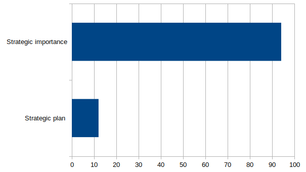
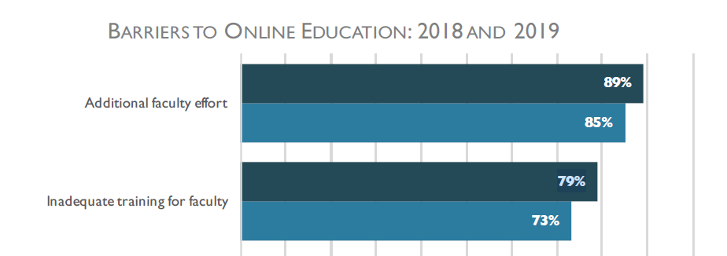

---
categories:
- bad
- casa
coverImage: race.jpg
date: 2019-12-23 10:58:01+10:00
next:
  text: Office365, charismatic technologies, and the ecological perspective
  url: /blog2/2020/01/13/office365-charismatic-technologies-and-the-ecological-perspective/
previous:
  text: Theory of workarounds
  url: /blog2/2019/12/20/theory-of-workarounds/
title: Is training the barrier to quality online learning in higher ed?
type: post
template: blog-post.html
---
## TL;DR

Recently there have been various suggestions that the biggest barrier to quality online learning in higher education is lack of knowledge held by teaching staff (Johnson, 2019; Mathes, 2019; Roberts, 2018). More or better training, faculty development and requirements for formal teaching qualifications are proposed as the solution.

The following argues that this is just a symptom of the real barrier. i.e. that Universities actually don’t know how to implement quality online learning. Specific evidence drawn from one of the clarion calls for more training/formal qualifications is offered. A pointer to possible solutions to the actual barrier is provided.

Note: I started writing this in late November. A week before ASCILITE’2019. Just finishing it now.

## Why?

The following is sparked by personal experience (bias?) and a post on OLDaily from [Stephen Downes](https://www.downes.ca/me/index.htm) titled [_More needs to be done to support teaching online in Canada_](https://www.downes.ca/cgi-bin/page.cgi?post=70160). Downes’ post reports on results from [a research report](https://onlinelearningsurveycanada.ca/publications-2019/) (Johnson, 2019) surveying Canadian, publicly funded, post-secondary institutions and reactions from [Tony Bates](https://www.tonybates.ca/2019/11/19/results-for-2019-survey-of-online-learning-in-canadian-post-secondary-institutions-now-available/) and [Clint Lalonde](https://edtechfactotum.com/more-needs-to-be-done-to-support-teaching-online-in-canada/). Downes wonders how, after 25+ years of online learning, 79% of institutions surveyed can report that a major barrier to online learning is inadequate training for faculty? Lalonde finds “this number staggering, and a sobering wake up call”. And its not just Canada. This topic echoes the findings from a 2019 [ICDE](http://www.icde.org/) report (Mathes, 2019) that was also featured on OLDaily. That report – [_Global quality in online, open, flexible and technology enhanced education: An analysis of strengths, weaknesses, opportunities and threats_](https://www.icde.org/knowledge-hub/report-global-quality-in-online-education) – draw on interviews with senior leaders from ICDE member institutions from across the world from which three themes emerged. Theme #2 was professional development

> Appropriate training is not always available to build the expertise and skills of faculty and staff responsible for developing and/or teaching courses in these modalities. This can result in a poor teaching experience for faculty and a poor learning environment for students. (Mathes, 2019, p. 10)

Lalonde isn’t certain why there is this apparent “massive skills gap among instructors to teach online”. Downes suggests that higher education’s problem isn’t a training problem, but a culture problem. He wonders “about the apparent inability or unwillingness of today’s professors to _teach themselves_ how to use a computer to teach”. Bates identifies the lack of willingness amongst institutions to “make training in teaching mandatory” as a major contributor and suggests (in another post) [_Should all lecturers have to have a teaching certificate? Why the answer is a resounding ‘yes’_](https://www.tonybates.ca/2019/11/14/should-all-lecturers-have-to-have-a-teaching-certificate-why-the-answer-is-a-resounding-yes/). Lalonde wonders if institutional focus on training for online has become less of a priority as a feeling of “been there done that” is combined with more attention being paid to broader issues such as accessibility, inclusiveness etc. He then picks up on Bates’ formal certification solution, but expands it to include not just online learning, but any learning modality.

## Is training really the barrier?

The image below is from an [ASCILITE’2019](https://2019conference.ascilite.org/) presentation I’m working on for next week (slides, paper and source code available [from here](/blog2/2019/11/28/how-to-share-design-knowledge-in-design-for-digital-learning/)). The image is from a Blackboard course site. It is not a site for a real course. However, each design decision present in this “course site” is inspired by a practice from an actual course site that was developed by someone with a formal teaching qualification. In some cases, they had more than one formal teaching qualification. Since it’s for a presentation, this example focused on limitations that were visual. A similar example could be generated focusing on design for learning.

The point is that these practices were taken from courses developed by people with formal teaching qualifications. Exactly the solution being suggested. Given we are now 20+ years into the digital/online learning revolution, this seems to suggest that more training and formal qualifications in (online) learning are not likely to help improve the quality of online learning. Suggesting that the barrier is not (just) a lack of training.

## What might be the barrier?

To answer this question, the following digs a bit deeper into [the report](https://onlinelearningsurveycanada.ca/publications-2019/) from the Canadian Digital Learning Research Association. It reveals a few more possible barriers, but each really appear to be symptoms – just like the need for more faculty training - of the real barrier to quality online learning and teaching.

### An absence of strategic planning?

The following is graph won’t be found in the report, but it is drawn from data presented in the report.

It shows that 94% of the institutions responding to the survey identified online learning as being of strategic importance of the institution. A variety of reasons is given. Growing continuing/professional education, increasing student access, and attracting students from outside traditional catchment areas are reported as the most important.

However, the graph also shows that only **12%** of the institutions responding to the survey had a fully implemented plan for online learning!!!!! 59% reported being in the process of developing a plan with 26% reporting that they don’t have one, but really should develop one.

Might this not create some issues? How is this the case after 25+ years of online learning?

The free text from one institution suggests the potential source of problems that this absence might create

> By creating a strategy, we are hoping to provide a frame for blended learning at our institute that will help guide processes, policies, and systems that align. At a course level, we are creating more supports for instructors to create their own digital learning objects for curriculum.

In a organisation espousing a strategic management approach the absence of strategic plans creates problems all the way down.

## Workload

It was interesting to note that training was NOT “the most significant barrier to the adoption of online learning” (p. 40) from institutions responding to the survey. The following graph shows the top two responses from responding institutions to the barreirs to online education (from both the 2018 and 2019 surveys)

Much of the discussion mentions the need for more _support_ for teaching staff, but most of the discussion appears to have focused on the _training_. Rather than pondering if the absence of appropriate supports might be exacerbating the training problem. i.e. more training is being called for because the systems and supports currently available to teaching staff are insufficient and inappropriate for the task being asked.

### The focus on the new shiny thing

Based on the responses so far, it appears that many institutions recognise the strategic importance of online learning, know they don’t have a plan, and are aware that there are significant barriers in terms of workload and preparation for our teaching staff. So, obviously institutions are focused on taking action to address these problems, right?

From the report

> institutions are experimenting with different delivery methods to better meet the needs of students. A variety of strategies are being employed: new technologies, OER, blended/hybrid learning, and alternative credentials. (p. 54)

Oh dear.

### The need for careful implementation

To break the iron triangle of access, cost and quality Ryan et al (2019) propose the following “practical and pedagogical techniques”

- High-quality large group teaching and learning;
- Alternative curriculum structures;
- Automation of assessment and feedback;
- Personalising feedback at scale;
- Peer-based learning; and,
- Offloading administrative and technical support.

Arguably, each of these are shiny new things. The last suggestion includes one of the recent “poster boy” _shiny new things_ - teacher bots. But the authors recognise the problem of shiny new things (arguably) with the recognition that the shiny new things “are surely part of the solution, they are by no means the entire solution”. The understand that it is important that shiny new things are

> ...implemented carefully and with a clear purpose...(and)...used to support good teachers, teaching practice and learning and assessment designs

As established above, it appears that many of the responders to the survey haven’t gotten there just yet. The question is whether they ever will. After all, we are 25+ years into this online learning fad.

The biggest barrier to quality online learning is actually...

## Western universities don’t know how to do online learning

The real barrier to quality online learning and teaching in higher education is that they don’t know how to do this. Universities are good at the shiny new thing, but not so much at figuring out how the shiny new thing can be “implemented carefully and with a clear purpose...(and)...used to support good teachers, teaching practice and learning and assessment designs”. In the last pages of their book Ellis and Goodyear (2019) describe it this way

> Over recent decades, Western universities have been very good at picking up and reproducing modish language about their purposes and methods – engaged enquiry, T-shaped graduates, being and becoming, and so on. They have been less good at ‘tooling up’ to deal with the complexity of analysing how their educational ecosystems actually function and of systematically redesigning for sustainable improvement. (p. 242)

For me, the lack of training for teaching staff is just a symptom of this broader problem. Universities are full of good people with a lot of knowledge about aspects (e.g. technical, pedagogical, content etc) of the challenge of online learning. But they are (and have been for some time) operating within organisations underpinned by a mindset that actively prevents those people from working effectively together to achieve “careful implementation”.

The fact that we are 25+ years into this online learning thing and its possible to make observations like the above seems to provide some support for this perspective.

## What’s the solution?

That’s the (significantly more than) $64K question. More training, better (or even some) strategic plans, more project managers, and more shiny new things won’t provide a solution.

Ellis and Goodyear (Ellis & Goodyear, 2019) offer a research-based book that offers both diagnosis and remedy. The (second) best top-level answer to the question I’ve seen so far.

The work I describe in this [year's ASCILITE paper/presentation](/blog2/2019/11/28/how-to-share-design-knowledge-in-design-for-digital-learning/) describes one meso-level practitioners attempt at a possible solution derived by combining some of ideas from Ellis and Goodyear (2019) with some other ideas.

Though whether these theoretical answers are good answers is waiting further work.

## References

Ellis, R. A., & Goodyear, P. (2019). _The Education Ecology of Universities: Integrating Learning, Strategy and the Academy_. Routledge.

Johnson, N. (2019). _National Survey of Online and Digital Learning 2019 National Report_ (p. 67). Retrieved from Canadian Digital Learning Research Association website: [https://onlinelearningsurveycanada.ca/publications-2019/](https://onlinelearningsurveycanada.ca/publications-2019/)

Mathes, J. (2019). _Global quality in online, open, flexible and technology enhanced education: An analysis of strengths, weaknesses, opportunities and threats_. Retrieved from International Council for Open and Distance Education website: [https://www.icde.org/knowledge-hub/report-global-quality-in-online-education](https://www.icde.org/knowledge-hub/report-global-quality-in-online-education)

Roberts, J. (2018). Future and changing roles of staff in distance education: A study to identify training and professional development needs. _Distance Education_, _39_(1), 37–53. [https://doi.org/10.1080/01587919.2017.1419818](https://doi.org/10.1080/01587919.2017.1419818)

Ryan, T., French, S., & Kennedy, G. (2019). Beyond the Iron Triangle: Improving the quality of teaching and learning at scale. _Studies in Higher Education_, _0_(0), 1–12. [https://doi.org/10.1080/03075079.2019.1679763](https://doi.org/10.1080/03075079.2019.1679763)