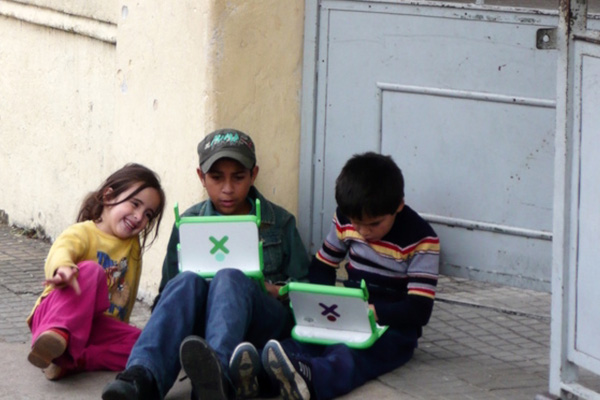

---
categories:
- casa
coverImage: verandahSunset.jpg
date: 2020-01-13 13:41:52+10:00
next:
  text: Three mashup types for digital learning and teaching
  url: /blog/2020/01/30/three-mashup-types-for-digital-learning-and-teaching/
previous:
  text: Is training the barrier to quality online learning in higher ed?
  url: /blog/2019/12/23/is-training-the-barrier-to-quality-online-learning-in-higher-ed/
title: Office365, charismatic technologies, and the ecological perspective
type: post
template: blog-post.html
---
The following began as a summary of

> Hammond, M. (2019). What is an ecological approach and how can it assist in understanding ICT take-up? _British Journal of Educational Technology_. [https://doi.org/10.1111/bjet.12889](https://doi.org/10.1111/bjet.12889)

A paper that introduces the _ecological approach_ to explain the disappointing uptake of digital technology in schools. Then I stumbled across the work of Ames (2015; 2019) on charismatic technologies. Combined these works resonate strongly with on-going tension between the next shiny new thing and the micro realities of practice around the use of digital technology (and arguably any innovation) and education (i.e. formal learning & teaching).

### A tension runs through it

A tension, on reflection, that seems to run through most education + digital technology work. I see it in what [Diane Ravitch described](https://dianeravitch.net/2019/12/31/audrey-watters-the-most-important-post-of-the-decade-the-100-worst-edtech-disasters-of-the-decade/) as “flash-in-the-plan technological disruptions that planned to ‘revolutionize’ education” stuffed into Audrey Watters [100 Worst Ed-Tech Debacles of the Decade post](https://hackeducation.com/2019/12/31/what-a-shitshow). I see it in the difference between the two distinct trajectories that Colvin et al (2016) found Australian universities taking for learning analytics: top-down focused on implementing a technical solution; and, the second focused on developing understanding that would enhance learning and teaching. More generally, I see it in [this presentation](https://www.slideshare.net/JockoSelberg/cynefin-and-complexity-an-gentle-introduction) (and below) introducing the Cynefin framework and complexity. And, I see it unfolding in the current push within higher education to integrate Office365 into learning and teaching.

The following uses Hammond’s (2019) and Ames’ (2015; 2019) work ponder this tension focused on Office365 and generate some questions.

!!! warning "Outdated content no longer available"

    Presentation from Slideshare no long available

## Ecological perspective

Hammond (2019) explains what an ecological perspective is (a summary of that paper at the end of this) and what it adds to understanding the uptake of digital technologies (Hammond uses the term ICT – Information and Communication Technologies) in learning and teaching. Hammond (2019) emphasises that an ecological perspective makes it “particularly important that policy makers are responsive to what is happening at the micro level and let practice adapt accordingly”. The rationale being that if any innovation (e.g. adoption of new digital learning/teaching practice/technology) is going to be sustainable there must be alignment in the entire ecology. From the macro level down. The argument is that failure to achieve this alignment will make any change unsustainable. i.e. the uptake of some new digital L&T practice will fail.

## Charismatic technologies

The term _charismatic technologies_ comes from the book - [The Charisma Machine: The Life and Death, and Legacy of the One Laptop per Child](https://mitpress.mit.edu/books/charisma-machine) (Ames, 2019) which appears to have grown out of an earlier paper (Ames, 2015). I became aware of the book through a pointer on Twitter that led to Amy Ko’s [personal reflections](https://medium.com/bits-and-behavior/a-autobiographical-synopsis-of-morgan-ames-the-charisma-machine-68792c7987fa) on the book. Ames (2015) argues that charismatic technologies “make both technological adoption and social change appear straight forward instead of as a difficult process fraught with choices and politics” (p. 110). Instead the technologies hold attention and generate attention and even devotion that persists even when it becomes evident that there are limitations and even problems. Some technologies have charisma. Charisma that can override rational thought. Apple products, especially laptops, spring to mind as good examples of charismatic technologies.

Ames (2015) argues that charisma is useful because it “can provide direction and conviction, smoothing away uncertainties and helping us handle contradictions and adversities” (p. 111). It does this by confirming existing views, stereotypes, institutions and power relations. By providing an ideology/worldview that explains what is happening in way that appears natural, universal and familar. The familiarity (confirmation bias) and the promised benefits make the idelogy attra ctive.

[“uruguay: students in artigas”](http://one.laptop.org/sites/default/files/Brazil-full_1.jpg) by [OLCP](http://one.laptop.org/) is licensed under [CC-BY-3.0](https://creativecommons.org/licenses/by/3.0/).

Ames illustrates this with a focus on the [One Laptop per Child Project (OLCP)](http://one.laptop.org/). A project that Ames attributes to the vision of Symour Papert – as “the project’s intellectual father” - and Nicholas Negroponte - “the public face”. The OLCP was charismatic due to the ideology it embodied, its physical design, and often over-the-top promotion. Underpinning the OLCP was the notion of children as inherently curious and with the smallest of nudgest fully able to tinker and learn – labelled the _charisma of childhood_ by Ames. It was also underpinned by the notion of school “as a stullifying rote experience that has not changed in over a century” (Ames, 2015, p. 111) – the _anti-charisma of school_. And, the _charisma of computers_ e.g. Papert’s identification of the computer as “the Proteus of machines”. All leading to the _charisma of the self-taught hacker_. In combination these ideologies resonated with a cross section of technologists who could see how it embodied their own experience/beliefs and also promoted an ideal that placed people like them at the top. Imagine how such people would react to the picture above showing children sitting in the street apparently engaged – obviously coding up a storm - with such a device. Ko [gives a personal description](https://medium.com/bits-and-behavior/a-autobiographical-synopsis-of-morgan-ames-the-charisma-machine-68792c7987fa) of these type of people and positions herself as an example of someone who did not fit in that group. Experience with the OLCP would appear to suggest that Ko’s group has a larger population that the “self-taught hacker” technologists.

In terms of design features that support the ideology. The OLCP had a _view source_ keyboard button, a screen that swiveled and could be flattened, two antennae/latches that looked like ears (see the image above), was originally labelled the _$100 laptop_ (wow, so cheap, everyone can have one), and it was intended to have a hand crank for charging. Each of these features help support or make more attractive the underpinning ideology. However, Ames research identifes how messy reality led to problems for each of these features. For example, the hand crank, the promise of easily accessible hardware, and the $100 price tag never happened. The _view source_ button was rarely used in practice. Of all the components of the OLCP, the screen was the second-most-expensive and second-most-expensive to replace.

[Ko describes](https://medium.com/bits-and-behavior/a-autobiographical-synopsis-of-morgan-ames-the-charisma-machine-68792c7987fa) other problems with the OLCP documented in Ames (2019). Problems due to inappropriate power, limited usability of installed software, battery and storage limitations. But perhaps more importantly observations that most OLCP users did not engage in activities aligned with the idea of the _self-taught hacker_. Instead of learning how to program by themselves, they listened to music, watched videos (including porn), and played games. Where learning occurred it was more likely due to peers and teachers than via kids acting as roaming autodidacts.

Ames explains that the point of all this is not to argue against the particular ideology that helps make a technology charismatic. Instead, the aim is reveal and understand the ideology in order to better understand if and how it fits with what we’re trying to achieve. Without this broader understanding, Ames argues that there is “little hope for long-term change” and instead there is the risk of “being perpetually blinded by the newest charismatic technology”. Importantly (for me), Ames (2015) identifies charismatic technologies as a conservative force that “may divert attention and resources from more complicated, expensive, or politically charged reforms that do not promise a quick fix and are thus less ‘charismatic’”. A view that resonates strongly with the point Hammond makes about the ecological perspective.

## Office 365 as a charismatic technology

Office 365, in particular Microsoft Teams, is a newish technology that is increasingly visible in higher education. I don’t think it’s a stretch to see it as a charismatic technology. Suggesting that this might be a useful way of analysing it through questions such as the following.

### What ideology does Office365 embody?

Arguably, there may be two different, but perhaps related, ideologies.

For the vendor and perhaps technology people, [Office365 appears](https://docs.microsoft.com/en-us/office365/servicedescriptions/office-365-platform-service-description/office-365-platform-service-description) to embody the shift from [products to platforms](https://www.inc.com/phil-simon/why-your-company-should-build-platform.html), the rise of [the platform economy](https://www.nbp.pl/badania/seminaria/25x2016_2.pdf). Which has connections to ideologies that see digital platforms enabling our transformation from workers to proto-entrepreneurs aka gig work etc.

This connects to the employability agenda in higher education (Boden & Nedeva, 2010). This can be seen in arguments for Office365 that push the argument of providing students with the “necessary skills for when they enter the workforce” (Hinton, 2019, n.p).

### What ideology does Domain of One’s Own embody?

[Domain of One’s Own](https://library.educause.edu/resources/2019/10/7-things-you-should-know-about-a-domain-of-ones-own) is one of a range of projects that could also be seen as charismatic technologies. Technologies that embody a similar ideology. An ideology more in line with the idea of [the IndieWeb](https://indieweb.org/), which is explained as being the “people-focused alternative to the ‘coporate web’”.

### Are you ignorant, right, wrong or pragmatic?

Ames argues that the point isn’t necessarily to argue that the ideologies built into charismatic technologies (e.g. digital platforms and employability for Office365) are wrong. At the very least, the point should be to be aware of the ideologies and what that means for your aims/context. Rather than adopting a technology just because everyone else is. And, if adoption does go ahead, know the likely mismatches and actively take steps to address those through adopting appropriate sociotechnical configurations.

Macgilchrist, Allert & Bruch (2019) provide a somewhat related example, though not tied specifically to a context or technology. They use social science fiction to describe three “histories of the 2020s” to map out three possible futures for current students: smooth users; digital nomads; and, collective agents. The type of analysis Ames suggests could help universities think about which of these futures they want to prepare students for and subsequently inform their technology adoption and management activities.

### What does Office365 divert attention from?

If Office365 is the latest charismatic technology that has blinded decision makers, then what are the “complicated, expensive, or politically charged reforms” that are being ignored?

Given [my recent work](/blog/2019/11/28/how-to-share-design-knowledge-in-design-for-digital-learning/) (Jones, 2019) I’d argue that universities still haven’t figured out how to analyse and explain how they will develop quality learning and teaching outcomes (Ellis & Goodyear, 2019). They haven’t solved the problem of how to sustainably and at scale share the design knowledge necessary to design quality digital learning experiences. I don’t expect the adoption of Office365 (or any other technology) to change that.

Examining and explaining disappointing use of digital technologies in learning and teaching is exactly what Hammond (2019) aims to do through an ecological approach.

### Is this an opportunity for universities to lead the way?

This pattern of the adoption of shiny new things leading to unfulfilled promises is well established in both research practice. It’s not as if what’s discussed here is unknown or overly new. And yet, Universities still tend to use technical and management practices that fail to use and are often completely ignorant of this type of analysis or the need for it.

This suggests that successfully integrating this type of analysis into enterprise practices is likely to be very challenging. But given growing perceptions of the centrality of digital technology to society, perhaps there’s significant value in developing the knowledge necessary to do this successfully.

### What ideology underpins the contemporary university?

For folk like Arthur (2009) the university is just another type of technology. Perhaps even a charismatic technology that embodies a certain collection of ideologies. For example, neo-liberalism. If so, will there be a mismatch between this ideology and the need to engage in more critical analysis?

Time to return to Hammond (2019)

## What is an ecological approach? How can it help?

To answer these questions, Hammond’s (2019) paper uses four big questions as its main sections

1. How has ICT take-up been researched and where are the gaps?
2. What is an ecological approach?
3. How might you apply an ecological approach to researching ICT take-up?
4. Why is an ecological approach worth adopting?

### How has ICT take-up been researched and where are the gaps?

The language used – _teacher adoption of ICT_ – suggests that the focus is on schools. But I’d expect much of what’s discussed to resonate with the experience within higher education.

Argument is that existing approaches – with an emphasis on surveying, typologising and modelling – has done some useful things, but in inadequate for the job of explaining disappointing ICT take-up in various contexts. This is because there is insufficient consideration of the institutional context.

i.e. it’s identified factors why teachers may or may not adopt ICT independent of the context in which they work. Leading tot he siutation where take-up is see as “the responsibility of teachers themselves rather than leaders or policy makes” (p. 3)

### What is an ecological approach?

Challenge is that the concept of _ecological_ has numerous meanings. Hammond adopts a definition coming out of Bronfenbrenner (1979) as

> one focused on the relationshiop of the individual to the system in which they act, a relationship which is seen as interdependent. As such an ecological approach is interested in stakeholder perspectives on policies and/or practices, e.g., how a child experiences family of school life, but at the same time it is interested in how these policies and practices are nested within a wider system, e.g., how the child’s experience of school is shaped by a wider culture or how family is shaped by structual shifts in the economy

This perspective is connected back to Darwin and his work on natural selection. It’s then linked to pragmatism and Dewey.

Bronfenbrenner (1979) is the source of the micro, meso, exo and macro levels to describe a nested environment. The actor, rather than being passively influenced by the levels, reacts/adapts to these. A metaphor of _canalisation/canalised_ arose. An individual can be led into, but not forced to behave certain ways.

The broader societal levels can lead to two different systems might resemble each other, but placed in different contexts be quite different. Source of the perspective that “it might be easier to society to change education than education to change society”

From an ecological systmes thinking, sustained innovation can only occur when there is an integrated approach across the different levels. This includes the observation that

> It is particularly important that policy makers are responsive to what is happening at the micro level and let practice adapt accordingly.

### How to apply an ecological approach to researching ICT take-up

It’s argued that the different layers of ICT take up in educational settings need to explored. These layers include

- The teacher Need to understand the teacher’s perspective on the ICT, but also the environment, teaching in general etc. This includes the immediate teaching context – students, resources etc.
- The institution The policies and pracitces of leaders etc.
- Beyond the institution National level policies, discourses and other factors. Tensions and contradictions in those policies
- The tools The nature of the tools etc.

Unlikely a research team can gather information on all levels. May need to foreground one of more layers while being aware of other layers (sampling etc)

Analysis needs to put the layers back together using various analytical frames. This includes: frameworks from ecological writers; life science metaphors; developed frameworks; social science theories e.g. activity theory, actor-network theory. Each with their strengths/weaknesses.

For example, the suggestion is that activity theory

> strains the very idea of ecological framing as it often ends up focusing on what systems do not allow

References are given.

### Why is an ecological approach worth adopting?

The answer is given via “five important insights about ICT take-up” that are drawn from disparate projects that employ an ecological approach.

#### The ecology of the classroom limits the use of technology

Generally due to misalignment. e.g. a project in Greece where

> training was not responsive to teachers’ needs; there was restricted access to computers; teachers worked in a culture which was not conducive to innovation

A more subtle example of how teachers’ work was ‘canalised’ was the widespread use of a three part lesson – explain new points; controled practice; feedback and summary – that did not provide space for the type of collaborative knowledge creation supported by ICT.

Which illustrates the double challenge of introducing ICT. Both pedagogical and technological challenges.

> A consequence here is that if policy makers want to promote the use of technology then they should work towards for a better alignment in the system.

Also makes the point that waiting for a new generation of teachers who are digitally literate is optimistic. As the misalignment will impact these “digital natives” ability to use ICT.

#### In spite of ecological limitations, technology can sometimes find a niche

While ICT take-up is disappointing there has been change. Gives various examples from the literature (e.g. lesson preparation, teacher PD etc)

Ecological explanation is that ICT has found a niche. Research has shown this typically how ICT that clearly supports “delivery” as a niche. Another is where technology provided widely accepted value for discipline teaching (e.g. use of data analysis software in teaching statistics) even if it meant reforming curriculum.

Such niche finding is easier where teacher (researchers) have more autonomy. But the lack of alignment between these particular cases and other teachers mean that it’s unlikely to scale/be sustained. Simlarly, reforms established at school level can disappear if not supported by the broader ecology.

> By understanding schools as ecological systems practitioners (teachers and education leaders) can learn that if they want to sustain the use of ICT then they must settle its use via schemes of work, and creating collaborative teams to support development. Change is not a short-term process and teachers should resist taking on the role of “hero innovator” (Fullan, 2007).

#### Teachers (and students) can ‘run away’ with technology by they will be called back

If context was the only influence, then the expectation would be of consistent take-up within similar contexts. But agency & disposition of teachers make a difference. But there is more also. Engestrom (2006) offers the metaphor of technology as “runaway objects”.

But the need for alignment will draw things back.

#### Developments beyond the institution are not the answer to ICT take-up

Examples given of how ICT have become central to broader society. e.g. changing the nature of some disciplines, etc. And these changes do have an influence. Education institutions “are not ring-fenced”. But these broader discourses can be simplified. e.g. parents can have concerns about Internet/phone use at schools. MOOCs are used by teachers for PD, but find difficult applying that knowledge. Other teachers had established routines at home and at work that prevented engagement.

#### Change is possible, if considered carefully

The ecological view can be seen as suggesting that systems cannot change. But systems have changed in the past and can in the future. An ecological view seeks to identify possibilities for change, to understand how change is/can/will be channelled. For researchers there’s a need to adopt a critical stance to “say when policies are distorted by commercial interests and when technological optimism is misplaced”

## References

Ames, M. (2019). _The Charisma Machine: The Life, Death, and Legacy of the One Laptop per Child_. https://mitpress.mit.edu/books/charisma-machine

Ames, M. G. (2015). Charismatic technology. _Proceedings of The Fifth Decennial Aarhus Conference on Critical Alternatives_, 109–120. [http://dl.acm.org/doi/abs/10.7146/aahcc.v1i1.21199](http://dl.acm.org/doi/abs/10.7146/aahcc.v1i1.21199)

Arthur, W. B. (2009). _The Nature of Technology: What it is and how it evolves_. Free Press.

Boden, R., & Nedeva, M. (2010). Employing discourse: Universities and graduate ‘employability.’ _Journal of Education Policy_, _25_(1), 37–54. https://doi.org/10.1080/02680930903349489

Bronfenbrenner, U. (1979). _The Ecology of Human Development_. Harvard University Press.

Colvin, C., Wade, A., Dawson, S., Gasevic, D., Buckingham Shum, S., Nelson, K., Alexander, S., Lockyer, L., Kennedy, G., Corrin, L., & Fisher, J. (2016). _Student retention and learning analytics : A snapshot of Australian practices and a framework for advancement._ Australian Government Office for Learning and Teaching. http://he-analytics.com/wp-content/uploads/SP13-3249\_-Master17Aug2015-web.pdf

Ellis, R. A., & Goodyear, P. (2019). _The Education Ecology of Universities: Integrating Learning, Strategy and the Academy_. Routledge.

Hinton, Z. (2019, May 14). _Using digital platforms to enhance the student journey_. Long-Term Stock Exchange CABS conference, Manchester. https://ltse.com/

Jones, D. (2019). Exploring knowledge reuse in design for digital learning: tweaks, H5P, CASA and constructive templates. In Y. W. Chew, K. M. Chan, & A. Alphonso (Eds.), _Personalised Learning. Diverse Goals. One Heart. ASCILITE 2019_ (pp. 139–148).

Macgilchrist, F., Allert, H., & Bruch, A. (2019). Students and society in the 2020s. Three future ‘histories’ of education and technology. _Learning, Media and Technology_, _0_(0), 1–14. https://doi.org/10.1080/17439884.2019.1656235