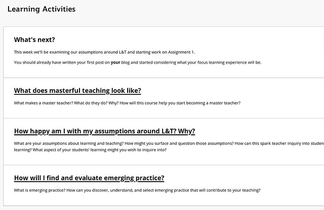
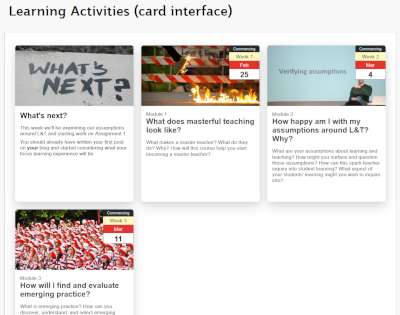
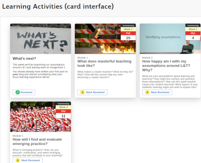

---
categories:
- eei
coverImage: frogs.jpg
date: 2020-01-30 16:06:34+10:00
next:
  text: Early steps with Gephi
  url: /blog/2020/04/19/early-steps-with-gephi/
previous:
  text: Office365, charismatic technologies, and the ecological perspective
  url: /blog/2020/01/13/office365-charismatic-technologies-and-the-ecological-perspective/
title: Three mashup types for digital learning and teaching
type: post
template: blog-post.html
---
## Introduction

Over the last 12 months my work helping improve digital learning and teaching environments has relied heavily successfully integrating a variety of technologies. It has relied on mashing up different technologies into effective learning and teaching environments and experiences. The following reflects on that work and identifies three different types of mashups:

1. Mashup within the LMS.
2. Mashup to change the LMS.
3. Mashup to embed the LMS into the broader work system.

### Why?

This type of work is important because [there are suggestions](https://campusmorningmail.com.au/news/zoning-university-technology-to-the-students/?utm_campaign=website&utm_source=sendgrid.com&utm_medium=email) that the perceived poor quality of learning and teaching at Universities can be fixed simply by re-allocating people and resources away from administrative business functions to learning and teaching. The problem is that interviews with university leaders (Ellis & Goodyear, 2019) find that they don’t yet know how to effectively merge learning, teaching, technology and facilities; privilege quality assurance and compliance over enhancement and innovation; focus on simple measurable outputs; and, have an under-developed capacity to analyse and explain the how to achieve those outcomes (p. 329).

The following uses experience to identify successful (perhaps necessary) mechanisms for merging technology with learning and teaching. The list suggests limitations in the current processes, technologies, and assumptions underpinning how universities go about developing quality learning and teaching. Limitations, which if not addressed, will limit any potential improvement that can come from throwing more resources at the problem.

For example, the list and the following explanation

1. Illustrates the limitations of the current conception of _integration_ that underpins current enterprise digital education practice.
2. Suggests that the trend of hobbling or not supporting existing Web standards by contemporary digital learning applications (e.g. Blackboard Ultra, some phone-based apps etc) is making it very difficult to engage in the types of integrations necessary to achieve quality digital learning and teaching environments.
3. Argues that the value generated by these types of mashups means that new applications should be evaluated on how well they support these mashups, not just on whether or not they provide LTI support.

### Reconising the need for a diversity of tools

[EDUCAUSE’s](https://www.educause.edu/) vision for the future of digital learning and teaching is the Next Generation Digital Learning Environment (NGDLE). It’s an idea based on the recognition that “no single application can deliver” (Brown et al., 2015, p. 1) all the functionality required by the diversity inherent in digital learning and teaching. Consequently, the suggestion is that the LMS will no longer be the single application for digital education. Instead, there will be an ecosystem of components available that “allow individuals and institutions the opportunity to construct learning environments tailored to their requirements and goals” (Brown et al., 2015, p. 1).

### LTI: the problematic “lego approach” metaphor of integration

The current dominant method for tailoring this ecosystem of components into a learning environment that meets requirements and goals is the [Learning Tools Interoperability (LTI)](https://en.wikipedia.org/wiki/Learning_Tools_Interoperability) standard. When considering a new digital L&T technology it has become common practice to check for LTI support. As if LTI is the be all and end all of integration. I find this problematic.

The major problem is embedded in the name, _Learning_ **_Tools_** _Interoperability_. LTI enables the (somewhat limited) seamless interoperability and integration of the **tools**. In my experience, LTI is not so good at helping develop a learning environment that seamlessly the integrates the experience and activity of the learners and teachers working within that environment.

LTI seems to be the type of enabling technology that the proposers of the NGDLE had in mind when they suggested that a ‘Lego approach’ would be necessary.

> Legos work because of a design specification that ensures the pieces will interlock, while enabling a wide variety of component parts. For the NGDLE to succeed as we describe here, a similar set of specifications and services will need to be defined that constitute the conformance needed to make the Lego approach workable (Brown et al., 2015, p. 9)

[Tony Bates questions](https://www.tonybates.ca/2015/05/11/educause-looks-beyond-the-current-lms-environment/) (read the comments) whether Lego are the right metaphor for a learning environment.

> A next generation digital learning environment where all the bits fit nicely together seems far too restrictive for the kinds of learning environments we need in the future. What about teaching activities and types of learning that don’t fit so nicely?

With LTI the Lego metaphor becomes two or more separate applications – e.g. LMS (Blackboard) and ePortfolio (PebblePad) that are entirely self-contained. They are connected by the LTI set of specifications, but they are distinct applications. The LTI specification makes the technical transfer of information between them seamless. But, LTI doesn’t help with the transition of the learners and teachers engaged in the learning environment created with these applications. The two separate applications have very different interfaces, terminology, and underpinning models. Making the transition less than seamless.

Not that everything needs to be seamless. There are times when a clear distinction is useful and important. It’s not a case of replacing LTI with mashups. It’s the case of having LTI **and** enabling mashups in order to achieve the following [from Tony Bates](https://www.tonybates.ca/2015/05/11/educause-looks-beyond-the-current-lms-environment/)

> I have much more faith in the ability of learners, and less so but still a faith in teachers and instructors, to be able to combine a wide range of technologies in the ways that they decide makes most sense for teaching and learning than a bunch of computer specialists setting technical standards (even in consultation with educators).

### Mashups: integration beyond lego bricks

In proposing the NGDLE, Brown and colleagues (2015) do appear to have recognised that this is required when they suggested that

> the model for the NGDLE architecture may be the mash-up. A mash-up is a web page or application that “uses content from more than one source to create a single new service displayed in a single graphical interface (Brown et al., 2015, p. 3)

As defined in this quote mashups not only support the integration of different tools. Mashups – by integrating these tools into a single interface – offer the potential of developing a learning environment that seamlessly integrates the experience and activity of learners and teachers.

The following provides examples of the different types of mashups that I’ve been involved with over the last 12 months within [the Blackboard Learn 9.1 LMS](https://blog.blackboard.com/our-latest-investment-blackboard-learn/). But first,

### What is a mashup?

Mashups originate in the practice of disc jockeys combining music from multiple artists to create new material (Beemer & Gregg, 2009). A practice made for YouTube as illustrated by the following video (and the rabbit warren YouTube will take you down, if you let it).

https://www.youtube.com/embed/oT3mCybbhf0

The brave new world of Web 2.0 brought that practice into the software sphere with the evolution of mashup to refer to software applications that merged functionality from multiple sources into a unified user interface (Kulathuramaiyer, 2007; Zang et al., 2008). An important feature was that anyone, just not software developers, could create mashups (Beemer & Gregg, 2009; Hoyer & Fischer, 2008; Zang et al., 2008). Thereby enabling the development of mashups that could respond quickly to specific contextual needs (Beemer & Gregg, 2009).

Echoing directly the NGDLE idea of using mashups to enable “individuals and institutions the opportunity to construct learning environments tailored to their requirements and goals” (Brown et al., 2015, p. 1).

## The mash-up list

The following list meant to be illustrative of types of integration/mashup that are different from that enabled by LTI. LTI generally allows to two different applications to communicate and share information.

### Mashup within the LMS

The simplest example use of the [**<embed>**](https://www.w3.org/TR/2011/WD-html5-author-20110809/the-embed-element.html) [tag](https://www.w3.org/TR/2011/WD-html5-author-20110809/the-embed-element.html) that is a standard part of HTML. [The description of the embed tag](https://www.w3.org/TR/2011/WD-html5-author-20110809/the-embed-element.html) from the standard explicitly makes the connection with mash-ups.

> The embed element [represents](http://www.w3.org/TR/2011/WD-html5-20110525/rendering.html#represents) an integration point for an external (typically non-HTML) application or interactive content.

If you’ve ever embedded a YouTube video, you’ve used the embed tag and produced a mash-up. You’ve mashed up external content within the LMS.

The embed tag enabled mashup is much more than a link. A link takes you outside of the existing environment/page. An embed enabled mashup is embedded within the LMS page.

Another example is illustrated in the following image. It is from a Blackboard site for a program in the Creative Industries. Embedded within this LMS page is styled list of the latest articles from [a discipline specific journal](https://abj.artrepreneur.com/). Some site specific Javascript is used to retrieve and display the journal’s RSS feed within the LMS-hosted program site.

Another example is work by folk at QUT where they integrated the [disqus comment plug-in](https://disqus.com/) into the Blackboard 9.1 LMS to provide a discussion experience that improves upon that offered by Blackboard’s native discussion forum.

### Mash-up to change the LMS

The previous mash-up examples took content/functionality from outside the LMS and embedded it within the LMS. The examples here bring in functionality from outside the LMS, to modify how the LMS appears and/or operates. Such work is done to address some limitation or inappropriate feature of the LMS. As the EDUCAUSE folk identified, one application can never cater for all the diversity associated with learning and teaching (Brown, et al., 2015).

For example, Blackboard 9.1 is known wide and far for ugly web pages (even [Stephen Downes](https://www.downes.ca/cgi-bin/page.cgi?post=69104) has experienced it). At almost it’s best, standard Blackboard 9.1 looks like the following.

Again, folk at QUT saw this as a problem and developed [a plugin](http://tweaks.github.io/Tweaks/) for the Blackboard LMS that could automatically transform the above to the something a bit better, like the following.

Over the last year we’ve gone a step forward and developed [some Javascript/CSS](https://github.com/djplaner/Card-Interface-Tweak) that can be embedded in Blackboard and produce something like the following.

This approach has also been extended to work with Blackboard functionality such [as review status](https://help.blackboard.com/Learn/Administrator/Hosting/Tools_Management/Review_Status).

There are many other examples of how the existing functionality/interface of an LMS is inappropriate for a given educational purpose. The [JS Hack building block](https://github.com/AllTheDucks/jshack) made use of the architecture of Blackboard 9.1 to enable institutions to develop (and share) modifications for the Blackboard 9.1 user interface. Both administrative (e.g. [displaying a warning to administrators](https://github.com/AllTheDucks/jshack-v1/wiki/Availability-Notice-Package)) and user interface.

The following Tweet is a recent example of the clash between pedagogical intent and technological design. Exactly the type of clash this type of mashup is meant to prevent.

https://twitter.com/OnlineCrsLady/status/1221879650424709121

### Mashup to embed the LMS into the ecosystem

The previous mashups have the user experience occurring within the LMS. The problem is that – as the NGDLE idea suggests – the LMS is only one tool from the ecosystem of applications that are required for learning and teaching. At least some (arguably most) of those applications will be personal, i.e. not chosen by the institution. How well the LMS can work well with other applications is important.

For example, when creating content Blackboard 9.1 – like most LMS – provides the ability to either upload files (e.g. Powerpoint, PDF, Word documents) or edit HTML using the TinyMCE editor. Uploading files means you can use tools purposefully designed to support content creation and link to their own ecosystem of tools. Using the TinyMCE editor you give up all that. Meaning you give up version control, citation management, and collaborative authoring (comments, track changes) etc to produce web content. It’s no surprise that the majority of content in an LMS is in documents.

This type of mashup fixes this type of problem by more effectively embedding the LMS in the broader ecosystem of digital technology.

The animated GIF below demonstrates that use of [a mashup we’ve developed](https://github.com/djplaner/Content-Interface-Tweak) that embeds the LMS within the broader content authoring ecosystem commonly used at our institution, including OneDrive/SharePoint, the Office365 applications and more broadly, web technologies. It starts with where the authors are, using Word and Powerpoint to author (perhaps collaboratively) content. But then uses other technologies to solve various problems with the existing process, embeds additional authoring functionality (version control, collaborative editing and commenting etc.), and provides teachers with an improved authoring experience and learners with an improved learning interface.

Not only that, in essence the mashup provides a simple [headless content management system](https://en.wikipedia.org/wiki/Headless_content_management_system) for Blackboard. Meaning the content (now in Word documetns) can be quickly re-used for different purposes. e.g. when we migrate to a different LMS, or in different course sites.

 

## Challenges to mashups

Even the most basic of mashups – embed within the LMS - is challenging if you have no background with web authoring. For example, in the last year I’ve had to explain how to embed a YouTube video numerous times. The remaining two mashup types are more complex again, generally outside the realm of the standard teacher.

But the ability to implement even the simplest of mashups is being curtailed by technological trends. Increasingly, most LMS prevent end-users from including Javascript and CSS. Web standards that are important enablers of mashups on the web. But the constraints are going further again. The design of the new Blackboard Ultra LMS constrains what HTML is accepted. Placing limits on even what can be achieved with the <embed> tag. Making chances of supporting web components limited.

In part, the espoused reason for this trend arises from the limited digital literacy of users mentioned in the previous paragraph. The flexibility offered by embedding Javascript/CSS combined with the perceived lack of knowledge means that disasters can happen. Closing this capability appears to be easier than providing the necessary training and support to leverage this functionality.

But at what cost?

## References

Bartuskova, A., Krejcar, O., & Soukal, I. (2015). Framework of Design Requirements for E-learning Applied on Blackboard Learning System. In M. Núñez, N. T. Nguyen, D. Camacho, & B. Trawinski (Eds.), _Computational Collective Intelligence_ (pp. 471–480). Springer International Publishing.

Beemer, B., & Gregg, D. (2009). Mashups: A Literature Review and Classification Framework. _Future Internet_, _1_(1), 59–87. https://doi.org/10.3390/fi1010059

Brown, M., Dehoney, J., & Millichap, N. (2015). _The Next Generation Digital Learning Environment: A Report on Research_ (A Report on Research, p. 11). EDUCAUSE.

Ellis, R. A., & Goodyear, P. (2019). _The Education Ecology of Universities: Integrating Learning, Strategy and the Academy_. Routledge.

Hoyer, V., & Fischer, M. (2008). Market Overview of Enterprise Mashup Tools. In A. Bouguettaya, I. Krueger, & T. Margaria (Eds.), _Service-Oriented Computing – ICSOC 2008_ (pp. 708–721). Springer. https://doi.org/10.1007/978-3-540-89652-4\_62

Kulathuramaiyer, N. (2007). _Mashups: Emerging Application Development Paradigm for a Digital Journal_. _13_(4), 531–542.

Martin, G. (2017). Scaling critical pedagogy in higher education. _Critical Studies in Education_, _58_(1), 1–18. https://doi.org/10.1080/17508487.2015.1115417

Wu, J. (1999). Hierarchy and Scaling: Extrapolating Information along a Scaling Ladder. _Canadian Journal of Remote Sensing_, _25_(4), 367–380. https://doi.org/10.1080/07038992.1999.10874736

Zang, N., Rosson, M. B., & Nasser, V. (2008). Mashups: who? what? why? _CHI’08 Extended Abstracts on Human Factors in Computing_, 3171–3176. http://dl.acm.org/doi/abs/10.1145/1358628.1358826