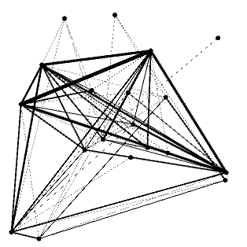
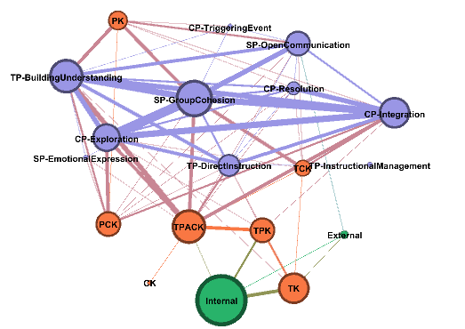
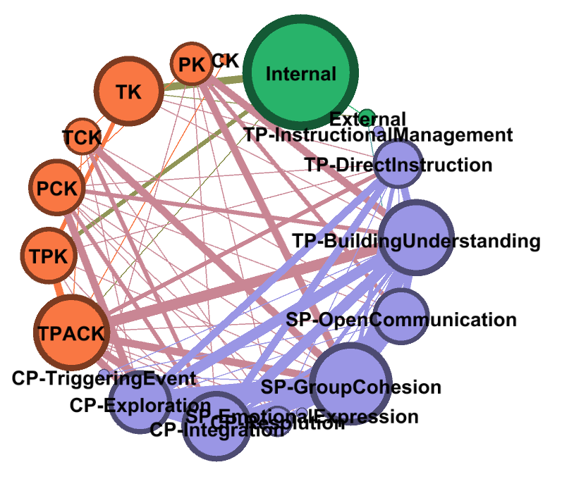

See also: [[blog-home | Home]]

Playing with Gephi

A friend is in the final throes of her PhD and wants to visualise some of her qualitative findings using a network diagram. I’ve skirted around network visualisation without ever really doing anything but wanted to learn more. Following documents and reflects on my explorations and experiments trying to help out. The main focus being on figuring out how to produce a visualisation that meets requirements.

Previous work has led to the use of [Gephi](https://gephi.org/). In part because my current institution provides access to [Turbo.net](https://turbo.net/docs/about/what-is-turbo) which provides Gephi as a container to install. Minimising the the dependency “hell” that can be the Java requirements to run Gephi.

# Reflections

The hardest part of all this was my old head building a conceptual model that bridged the data analysis outputs and requirements of my friend, network analysis/visualisation concepts, and Gephi’s (and other software) capabilities and operations. The biggest help in all this was various freely available tutorials (e.g. [this list](https://seinecle.github.io/gephi-tutorials/)) developed by Gephi users.

# Requirements

My current understanding of the requirements, includes:

- Data is coming out in spreadsheets that need to be visualised.
- Data contains 19 categories (i.e. nodes) which might be mentioned together (i.e. links)
- The number of times a node is mentioned is available and should be part of the visualisation.
- The number of times two nodes are mentioned together is also available and should be part of the visualisation
- Those categories can also belong to different groups and these groups need to be visualised.
- There might be data from individual interviews and other combinations (i.e. multiple data sets to be visualised).

# Getting the data into Gephi

Data from the analysis phase comes in a spreadsheet with the 19 categories in a 2x2 matrix. The cells represent either

1. the number of times two different categories were mentioned together, or
2. the number of times a category was mentioned in total.

One approach to get data into Gephi is to [import](https://github.com/gephi/gephi/wiki/Import-CSV-Data) two [CSV files](https://libguides.brown.edu/gephi), that specify:

1. Nodes; and  
    Establish the node label, it’s ID and provide a range of additional attributes.
2. Edges.  
    Specify if and how two nodes (source and target) are connected, the type of edge (directed or undirected) and optionally the weight.

### Nodes

Four columns

- Id – manually assigned.
- Label – from the spreadsheet with the CoI labels combined.
- Mentions – taken from the cell where the row/col matches the node
- Group – whether the node belongs to context; technology-enabled design; or learning and teaching environment.

### Edges

Four columns

- Source & Target – the Ids for the nodes the edge connects.
- Weight – how many times nodes (categories) were co-mentioned.
- Type – undirected.

### Importing and first look

With the two CSV files created, it’s a straight forward process to import and visualise. The test data gives the following visualisation out of the box. It needs some work.

# Visualising node and edge weights

The first visualisation has many limitations, next step is to address the following:

- Node size isn’t being shown.
- Node labels aren’t being shown.
- It’s all black and white.
- Is the layout as good as it can get?

This tutorial provides an in context explanation of how to make these fixes.

Showing node labels is a simple switch.

Scaling node size uses the appearance dialog and allows changes to colour, node size etc based on various factors, including node attributes. In this case, select mentions.

Appearance also allows colouring of nodes based on node attributes. In this case, group will be used.

Random experimentation with layouts reveal the _Fruchterman Reingold_ layout doing a reasonable first pass. All that combined gives the following image.

# Visualising groups

As illustrated in the previous diagram, colouring nodes based on group membership provides some representation that helps see this relationship. However, relying on colour for a this might be problematic.

Is there a layout/method that co-locates nodes of the same group?

[This blog post](http://www.martingrandjean.ch/intellectual-cooperation-multi-level-network-analysis/) illustrates something similar by grouping according to organisational membership. Though it appears this is done manually, perhaps with a bit of post Gephi touching up. Time to explore different layouts in more detail.

Start with [this tutorial](https://gephi.org/users/tutorial-layouts/), which begins with the installation of some new layout plugins (and shows some important Gephi interface actions e.g. dragging).

The circular layout generates the following image. Which may be getting close. Would be good if the labels didn’t overlap, but that’s for another day.

# What’s next?

It appears that Gephi (perhaps combined with some post-visualisation manual image editing) can be used.

The next major question will be how to automate/manage the process for converting analysis data into visualisations that are then integrated into publications.

# References

"Lantana camara plant NC3" flickr photo by Macleay Grass Man https://flickr.com/photos/macleaygrassman/48735662157 shared under a Creative Commons (BY) license