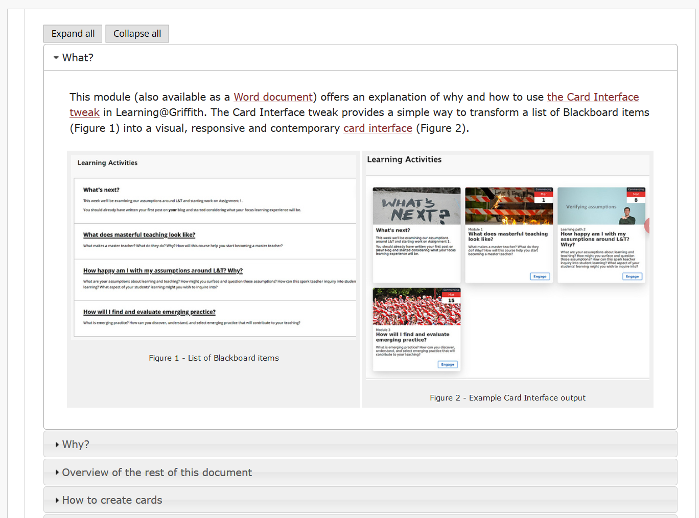

---
categories:
- bad
- casa
coverImage: 23776579774_bb775a0f1f_o-scaled.jpg
date: 2020-05-20 09:32:59+10:00
next:
  text: Learning to think in React
  url: /blog/2020/05/22/learning-to-think-in-react/
previous:
  text: Exploring auto-coding with NVivo
  url: /blog/2020/04/30/exploring-auto-coding-with-nvivo/
title: Playing with React.js as a technology for CASA
type: post
template: blog-post.html
---
Can React.js help extend CASA support for forward-oriented design?

As the title suggests the aim here is to discover if the [React.js library](https://reactjs.org/) for building web (and other) user interfaces might help address some limitations and add some needed features to the Contextually-Appropriate Scaffolding Assemblage (CASA) idea ([Jones, 2019](/blog/2019/11/28/how-to-share-design-knowledge-in-design-for-digital-learning/)). I’m going to be spending a fair bit of time on this, hence the importance of at least trying to be explicit about thinking it through. Not to mention the value of explicitly trying to make sense of all this and recording the process for later referral.

Any and all comments welcome. Especially technical corrections and disagreements. There’s much more to all of this than I know.

With that caveat, the answer I’ve drawn is that React.js can help improve CASA, and that’s work I’m starting on now.

Following starts with a re-statement of the perceived requirement and outlining limitations of current practice. React is briefly introduced and a comparison done against other possibilities. Finally, there is a dive into the React ecosystem and what it might provide the CASA idea.

## What is the requirement?

Last week [this tweet](https://twitter.com/plredmond/status/1261053050304647168) from @plredmond had me running down a web-page rabbit hole and stumbling across this list of [“Top Research Questions”](https://uwm.edu/deta/top-research-questions/) for the distance education community. A list that was apparently “derived and prioritized by the experts in the field of the 2015 DETA Summit at the ELI Annual Meeting”.

Question #7 – the last question in bold and thus significant? – caught my eye

> **What are the key components that promote a sustainable and an effective teaching and learning ecosystem?**

Not a bad description of my broader interest in digital/online learning within higher education institutions. In last year’s [ASCILITE paper](/blog/2019/08/08/exploring-knowledge-reuse-in-design-for-digital-learning-tweaks-h5p-constructive-templates-and-casa/) I argued that current approaches to enabling effective design for learning (I like [Goodyear’s distinction](https://journal.alt.ac.uk/index.php/rlt/article/view/1391/html) between “learning design” and “design for learning”) in higher education is neither sustainable or effective. The largest reason is the mismatch between the nature of encouraging the on-going development of effective learning and teaching and what can be provided by the current focus on using standard strategic/corporate/leadership techniques ([Jones & Clark, 2014](/blog/2014/09/21/breaking-bad-to-bridge-the-realityrhetoric-chasm/)).

For example, successfully implementing Microsoft Teams (or Zoom etc) and then offering training on its use will enable the successful completion of an operational plan. It will also enable some examples of good learning and teaching. But it won’t be sufficient for creating (nor a sufficient contribution toward) “a sustainable and an effective teaching and learning ecosystem”.

## CASA and Forward-oriented design

My [most recent attempt](/blog/2019/11/28/how-to-share-design-knowledge-in-design-for-digital-learning/) (Jones, 2019) to explore a different answer is the idea of Contextually-Appropriate Scaffolding Assemblages (CASA). CASA are intended to embed necessary design knowledge into a digital technology that is (more easily) embedded into contextually appropriate activity system. An activity system that makes it significantly easier for teachers to engage in forward-oriented design for learning (Dimitriadis & Goodyear, 2013; Goodyear & Dimitriadis, 2013; Sun, 2017) as represented in the following diagram. As argued by others (Dimitriadis & Goodyear, 2013; Goodyear & Dimitriadis, 2013; Sun, 2017) most design for learning stops at _design for configuration_. My argument is that this flaw infects most attempts to build a teaching and learning ecosystem (e.g. introduce Microsoft Teams)

It’s just not sufficient to implement the learning activity. Instead, active thought has to be given to the type of work that the teacher will need to do: while learning is occurring (including thinking about what the learners will do); while reflecting on how well (or not) that learning activity went; and, re-thinking how that learning activity will work next time. Suggesting that an effective teaching and learning ecosystem will provide active support for forward-oriented design. My argument is that such support also needs to encourage and enable individuals to integrate this support into their context-specific assemblage of practices and skills. To be successful in this it the support also needs to be able to respond to the diversity and volatility of the contexts. Otherwise it won’t be used for long, or at all.

Oh, this also must be achieved sustainably.

## Problems with early CASA

As described in the ASCILITE paper ([Jones, 2019](/blog/2019/08/08/exploring-knowledge-reuse-in-design-for-digital-learning-tweaks-h5p-constructive-templates-and-casa/)) we’ve developed and used two example CASA. They have been used in 100s of courses. They fill a need, but they can be better. Some of the current issues

1. The cost (difficulty)/benefit ratio for one of the CASA is still too high.  
    One of the CASA remains too difficult/different for some (but not all) people to understand and see its benefits. Hence, they can’t see how it fits with their current assemblages. Instead, some are distracted by the “pretty interface” offered by tools such as Microsoft Sway. A tool that is easy to use, but which at best offers very limited design for configuration and nothing else.
2. Insufficient support for orchestration and reflection.  
    In particular, current CASA don’t provide any insight into how and what learners are doing. Meaning next to no support for orchestration and reflection.
3. Insufficient support for customisation and generativity.  
    Both CASA currently offer support for a small set of fairly generic activity systems. The [reusability paradox](https://cnx.org/contents/2tQZVsKy@19/The-Reusability-Paradox) suggests that the there is more value in enabling more context specific adaptation.
4. The technology foundation for these CASA is primitive.  
    The current CASA were my training projects for Javascript and Blackboard. It shows in the quality of the tech. The limitations are becoming an issue and are one of the major constraints on addressing the above problems.

Lastly, I’ve a project in which I need to develop a graduation checker. A tool that allows students to check when and what courses they need to complete in order to graduate. A tool that requires a more complex user interface.

How to address these problems? What are the options? Well, one is…(and yes I do recognise the apparent techno-solutionism here and have failed to explain why I continue down this route).

## React.js

[React](https://reactjs.org/) is a “JavaScript library for building user interfaces”. Its origins are with FaceBook, but I’m trying not to hold that against it. On the plus side, it is open source and widely used. Meaning that there is a lot of tooling available to support React development. There are also jobs available in React development. A plus given the likely COVID inspired collapse in Australian higher education that has a growing attraction and the challenges that poses for people on contracts.

The following seeks to answer these sub-questions about React

1. What about other alternatives? Bootstrap, Angular…
2. Can it be integrated into the existing ecosystem?
3. What support for current CASA might it provide?

### Sustainability and reusing design knowledge

Question #3 is important from the sustainability perspective. The CASA idea positions the ability to reuse design knowledge as a key enabler for sustainability. It argues that current approaches to maintaining a teaching and learning ecosystem don’t enable reuse of design knowledge. Too many people are wasting time trying to solve the same problems.

One of the key limitations of the current CASA implementation is that my weak brain had to solve too many problems. One of the strengths of current CASA is that they enable the reuse of existing design knowledge. The ability to draw on and reuse a vast array of design knowledge is important for CASA.

## What about the alternatives?

### What about Bootstrap?

A lot of people like and use Bootstrap. But, [this comparison](https://flatlogic.com/blog/bootstrap-vs-material-ui-which-one-to-use-for-the-next-web-app/) of Boostrap and Material-UI (a React-based framework discussed below) has me thinking that React offers a better option than Bootstrap. Mainly because it argues that one of Boostrap’s strengths is consistency with “average opportunities for customisation”. For CASA, customisation is important.

React versus Boostrap is really a apples and oranges comparison. Bootstrap is a more complete framework for CSS/HTML and a very successful one. As illustrated in [other perspectives](https://www.slant.co/versus/504/522/~bootstrap_vs_material-ui) and [top 15](https://www.mockplus.com/blog/post/css-framework) and [top 10](https://geekflare.com/best-css-frameworks/) lists of CSS frameworks. React is a library. A smaller scale object. The type of thing React is means much more able to play well with others. Whereas all-encompassing frameworks don’t play well with others. Also, comments suggest that React is easier to try out small and grow.

Perhaps the biggest plus for React is that it focuses on building user interfaces. Providing the View in Model-View-Controller development. The focus with the CASA concept is **not** to be developing full web applications. It to act as the glue between current systems and practices. The place where additional contextual knowledge is added.

### What about Angular and Vue?

What about comparing apples with apples. Apparently it makes more sense to [compare Angular, Vue and React](https://www.codeinwp.com/blog/angular-vs-vue-vs-react/).

[Angular](https://angular.io/) is from Google. [Vue](https://angular.io/) is smaller scale in origins, an ex-Google employee and friends.

For a code-based comparison, here’s a description of [writing the same app in both Vue and React](https://medium.com/javascript-in-plain-english/i-created-the-exact-same-app-in-react-and-vue-here-are-the-differences-e9a1ae8077fd). Which initially suggests not a lot of difference, but has me thinking Vue seems to fit my conceptions a little better. But eventually not much to choose between them.

There’s also an article that creates [the same simple App using Angular](https://medium.com/javascript-in-plain-english/i-created-the-exact-same-app-in-react-and-vue-part-2-angular-39b1aa289878). Angular uses TypeScript which makes it more object-oriented. And ends up with code in a format that’s a bit more familiar to me. However, it’s described as a more heavyweight framework. Bumping up against the issue with Bootstrap above.

Just discovered a site that implements a todo app in [multiple different MV\* frameworks](http://todomvc.com/). If I actually had the time to do an in-depth comparison, this would be very useful. The design of the [React version of the app](http://todomvc.com/examples/react/#/) is likely to be a useful inspiration.

With considering just Angular, Vue and React it’s close. However, the sunk cost of the pre-conceived idea of using React will win. Especially given this quote from a [comparison of Angular and React](https://blog.udemy.com/react-js-vs-angular-vs-vue-js-which-is-the-best-javascript-framework/)

> React.js is comprised of tools that help you build components to be dropped into a page

Can it be integrated into the pages that CASA will need to work with?

### What about Web components?

Thanks largely to the work [of Bryan Ollendyke](https://btopro.com/) (@btopro) I’ve become aware of [Web components](https://developer.mozilla.org/en-US/docs/Web/Web_Components) and long put them on my list of tech to grok. The little I knew suggested they’d be a good tool for the CASA idea. Without the slightly grubby feel that a technology that originated at Facebook might being.

According to [the React folk](https://reactjs.org/docs/web-components.html), React and Web components are apple and oranges. That they are and can be complementary. Others seem to agree that [it’s not React versus Web components](https://dev.to/steveblue/it-s-not-about-web-components-vs-react-5137). Arguing that something like React might be needed for complex web applications, but not something simpler. React adds state to UI and some other advantages. But in theory these are still interoperable.

Suggesting it’s not currently a question of React or Web components.

## Can it be integrated into the existing ecosystem?

One of React’s hyped benefits is that it plays well with others. It doesn’t expect to be the only framework/tool you are using. It can be [embedded in web pages](https://levelup.gitconnected.com/the-two-easiest-ways-to-share-your-reactjs-project-as-a-widget-971dfef66d98) produced by other systems. As illustrated by the following two examples working in this Wordpress post. They also work in Blackboard Learn, which is currently where the CASA I work on have to live. This also suggests that they will also work in any other future systems or organisation adopts. At least as long as those systems “play well with others”. i.e. not Blackboard Ultra.

Or something slightly more exciting

<iframe width="320" height="240" src="https://djon.es/gu/react/build/"></iframe>

That’s a yes, but with a bit more to do

## What might the React ecosystem provide CASA?

Something like React is a pre-requisite for the next CASA – a graduation checker – which will require quite a complex user interface. A React strong point. Combine that with the large React ecosystem and its integration into Web (and mobile) UI development and it will definitely help the grad checker. The question is what might the React ecosystem offer the two existing CASA.

### Card Interface

At its core the Card Interface CASA translates boring, ugly lists of Blackboard Learn content items into a more contemporary interface. It also embeds contextual knowledge, such as on what date does Week 1, Trimester 1, 2019 start? It converts the interface on the left to the interface on the right.

|      |      |
| --- | --- |

The Card based approach to user interface design is a widely used contemporary practice. You’ve probably seen it on numerous websites. Hence it is a common need for web interfaces. A strength of React is that it encourages the design of reusable components. In fact, there’s a collection of tooling to help with the design and management of reusable components. This suggests that the React community should provide significant existing explicit support (even components) for a Card interface. A Google search for [“react card interface”](https://www.google.com/search?q=react+card+interface) supports that suggestion.

### React Frameworks

Since React is a fairly low level Javascript UI library, there’s a lot of space for frameworks that provide pre-built components. Here’s a list of [20+ such React libraries/frameworks](https://www.codeinwp.com/blog/react-ui-component-libraries-frameworks/).

There’s [Material-UI](https://material-ui.com/). Based on a design from another Internet behemoth (Google). Material-UI is described as a REACT UI framework. It’s open source. It supports a long [list of components](https://material-ui.com/getting-started/supported-components/), including [Cards](https://material-ui.com/components/cards/). The Card component [appears quite flexible](https://deprecate.mui-treasury.com/components/card). Beyond that, there are [templates](https://material-ui.com/getting-started/templates/) and [example applications](https://github.com/mui-org/material-ui/tree/master/examples). There is a collection of [premium themes and templates](https://material-ui.com/store/?utm_source=docs&utm_medium=referral&utm_campaign=example-projects-store). Some people seem [to like it](https://dev.to/amberjones/5-delightful-things-about-material-ui-5402). There are those that [have problems](https://medium.com/techtrument/bye-bye-material-design-acaebcc7c6b4) with Google’s work on the design of the Material guidelines that Material-UI is based on.

[React Toolbox](http://react-toolbox.io/#/) is another implementation of Google’s Material design into React. It has support for [CSS Modules](https://github.com/css-modules/css-modules), which may be useful for CASA. Need to explore if Material-UI also supports this, and if this will work in the Blackboard context.

If you don’t use Google’s Material. Then there [is Ant Design](https://ant.design/) and the React UI library based on it. It has [a Card component](https://ant.design/components/card/) and many of the same things as Material-UI. Or perhaps [IBM’s Carbon](https://www.carbondesignsystem.com/get-started/about-carbon). Not as complete, but supports React.

Or perhaps [React Bootstrap](https://react-bootstrap.github.io/). i.e. Bootstrap rebuilt using React, but still maintaining compatibility with the Bootstrap UI ecosystem (e.g. themes).

### Content Interface

In a course context, the Card Interface is used to give an overview of learning modules. The Content Interface embodies design knowledge in Javascript which is then used to transform a HTML description of a learning module into a more interactive Web experience. As the (bad) title suggests this CASA initial focused on presenting content. Currently using the jQuery accordion to produce something like the following. The long term aim is to provide more support for interactive learning and teaching activities.

There appear to be three broad ways that React can help

1. Provide alternatives to the jQuery accordion interface for presenting a learning module.
2. Provide a range of React components that can be used to enhance the interactive activities that can used within a learning module.
3. Good development tooling and practices to enable more rapid response to divergent requirements.

Way #1 could look something [like Spectacle](https://github.com/FormidableLabs/spectacle) – a presentation library. Which appears to use a [a Carousel component](https://ant.design/components/carousel/) common to most React frameworks. There are some possibilities with infinite scroll and parallax in the [awesome react component list](https://github.com/brillout/awesome-react-components). In the ends this really requires more CSS/HTML design before considering any React components.

Individual components could be used with way #2. Collections of React components could be used to implement specific learning activities.

In terms of tooling and development practice there are tools like [Storybook](https://storybook.js.org/) and [Bit.dev](https://bit.dev/) which are designed to manage collections of components and reuse them. Though it’s not quite [apples and oranges](https://dormoshe.io/trending-news/how-is-bit-dev-different-from-storybook-5840?utm_source=twitter&utm_campaign=twitter). Storybook focuses on visual development of standalone components whilst Bit supports the full life cycle of developed components. And here’s a taste of [more React dev tools](https://blog.bitsrc.io/9-tools-and-libraries-to-boost-your-react-component-workflow-6ff4b49511c2).

Not to mention a [2020 list of dev React tools](https://www.ideamotive.co/blog/best-open-source-react-developer-tools). From there some tools I will use: Create React App; Jest; React Developer Tools.

Some to explore further:

- Storybook;  
    As above.
- [React Styleguidist](https://react-styleguidist.js.org/);  
    Immediate reaction is a that it echoes Storybook/bit.dev. I’m not working in a team. Hence the need isn’t as strong. But good practice would suggest adopting something like this.
- [React Proto](https://medium.com/@darryl.amour/react-proto-2-0-beta-revitalized-7191cc90ff38);  
    Now this looks interesting, a prototyping tool. Mocking up the app is a recommended first step in React development and something I’ve been pondering. The [Proto site](https://react-proto.github.io/react-proto/) gives an overview of what it offers that resonates with my needs.
- [Evergreen](https://evergreen.segment.com/);  
    Another component collection. Gives impression of more complete than Belle. But not as complete as some above.
- [Belle](http://nikgraf.github.io/belle/#/?_k=n1pi5r);  
    Another collection of components. Nothing leaping out to put it over other options above. Doesn’t appear quite as complete as the other options.
- [Gatsby](https://www.gatsbyjs.com/guides/react/).  
    A [static site generator that leverages React](https://blog.logrocket.com/is-gatsby-really-that-great-e7b19c4c1c05/). Initially this doesn’t strike me as a good fit. But reading some more suggests that it might be a useful replacement for Create React App. The Grad Checker is going to be implemented as a standalone web page that needs to consume and manipulate data. Gatsby’s support for GraphQL might be useful. More exploration required.  
      
    I do wonder if Gatsby could be useful for the Content Interface? A bit of a stretch, but [the Showcase](https://www.gatsbyjs.org/showcase/) has some nice examples, including [Digital Psychology](https://digitalpsychology.io/).

## Conclusions and what’s next?

Seems I’ve convinced myself to use React. Next step is to start developing the Graduation Checker. First a prototype (React Proto here I come?). Then some decisions about implementation. Gatsby? Create React App? Component libraries? Tooling etc.

Sometime after that I’ll need to experiment more with the integration of React into Blackboard. From there whether or not to replace the current Card and Content CASA.

Though first I probably should see if I can add the Content Interface to this blog post to enable the embed stuff above.

## References

Dimitriadis, Y., & Goodyear, P. (2013). Forward-oriented design for learning: Illustrating the approach. _Research in Learning Technology_, _21_, 1–13.

Goodyear, P., & Dimitriadis, Y. (2013). In medias res: Reframing design for learning. _Research in Learning Technology_, _21_, 1–13. https://doi.org/10.3402/rlt.v21i0.19909

Jones, D. (2019). Exploring knowledge reuse in design for digital learning: Tweaks, H5P, CASA and constructive templates. In Y. W. Chew, K. M. Chan, & A. Alphonso (Eds.), _Personalised Learning. Diverse Goals. One Heart. ASCILITE 2019_ (pp. 139–148).

Jones, D., & Clark, D. (2014). Breaking BAD to bridge the reality/rhetoric chasm. In B. Hegarty, J. McDonald, & S. Loke (Eds.), _Rhetoric and Reality: Critical perspectives on educational technology. Proceedings ascilite Dunedin 2014_ (pp. 262–272). http://ascilite2014.otago.ac.nz/files/fullpapers/221-Jones.pdf

Sun, S. Y. H. (2017). Design for CALL – possible synergies between CALL and design for learning. _Computer Assisted Language Learning_, _30_(6), 575–599. https://doi.org/10.1080/09588221.2017.1329216