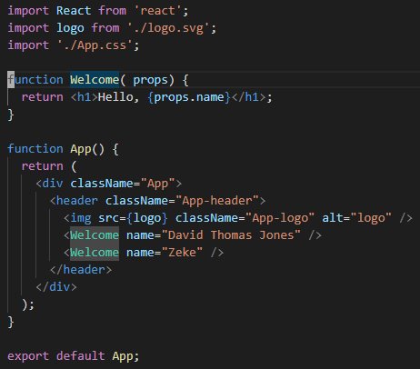

---
categories:
- bad
- casa
coverImage: 49174894718_173269bb7c_o-scaled.jpg
date: 2020-05-22 08:15:18+10:00
next:
  text: Improving jQuery theme/Content Interface integration
  url: /blog2/2020/05/29/improving-jquery-theme-content-interface-integration/
previous:
  text: Playing with React.js as a technology for CASA
  url: /blog2/2020/05/20/playing-with-react-js-as-a-technology-for-casa/
title: Learning to think in React
type: post
template: blog-post.html
---
As [outlined previously](/blog2/2020/05/20/playing-with-react-js-as-a-technology-for-casa/) I’m taking some steps toward learning and using the React Javascript library to develop some web interfaces/applications. The following documents progress toward writing that first application, which is largely confined to develop an initial mock-up and then learning more about the “React way”.

## Developing a mock-up

The React site provides an introduction the main concepts of React. Number 12 of that list is titled [“Thinking in React”](https://reactjs.org/docs/thinking-in-react.html). It starts with a mock up. A mock up also fits with an agile tendency to want to maximise feedback and iteration. I need one to share with my “clients”.

This is where [React Proto](https://react-proto.github.io/react-proto/) could enter the picture. It’s an [Electon-based](https://www.electronjs.org/) app that supports prototyping React applications. Sadly, however, it’s reality doesn’t match my original assumption. You need to create a mockup image first. Then React Proto can be used to outline the React components within that image and then produces code.

Which has me looking for a web prototyping tool and stumbling across [Justinmind Prototyper](https://www.justinmind.com/wireframe-tool/website). Which looks like being a very slow download. Eventually downloaded and after some initial struggles groking the tool a rough prototype developed. Showed to someone. Got some initial feedback.

Next step use - npx create-react-app gradcheck – to create a skeleton React app. But a skeleton that doesn’t include any knowledge of the app I’m designing and the React components I’ll need to write for it.

This is where React Proto comes in. Using it I

1. Import a screen shot of the HTML template created using the Justinmind prototype.
2. Mark up that image using React Proto to identify each of the required components, including configuring a few options.
3. When finished, export that data into my existing gradcheck application.

Ending up with a folder of jsx code ready for me to fill in details.

Sadly, it doesn’t quite update everything. Running – npm start – to view the app still gives the default create-react-app view. Do I know enough to make the change?

That’s a no. Time to take baby steps

## Main concepts of React

Next step is to work through [the Main Concepts “guide”](https://reactjs.org/docs/hello-world.html) for React, including updating some [Javascript knowledge](https://gist.github.com/gaearon/683e676101005de0add59e8bb345340c).

And then we’re into [JSX](https://reactjs.org/docs/introducing-jsx.html). The apparently strange, almost PHP-like approach to mixing HTML and code. However, unlike PHP, React does provide some separation of concerns. Rather than functional separation – rendering and UI logic – React separates concerns into separate components. For me, this echoes of the argument against functional decomposition proposed by “The Method” from [Righting Software](https://rightingsoftware.org/). Need to read and think more about this.

Nice intro to JSX. Definition of _React elements_ – the output of React.createElement calls and JSX – which are objects that describe what to see on the page. Used by React to construct the DOM.

### Rendering elements

Onto [Rendering Elements](https://reactjs.org/docs/rendering-elements.html) and starting with the idea of elements being used to make up components.

React applications are embedded into HTML pages via a particular (web) DOM node. There can be multiple. React handles the “rendering” of React elements into those DOM nodes.

React elements – its children and attributes – can’t be changed. To update the UI you have to create a new element and render it. But the React DOM is smart enough to only update what’s changed.

The focus is on what the UI looks at any given time, rather than how to change it. Apparently doing this eliminates a class of bugs. Will need to think on that.

Typically the render function is called only once (more on this to come)

### Components and props

And now onto [components](https://reactjs.org/docs/components-and-props.html), which are apparently like JavaScript functions. React components provide the reusable bits and can be designed in isolation from each other.

Thinking of them as functions, they take input. Called **props**. And return React elements. Hence where JSX enters the picture.

They can be defined two ways. As Function or Class components. Function components are functions. Class components are defined using JavaScript classes. Apparently each have strengths and weaknesses. But I’ve seen some recommended functions. And create-react-app appears to be going there by default.

The code produced by React Proto is using a different structure. Hence my problems above. More to learn.

React components must start with a capital letter. Otherwise they are seen as DOM tags.

Once the components are defined, you get the benefit of being able to reuse again using HTML.

e.g. the following from my playground during this process. The function Welcome is defining a new (very simple) React component. It takes props and uses JSX to return a React element(s).

This component is then used twice in the create-react-app App component. Which is described as typical React practice. See the two tags <Welcome name=”…

The power comes when the components are much more powerful than Welcome.

The trick then is how to decompose a web UI into components. The example on [the components page](https://reactjs.org/docs/components-and-props.html) shows that it is much more fine grain a decomposition than I expected.

Ok, props can’t be changed. Functions must be pure in this way. A React requirement.

It is via a new concept **State** that React components change their output/appearance in response to external actions.

### State and lifecycle

How then do you get a React clock component? A component that updates its display as the time changes? Enter [State and Lifecycle](https://reactjs.org/docs/state-and-lifecycle.html).

Only a single instance of a class is used per DOM.

The first time a component is rendered into a DOM, it’s called mounting and to tidy up resources there is unmounting.

Which correspond to **lifecycle methods** such as componentDidMount.

The **state** data member of a component holds state. It can/should only be changed using the setState function. This is how React knows that changes have occurred and thus should looking into running render again.

setState may be asycnchronous. Placing limits on how props and state can be combined. Requiring a second form of setState passed a function.

Status is encapsulated. No other component can know about if/what state a component has.

### Handling events

What about [handling user interface events](https://reactjs.org/docs/handling-events.html)?

Some similarities with JavaScript. But differences, including:

- Using camelCase for names
- Passing functions
- Having to explicitly call preventDfault

Will need to revisit this in anger when working on a project.

### Conditional rendering

It appears that [conditional rendering](https://reactjs.org/docs/conditional-rendering.html) is the idea of encapsulating different states in different React components. Then using conditionals to choose which element to render.

If an element returns NULL, then the component will not be rendered.

### Lists and keys

And onto data structures – [lists and keys](https://reactjs.org/docs/lists-and-keys.html). Particularly useful for generating lists of repeated elements. E.g. lists, table rows etc. JSX notation allows some powerful combinations.

But useful if these have keys (for React).

### Forms

Apparently [Form elements](https://reactjs.org/docs/forms.html) react different in react. Unlike other HTML elements, form elements maintain some internal state.

Preventing normal submission of a page by the form, requires the use of **controlled components**.

Which means that the React state of a form element becomes the authoritative source. The component has to control the state of the form element.

Which means that an onSubmit event handler is written as part of the component.

There are also differences for textarea and select to bring them into line with other form elements.

There is a concept of [**uncontrolled components**](https://reactjs.org/docs/uncontrolled-components.html)**.**

### Lifting state up

Sometimes state needs to be shared by several components. The recommended solution is to [lift state up](https://reactjs.org/docs/lifting-state-up.html) to a common ancestor. This entails

1. Moving the bit of state to be shared into the common ancestor.
2. That state is passed as props to the descendants.
3. Pass from the ancestor to the descendants an “onChange” method.
4. When the descendants need to change the value, they call that method.

The idea being that there is a single source of truth for data. One of the components.

### Composition versus inheritance

Ahh, the debate of [composition versus inheritance](https://reactjs.org/docs/composition-vs-inheritance.html). My vague insight into the OO design community was that they’d come down on the side of composition being the generally better approach. Wonder if that’s correct?

Yep, at least for React “has a powerful composition model, and we recommend using composition instead of inheritance”.

There are components (e.g. dialog) that contain others. Advice is to pass children as props. Use your own convention.

Specialisation (Dialog -> WelcomeDialog) also done with composition and props.

Experience from Facebook is that they haven’t seen a need for inheritance.

Non-UI functionality shared between components – not surprisingly – is suggested to go into its own module.

## What’s next?

The next page in this sequence is [Thinking in React](https://reactjs.org/docs/thinking-in-react.html), where I started. I’ll save that for another post where I actually start work on the first version of the Grad Checker prototype.