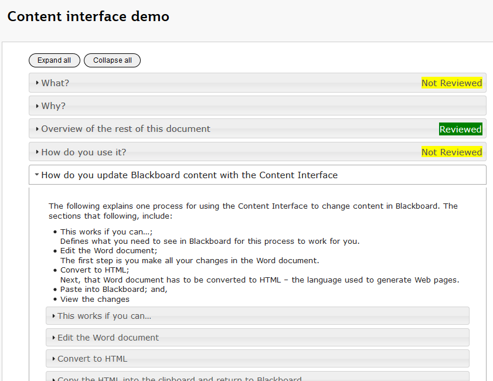
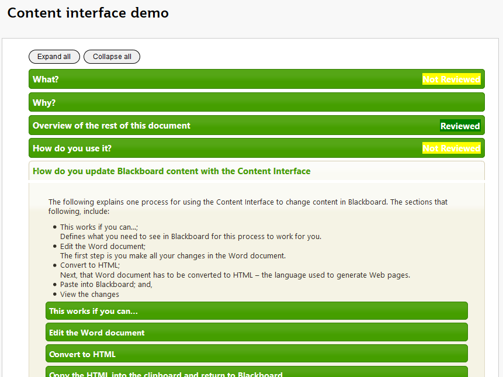
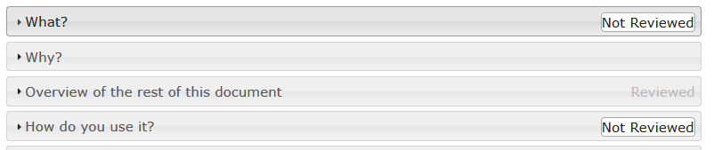
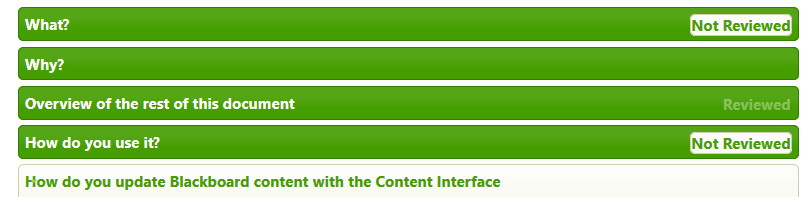

See also: [[blog-home | Home]]

### The Problem

One of the benefits of using jQuery as the initial framework for [the Content Interface](/blog2/2019/08/08/exploring-knowledge-reuse-in-design-for-digital-learning-tweaks-h5p-constructive-templates-and-casa/#contentInterface) is that you can leverage the existing ecosystem. e.g. jQuery’s themes enable a default Content Interface (on the left) to be “themed” (on the right) by changing a single line of CSS.

|  |  |
| --- | --- |

The problem is visually obvious in the above. The _Reviewed_ and _Not Reviewed_ additions to the accordion bars have not changed colours to fit the themes. Not to mention being pretty horribly designed regardless of the colour.

Can this be fixed?

### Do jQuery’s themes provide support for this type of colour?

Exploring the [jQuery theme roller](https://jqueryui.com/themeroller/) and the [CSS framework](https://api.jqueryui.com/theming/css-framework/) for jQuery reveals some classes that could be useful: .ui-state-highlight .ui-state-error .ui-priority-primary .ui-priority-secondary .ui-state-disabled

After a bit of experimentation .ui-state-active (Not Reviewed) and .ui-state-disabled (Reviewed) appear to be the best options. Giving the following results.

### Can the Content Interface be modified to support this?

Should be a quick matter of modifying the HTML code that the Javascript is producing.

Yep, that worked. Time to commit and deploy.