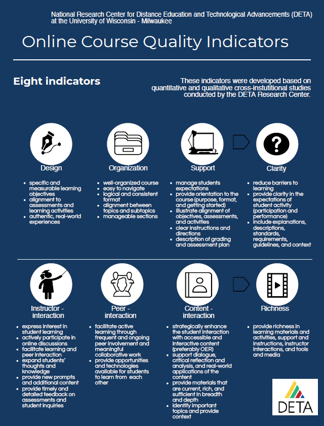
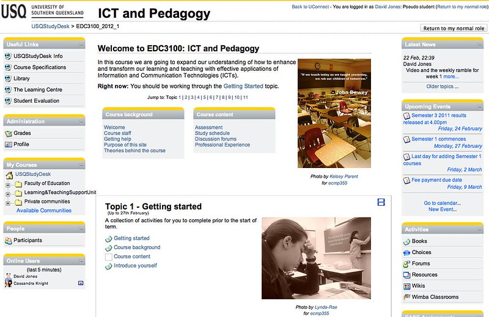
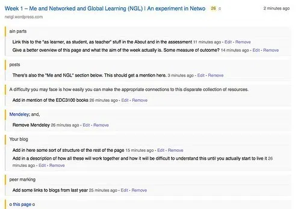
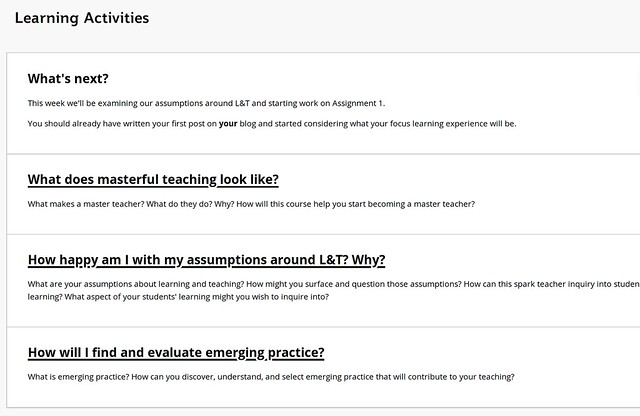
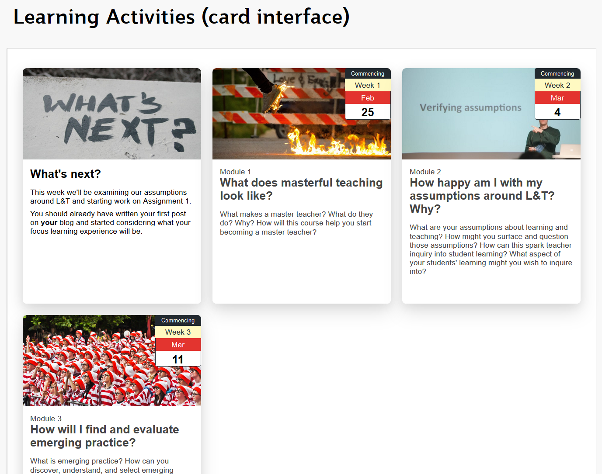
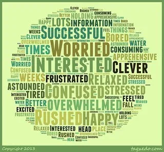
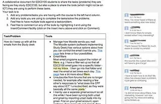
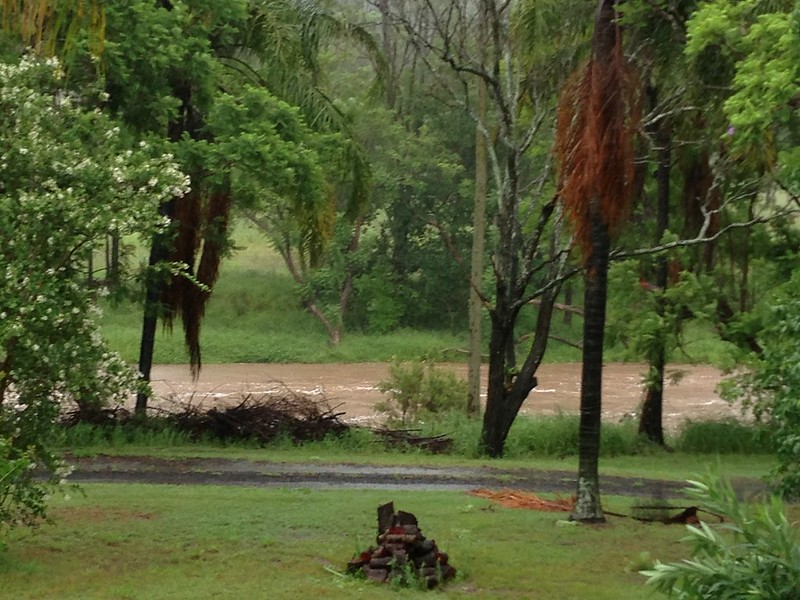

See also: [[blog-home | Home]]

COVID-19 and the subsequent #pivotonline has higher education paying a lot more attention to the use of digital and online technology for learning and teaching (digital education). COVID-19 has made digital education necessary. COVID-19 has made any form of education – and just about anything else – more difficult. For everyone. COVID-19 and it’s impact is rewriting what higher education will be after. COVID-19 is raising hopes and fears that what will come after will be (positively?) transformative. Not beholden to previous conceptions and corporate mores.

Most of that’s beyond me. Too big to consider. Too far beyond my control and my personal limitations. Hence I’ll retreat to my limited experience, practices, and conceptions. Exploring those more familiar and possibly understandable landscapes in order to reveal something that might be useful for the brave new post-COVID-19 world of university digital education. A world that I’m not confident has any hope of being positively transformed. Regardless of what the experts, prognosticators, futurists and vendors are selling. But I’m well-known for [being a pessimist](/blog2/2014/08/28/on-trying-to-be-optimistic-in-a-stupid-world/).

Echoing Phipps and Lanclos (2019) I believe that making changes in digital education needs to be grounded in “an understanding of the practices that staff undertake and the challenges they face” (p. 68). Some colleagues and I have started identifying our practices and challenges by documenting the workarounds we’ve used and developed. Alter (2014) defines workarounds as

> a goal-driven adaptation, improvisation, or other change to one or more aspects of an existing work system in order to overcome, bypass, or minimize the impact of obstacles, exceptions, anomalies, mishaps, established practices, management expectations, or structural constraints that are perceived as preventing that work system or its participants from achieving a desired level of efficiency, effectiveness, or other organizational or personal goals (p. 1044)

Workarounds are a useful lens because they highlight areas of disconnect between what is needed and what is provided. Alter (2014) suggests that this Theory of Workarounds could be used to understand these disconnects and leverage that understanding to drive re-design. Resonating with Biggs’ (2001) notion of quality feasibility, a practice that actively seeks to understand what the impediements to quality teaching are and to remove them.

The challenge I faced was whether I could remember a reasonable percentage of the workarounds I’ve used in 20+ years.

Enter the following list of eight [Online Course Quality Indicators](http://professorjoosten.blogspot.com/2020/03/quality-indicators-of-online-learning.html) also available as a [PDF download](https://drive.google.com/file/d/1GfwQLyLIk12of2ZFSHpVLJlFryRJXXqo/view) and tested in Joosten, Cusatis & Harness (2019) (HT: [@plredmond](https://twitter.com/plredmond/status/1261053050304647168) and OLDaily).My interest here isn’t in the validity/value of this type of approach (of which I have my doubts). Instead, my interest in that the eight indicators offer a prompt for the type of considerations to which a conscientious teacher might pay attention. The type of considerations that will point out limitations within institutional support for (digital) education and generate workarounds.

## Initial findings

So far I’ve remembered 53 workarounds. Detail provided below. The following table maps workarounds against the quality indicators. The biggest category is **Doesn’t fit**. i.e. workarounds that didn’t seem to fit the quality indicators. Perhaps suggesting that the quality indictors were designed to analyse the outcome of teacher work (online course), rather than provide insight into the practices teachers undertake to produce that outcome.

Peer interaction and content interaction are the indicators with the next highest number of workarounds. Though I have collapsed both content interaction and richness indicators into content interaction.

|   **Quality Indicator**   |   **\# of workarounds**   |
| --- | --- |
|   Design   |   4   |
|   Organisation   |   6   |
|   Support   |   1   |
|   Clarity   |   3   |
|   Instructor interaction   |   7   |
|   Peer interaction   |   10   |
|   Content interaction / Richness   |   9   |
|   Doesn’t fit   |   13   |

53 is a fair number. But perhaps not surprising given my original discipline is information technology and part of my working life has been spent designing LMS-like functionality.

What’s disappointing is that a number of these workarounds are duplicates solving the same fundamental problem. The only difference being in the institutional and technological context. For example, a number of the workarounds are focused on helping with:

1. Production and maintenance of well-designed, rich course content.
2. Increasing the quanity and quality of what teachers know about students background and activity.

What does that say about higher education, digital education, and me?

Proper reflection and analysis will have to wait for another time. But evidence of a difficulties in at least two fundamental practices seems important. Or, perhaps it’s just showing how blinked and obsessive my interest is.

There are some questions about whether the following are actually workarounds. In particular, some of the fairly specific learning activities aren’t actually designed to change an existing part of the institutional context. There was no part of the institutional context that provided for the learning activities. Largely because the learning activities were so specific to the learning intent that the institution would never have been able to provide any support. However, most institutions now have lists of digital tools that have been approved for use in learning and teaching. Typically, the specificity of the learning need means that no appropriate tool has been added to the list.

What does this say about [the reusability paradox](http://wikity.djon.es/reusability-paradox/) and institutional approaches to digital education?

## Workarounds and quality indicators

The following steps through each of the quality indicators and uses them as an inspiration to answer the above question. For each workaround links to additional detail is provided and initial thoughts on the workaround given.

### Design

**Systems Emergencies**

One attempt at an authentic real world experience was the [Systems Emergency assessment item](https://web.archive.org/web/20050425230923/http://www.infocom.cqu.edu.au/Units/aut2000/85321/Assessment/System_Emergency/) for Systems Administration (Jones, 1995). Each student had to run a program on their computer. A program that would break their computer. Simulating an authentic error. The students had to draw on what they’d learned during the course to disagnose the problem, fix it and complete a report.

Is this a workaround? It’s so specific to a particular course and a particular pedagogical choice there is no institutional system that it is replacing.

**Open Learning Computing Platform**

Better example from the same course went by the acryonym [OLCP (open learning computing platform)](/blog2/publications/a-work-station-in-every-home/) (Jones, 1994). The recommended computer systems almost all distance education students were using (Windows 3.1/95) was not up to the requirements of the course (Systems Administration). To workaround this limitation we distributed a version of Linux (Jones, 1996a), eventually relying on commercial distributions. Without Linux the course couldn’t be taught.

**Personal Blogs, not ePortfolios**

Arguably, my predilection for requiring students to use their choice of public blogging engines, rather than institutional ePotfolio tools was also driven by a desire for authenticity. Not to mention my skepticism about the value of [institutional ePortfolio systems](http://djon.es/blog/2014/02/27/a-story-about-the-failure-of-institutional-eportfolios/) (which got me in trouble one time). Initially, individual student blogs were an extension of journaling (introduced in Sys Admin) and an encouragement to engage in open reflection and discussion. Intended to mirror good practice for IT professionals and first used in a Web Engineering course in 2002. Later evolving into the [BAM and BIM tools](/blog2/publications/blog-aggregation-management-reducing-the-aggravation-of-managing-student-blogging/) to encourage reflection for assessment purposes and to encourage the development of a professional learning network.

**Alignment and curriculum mapping**

In terms of alignment of assessments and learning activities I’ve used and more often seen people use [bespoke Word documents](/blog2/2012/07/20/starting-the-re-design-of-edc3100/) and spreadsheets to engage in mapping of courses and programs. Mainly because institutions did not have any practice of encouraging such practices, let alone systems to do it (e.g. [this from 2009](/blog2/2009/12/21/supporting-curriculum-mapping/)). There’s been a lot more attention paid and importance placed on mapping, but generally it remains an area of bespoke documents and spreadsheets. Perceived shortfalls that led to some [design work on alternatives](http://djon.es/blog/research/curriculum-mapping/).

### Organisation

**Moodle Course design**

Designing a well-organised course site that is easy to navigate with manageable sections and a logical and consistent form is no easy task given the nature of most LMS. [My first foray](http://djon.es/blog/2012/02/22/one-moodle-course-design-approach-ad-trade-offs/" \l "scroll) into this (before 2012 I was using an LMS I developed) added the fikkiwubg design features using bits of HTML.

A [“Jump-to: Topic” navigation bar](http://djon.es/blog/2012/02/22/one-moodle-course-design-approach-ad-trade-offs/" \l "scroll) to my Moodle course sites to avoid the scroll of death.

Addition of [non-topic based navigation](http://djon.es/blog/2012/02/22/one-moodle-course-design-approach-ad-trade-offs/" \l "nonTopic) to the top of the Moodle site to provide a sensible grouping of resources (Course background & content) that didn’t fit with the default Moodle design.

Addition of [topic-based photos](http://djon.es/blog/2012/02/22/one-moodle-course-design-approach-ad-trade-offs/" \l "photos) to generate visual interest, perhaps a bit of dual coding with the topic, and encourage some further exploration.

A “Right now” section at the top manually updated each week (along with the banner image) of term to orient students to the current focus.

**Moodle Activity Viewer**

Since the in-built Moodle reports aren’t that good and because I really wanted to understand how students were engaging with the Moodle sites I designed the Moodle Activity Viewer scratched an itch. It enabled [an analysis of student activity](http://djon.es/blog/2014/02/03/analysing-edc3100-using-mav/).

**Evernote to search a course site?**

On of the on-going challenges with using Moodle was the [absence of a search engine](/blog2/2013/03/07/the-absence-of-a-search-function-my-current-big-problem-with-a-moodle-installation/), a fairly widespread and important part of navigating any website. I did [consider a number of different options](/blog2/2014/02/25/evernote-as-a-solution-to-a-moodle-problem/) and ended up trying out a kludge with Evernote. But only for one offering.

[Modifying the Moodle search book block](/blog2/2016/05/10/testing-out-the-moodle-book-search/)

**Hosting course content on a Wordpress blog**

In 2012 I took over a Masters course titled Network and Global Learning. Given the focus of the course, hosting the learning environment in a closed LMS site didn’t seem appropriate. Instead, I decided to [try it as an open course](/blog2/2012/08/22/the-dilemma-of-open-courses-in-an-australian-university/). It ended up as [a Wordpress site](https://netgl.wordpress.com/) and has since been taken over by another academic...at least for one offering. Looks like it probably ended up back in the LMS.

**Diigo for course revision**

Given NGL was hosted on a course blog, this raised questions about how to take notes about what wasn’t working and ponder options for re-design. In Word, this could be done with the comments feature. For the Web [I used Diigo](/blog2/2015/07/15/revising-week-1-of-edu8117-networked-and-global-learning/) to produce annotations like the following.

**Card Interface**

Late 2018 saw me stepping backwards to Blackboard 9.1. A very flexible system for structuring a site, but incredibly hard to make look good without a lot of knowledge. How to enable lots of people organise their course sites effectively? Enter [the Card Interface](/blog2/2019/08/08/exploring-knowledge-reuse-in-design-for-digital-learning-tweaks-h5p-constructive-templates-and-casa/). Easily convert a standard Blackboard content page into a contemporary, visual user interface.

|      |      |
| --- | --- |

### Support

**jQuery to work around limitations of a standard course design**

Over a number of years of iterative design improvements I’d gotten to the stage of having quite a detailed Assessment section on my course site. Echoing much of the online course quality indicators say about support: description of grading and assessment plan; clear instructions and directions;…. This required some extra lifting on my part to add to the base LMS functionality.

Eventually, the institution figured out that the difficulty of this needed to be reduced and instroduced a [new standard course design](/blog2/2015/01/20/what-might-the-3-levels-of-organisational-culture-reveal-about-university-e-learning/). The problem was that the new institution standard provided less support than I was already providing. Not just assessment, but other areas as well.

My solution was to [use jQuery](/blog2/2015/01/21/learning-to-live-with-a-standard-look-and-feel/) to modify the default course site so that it would point to my resources, not the limited standard.

### Clarity

I’m assuming that there is meant to be some overlap between support and clarity. There are some arrows in the original image suggesting it.

**Course macro system**

A key part of clarity is knowing when something is meant to happen. When an assignment is due. When semester starts etc. Some of the events the occur in a course design occur in every offering of the course. The main difference is that the specific dates change. The simplest solution is to [use week numbers](/blog2/2015/06/26/and-the-little-one-said-roll-over-roll-over/). A practice commonly used from the days of distance education until now. The problem is that this approach sacrifices a little bit of clarity.

My solution was a [“course macro” system](/blog2/2015/02/03/concrete-lounge-1-helping-learners-find-correct-up-to-date-course-information/). Rather than put _Week 5_ as the due date, I would put _{A1\_DUE\_DATE}_. The braces indicating that this was a variable. Before anyone see the variable, the macro system would replace the variable with the correct value. The macro system knows what course you’re looking at and know the right value to show you.

It wasn’t just for dates. The macro system was useful for any information that would be repeated in multiple places, but which could vary over time. Using the macro system meant I could easily change all usage of the information, without having to remembering where it was used.

**Auto-marking contributions and activity**

Since what the student does I decided – for better or worse – to target extrinsic motivation and give a small percentage of a course assessment based on whether or not course activities were completed, including the quantity and characteristics of the posts students made to their individual blog. The calculation of this mark was [done by Perl scripts](/blog2/2013/06/10/the-kludge-for-marking-learning-journals/) that I wrote. Students were notified of their progress via emails also sent by Perl scripts.

**Student Evaluation of Course Leaderboard**

For better or worse, response rates on institutional end of term student evaluation surveys was deemed important. Response rates were also low across the board. One solution I [developed](/blog2/creating-a-set-leaderboard/) and which was then adopted by others was the [development of an “evaluation leaderboard”](/blog2/2017/06/17/nudging-up-myopinion-response-rates-using-a-gamified-leaderboard/). While the surveys were available a table was added to the top of the course site. That table listed each student cohort and show the number and percentage of that cohort who had responded. The table along with appropriate prompting from teaching staff increased response rates by 12 to 15%. There’s even [a poster](http://djon.es/Leaderboard/June2017Poster.pdf) about the idea.

### Instructor – interaction

**Course barometers**

My teaching journey has always involved distance education. First print-based and then online. One of the biggest problems I ever had with distance education – especially print-based - was the loss of informal student feedback ([Jones, 2002](/blog2/student-feedback-anonymity-observable-change-and-course-barometers/)). Then I stumbled across the idea of a course barometer (Svensson et al., 1999). I implemented the functionality in an LMS I was writing and used it in [my courses](https://web.archive.org/web/20040423113723/http://www.infocom.cqu.edu.au/Courses/aut2001/85321/Resources/Course_Barometer/). Initially, other staff could add a barometer to their course. Eventually and for a couple of years, a course barometer became a standard part of all courses. Moving onto Moodle I wanted the same functionality, and kludged something using [the Moodle Feedback module](/blog2/2012/03/05/implementing-a-course-barometer-in-moodle-a-kludge/).

**Minute Papers via BAM and Google Forms**

In on-campus teaching I had used [minute papers](https://oncourseworkshop.com/self-awareness/one-minute-paper/) as another method to gain insight into student progress. For distance education students, minute papers were implemented as part of the use of individual student blogs and [the BAM tool](http://djon.es/blog/publications/blog-aggregation-management-reducing-the-aggravation-of-managing-student-blogging/) (Jones & Luck, 2009). I’ve also used Google forms to [implement the IMPACT procedure](/blog2/2013/03/04/how-are-they-going/). An extended version of the minute paper. Student feedback was then run through Tagxedo

**Use my blog to publicly reflect on my teaching**

That word cloud image above was a course taken by pre-service teachers titled ICT and pedagogy. A key message of that course was that reflection is important for learning, that good teaching relies on learning, and that reflection can help teachers. Hence students in this course were encouraged to use their individual blogs to reflect and I modelled this reflection by using my blog to reflect on what was happening in this course. An example of that is the blog post sharing the tag clouds. A blog post that had a couple of [comments from students](/blog2/2013/03/04/how-are-they-going/).

**Staff MyCQU**

A key enabler of effective instructor/learner interaction is the amount of knowledge the instructor has about the student and how effectively they use that knowledge to guide interaction. I’ve never experienced a University who has solved the challenge of getting. [Staff MyInfocom/MyCQU](/blog2/2010/06/13/workarounds/) was a simple web portal that showed the courses someone was teaching and provided various lists of student details. Ended up being used by the entire University.

**Know thy student**

Staff MyCQU provided access to the data, but not within the context of learning. The [Know thy student project](http://djon.es/blog/2017/10/19/implications-and-questions-for-institutional-learning-analytics-implementation-arising-from-teacher-diy-learning-analytics/) (Jones et al., 2017) used a duplicate database to hold information about students specific to the pedagogy of the course I was teaching. It then provided contextualised access to that information from within the course site. Where ever a student name was mentioned in the course site, I could access information about that students and what they had done so far in the course.

**Pastoral and academic management**

Trends in funding for Australian higher education are starting to focus attention on retention. Consequently, there’s interest in implementing processes to effectively enable and encourage pastoral and academic care. A starting point for this type of task is gathering disparate information about students demographics and activities into a central form. Enter a collection of Python scripts that scrape various data sources, combine them into a data store, and then produce various reports.

**Finding a time to reschedule a face-to-face session**

Unforeseen circumstances meant that a teacher couldn’t make a timetabled session. Needed to identify the impacted students, contact them to find the best alternate time and book it. The process I used to do this [was documented](/blog2/2015/02/19/organising-a-change-in-session-time/) and ended up relying on copy and pasting from a Moodle site, some manual editing, email, and setting up a Moodle quiz to ask for times.

### Peer – interaction

**Blogs, learning journals and BIM**

To encourage reflection and peer interaction students [were encouraged to](/blog2/2013/02/25/the-assessment-of-learning-journals-ideas-for-bim/): maintain a personal blog; regularly post to the blog; and, actively follow and comment on blog posts from other students. Supporting this learning design led to numerous work arounds

Writing (and updating) the BIM Moodle plugin and arguing its inclusion in the institutional Moodle instance.

Prior to BIM being installed, using the Moodle database activity to allow [re](http://djon.es/blog/2013/04/01/meaningless-freedom-and-auto-marking-the-learning-journals/)[gistration](http://djon.es/blog/2013/04/01/meaningless-freedom-and-auto-marking-the-learning-journals/) of student blogs. That information was manually transferred to my laptop. My laptop was then used to drive the mirroring of student blog posts.

Manually [producing OPML files](http://djon.es/blog/2016/03/06/producing-opml-files-for-edc3100-student-blogs/) for different student cohorts and encouraging the use of feed readers (e.g. Feedly) for students to track posts from other students.

Writing Perl scripts to perform sentiment analysis on student blog posts and integrating that analysis into the _Know thy student_ tool.

Write Perl scripts to [automatically mark student blog activity](/blog2/2013/06/10/the-kludge-for-marking-learning-journals/) against defined criteria; and, email students their progress (as mentioned earlier).

**Integrating Webfuse discussions forums into Blackboard groups**

The Blackboard LMS was unable to correctly support a [specific group-based learning design](/blog2/2008/11/19/the-model-underpinning-blackboard-and-how-acct19064-uses-it/). To implement it we needed to [integrate discussion forums](/blog2/2010/06/13/workarounds/) from Webfuse (my LMS) into Blackboard. That course and learning design won a national teaching citation.

**Google doc to share course problems and solutions**

With 100s of students taking a course focused on exploring the use of different digital technologies for teaching there were always going to be challenges. With 100s of students many would discover new and intersting problems and solutions. We wanted them to [share their experience](/blog2/2013/03/13/many-of-our-students-are-neither-digital-natives-nor-digitally-literate/).

We did this via a Google doc. Students were encouraged to add any problems they were having with the course and to also add suggested solutions.

**Shared bookmarks**

Social bookmarking allows a group of people to share and annotate the good stuff they find on the web. In one of my courses we had a [course Diigo group](https://groups.diigo.com/group/icts-and-pedagogy) that has 100s have shared resources.

**Shared attentions**

But it wasn’t just sharing links. Diigo allowed shared annotations and for some readings, students were encouraged to [make annotations](/blog2/2014/08/15/joining-the-swarm-what-a-course-might-be/). With the standard practice of starting with a new course site each offering, the opinions and discussions shared via these means would normally be lost. Using Diigo meant they were still visible. Providing what Riel and Polin (2004) describe as the “residue of experience” (p. 18) that in good online learning communities “remains available to newcomers in the tools, tales, talk, and traditions of the group” (p. 18). The residue of experience provides a richer learning environment.

**Use Diigo as method to collaboratively create a podcast**

While I was a student I used the Diigo social bookmarking tool to create a method for [collaboratively creating a podcast](http://djon.es/blog/2011/04/06/building-a-collaborative-cv09-podcast/). Find an audio file online, add a description, and bookmark it with a particular tag and it would be added to [the podcast](http://feeds.feedburner.com/gdlt).

I used it a couple of times in my teaching, but more as a way to curate my own podcast. I should probably get back into this.

**What’s the weather like where you are**

One of the advantages (and disadvantages) of courses with large distance education enrolments is that the students can be located anywhere. To take advantage and raise awareness of this, and to demonstrate another pedagogical application of digital technology I adopted [Alec Couros’](https://twitter.com/courosa) [weather activity (slide 3)](https://www.slideshare.net/courosa/rethinking-teaching-learning-in-a-networked-reality-7244592). Check out the [380+ photos](https://www.flickr.com/photos/ictspedagogy/) generated since 2012, including the following contribution from me.

### Content – interaction

**Camera ready distance education study guides**

Back in the early to mid 90s I taught dual mode courses taken by both on-campus and distance education students. In this pre-Online world distance education students received print-based study guides. Study guides produced by an industrial strength pipeline of copy editors and desk top publishers. At this stage Wordstar on MS-DOS was the high point of available text editors. The industrial strength pipeline was needed. The standardisation of these study guides couldn’t handle the unique [requirements of Prolog](/blog2/publications/computing-by-distance-education-problems-and-solutions/) and required long lead times (Jones, 1996). First response to this harnessed the rise of Word to starting producing camera ready PDF documents. Bypassing the industrial pipeline.

**Online textbook**

That evolved into a method for producing [a hypermedia textbook](/blog2/publications/solving-some-problems-of-university-education-a-case-study/) (Jones, 1996b) that you can still [peruse today](https://web.archive.org/web/19970809020334/http://mc.cqu.edu.au/subjects/85321/study-guide/chap4/sec1p2.html), including [the online index](https://web.archive.org/web/19970809015030/http://mc.cqu.edu.au/subjects/85321/study-guide/index/index.html) (Thanks to the Internet Archive’s WayBack Machine).

**Authoring Moodle Book from HTML**

Almost 20 years later and I was using the Moodle Book plugin to produce online content. Authoring for the Moodle Book wasn’t that great. [An alternative](/blog2/2015/02/08/kludging-an-authoring-process-with-moodle-books-etc/) was needed that fit my practices. Resulting process allowed me to create content in a HTML file. That was run through a script to produce something that could be imported into the Moodle Book.

**Integrating the Moodle book with github**

20 years later I started work on [the Moodle “open” book project](/blog2/the-moodle-open-book-module-project/). An attempt to modify the Moodle Book plugin to integrate it with github. Initial development completed, but never used in anger. Beyond the open-washing the main aim of this project was to make it easier to create and maintain online resources.

**Content Interface**

Fast forward a few years to another institution and another LMS and [the Content Interface](https://github.com/djplaner/Content-Interface-Tweak) aims to address the same problem. This version of a solution is [both code](https://github.com/djplaner/Content-Interface-Tweak) you can download and is being used. Though not with its challenges.

**Animations for dynamic, abstract concepts**

Back in the 90s I used to teach information technology students about the internal data structures and algorithms used in operating systems. This involved pretty complex, abstract, dynamic concepts. Visualisation of these concepts was hard.

Working with (really relying upon) a couple of project students we developed a sequence of [Flash-based (it was the 90s) animations](/blog2/2008/12/30/operating-systems-animations-and-other-resources/). Animations that were used in the course long after I moved on and were also used across the world.

**Animated, simulated operating systems of learning dynamic, abstract concepts**

The first solution tried to solve this problem was through computer-aided learning. Initially we used a CAL tool developed in the US called PRMS (Hays et al., 1989). But it had some limitations and one of the students who experienced PRMS had the interest and ability to develop a better simulated, animated operating system called RCOS (Chernich et al., 1995).

**Physical activity for learning dynamic, abstract concepts**

Before the availability of animations, how did we teach these complex, abstract, dynamic concepts in face-to-face lectures? To teach scheduling algorithms, I used student volunteers and chairs out the front of the lecture theatre. The students simulated processes and perhaps other students the scheduling algorithm.

**Online lectures for distance education students**

In the same project we developed online lectures. We started with the slides provided with the course textbook. To produce the online lectures, we: converted the original slides to HTML, updated the programming language in the slides to one familiar to our students; added our animations; and, added audio we’d recorded.

Echoing an approach I’d used earlier.

**Slide casts for faculty professional development on Slideshare**

Almost 10 years later we wanted to produce slidecasts for professional development sessions. By 2007/2008 PowerPoint provided the ability to record narration but didn’t provide a decent method to disseminate the slides/audio on the web. To [work around this](/blog2/2008/08/07/creating-slidecasts-on-slideshare-e-learning-support/) some shell scripts we used to transform and concatenate the PowerPoint audio files to produce a format that could be linked with the PowerPoint slides on Slideshare.

I’m pretty sure that Slideshare doesn’t support this functionality anymore.

## **Stuff that doesn’t fit**

**User authentication and access control**

In the mid-1990s I was developing a web information system used by multiple students and staff. We need to implement a form of user authentication and access control. Intially we didn’t have access to the institutional authentication systems. This was well before the days of “single-sign on” (has any organisation ever really had single sign on?). Subsequently, the institutional authentication system didn’t support the types of groups and operations we needed to support. This page provides some description of evolution of our [user auth/access control workaround](/blog2/2010/06/13/workarounds/).

**Visualising student locations**

Most of my teaching has occurred at institutions with large numbers of distance students. Students spread throughout the world. Visualising just where those students are is typically limited to lists of student locations. In response to a request from a Head of School I used cartodb to convert that list of student locations [into map-based visualisations](http://djon.es/blog/2015/08/18/visualising-locations-of-students-etc/).

**Numerous adminstrative applications**

Webuse provided [numerous different administrative applications](/blog2/2010/06/13/workarounds/). A personalised timetable generator for teachers and students. More teacher administration centric examples were an academic misconduct database, assignment extensions system, academic staff allocations, and informal review of grade systems.

**Graduation checker**

I’m currently working on a [graduation checker application](/blog2/2020/05/20/playing-with-react-js-as-a-technology-for-casa/) of a degree with a complex structure. A complexity that can make it difficult for some students to visualise what they need to do (and when) to graduate.

**Analysing results of student evaluations of learning and teaching**

Almost every university has a standard teaching/course evluation process that happens each time a course is offered. The purpose of which would be for teaching staff to reflect on the feedback provided and take action. But typically the evaluation systems [don’t enable this](/blog2/2014/01/10/missing-affordances-a-partial-explanation-for-the-quality-of-university-lt/). Particularly doing analysis of free text feedback. I’ve manually extracted that [information and used NVIVO](/blog2/2014/01/15/analysing-some-course-evaluation-comments/) for the analysis. Then I wrote a GreaseMonkey script that would [automate the extraction](/blog2/2016/05/18/building-a-casa-for-student-evaluation-of-teaching-results/) of all the data into a spreadsheet for further anaysis. A tool that was eventually used to support others, particularly those applying for teaching awards.

**Filtering LMS email “spam”**

To encourage collaboration around digital education the academic department I worked with decided that all teaching staff should be able to see the course sites for all of the department’s courses. For a single semester, we were all added to 40+ courses. The problem was that the LMS was configured with email notifications for discussion forums and there were some discussion forums you could not unsubscribe from. LMS email spam.

The solution was to employ email filter rules to throw away all but the relevant LMS email.

**Kludges to make final results processing better**

At the end of a course, most University academics have to distill student outcomes into a mark and a grade and upload that distallation into an enterprise system. There is typically a huge gulf between what the teacher’s distallation naturally produces and what the enterprise system expects to see. That gulf typically means a lot of manual work (and checking) by the teaching staff. To make this process easier, I’ve written Perl scripts to help with the distallation. I’ve also [written GreaseMonkey scripts](/blog2/2014/10/14/fixing-one-part-of-the-peoplesoft-gradebook/) to modify the interface of the Enterprise System to make the process quicker and more correct. [More detail here](/blog2/2014/11/07/established-versus-affordances-part-of-the-reason-institutional-e-learning-is-like-teenage-sex/). One of my colleagues used the kludge and [commented](/blog2/2014/10/14/fixing-one-part-of-the-peoplesoft-gradebook/)

> That really should be built into any sensible system but it’s nice that you can make it happen regardless of the clunky system

**Check status of Blackboard course site**

We noticed that there were some fairly common errors being made with preparing Blackboard course sites. But there was no automated method to proactively check for these common errors. We wrote a script to [automate this process](/blog2/2008/08/28/getting-started-on-blackboard-indicators/) and reported it to the L&T leaders responsible.

**Check presence of Tweak**

10+ years later and I was back on Blackboard (at another institution). First task was to identify which courses were using a particular functionality (course tweaks) that were being deprecated. The only available method was to check the course site. No report available.

Bugger doing that manually. I wrote a script (similar to the status check) to do the check for me.

## References

Alter, S. (2014). Theory of Workarounds. _Communications of the Association for Information Systems_, _34_(1). https://doi.org/10.17705/1CAIS.03455

Biggs, J. (2001). The Reflective Institution: Assuring and Enhancing the Quality of Teaching and Learning. _Higher Education_, _41_(3), 221–238.

Chernich, R., Jamieson, B., & Jones, D. (1995). _RCOS: Yet another teaching operating system_.

Ellis, R. A., & Goodyear, P. (2019). _The Education Ecology of Universities: Integrating Learning, Strategy and the Academy_. Routledge.

Hays, J., Miler, L., Othmer, B., & Saeed, M. (1989). _Simulation of Process and Resource Management in a Multiprogramming Operating System_. 125–128.

Jones, D. (1994). _A workstation in every home!_

Jones, D. (1995). _Teaching systems administration II_.

Jones, D. (1996a). Computing by distance education: Problems and solutions. _ACM SIGCSE Bulletin_, _28_(SI), 139–146.

Jones, D. (1996b). Solving Some Problems of University Education: A Case Study. In R. Debreceny & A. Ellis (Eds.), _Proceedings of AusWeb’96_ (pp. 243–252). Southern Cross University Press.

Jones, D. (2002). Student Feedback, Anonymity, Observable Change and Course Barometers. In P. Barker & S. Rebelsky (Eds.), _World Conference on Educational Multimedia, Hypermedia and Telecommunications 2002_ (pp. 884–889). AACE.

Jones, D., Jones, H., Beer, C., & Lawson, C. (2017). _Implications and questions for institutional learning analytics implementation arising from teacher DIY learning analytics_. ALASI 2017: Australian Learning Analytics Summer Institute, Brisbane, Australia. http://tiny.cc/ktsdiy

Jones, D., & Luck, J. (2009). Blog Aggregation Management: Reducing the Aggravation of Managing Student Blogging. In G. Siemns & C. Fulford (Eds.), _World Conference on Educational Multimedia, Hypermedia and Telecommunications 2009_ (pp. 398–406). AACE. http://www.editlib.org/p/31530

Joosten, T., Cusatis, R., & Harness, L. (2019). A Cross-institutional Study of Instructional Characteristics and Student Outcomes: Are Quality Indicators of Online Courses Able to Predict Student Success? _Online Learning_, _23_(4), Article 4. https://doi.org/10.24059/olj.v23i4.1432

Lanclos, D., & Phipps, L. (2019). Trust, Innovation and Risk: A contextual inquiry into teaching practices and the implications for the use of technology. _Irish Journal of Technology Enhanced Learning_, _4_(1), 68–85.

Riel, M., & Polin, L. (2004). Online learning communities: Common ground and critical differences in designing technical environments. In S. A. Barab, R. Kling, & J. Gray (Eds.), _Designing for Virtual Communities in the Service of Learning_ (pp. 16–50). Cambridge University Press.

Svensson, L., Andersson, R., Gadd, M., & Johnsson, A. (1999). _Course-Barometer: Compensating for the loss of informal feedback in distance education_. 1612–1613.