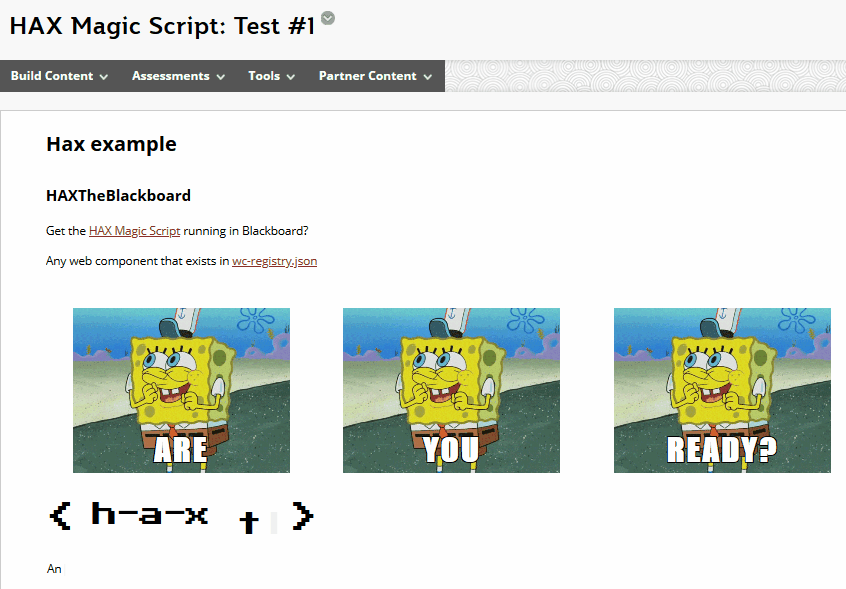
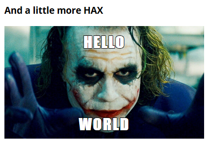
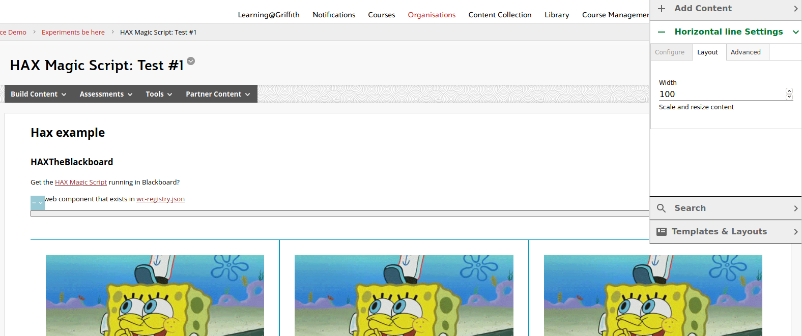
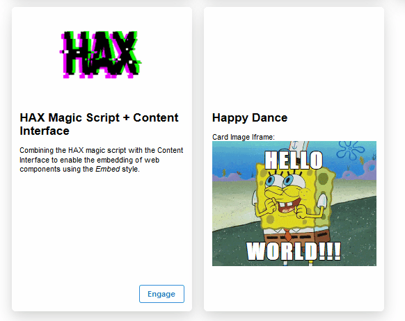

See also: [[blog-home | Home]]

### 2023 Update

Add the "magic script" to my Wordpress install and we have...

### Original

So look what I've done inside my [Blackboard Learn](https://en.wikipedia.org/wiki/Blackboard_Learn) sandpit site.



It probably doesn't look that exciting. A bit of HTML and a couple of animated GIFS. Anyone could do that, right?

Not quite. Following explains why this is a bit of game changer and explores how it might be leveraged in work with Blackboard.

## It's not the what, it's the how

...And what the how makes possible

The core of this image is enabled by four different [web components](https://developer.mozilla.org/en-US/docs/Web/Web_Components)

1. [grid-place](https://www.npmjs.com/package/@lrnwebcomponents/grid-plate) - provides an easy way to display the three SpongeBob images in a grid
2. [meme-maker](https://www.npmjs.com/package/@lrnwebcomponents/meme-maker) - overlays the meme-like words (i.e. ARE, YOU, READY?) onto the SpongeBob images (no image manipulation required)
3. [hax-logo](https://www.npmjs.com/package/@lrnwebcomponents/hax-logo)
4. [type-writer](https://www.npmjs.com/package/@lrnwebcomponents/type-writer) - provides the "type-writer" animation of "Any tag you type here that is listed..."

A web component is a nicely encapsulated bit of code. Code that provides some specific functionality. For example, the ability to make a meme. i.e. take any image on the web and overlay words of my choosing on that image. (e.g. the three times SpongeBob's happy dance gif was used in the image above.

No online meme maker was used in the construction of the above Blackboard-based content.

Instead - like all web components - I used a specially created HTML tag. Just like any other HTML tag, but provide this unique meme making functionality. What's more I could use this functionality as many times as I want. For example, I could add a meme with happy dance SpongeBob saying ["hello world"](https://en.wikipedia.org/wiki/%22Hello,_World!%22_program)

To do this I would (and did) add the following HTML to my Blackboard page.

```html 
<p><meme-maker alt="happy dance GIF by SpongeBob SquarePants" image-url="https://media0.giphy.com/media/nDSlfqf0gn5g4/giphy.gif" top-text="Hello" bottom-text="World" imageurl="https://media0.giphy.com/media/nDSlfqf0gn5g4/giphy.gif" toptext="happy dance GIF by SpongeBob SquarePants"></p>
``` 

Which produces the following (all on the same Blackboard page).


**Note:** The _meme-maker_ tag wouldn't work without the _p_ tag around it. Perhaps a Blackboard thing, or perhaps an artefact of the kludge I've used to get it to work in Blackboard.

The **meme-maker** web component includes code that knows how to take the values I've placed in the **top-text** and **bottom-text** attributes and overlay them onto the image I've specified in **image-url**. Change those attributes and I can create a new "meme". For example, something a little more HAX.



## But wait, there's more

But I'm not limited to those four tags/web components. I can use any of the 560+ web components listed in [this JSON file](https://cdn.webcomponents.psu.edu/cdn/wc-registry.json). A list that includes: various types of charts; more layout components like the grid; players for various types of multimedia; a discussion form; rich text editor; and, much, much more.

Thanks to [the magic script](https://dev.to/btopro/uwc-part-3-the-magic-script-122a) I just include the right HTML tags and it all happens as if by magic.

!!! warning "Broken image link"

**TODO** I do need to find out if and where the docs are for the various components. The NPM pages and git repo aren't doing it for a lowly end user.

## And it works anywhere on the web

Web components are based on web standards that are supported by all modern web browsers. Meaning that the magic script and the bit of content I've written above will work in any HTML hosted by any "content management system".

e.g. view the content from Blackboard in [this page from my personal website](https://djon.es/hax.html) or view the original inspiration in [this CodePen](https://codepen.io/btopro/pen/yLNmVbw)

## How it works in Blackboard, currently

It's a currently a horrendous [kludge](https://en.wikipedia.org/wiki/Kludge) that's not really usable. I certainly wouldn't be using it as it stands (but more on that below). And I wouldn't expect the average academic or educational developer to be lining up to use it as stands.

The main problem with how it works is the configuration of the TinyMCE editor in Blackboard. Configuration that ends up encoding the HTML elements for the web components into [HTML entities](https://www.w3schools.com/html/html_entities.asp). Meaning the web components don't work.

The kludge to get the magic script to work goes like this

1. Add the magic script code into a Blackboard content item using TinyMCE.
2. Use TinyMCE to add the web component HTML into a Javascript string (which will get encoded as HTML entities by TinyMCE when saved).
3. Add a [Javascript function](https://stackoverflow.com/questions/7394748/whats-the-right-way-to-decode-a-string-that-has-special-html-entities-in-it/7394787#7394787) to decode the string into the item.
4. Call that function and injectsthe decoded string into a specific DOM element.

Together this means that the magic script does it magic when the Blackboard page is viewed.

All this proves is that the magic script can work. Question now is...

## How to better use this within Blackboard?

The method described above is usable for just about no-one. A better approach is required for broader, effective adoption.

### HAX as a way of editing content (not currently possible)

[HAX](https://haxtheweb.org) is the broader project from which the "magic script" originates. There is an 8 minute video that explains [what and why HAX is](https://www.youtube.com/watch?v=9Mq6J6U9K9Q&list=PLJQupiji7J5eTqv8JFiW8SZpSeKouZACH&index=11&t=0s). It describes HAX as providing a way to edit course material in a way that the editor understands what type of content/object is being edited and uses that knowledge to provide content appropriate editing operations. HAX is a way of embedding more design knowledge into the technology thereby reducing the amount of knowledge required of teachers and students.

All of this is enabled through the use of web components. HAX uses the magic script to know about what type of content it is editing and what it can do to that content. HAX itself is a component that can be added to any page, including within Blackboard.

For example, the following screenshot shows the use of HAX to add a horizontal line into the Blackboard page from above.



Of course, the edit I'm making to the Blackboard page is only visible to me while I'm looking at the page. Any change I make is not saved for later use. For that to happen HAX needs to be integrated into the authing process of the content management system (in this case Blackboard). The [What is HAV?](https://youtu.be/9Mq6J6U9K9Q?t=429) includes examples of this happening in various different content management systems including Grav, Drupal and variations of Wordpress. This is achieved via changes to the content management systems editing process. For example, [this Javascript for Wordpress](https://plugins.trac.wordpress.org/browser/haxtheweb/tags/3.9.4/js/hax-the-press.js).

Something like this might be possible with Blackboard. [JSHack](https://github.com/AllTheDucks/jshack-v1/wiki) is a Blackboard building block that enabled the injection of HTML/Javascript into Blackboard pages. Beyond what is possible by manually including HTML/Javascript via TinyMCE that I've used above.

But, I don't have the ability to install Building Blocks into the institutional Blackboard. I'm not even going to try to make the case.

Without this ability, I can't see how I can make the "HAX as editor" approach work. What follows are some other alternatives.

### Make a Black(board) magic script (unlikely)

One potential approach might be to write an extension to the magic script specifically for Blackboard that would work something like this:

1. Add the magic script etc. to any Blackboard page via the Blackboard editor.
2. Author adds any of the web components by typing HTML into the Blackboard editor.
3. But on page load, the magic script would search the content items for any web component HTML entities and decode them. Not sure how challenging correctly finding all the HTML entities will be.
4. At this stage, the original magic script takes over and magic happens.

There are two problems with this approach:

1. High levels of knowledge. It requires authors to write HTML manually. Maybe some educational developers. But not many.
2. Can it be done. I'm not 100% convinced I could write Javascript to find all web component HTML entities and correctly decode them.

### The Content Interface approach - partly implemented

[The Content Interface](/blog2/2019/08/08/exploring-knowledge-reuse-in-design-for-digital-learning-tweaks-h5p-constructive-templates-and-casa/#contentInterface) is the attempted soluton to the content authoring problem as part of [another attempt to share design knowledge for digital learning](/blog2/2019/11/28/how-to-share-design-knowledge-in-design-for-digital-learning/).

With the Content Interface authors use Microsoft Word (a tool many are comfortable with and which provides various authoring functionality) to create course materials. They use Word styles to semantically mark up the objects in their materials. The Word document is converted to HTML and pasted into Blackboard. A Javascript then transforms the semantically marked up HTML in various ways.

#### The simple approach - Implemented

One of the styles supported by the Content Interface is the _embed_ style. It's used to include HTML (e.g. the embed code for a YouTube video) in the Word document which is then turned into HTML in Blackboard that is displayed (e.g. the YouTube video). If the magic script Javascript is added to the Content Interface javascript then it should be possible to embed web component HTML in the Word document and have it displayed via the Content Interface.

!!! warning "Broken image link"

#### The more useful approach - not yet

The Content Interface Javascript is currently hard coded to translate Word content with specific styles (e.g. _Reading_) into a specific collection of HTML and CSS. What is a web component but a way to package up code (Javascript), HTML and CSS into a more reusable form? Suggesting that parts of the Content Interface could be re-written to rely on the magic script and the associated web components. Bringing to the Content Interface all the advantages of web components.

In fact, the Content Interface itself could be rewritten as a web component. Enabling there to be multiple different Content Interface components designed to suit specific purposes. For example, as shown above the Content Interface currently used jQuery accordions to navigate through large course materials. Different components could be written to support different navigation styles. e.g. a [parallax scrolling page](https://mytasker.com/blog/parallax-scrolling-website) or a choice like Microsoft Swa offers between vertical and horizontal navigation.

### Same for the Card Interface - partially implemented

[The Card Interface](/blog2/2019/08/08/exploring-knowledge-reuse-in-design-for-digital-learning-tweaks-h5p-constructive-templates-and-casa/#cardInterface) complements the Content Interface in the act of displaying modules of course materials. The Card Interface generates the "table of contents" of the modules. The Content Interface generates the module content. Given their common origins the two approaches for integrating the magic script with the Content Interface also work for the Card Interface.

#### The simple approach - sort of implemented

i.e. include the magic script with the Card Interface code and embed a web component. The problem with this approach is that the web component HTML has to be entered via TinyMCE (details about Cards are entered via TinyMCE into Blackboard content items) leading to the HTML entity problem...but it doesn't. As shown in the following image.



This is actually an unexpected outcome. A bit of tidying up would enable this to work somewhat. But of questionable value.

#### The more useful approach - Card Interface as web component(s) - not yet

As with the Content Interface, the Card Interface could be reimplemented as a web component. Improving its structure and reusability. There could then be potentially a collection of related web components that provide different interfaces and functionality for the purpose of navigating between collection of objects.

## What next?

HAX as an editing experience isn't something I'll be able to support in Blackboard. However, web components do offer great promise and require more exploration.

I need to

- Learn more about developing web components.
- Figure out how to roll out a CDN/magic script specific to my institution/work.
- Start thinking about productive ways to integrate web components into my daily work.
- Ponder the implications of web components in terms of the NGDLE/VLE and local strategic directions.