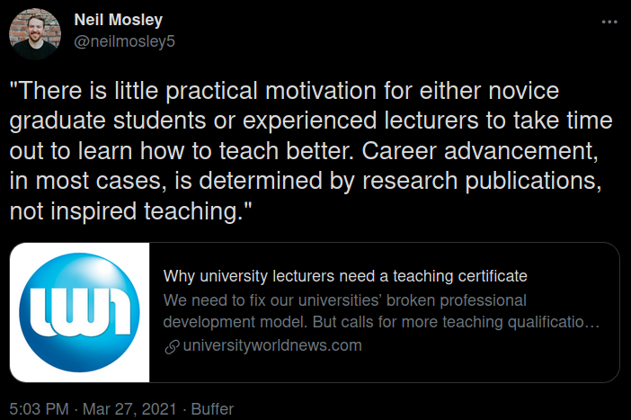

---
categories:
- casa
coverImage: 30189914217_65178b31dd_k-e1617058296261.jpg
date: 2021-03-30 09:03:39+10:00
next:
  text: Exploring Dron's definition of educational technology
  url: /blog2/2021/06/04/exploring-drons-definition-of-educational-technology/
previous:
  text: What are the symbols in digital education/design for learning?
  url: /blog2/2021/03/24/what-are-the-symbols-in-digital-education-design-for-learning/
title: On formal qualifications and improving learning and teaching
type: post
template: blog-post.html
---
The following is sparked by Twitter conversations arising from a [tweet from @neilmosley5](https://twitter.com/neilmosley5/status/1375704895853096961) quoting from [this article](https://www.universityworldnews.com/post.php?story=2019112809050642) by [Tony Bates](https://www.tonybates.ca/). In particular, pondering [a tweet from @gamerlearner](https://twitter.com/gamerlearner/status/1376322969417314304) where the idea is that a "consistent requirement for educators in HE to have some kind of formal teaching qual" will not only help motivate academics "to take time out to learn how to teach better" and generally value teaching more.

It is somewhat troubling and inconsistent that there is no requirement for university academics to have formal teaching qualifications. But I don't see how such a requirement **by itself** will fix issues with the quality of learning and teaching in universities. Especially in the context of Australian higher education given the growing complexity learning and teaching arising from on-going change (e.g. micro-credentials, WIL, multi-modal, flexible, COVID...)

Instead, requiring formal qualifications appears to be a simple solution to a complex problem. It is a solution that seems to fall into the second of [three levels of improving teaching](/blog2/2009/02/26/improving-university-teaching-learning-from-constructive-alignment-by-not-mandating-it/#3-levels-of-improving-teaching) - "What management does". It is a solution that allows someone to "lead" the implementation of a project (e.g. the institutional implementation of HEA fellowships), pass some policies, deliver against some KPIs, and provide demonstrable evidence that the institution takes learning and teaching seriously.

While this is going on the reality of teaching reveals a different story about how seriously learning and teaching are taken. Some examples follow, but there are many more (e.g. I don't even mention the great value placed on research). Workload formulas specify a [maximum of 30 minutes for all outside class student interactions per student](https://twitter.com/s_palm/status/1376278809452834819). There is significant rhetoric around moving away from lectures, but workload formulas are built around time-tabling lecture theatres. A significant proportion of teaching is done by fantastic but under paid sessional staff often appointed at the last minute. The systems and technologies provided to support learning and teaching are [disjointed, require significant extra work](/blog2/2015/04/22/why-is-e-learning-like-teenage-sex-and-what-can-be-done-about-it/#abstract) to be somewhat useful. Mainly because they can't even [provide the simplest of functionality](/blog2/2019/01/30/improving-reuse-of-design-knowledge-in-a-lms/) or help [do the little things](/blog2/2021/03/06/do-the-little-things-matter-in-design-for-learning/).

Given this mismatch, is it any surprise that there are concerns and signs that any requirement for formal teaching qualifications is likely to lead to [task corruption](/blog2/2009/03/04/task-corruption-in-teaching-university-negative-impact-of-place/#what-is-task-corruption). At the individual level, as [@AmandasAudit suggests](https://twitter.com/AmandasAudit/status/1376279896738066433) "how many will short cut and just phone it in?". At the organisational level, e.g. [@scotxc argues that it becomes](https://twitter.com/SCOTXC/status/1376462416158986240) "very easy to become a box-ticking exercises for uni's to say 'They're qualified!!'".

My argument is that actually improving learning and teaching requires moving to [level 3 of improving teaching](/blog2/2009/02/26/improving-university-teaching-learning-from-constructive-alignment-by-not-mandating-it/#3-levels-of-improving-teaching) - "What the teacher does". What Biggs (2001) suggests as focusing on teaching, not individual teachers. Ensuring that the institutional systems, processes, policies etc. all encourage and enable effective teaching practice and move toward [a distributive view of learning and knowledge](/blog2/2015/01/06/tpack-as-shared-practice-toward-a-research-agenda/#a-distributive-view-of-learning-and-knowledge).

This is not a simle task. It is complex. It is [a wicked problem](https://en.wikipedia.org/wiki/Wicked_problem). There is no simple solution. There is no silver bullet. Formal teaching qualifications might be part of the broader solution, but I can't see it being **the** solution. I'm not convinced it is even likely to be the most beneficial contributor.

## References

Biggs, J. (2001). The Reflective Institution: Assuring and Enhancing the Quality of Teaching and Learning. _Higher Education_, _41_(3), 221--238.