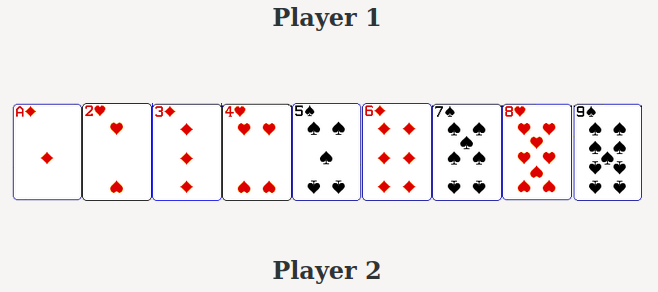

---
categories:
- bricolage
- casa
date: 2021-10-23 17:04:59+10:00
next:
  text: '"Orchestrating entangled relations to break the iron triangle: examples from
    a LMS migration"'
  url: /blog/2022/07/05/orchestrating-entangled-relations-to-break-the-iron-triangle-examples-from-a-lms-migration/
previous:
  text: Exploring Dron's definition of educational technology
  url: /blog/2021/06/04/exploring-drons-definition-of-educational-technology/
title: Representing problems to make the solution transparent
type: post
template: blog-post.html
---
The following illustrates how the game _Number Scrabble_ and Herb Simon's thoughts on the importance of design representation appears likely to help with migration of 1000s of course sites from Blackboard Learn (aka Blackboard Original) to another LMS. Not to mention becoming useful post-migration.

## Number Scrabble

_Number Scrabble_ is a game I first saw described in Simon's (1996) book _Sciences of the Artificial_. I used it in [a presentation from 2004](https://web.archive.org/web/20060830061405/http://cq-pan.cqu.edu.au/david-jones/Publications/Presentations/2004/Conceptualisation/5/index.html) (the source of the following images).

_Number Scrabble_ is a game played between two players. The players are presented with nine cards. The players take turns selecting one card at a time. The aim being to get three cards which add up to 15 (aka a "book"). The first player to obtain a book wins. If no player gets a book, the game is a draw.

## Making the solution transparent

Simon (1996) argues that problem representation is an important part of problem solving and design. He identifies the extreme (perhaps not always possible) version of this view as

> Solving a problem simply means representing it so as to make the solution transparent.

He uses the example of _Number Scrabble_ to illustrate the point.

How much easier would you find it to pay _Number Scrabble_ if the cards were organised in the following magic square?

Would it help any if I mentioned another game, tic-tac-toe?

With this new representation _Number Scrabble_ becomes a game of tic-tac-toe. No arithmetic required and tactics and strategies most are familiar with become applicable.

## My Problem: Course Migration - Understand what needs migrating

Over the next two years my colleagues and I will be engaged in the process of migrating University courses from the Blackboard Learn (aka Blackboard Original) LMS to another LMS. Our immediate problem is to understand what needs migrating and identifying if and how that should/can be migrated to the new LMS.

I've actually grown to quite like Blackboard Learn. But it's old and difficult to use (well). It's very hard to fully understand the purpose and design of a course site by looking at and navigating around it. A course site is likely to have a handful of areas curated by the teaching staff. Each with a collection of different tools and content organised according to various schemes. There are another handful of areas for configuring the course site.

To make things more difficult a Blackboard course site has a [modal interface](https://en.wikipedia.org/wiki/Mode_\(user_interface\)). Meaning the course site will look different for different people at different times.

In addition, using Dron's (2021) definition, Blackboard Learn is a [very soft technology, which makes it hard to use](/blog/2021/06/04/exploring-drons-definition-of-educational-technology/#hard-is-easy-soft-is-hard). As a soft technology, Blackboard Learn provides great flexibility in how it is used. Flexibility when applied across 1000s of course sites will reveal many interesting approaches.

Attempting to understand the design, purpose and requirements of a Blackboard course site by looking at it is a bit like playing _Number Scrabble_ with a single line of cards. A game we have to play 1000s of times.

## Can we make the migration problem (more) transparent? How we're trying

I wondered if the design problem of if/what/how to migrate a course site would be simpler if we were able to change the representation of the course site. Could we develop a representation that would make the solution (more) transparent?

COuld we develop a representation we designers could use to gain an initial understanding of the intent and method of a course site. A representation we could use during collaboration with the teaching staff and other colleagues to refine that understanding and plan the migration. A representation that could scaled for use across 1000s of course sites and perhaps lay the foundation for business as usual post-migration.

What I currently have is a collection of Python code that given a URL for a Blackboard course site will:

1. Scrape the course site and store a data structure representing the site, it's content and configuration.
2. Perform various forms of analysis and modeling with this data to reveal important features.
3. Generate a Word document summarising the course and hopefully providing the representation we need.

The idea is that given a list of 1000s of Blackboard courses. The code can quickly perform these steps and provide a more transparent representation of the problem.

## But is it useful? Is it making solutions transparent? Yes

The script is not 100% complete. But it's already proving useful.

Yesterday I was helping a teacher with one task on their course site (a story for another blog post). The teacher mentioned in passing another problem from earlier in the course. A problem that has been worked around, but for which the cause remains mysterious. It was quite a strange problem. Not one I'd encountered before. I had some ideas but confirmation would require further digging into the complexity of a Blackboard course site. Who has the time?!

As I'm also currently working on the "representation" script I thought I'd experiment with this course. Mainly to test the script, but maybe to reveal some insights.

I ran the script. Skimmed the resulting Word document and **bingo** there's the cause. A cause I would never have considered. But it is understandable how it came about.

The different representation made the solution transparent!!

## References

Dron, J. (2021). Educational technology: What it is and how it works. AI & SOCIETY. https://doi.org/10.1007/s00146-021-01195-z

Simon, H. (1996). The sciences of the artificial (3rd ed.). MIT Press.