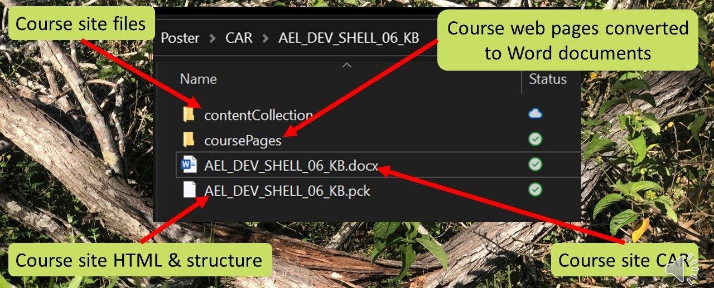

---
categories:
- bad
- casa
coverImage: entangled.jpg
date: 2022-10-10 09:08:08+10:00
next:
  text: '"Gatherers, Weavers and Augmenters: Three principles for dynamic and sustainable
    delivery of quality learning and teaching"'
  url: /blog/2023/02/09/gathers-weavers-and-augmenters-three-principles-for-dynamic-and-sustainable-delivery-of-quality-learning-and-teaching/
previous:
  text: 'Orchestrating entangled relations to break the iron triangle: examples from
    a LMS migration'
  url: /blog/2022/07/05/orchestrating-entangled-relations-to-break-the-iron-triangle-examples-from-a-lms-migration/
title: '"Orchestrating entangled relations to stretch the iron triangle: Observations
  from an LMS migration"'
type: post
template: blog-post.html
comments:
    []
    
pingbacks:
    []
    
---
## About

This work arose from the depths of an institutional LMS migration (Blackboard Learn to Canvas). In particular, the observation that the default migration processes required an awful lot of low level manual labour. Methods that appeared to reduce the quality of the migration process and increase the cost. Hence we started developing different methods. As the migration project unfolded we kept developing and refining. Building on what we'd done before and further decreasing the cost of migration, increasing the quality of the end result, and increasing the scale and diversity of what we could migrate.

We were stretching the iron triangle ([Ryan et al, 2021](https://www.tandfonline.com/doi/abs/10.1080/03075079.2019.1679763)). Since stretching the iron triangle a key strategic issue for higher education (Ryan et al, 2021), questions arose, including:

1. What was different between the two sets of orchestrations? Why are our orchestrations better than the default at stretching the iron triangle?
2. Might those differences help stretch the iron triangle post-migration (i.e. business as usual - BAU)?
3. Can we refine and improve those differences?

The work here is an initial exploration into answering the first question.

## Table of Contents

Below you will find

- An abstract for the [ASCILITE'2022 poster](https://bit.ly/ascilite2022).
- An embedded copy of the poster.
- A sequence of videos providing detailed comparisons of the two sets of orchestrations for three of the migration tasks:
    1. Migrating echo360 embedded videos;
    2. Performing quality assurance checks on migrated course sites; and,
    3. Designing Canvas course sites with high levels of usability.
- More information on the software underpinning these and other orchestrations, including: the Course Analysis Report (CAR) process; Word2Canvas; and, Canvas Collections.
- And finally a couple of reference lists, including those for the poster and the abstraction.

## Abstract

A key strategic issue for higher education is how to maximise the accessibility, quality, and cost efficiency of learning and teaching (Ryan et al., 2021). Higher education’s iron triangle literature (Daniel et al, 2009; Mulder, 2013; Ryan et al, 2021) argues that effectively addressing this challenge is difficult, if not impossible, due to the “iron” connections between the three qualities. These iron connections mean maximising one quality will inevitably result in reductions in the other qualities. For example, the rapid maximisation of accessibility required by the COVID-19 pandemic resulted in a reduction in cost efficiency (increased staff costs) and a reduction in the perceived quality of learning experiences (Martin, 2020). These experiences illustrate higher education’s on-going difficulties in creating orchestrations that stretch the iron triangle by sustainably and at scale fulfilling diverse requirements for quality learning, (Bennett et al., 2018; Ellis & Goodyear, 2019). This exploratory case study aims to help reduce this difficulty by answering the question: What characteristics of orchestrations help to stretch the iron triangle?

An LMS migration is an effective exploratory case for this research question since it is one of the most labour-intensive and complex projects undertaken by universities (Cottam, 2021). It is a project commonly undertaken with the aim of stretching the iron triangle. Using a socio-material perspective (Ellis & Goodyear, 2019; Fawns, 2022) and drawing on Dron’s (2022) definition of educational technology the poster examines three specific migration tasks: migrating lecture recordings; designing quality course sites; and, performing quality assurance checks. For each task, two different orchestrations – organized arrangements of actions, tools, methods, and processes (Dron, 2022) – are described and analysed. The institutional orchestrations developed by the central project organising the migration of an institution’s 4500+ courses, and the group orchestrations developed, due to perceived limitations of the institutional orchestrations, by a sub-group directly migrating 1700+ courses.

Descriptions of the orchestrations are used to identify their effectiveness in sustainably and at scale satisfying diverse quality requirements - stretching the iron triangle. Analysis of these orchestrations identified three characteristics that are more likely to stretch the iron triangle: contextual digital augmentation; meso-level automation; and, generativity and adaptive reuse. Each of these characteristics, their presence in each orchestration, the relationships between these characteristics; linkages with existing literature and practice; and their observed impact on the iron triangle qualities is described. These descriptions are used to illustrate the very different assumptions underpinning the two sets of orchestrations. Differences in relationships evident in the orchestrations and which mirror the distinctions between ‘smooth users’ and ‘collective agency’ (Macgilchrist et al., 2020); and, industrial and convivial tools (Illich, 1973). The characteristics identified by this exploratory case study suggest that an approach that is less atomistic and industrial, and more collective and convivial may help reconnect people with educational technology more meaningfully and sustainably. Consequently this shift may also help increase higher education’s ability to maximise the accessibility, quality, and, cost efficiency of learning and teaching.

## Poster

The postere is embedded below and also available [directly from Google slides](https://docs.google.com/presentation/d/1zhGcxYSALIpO29GQk3pUM1JzeqkCpngG/edit?usp=sharing&ouid=110869324164028184563&rtpof=true&sd=true). The _Enter full screen_ option available from the "three dots" button at the bottom of the poster embed is useful for viewing the poster.

<iframe src="https://docs.google.com/presentation/d/e/2PACX-1vQ_WtrQoJdZFEx3FqiORLVoz0vkc246hnfjxpQVhZUr3qQcNPXazo2ohssuDhyfOw/embed?start=false&amp;loop=false&amp;delayms=60000" width="802" height="527" frameborder="0" allowfullscreen="allowfullscreen"></iframe>

### Comparing orchestrations

The core of this exploratory case study is the comparison of two sets of orchestrations and how they seek to fulfill the same three tasks.

### echo360 migration

<iframe title="YouTube video player" src="https://www.youtube.com/embed/JFbOspwCM4g" width="560" height="315" frameborder="0" allowfullscreen="allowfullscreen"></iframe>

### Course site QA

<iframe title="YouTube video player" src="https://www.youtube.com/embed/7auvaQH_QFQ" width="560" height="315" frameborder="0" allowfullscreen="allowfullscreen"></iframe>

### Course site usability

<iframe title="YouTube video player" src="https://www.youtube.com/embed/Nf1tFp3RtQI" width="560" height="315" frameborder="0" allowfullscreen="allowfullscreen"></iframe>

## About the orchestrations

The orchestrations discussed typically rely on software that we've developed by building on the shoulders of other giants of open source software. Software that we're happy to share with others.

### Course Analysis Report (CAR) process

The CAR process started as [an attempt](/blog/2021/10/23/representing-problems-to-make-the-solution-transparent/#my-problem-course-migration-understand-what-needs-migrating) to make it easier for migration staff to understand what was in a Blackboard course site. It started with a _gather_ that extract the contents of each Blackboard course site into an offline data structure. A data structure that provided a foundation for much, much more.

The echo360 migration video offers some more detail. The following image is from that video. It shows the CAR folder for a sample Blackboard course. Generated by the CAR script this folder contains

- A folder (_contentCollection_) containing copies of all the files uploaded to the Blackboard course site. The files are organised in two ways to help the migration:
    1. Don't migrate files that are no longer used in the course site; and, Files are placed into an _attached_ or _unattached_ folder depending on whether they are still used by the Blackboard course site.
    2. Don't migrate all the files in one single unorganised folder.
- A folder (_coursePages_) containing individual Word documents containing the content of course site pages.
- A CAR report. A Word document that summarises the content, structure and features used in a course site.
- A pickle file. Contains a copy of all the course site details and content in a machine readable format.

While the CAR code is not currently publicly available we are happy to share.

### Word2Canvas

[Word2Canvas](https://djplaner.github.io/word-to-canvas-module/) is Javascript which modifies the modules page on a Canvas course site. It provides a button that allows you to convert a specially formatted Word document into Canvas module.

The _coursePages_ folder produced by the CAR process generates these specially formatted Word documents. Enabling migration to consist largely of minor edits of a Word document and using word2canvas to create a Canvas module.

The echo360 migration video offers some more detail, including an example of using the CAR. The [Word2Canvas to site](https://djplaner.github.io/word-to-canvas-module/) provides more detail again, including how to install and use word2canvas.

### Canvas Collections

[Canvas Collections](https://djplaner.github.io/canvas-collections/) is also Javascript which modifies the Canvas modules page. However, Canvas Collections' modifications seek to improve the usability and visual design of the modules page. In doing so it addresses long known limitations of the Modules page, as the following table summarises.

| Limitation of Canvas modules | Collections Functionality |
| --- | --- |
| Lots of modules leads to a long list to search | [Group modules into collections](https://djplaner.github.io/canvas-collections/features/collections/) that are viewed separately |
| An overly linear and underwhelming visual design | Ability to select from, change between, and create new [representations of collections and their modules](https://djplaner.github.io/canvas-collections/features/representations/). |
| No way to add narrative or additional contextual information about modules to the modules page. | Ability to transform vanilla Canvas modules into [contextual objects](https://djplaner.github.io/canvas-collections/features/objects/) by adding additional properties (information) for modules that are used in representations and other functionality. |

The course site usability video provides more detail on Canvas Collections, as does the [Canvas Collections site](https://djplaner.github.io/canvas-collections/). Canvas Collections is available for use now, but is continually being developed.

## References - Poster

Arthur, W. B. (2009). _The Nature of Technology: What it is and how it evolves_. Free Press.

Bygstad, B. (2017). Generative Innovation: A Comparison of Lightweight and Heavyweight IT: _Journal of Information Technology, 32_(3), 180-193. [https://doi.org/10.1057/jit.2016.15](https://doi.org/10.1057/jit.2016.15)

Cottam, M. E. (2021). An Agile Approach to LMS Migration. _Journal of Online Learning Research and Practice_, _8_(1). [https://doi.org/10.18278/jolrap.8.1.5](https://doi.org/10.18278/jolrap.8.1.5)

Dron, J. (2022). Educational technology: What it is and how it works. _AI & SOCIETY_, _37_, 155–166. [https://doi.org/10.1007/s00146-021-01195-z](https://doi.org/10.1007/s00146-021-01195-z)

Ellis, R. A., & Goodyear, P. (2019). _The Education Ecology of Universities: Integrating Learning, Strategy and the Academy_. Routledge.

Fawns, T. (2022). An Entangled Pedagogy: Looking Beyond the Pedagogy—Technology Dichotomy. _Postdigital Science and Education_, _4_(3), 711–728. [https://doi.org/10.1007/s42438-022-00302-7](https://doi.org/10.1007/s42438-022-00302-7)

Goodhue, D., & Thompson, R. (1995). Task-technology fit and individual performance. _MIS Quarterly_, _19_(2), 213–236.

Illich, I. (1973). _Tools for Conviviality_. Harper and Row.

Jones, D., & Clark, D. (2014). Breaking BAD to bridge the reality/rhetoric chasm. In B. Hegarty, J. McDonald, & S. Loke (Eds.), _Rhetoric and Reality: Critical perspectives on educational technology. Proceedings ascilite Dunedin 2014_ (pp. 262–272). [http://ascilite2014.otago.ac.nz/files/fullpapers/221-Jones.pdf](http://ascilite2014.otago.ac.nz/files/fullpapers/221-Jones.pdf)

Macgilchrist, F., Allert, H., & Bruch, A. (2020). Students and society in the 2020s. Three future ‘histories’ of education and technology. _Learning, Media and Technology_, _45_(0), 76–89. [https://doi.org/10.1080/17439884.2019.1656235](https://doi.org/10.1080/17439884.2019.1656235)

Mulder, F. (2013). The LOGIC of National Policies and Strategies for Open Educational Resources. _International Review of Research in Open and Distributed Learning_, _14_(2), 96–105. [https://doi.org/10.19173/irrodl.v14i2.1536](https://doi.org/10.19173/irrodl.v14i2.1536)

Ryan, T., French, S., & Kennedy, G. (2021). Beyond the Iron Triangle: Improving the quality of teaching and learning at scale. _Studies in Higher Education_, _46_(7), 1383–1394. [https://doi.org/10.1080/03075079.2019.1679763](https://doi.org/10.1080/03075079.2019.1679763)

## References - Abstract

Bennett, S., Lockyer, L., & Agostinho, S. (2018). Towards sustainable technology-enhanced innovation in higher education: Advancing learning design by understanding and supporting teacher design practice. _British Journal of Educational Technology_, _49_(6), 1014–1026. https://doi.org/10.1111/bjet.12683

Cottam, M. E. (2021). An Agile Approach to LMS Migration. _Journal of Online Learning Research and Practice_, _8_(1). https://doi.org/10.18278/jolrap.8.1.5

Dron, J. (2022). Educational technology: What it is and how it works. _AI & SOCIETY_, _37_, 155–166. https://doi.org/10.1007/s00146-021-01195-z

Ellis, R. A., & Goodyear, P. (2019). _The Education Ecology of Universities: Integrating Learning, Strategy and the Academy_. Routledge.

Fawns, T. (2022). An Entangled Pedagogy: Looking Beyond the Pedagogy—Technology Dichotomy. _Postdigital Science and Education_. https://doi.org/10.1007/s42438-022-00302-7

Illich, I. (1973). _Tools for Conviviality_. Harper and Row.

Macgilchrist, F., Allert, H., & Bruch, A. (2020). Students and society in the 2020s. Three future ‘histories’ of education and technology. _Learning, Media and Technology_, _45_(0), 76–89. https://doi.org/10.1080/17439884.2019.1656235

Martin, L. (2020). _Foundations for good practice: The student experience of online learning in Australian higher education during the COVID-19 pandemic_). Tertiary Educational Quality and Standards Agency. [https://www.teqsa.gov.au/latest-news/publications/foundations-good-practice-student-experience-online-learning-australian](https://www.teqsa.gov.au/latest-news/publications/foundations-good-practice-student-experience-online-learning-australian)

Ryan, T., French, S., & Kennedy, G. (2021). Beyond the Iron Triangle: Improving the quality of teaching and learning at scale. _Studies in Higher Education_, _46_(7), 1383–1394. https://doi.org/10.1080/03075079.2019.1679763