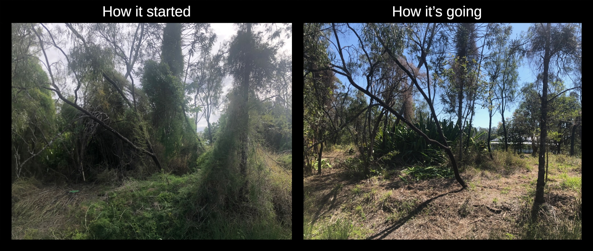

---
categories:
- colophon
date: 2025-01-12 15:19:03+10:00
next:
  text: Home
  url: /blog/index.html
previous:
  text: Announcing (finally) Canvas Collections
  url: /blog/2023/08/18/announcing-finally-canvas-collections/
title: What now?
type: post
template: blog-post.html
comments:
    - approved: '1'
      author: Peter Albion
      author_email: palbion@me.com
      author_ip: 120.155.147.161
      author_url: http://peter.albion.id.au
      content: Interesting to see what you are up to. It seems you and I are somehow intertwined
        ever since you taught a course I took in 1989-90. I saw your name pop up in the
        FEP site which I manage. It might be good to catch up some time.
      date: '2025-01-13 19:52:39'
      date_gmt: '2025-01-13 09:52:39'
      id: '24911'
      parent: '0'
      type: comment
      user_id: '0'
    - approved: '1'
      author: David Jones
      author_email: davidthomjones@gmail.com
      author_ip: 61.68.186.82
      author_url: null
      content: It does seem to be a strangely small world. The FEP site came up in a chat
        I was having with someone last week. Email to follow.
      date: '2025-01-14 08:22:54'
      date_gmt: '2025-01-13 22:22:54'
      id: '24912'
      parent: '24911'
      type: comment
      user_id: '1'
    
pingbacks:
    []
    
---
2024 passed without a post to this blog. Many reasons, but largely because I moved on from higher education. Suddenly digital education - the old focus of this blog - wasn't a big part of my thinking. Raising the question, **what now**?

What now for this blog, for my online presence and engagement, and for what "I do"?

As well as starting with these questions this post is also a warning to anyone still keeping an eye on this blog from a higher education perspective of looming change. If you're still around (there are 850+ email subscribers, I'm guessing many of which are long defunct ex-student subscriptions), you may wish to move on. If so, so long and thanks for the fish.

If you're still around at the end, all suggestions welcome and come back in 12 months to see if/what's happened.

**TLDR**

Moving forward, my focus will be on the sustainable restoration of the native forests. On our home block and in our broader local environment. While superficially very different to "digital education", I see it as very similar at an abstract level.

Technically, I'm not convinced that Wordpress is the blogging tool I'll continue with. Can I blog meaningfully? Is Wordpress really the software I want to use?

I do intend to maintain the content and domain name. If only to prevent questionable actors from taking over the expired domain. As has happened with a couple of the higher education technology blogs/sites (e.g. [Mark's](https://www.slideshare.net/marksmithers)) I used to follow.

I have some early thoughts on how I'll leverage online/digital tools to support this new focus.

- I will keep and expand use of ["my Memex"](/blog/2020/07/06/designing-a-personal-memex-with-foam/) for knowledge management.
- Will likely move my [Mastodon account](https://indieweb.social/@djplaner) away from the [Indieweb server](https://indieweb.social/explore) to a better match.
- WIll be exploring integration with other tools and services (e.g. [eBird](https://ebird.org/home) and [iNaturalist](https://inaturalist.ala.org.au/)).

More detail follows.

## Shifting focus - sustainable restoration as bricolage/assemblage

Since my last blog post a bit has changed. I "lost" a parent. Ended my ~30 year career in tertiary education. Reached a joint decision with any prospective employers that full-time employment was not the direction for me. This and other events encouraged some reflection on what brings me joy.

A lot of people who have looked at my work in higher education probably (e.g. my wife) will assume playing with digital technology was what brought me joy. I've always been labelled as the "technology guy". Sure there was a lot of playing with digital technologies and I enjoyed much of it but technologies were just the tools for building [contextually-appropriate scaffolding assemblages (CASA)](/blog/2015/10/01/university-e-learning-removing-the-context-and-adding-the-sediment/#casa-context-appropriate-scaffolding-assemblages). Tools for engaging in [bricolage](/blog/2014/09/21/breaking-bad-to-bridge-the-realityrhetoric-chasm/#what-work-gets-done-bricolage-or-strategic) with available services and technologies to [gather, weave, and augment](/blog/2023/02/09/gathers-weavers-and-augmenters-three-principles-for-dynamic-and-sustainable-delivery-of-quality-learning-and-teaching/) the current environment and what was possible with learning and teaching.

Throughout my work in higher education the focus understanding the local environment and out how to sustainably make real improvements to it. A big part of what's changed for me is the local environment. No longer will it be learning and teaching in higher education. It's been replaced with living within [Postmans Ridge](https://en.wikipedia.org/wiki/Postmans_Ridge,_Queensland) and surrounds. In particular, our [10 acre home block](https://djplaner.github.io/memex/sense/landscape-garden/wood-duck-meadows.html). How do I _gather_ and _weave_ in order to _augument_ this new local environment?

The need is obvious. Since colonisation at least [40% of Australia's forests](https://theconversation.com/in-2025-lets-make-it-game-on-not-game-over-for-our-precious-natural-world-245761) have been cleared. Since 2001, [losses in South-East Queensland](https://www.hlw.org.au/region/about/natural-assets/nature#gsc.tab=0) include: 7,384 hectares of remnant vegetation, 54,983 hectares of woody vegetation, and 1,220 hectares of natural wetlands. [Our block](https://djplaner.github.io/memex/sense/landscape-garden/wood-duck-meadows.html) has evidence of brigalow scrub and other ecosystems but falls within an area that is [classified as "non-remnant"](https://www.qld.gov.au/environment/plants-animals/biodiversity/glossary). i.e. it has been heavily thinned, has significant disturbed vegetation, or cleared. Which in our case includes some significant infestation by nasty weeds. For example, the [climbing asparagus fern](https://weeds.brisbane.qld.gov.au/weeds/climbing-asparagus-fern) in the following image (in the left photo, not the right) which shows off some of my early work.There are a lot of people and groups (e.g. [this local group](https://fep.org.au/our-parks/redwood-park/) I've joined) doing this work. Not surprisingly the purpose, approach and terminology used by these groups varies significantly. As novices our purpose and approach will evolve, but the term "sustainable restoration" resonates currently. It's a term [attributed to John Lahey](https://sown.com.au/wp-content/uploads/2020/05/Creek_in_our_backyard_revised_2013.pdf) describing "restoration efforts where human input is minimal". Which speaks to me of bricolage. Sustainable restoration is not a widely used/known term meaning there isn't multiple meanings (often with associated "thought camps") as with other terms. That said related terms and movements like restoration, rewilding, and permaculture are of interest. Especially if rewilding is seeking to restore ecosystems so they can look after themselves (Macgilchrist, 2021). But even that sentiment has some difference to ponder.

## Limitations of my current digital practices

The digital practices I use in everyday life and to maintain my online presence suffer from a number of limitations. Aside from the more common limitations (e.g. a over-reliance on passively scrolling through information feeds managed by commercial interests) these include:

1. Aging infrastructure.
    
    Much of the infrastructure is so 00s. Showing my [Web 2.0 roots](/blog/2007/07/11/cqus-first-web-20-course-site-goes-live/) (and age). Based on shared hosting server rather than containers. Still using a bloated blog software (Wordpress) rather than something small (e.g [small web](https://benhoyt.com/writings/the-small-web-is-beautiful/) and [smolweb](https://smolweb.org/index.html)). Relying on "free" technology (Github) where I'm [not the customer so I'm probably the product](https://sfconservancy.org/blog/2022/jun/30/give-up-github-launch/).
    
    Another example is that Wordpress xmlrpc (how I used to publish blog posts) is [now deprecated](https://www.hostinger.com/tutorials/xmlrpc-wordpress#Why_you_should_disable_xmlrpcphp).
2. Misdirected audience/purpose.
    
    e.g. as mentioned above, being based on a Indieweb focused Mastodon server doesn't match the new focus. Most of my content being on a blog. Which is perhaps good for sharing writing but maybe not the best fit for other tasks (e.g. plant identification, tracking restoration impacts etc).
3. Somewhat disconnected
    
    e.g my [memex site](https://djplaner.github.io/memex/) isn't hosted in the same place as this blog, relies on a different toolset, and isn't part of the same domain.

## Some steps moving forward

- Replace Wordpress or not?
- Use [Foam/mkdocs](https://djplaner.github.io/memex/colophon/colophon.html#other-examples) for everything?
- Bring all under a single domain?
- What other task focused applications are there and how can they all fit?
- Move Mastodon servers?
    
    e.g. [Which should I use](https://www.sciencebase.com/science-blog/which-mastodon-server-should-i-use.html)
- What other takes are there on online practices and presence?
    
    e.g. [The social web](https://manuelmoreale.com/the-social-web), [Indieweb vis Indie Web](https://fyr.io/post/indieweb_vs_indie_web), [The slow web](https://www.jackcheng.com/the-slow-web/), [The small web is beautiful](https://benhoyt.com/writings/the-small-web-is-beautiful/), [About smolweb](https://smolweb.org/index.html), and the many other perspectives from the [Diagram website](https://diagram.website/).

## References

Macgilchrist, F. (2021). Rewilding Technology. On Education. Journal for Research and Debate, 4(12). [https://doi.org/10.17899/on\_ed.2021.12.2](https://doi.org/10.17899/on_ed.2021.12.2)