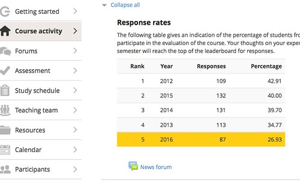

See also: [[blog-home | Home]]

The following aim to help a USQ course examiner add a student evaluation of teaching (SET) response rate leaderboard to any web page. The leaderboard was designed to provide students with insight into how many students have completed the SET survey, and serve as an additional method to increase response rates.

For more information, check out the [GitHub repository](https://github.com/djplaner/leaderboard) (for the latest "code") and [the poster page](http://djon.es/blog/2017/06/17/nudging-up-myopinion-response-rates-using-a-gamified-leaderboard/) (for a more academic rationale, explanation and updated results).

An initial trial of the leaderboard approach in the S2 offering of EDC3100 contributed to a 47.7% response rate and turned around a declining trend.

## What does it look like?

The image below is an example of what the leaderboard will look like.  The data used here is real data from EDC3100, however, the 2016 response rate is an imaginary number included for illustration. 

The leaderboard shows one row for each offering of the course you include. How many you include is up to you. The current offering is highlighted using a yellow background.

As students from the 2016 offering of the course submit evaluations, I will update the number of responses in a cell in a Google spreadsheet. As the 2016 percentage increases that offering will move up the leaderboard. If the 2016 response rate ever exceeds the 42.91% from 2012, it will reach #1.

The leaderboard can be used just with the current offering to provide students with an update of progress.

The leaderboard can be added to most parts of the Study Desk and to most web pages. Typically the leaderboard is  added to the first block on the Study Desk to ensure that students see it every time the visit the course site.

## Pre-requisites

Before adding the leaderboard you will need to fulfill the following:

1. Be the course examiner for a USQ course. This includes - for all the offerings of the course you'd like to include in the leaderboard - access to the following information
    1. Total number of students enrolled in each offering.
    2. The number of SET responses for each offering. (Having no responses for the current offering is fine).
2. Have a Google account. This is the account you use to access any Google service (e.g. gmail or YouTube). If you don't have one, it is fairly straight forward to [create a Google account](https://accounts.google.com/Signup).
3. Have the ability to edit the web page(s) (or part thereof) into which you'll embed the SET leaderboard

## The process

There are three steps (explained in more detail below) to creating and maintaining the leaderboard, they are:

1. Copy and modify a Google spreadsheet to suit your course. This will contain the raw data that goes into the table.
    
    **Note:** this Google spreadsheet needs to be "public on the web". Meaning that anyone can theoretically find and view the contents of the spreadsheet (for example [this one](https://docs.google.com/spreadsheets/d/1o7Dqv8XK54yVrvAmbJvsf88ot2QssSxUMJM4wP8q204/edit#gid=0)). If you're not comfortable with this, you should not use the leaderboard.
2. Copy, paste, and modify some HTML into the web page where you'd like the leaderboard to appear.
3. Regularly check the SET response rates for the current offering of the course and update a cell in the Google spreadsheet.

Steps 1 and 2 should only need to be done once. Step 3 will need to be repeated while the SET survey is open to students of the current offering. How often you repeat this will depend on your context.

### Copy and modify a Google spreadsheet

This process creates a copy of an existing spreadsheet that will contain the data about your course and its response rates.

1.  Visit [this Google spreadsheet](https://docs.google.com/spreadsheets/d/1o7Dqv8XK54yVrvAmbJvsf88ot2QssSxUMJM4wP8q204/edit#gid=0) in a new tab or window.
2. If you haven't already, sign in with your Google account. If, when viewing the Google spreadsheet, you can see the words **Sign in** in the top right-hand corner, then click on **Sign in** and enter the details of your Google account.
3. Make your copy of the spreadsheet.
    - Use the "Make a copy..." item in the **File** menu
    - Name it what ever you deem appropriate.
4. Make your spreadsheet public on the web. This involves the following steps:
    1. Click on the **Share** button in the top right-hand corner of your spreadsheet.
    2. On the window that opens, click on **Get shareable link**
    3. Click on **can view**
    4. Click on **More...**
    5. Select the **On - Public on the web** radio button
    6. Hit the **Save** button
    7. Hit the **Done** button
5. Modify the data in your copy of the spreadsheet to match your course This might include
    - Removing rows to match the number of course offerings you have information for. To delete rows, select data within those rows and then use the **Delete row** option within the **Edit** menu
    - Adding rows. Best achieved by copying an existing row; pasting a new row at the bottom; and modifying the content of the row (don't modify Column C).  There is no need to put the rows in order, the leaderboard sorts the rows in descending order based on the percentage of responses (Column C)
    - Changing the total enrollment (column E) for each offering of the course.
    - Changing the number of responses (column B)for each offering of the course. Column C - the percentage of students who have responded - is automatically calculated.
    - Indicating which offering is the current offering by moving the **yes** in column D
6. **Keep the Google spreadsheet open in a browser tab, you'll need it later.**

### Copy, paste and modify some HTML

This process will modify a web page (part of a course site) to display the SET leaderboard.

1. Visit [this web page](https://github.com/djplaner/leaderboard/blob/master/COPY_ME.html) in a new tab or window.
2. View the source of that page. Right-click on the page and you should see a menu appear with an option something like **View source**
3. Copy all of the HTML code revealed.
4. Edit the web page (or part thereof) where you will display the SET leaderboard.
5. Ensure your editor is in "HTML code view" mode. On most editors this involves clicking on an icon that looks like this **<>**. When you click on it, you should see the HTML code for whatever is already in the editor. It should look something like the HTML code you copied in Step 3.
6. Paste the HTML you copied from step 1 into the editor. If you already have some content in the editor, you will need to determine exactly where is the best place to paste the new HTML. Sorry, but this does require an attempt to read and understand the HTML ode.
7. Replace this text  **\*\*\*\*\* YOUR SPREADSHEET URL HERE \*\*\*\*\*** The HTML you just pasted in should include the above text. It will appear between two single quotes. You need to replace **\*\*\*\*\* YOUR SPREADSHEET URL HERE \*\*\*\*\*** with the URL of your Google spreadsheet.
    1. Copy the URL of the Google spreadsheet you created above.
    2. Return to your web page and highlight the **\*\*\*\*\* YOUR SPREADSHEET URL HERE \*\*\*\*\*** text
    3. Paste in the URL of the spreadsheet
8. Return the editor to your normal view. Typically by clicking on the same **<>** icon.
9. Save and view the web page and hopefully celebrate a working SET leaderboard.
10. Most likely you may wish to add some additional contextual explanation around the HTML you've added. This is recommended, however, try not to modify any of the HTML just pasted in. Doing so may prevent the leaderboard from working.

### Update the Google spreadsheet

You will need to update the Google spreadsheet so that it holds the correct number of responses for the current offering, at least while the survey is open to all.

The process used in EDC3100 was, every day or two to check MyOpinion and if there were any changes then edit the **Responses** cell for the current offering.