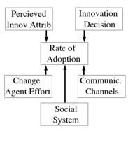

David Jones, Kieren Jamieson, Damien Clark, ["A Model for Evaluating Potential WBE Innovations,"](/blog/publications/a-model-for-evaluating-potential-web-based-education-innovations/) Hawaii International Conference on System Sciences, vol. 5, no. 5, pp. 154a, 36th Annual Hawaii International Conference on System Sciences (HICSS'03) - Track 5, 2003.

## Abstract

Due to the constantly evolving nature of Web-based Education (WBE) it is often difficult for educators to understand the issues, challenges, impact, and effort required to introduce WBE innovations. This lack of knowledge can contribute to the limited adoption and less than successful implementation of WBE innovations. This paper draws on an aspect of innovation diffusion theory to propose a model through which educators can evaluate potential WBE innovations. It is proposed that this model can aid educators increase their awareness of potential implementation issues, estimate the likelihood of reinvention, and predict the amount and type of effort required to achieve successful implementation of specific WBE innovations. The worth of the model is demonstrated by drawing on past experience.

## Introduction

Web-based education (WBE) is the most recent in a long line of educational innovations which promise tremendous advantages. University educators are being encouraged to adopt WBE innovations for a number of reasons including, but not limited to, increasing access and flexibility, reducing cost, improving quality, adopting more student centered approaches, amongst others.

However, there is a growing realization that many of these innovative approaches to teaching and learning suffer from a lack of utilization (Surry and Farquahar, 1997). The majority of web-based education (WBE) is badly done (Taylor 1998) and makes less than effective use of the medium and does not use pedagogical approaches favoured by educational researchers (Mioduser, Nachmias, Oren & Lahav, 1999). While a growing number of faculty are enthusiastic about WBE there is still a large number who seem hesitant or reluctant to adopt technology for the teaching tasks (Jacobsen, 1998).

There are many reasons for these problems. One commonly identified barrier to WEB adoption by faculty is a lack of time (Jacobsen, 1998; Ebersole, Vorndam, 2002; De Vos, Goeman, & Blocry, 2002). The adoption of communication and information technologies at Universities is often badly done and based on ignorant optimisms (Taylor 1998). The full possibilities of a new technology are difficult to predict (Sproull and Kiesler, 1991) and many such projects fail due to the innovators underestimating the consequences of new technologies (Sproull and Kiesler, 1991) and failing to accommodate environmental and contextual factors affecting implementation (Jonassen, 1998). It is crucial that academics constantly enhance their understanding of the issues, trends and opportunities associated with WBE and their impact on educational systems, programs and the profession itself (Aggarwal, 2000, pI).

This paper proposes the use of a model based on an aspect of diffusion theory to evaluate potential WBE innovations. The aim of this evaluation is to improve understanding of the possible implementation issues, identify the likelihood of reinvention, and predict the amount and type of effort which may be required to achieve successful implementation. It is suggested that with this information faculty enter the implementation stage of a WBE innovation better informed and with a greater chance of success.

The first section of this paper offers a brief introduction to diffusion theory which serves as the theoretical foundation for the paper. Based on this introduction the paper examines more closely the aspect of diffusion theory which provides the model and explains how it can be used to evaluate WBE innovations. The paper then draws on the authors experience with three different WBE innovations to demonstrate the model. The paper closes with some discussion about the use of the model and ideas for future work.

## Diffusion Theory

There is no single, unified, universally accepted theory of adoption and diffusion with the literatue being made up of numerous, unrelated theories, each addressing a different aspect of the diffusion process or a different type of innovation or organization (Surry, 2002). Rogers' (1995) work forms the basis of most studies related to adoption and diffusion, including this paper. This work grew out of work in rural sociology and in particular a 1943 study by Ryan and Gross at Iowa State University (Rogers 1995 need pp). Since that time over 3800 papers on diffusion theory have been published in a range of fields including education, marketing, anthropology, public health and rural sociology (Rogers, 1995, pp 43).

Diffusion is defined as "the process by which an innovation is communicated through certain channels over time among the members of a social system" (Rogers, 1995, p5). An innovation is an idea, practice or object that is perceived as new by the individual (Rogers, 1995). The diffusion theory framework involves four main elements: innovation, communication channels, time and the social system. Each of these elements influence the adoption or rejection of an innovation in a complicated, inter-dependent way.

Four of Rogers' theories seem to be common elements of most diffusion theories including (Surry, 2002):

1. **Diffusion process.** Diffusion is a process that occurs over time and can be seen as having five distinct stages - knowledge, persuasion, decision, implementation, and confirmation.
2. **Adopter categories.** Members of a population vary greatly in their willingness to adopt a particular innovation. Individual characteristics can be used to divide the population into categories - innovators, early adopters, early majority, late majority, and laggards.
3. **Perceived Attributes**. How people perceive an innovation influences their adoption decision. Five perceived attributes of an innovation have been shown to have strong influence - trialability, observability, relative advantage, complexity, and compatibility.

5. **Rate of Adoption.** The relative speed with which an innovation is adopted by members of a social system. Innovations are diffused over time in a pattern that resembles an s-shaped curve.

Given the lack of utilisation (Surry and Farquahar, 1997) and the poor quality of WBE (Taylor 1998; Mioduser, Nachmias, Oren & Lahav, 1999) it is not surprising that the study of innovation diffusion is neither new nor rare in the field of instructional technology (Surry and Farquahar, 1997).

Many authors (Jacobsen, 1998; Ferrarini and Poindexter, 1999; Ferrarini and Poindexter, 1999; Ebersole and Vorndam, 2002) have used adopter categories and rate of adoption to investigate the differences between early and late adopters, the perceived barriers and incentives to adoption of WBE innovations and the rate of adoption of WBE innovations. Jacobsen (2000) used the five stages of the innovation decision process as a conceptual framework for the consideration of individual stories about adopting technology for teaching and learning. Other authors (Bronack and Riedl, 1998; Jones, 1999) have used the perceived characteristics of innovations to examine some innovations work and others don't. Schefstrom et al. (1998) used a number of diffusion theory aspects to explain the current situation with respect a particular WBE innovation. Surry and Farquahar (1997) discuss how four of the most commonly examined diffusion theories have been used to build diffusion theories specific to instructional technology.

## The Model

The intent of this paper is to develop a model which can help faculty increase their awareness of potential implementation issues, estimate the likelihood of reinvention, and predict the amount and type of effort required to achieve successful implementation of specific WBE innovations. The model being proposed is based on diagram 1 taken from Rogers (1995, p 207). This diagram proposes that there are five variables that determine the rate of adoption of an innovation.

_Diagram 1  
Variables influencing rate of adoption_

We propose that the six variables from this diagram offer a framework through which a WBE innovation can be evaluated. We suggest that by examining each of these six components a faculty member can:

1. Generate a range of issues to consider before implementation.

3. Predict the amount of effort required to achieve the required rate of adoption.
4. Predict the level of reinvention.

It is important to note that this evaluation is not based not on supposedly objective benefits of the WBE innovation. Instead this evaluation will be based on subjective, contextual, and environmental issues that are unique to each situation. The following sections offer an expanded explanation of each of the six variables from Diagram 1.

## Rate of Adoption

The rate of adoption of an innovation is the length of time necessary for a certain percentage of members of a social system to adopt the innovation. For most innovations it is an S-shaped curve indicating that even successful innovations start out slowly and don't become widely adopted until a critical mass develops (Surry, 2002). In most cases when implementing a WBE innovation it will be necessary to achieve a specific rate of adoption.

## Perceived Innovation Attributes

As mentioned earlier diffusion theory identifies five characteristics of innovations that influence whether an innovation will be adopted. These characteristics are not objective characteristics agreed upon by everyone. Instead, diffusion theory concentrates on how the potential adopters of the innovation perceive the innovation's characteristics. Two individuals could, and usually do, perceive the features of any given innovation differently.

The characteristics include:

- **Relative advantage**. The degree to which an innovation is perceived as better than the idea it supersedes.
- **Compatibility**. The degree to which an innovation is perceived as being consistent with the existing values, past experiences, and needs of potential adopters.
- **Complexity**. The degree to which an innovation is perceived as difficult to understand and use.

- **Trialability**. The degree to which an innovation may be experimented with on a limited basis.
- **Observability**. The degree to which the results of an innovation are visible to others.

Research studies confirm that an innovation which is perceived as having high compatibility, relative advantage, trialability and observability while having low complexity is more likely to be adopted. Tornatzkey and Klein (1982) found that relative advantage, compatibility and complexity are the most significant factors in explaining relationships across abroad range of innovations. Surry and Farquhar (1997) report on a number of studies which confirm the links between relative advantage, complexity and compatibility and the adoption of innovations in education.

## Innovation-Decision

The type of decision to adopt or reject an innovation can be of three types:

1. **Optional.** Each individual in a social system to adopt or reject the innovation.
2. **Collective.** The social system makes a consensus-based decision to adopt or reject an innovation
3. **Authority.** Made by those in authority with the expectation that the social system will follow that decision.

Authority decisions generally show the fastest rate of adoption. Optional decisions can usually be made more rapidly than collective decisions.

However, these types of decisions are often circumvented during implementation. This circumvention, referred to as reinvention in the diffusion theory literature, is defined as the degree to which an adopter modifies the innovation in the process of its adoption and implementation (Rogers, 1995; pp174). In an environment like higher education, re-invention of instructional technology is a strong possibility.

## Communication Channels

Diffusion of an innovation is a particular type of communication aimed at reducing uncertainty about the innovation and encouraging adoption of the innovation. A communication channel is the medium used to disseminate messages about the innovation from one individual or group to another. Diffusion theory suggests that the nature of this communication channel will influence whether or not information is transferred and the effect of that transfer. Diffusion theory categorizes communication channels on two dimensions based on the nature of the channel, mass media or interpersonal, and its source, local or cosmopolite.

Mass media channels, which enable small group to reach a large audience, are a rapid and efficient means by which to inform an audience of an innovation and lead to changes in weakly held attitudes. Interpersonal channels, links between two or more individuals are more effective in dealing with resistance or apathy. Cosmopolite communication channels originate from outside the social system. Potential adopters of an innovation rely more on subjective evaluations from other individuals like themselves who have previously adopted the innovation than objective evaluations of an innovation (Rogers, 1995, p18).

## Social System

A social system is 'a set of interrelated units that are engaged in joint problem-solving to accomplish a common goal' (Rogers, 1995, p. 23\]. The units of a social system may be individuals, groups or organisations. The members of each social system are connected via the need to solve a common problem to reach a shared goal. Diffusion theory identifies a number of ways by which the social system can influence the adoption of an innovation (Rogers, 1995, p24) including:

- **Social structure.** The formal arrangement of units within the social system.
    
- **Communication structure.** The informal, interpersonal networks which link the social systems members.
    
- **System norms.** The established behavior patterns and beliefs that are common amongst the members of the social system.

The structure of a social system can enable or hinder the diffusion of innovations with that system (Rogers, 1995, p25). An innovation which challenges the social systems norms or breaks the social structure is likely to require significantly larger effort to enable adoption.

## Change Agent Efforts

A change agent is an individual who influences innovation-decisions in a direction deemed desirable by the individual/organization driving the innovation (Rogers, 1995, p. 335). In a higher education setting this is usually the teaching staff possibly supplemented by support staff or in some cases students. The relationship between rate of adoption and change agent efforts is not direct and linear (Rogers, 1995, p208). Appropriate efforts at certain stages in the innovation's diffusion will have greater effect.

The success of change agent efforts is related to a number of factors including: the extent of change agent effort in contacting clients, timing of client contact, having a close rapport, empathy, and credibility with clients, and if the change agent is homophilous with clients. Homophily is the degree of similarity between two individuals.

## Using the Model

To demonstrate the usefulness of this model the following sections use the model to evaluate the outcomes of three different WBE innovations which the authors have used over the last seven years in a single course. This evaluation shows how appropriate use of the model can identify implementation issues, predict the effort required to achieve adoption, and to predict likely reinvention.

This examination draws on a number of data sources gathered over the last seven years of teaching a course. Those sources include results of various evaluation and research surveys, archives of class discussions on email and mailing lists, and reflection by teaching staff.

The three innovations to be examined are

1. **Online Assignment Submission.** The use of network technologies for the submission and return of course-work assessment. Initially problematic this innovation has become one of the most popular of the WBE innovations and is spreading into other courses.
2. **Mailing lists.** The use of electronic mailing lists as the main course communication medium for both student/staff and student/student discussion. Initially very popular mailing lists have become the standard communication medium in many courses. However, over recent years they have become increasingly problematic and people are examining alternate mediums.
3. **Group work.** A small group, collaborative approach to assessment facilitated by network technologies. This type of pedagogy is seen as having significant benefits in terms of the depth and quality of student learning. A small number of other courses have experimented with it. However, in the course discussed here the experience was extremely problematic and is no longer used.

Each of the following sections draw on the five dependent variables from Diagram 1 to examine these three innovations. These sections are, due to space limitations, by no means exhaustive but do provide an indication of the value of this model.

## Social System

The context for all of the innovations discussed in this paper is the Systems Administration course offered by the Faculty of Informatics and Communication (Infocom) at Central Queensland University (CQU). This course has been taught by each of the three authors at differing times over the last seven years. The social system within the course and within which it operates has changed since 1996.

The members of the Systems Administration social system can be divided into the following groups:

- **Students.** In 1996 there were 77 students in the course including 20 on-campus students and 57 distance students. The 2002 offering of the course had 210 students including 68 distance students and 142 on-campus students located at 7 different campuses.

- **Teaching Staff.** In 1996 there was one course coordinator and a casual marker. The 2002 offering had 10 staff members including a coordinator, 3 markers, 2 tutors, and 4 lecturers.
- **Organizations.** Apart from the Faculty of Informatics and Communication other organisations involved in the delivery of the course include the Division of Teaching and Learning Services (DTLS), Campus Management Systems (CMS), and other commercial partners. DTLS is responsible for producing and distributing distance education material. CMS is a partner of CQU and is responsible for the running of five commercial campuses.

## Social and Communication Structure

A course coordinator is the academic in charge of the course. This individual (or small group) decides the content, pedagogy, and assessment for a course. In the mid-1990s the course all student/staff communication was with the course coordinator. The course coordinator was the only change agent and communicated directly with students.

In recent years a number of other campus-based lecturers have been employed. These staff become the main communication channel for students at those campuses and are able to filter communication from the course coordinator. The increase in complexity of offerings has also increased the administrative staff associated with course delivery.

This increase in complexity of the structure has made it more difficult to implement some forms of innovation. Especially where the innovation challenges system norms.

## System Norms

Some of the norms associated with the Systems Administration social system include:

- **Computer based topic area.** As an advanced level, undergraduate course in computing both the students and staff in Systems Administration tend to have greater knowledge and experience with computers and the Internet than the general population. Additionally the course content covers the provision and management of Internet services and so students see the value to their future careers in gaining experience using Web-based systems.

- **Preference for individual work.** Due to limited use of group work both students and staff have limited training, skills and experience group-based pedagogies. Many students have never worked on a group project and are more used to working alone. Most distance students choose to study via distance education due to the need for autonomy, independence and flexibility.
- **Reliance on lectures and tutorials.** Standard pedagogy in most CQU courses uses a traditional combination of lectures and tutorials. The contract between CQU and the commercial partner that runs the AICs has written into it an expectation that traditional lecture/tutorial delivery will be used. Campus lecturers at the AICs for Systems Administration are generally employed as casuals specifically for a specific number of lectures and tutorials. Workload allocation within CQU is also closely tied to the traditional lecture/tutorial approach.
- **Changing nature of student aims.** Increasing numbers of CQU students, both on-campus and distance, supplement their study by working full or part-time. At the same time increasing numbers of students see the purpose of study as obtaining a degree rather than for the pure joy of learning.
- **Funding and resourcing.** A percentage of funding is taken off the top by the organisation for the existing distance education support infrastructure. Workload calculations for course coordinators emphasizes traditional pedagogies.

The introduction of a collaborative, small group approach to assessment is a significant challenge to the social structure and system norms. It requires students to break the familiar patterns. It goes against organizational practice which employs casual staff for lectures and is not funded appropriately. This implies a large amount of effort would be required to implement this innovation successfully.

In 1996 when 74% of students were distance students mailing lists served a useful purpose in providing previously unknown interaction. As the nature of the social system changed the use of mailing lists became less appropriate and more problematic. In 2002 where only 44% of students were distance students the benefit it provides is less and problems are increasing.

Online assignment submission does replace an existing organizational system for the submission and return of assignments. However, due to the technical competence of the staff and students and the computer-based nature of the course assessment adoption of online assignment submission does not require as large a leap as may be required in other courses.

## Perceived Innovation Attributes

Tables 1, 2, and 3 represent the common perceptions of the three WBE innovations from Systems Administration. The summary of perceptions is based on staff reflection, results of student evaluations and discussion on class mailing lists and represent the most recent perceptions.

Perceptions of attributes change over time. Online assignment submission is considerably lower in complexity in the late 90s than when first introduced. This is primarily due to the increased spread of the Internet/WWW and the increased quality of the available tools.

|   **Attributes**   |   **Staff**   |   **Campus**   |   **Distance**   |
| --- | --- | --- | --- |
|   **Relative Advantage**   |   High   |   High   |   V.High   |
|   **Compatibility**   |   High   |   High   |   High   |
|   **Complexity**   |   Low - High   |   Low   |   Low   |
|   **Trialability**   |   High   |   High   |   High   |
|   **Observability**   |   High   |   High   |   High   |

_Table 1  
Perceived Attributes of Online Assignment Submission_

Online assignment submission has provided significant relative advantage to both staff and students. Staff benefited from an easier, quicker marking process and more control and flexibility over the submission process. Students enjoyed a quicker, more flexible submission process including the ability to resubmit multiple times.

|   **Attributes**   |   **Staff**   |   **Campus**   |   **Distance**   |
| --- | --- | --- | --- |
|   **Relative Advantage**   |   Low   |   Low   |   Low   |
|   **Compatibility**   |   Low   |   Low   |   Low   |
|   **Complexity**   |   High   |   High   |   High   |
|   **Trialability**   |   Low   |   Low   |   Low   |
|   **Observability**   |   Low   |   Low   |   Low   |

_Table 2  
Perceived Attributes of Group Work_

Group work was perceived by students as having little relative advantage and being highly incompatible. While teaching staff understood the advantages group work offer from an educational perspective implementing group work had high complexity and low compatibility with the existing organizational structure.

|   **Attributes**   |   **Staff**   |   **Campus**   |   **Distance**   |
| --- | --- | --- | --- |
|   **Relative Advantage**   |   High - Low   |   High - low   |   V.High - highish   |
|   **Compatibility**   |   High   |   High   |   High   |
|   **Complexity**   |   Low-Highish   |   Low - highish   |   Low - highish   |
|   **Trialability**   |   High   |   High   |   High   |
|   **Observability**   |   High   |   High   |   High   |

_Table 3  
Perceived Attributes of Mailing Lists_

The relative advantage of mailing lists while relatively high when first introduced. This primarily due to the majority of students being distance students an the mailing list being the prime form of interaction. In later years as campus-based students have become the majority the relative advantage has decreased. At the same time an increase in student numbers and misuse of the mailing list has increased the complexity of the mailing lists due to the volume of messages.

## Type of Innovation Decision

Both online assignment submission and group work were communicated to the students as an authority decision through course materials and assessment details. The use of the course mailing list was communicated as an optional innovation decision.

While communicated as an authority decision system norms there were mixed messages about online assignment submission. The traditional methods for assignment submission were still available to students as they could not be “turned off” for a specific course. Consequently the innovation decision for online assignment submission was still somewhat optional. As a result some students did not adopt online assignment submission. This was especially true in the early and mid 1990s amongst on-campus students where the technology was new and still problematic. In particular some on-campus students, for whom the innovation provided little relative advantage, attempted to continue use of the traditional submission mechanism.

Since group work was part of the assessment it was a form of authority innovation-decision. Students would fail if the did not adopt the innovation. While this ensured a high level of adoption the perception of many students that group work offered little relative advantage, high complexity and low compatibility lead to a large amount of reinvention. The most obvious reinvention was the situation where all members of the group did not contribute equally. The good students were driven to get a good mark so performed whatever tasks were necessary to obtain that mark. The poorer students were quite happy to allow the good student to take over and perform the work. However, peer-group pressure prevented most from reporting the imbalance.

The adoption of mailing lists was an optional innovation decision in a number of respects including whether students used it and how they used it. As the relative advantage decreased and the complexity increased an increasing number of students do not subscribe to the course mailing list. As the social system has changed the amount of mailing list misuse has increased. Increasingly students are not reading previous messages, are not attempt to figure out problems for themselves, and are increasingly sending inappropriate messages to the list.

## Communication Channels

In recent offerings less than 20% of the students in Systems Administration are located at the same campus as the primary change agent. Combined with the size of the student enrolment (150+) it is not possible for the coordinator to use inter-personal communication channels for all students. The reliance on mass media communication channels such as mailing lists and the web has made it more difficult to encourage the adoption of some innovations. Especially when those innovations, such as group work, are high in complexity or low in compatibility.

## Change Agent Efforts

Innovative approaches in Systems Administration have achieved greater success when staff demonstrate through their use of the communication channels that they are approachable, responsive and empathetic towards the students. When the course was delivered by a coordinator who communicated frequently and well with the students, there was significant good will even if some of the innovations were problematic.

“Coordinator is the saving grace of offering the subject this way - he is very quick to respond to any calls for help etc etc. I think this type of learning will only work for lecturers as "into it" as the coordinator is”

However, in other offerings when coordinator's communication was perceived to be less appropriate:

“The lecturer did not reply to requests for information to the mailing list. He didn't reply to most of the emails I sent to him directly. We still haven't got any results from the assignments we submitted nine weeks ago and four weeks ago respectively”

## Discussion and Future Work

The previous sections have shown an examination of the five dependent variables from diagram 1 can offer insight into the potential issues, amount of work required, and the amount of reinvention likely when adopting a particular WBE innovation. It has also shown how this examination should be repeated as the social system and other contextual aspects change over time. An innovation that once worked, such as mailing lists, may become more problematic as time progresses.

What has been explained so far is an initial investigation of the appropriateness of this model for this purpose. Future work is required including:

- **Process and tool development.** The use of the model described here has been rather ad hoc. There is a need for processes and tools which make this examination an easier and more standard process. This would would like draw on the range of existing work within diffusion theory.
- **Further testing.** More investigation is required into the predictive worth of the framework as opposed to the after the fact examination shown here
- **Investigation of recent diffusion theory research.** There have been recent moves to expand simple, voluntary and shallow usage diffusion models to complex, mandatory and deep usage diffusion models (Chin and Marcolin, 2001). These moves promise to offer deeper understanding of the potential issues.

## Conclusions

WBE innovations are largely promoted on the basis of a collection of supposedly objective benefits. The implementation of these innovations often ignores contextual issues that can cause problems with adoption of the innovations. This paper has proposed the use of a model from diffusion theory through which educators can increase their awareness of potential implementation issues, estimate the likelihood of reinvention, and predict the amount and type of effort required to achieve successful implementation of specific WBE innovations. We have shown how this model can be used to explain our experience with three specific innovations over the last seven years.

## References

Mioduser, D., Nachmias, R., Oren A., Lahav, O. (1999). Web-Based Learning Environments (WBLE): Current State and Emerging Trends. Proceedings of Ed-Media'99, Seattle, Washington.

Sproull, L., Kiesler, S., (1991). Connections: new ways of working in the networked organization. Cambridge, MIT Press.

Jonassen, D. (1998). Designing Constructivist Learning Environments. Instructional Theories and Models. C. M. Reigeluth. Mahwah, NJ, Lawrence Erlbaum.

Anil Aggarwal, (2000). Web-Based Learning and Teaching Technologies: Opportunities and Challenges, Hershy, PA, Idea Group Publishing.

Daniel Surry (2002), A Model for Integrating Instructional Technology into Higher Education, ... American Educational Research Association, April 2002.

Jacobson, D. M. (1998). Adoption patterns of faculty who integrate computer technology for teaching and learning in higher education. Proceedings of the ED-MEDIA AND ED-TELECOM 98: World Conference on Educational Multimedia and Hypermedia & World Conference on Educational Telecommunications, Freiburg, Germany, June 20-25., pp668-675

Jacobsen, D. M. (2000). Excellent Teaching and Early Adopters of Instructional Technology, Proceedings of EdMedia'2000, pp451-456

Eric De Vos & Katie Goeman, Nathalie Blocry, There Is Still Hope for ICT in Flanders Fields. ICT in Education: the Use, Benefits, Barriers and Expectations as Perceived by Educators at Flemish Universities, Proceedings of EdMedia'2002, pp 392-397

Samuel Ebersole, Marge Vorndam, Adoption of Computer-Based Instructional Methodologies: A Case Study, Proceedings of EdMedia'2002, pp 465-471

Dick Schefström, Johnny Widen, Peter Parnes, Kåre Synnes, Anders Söderlund, Education Direct - Entering the World Beyond the Web, Proceedings of EdMedia'1998, pp 1259-1264

Stephen C. Bronack, Richard E. Riedl, Distributed Learning Environments: Pedagogy, Implementation, and the Early Adopter, Proceedings of EdMedia'1998, pp 244-248

Tawni Hunt Ferrarini, Sandra Poindexter,Web Integration in Courses: Which Factors Significantly Motivate Faculty?, Proceedings of EdMedia'2001, pp 512-

Rogers, E., (1995), Diffusion of Innovations (4th Edition), New York: The Free Press.

Surry, D.W., & Farquhar, J.D. (1997). Diffusion Theory and Instructional Technology. Journal of Instructional Science and Technology. 2(1).

Taylor, P. (1998). Institutional Change in Uncertain Times: lone ranging is not enough. Studies in Higher Education. 23(3). pp269-278.

Tornatzky, L.G., & Klein, K.J. (1982). Innovation Characteristics and Innovation Adoption-Implementation: A Meta-Analysis of Findings. IEEE Transactions on Engineering Management. 29(1). pp 28-45

Wynne Chin, Barbara Marcolin, The Future of Diffusion Research, The DATA BASE for Advances in Information Systems, Summer 2001, 32(3), pp 8-12