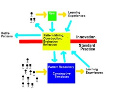

See also: [[blog-home | Home]]

David Jones, Teresa Lynch, A Model for the Design of Web-based Systems that supports Adoption, Appropriation, and Evolution, Proceedings of the 1st ICSE Workshop on Web Engineering, Murugesan, S. & Deshpande, Y. (eds), Los Angeles, pp 47-56

**Keywords:** Web Information Systems, Diffusion of Innovations, Systems Development, User-centered development, Patterns

## Abstract

Current methodologies for the development of Web-based information systems have a number of problems. This paper describes three of those problems: the lack of adoption of the resulting systems, little appropriation of the work of early innovators and the difficulty of ensuring the on-going evolution of systems in response to a changing context. This paper proposes an approach built on hypermedia templates constructed by the continual investigation and evaluation of practice for abstraction into design patterns (appropriation and evolution). Most importantly the approach has an emphasis in being adopter-based and focusing on the human, social, and interpersonal aspects of innovation diffusion (adoption).

## 1\. Introduction

Central Queensland University (CQU) is a multi-campus regional institution with four branch, three interstate, and several international campuses. Web-based information systems, particularly various forms of Web-based learning are being seen as a solution to many of the problems created by a complex and multi-mode course offering which is not being served well by existing approaches \[14\]. However, even with the obvious, and by now widely accepted advantages of Web-based learning, the actual use of Web-based learning by academics is not wide spread and fraught with difficulty. For example, of the 60 staff within the Faculty of Informatics and Communication at CQU only 5 staff are making significant use of Web-based learning. It appears that the main reasons for these problems are related to the the approaches used to design and implement Web-based learning and their mismatch with the requirements of the potential users.

This paper describes the rationale and development of a new approach to the design and implementation of Web-based learning intended to encourage the wide spread use of Web-based learning within the Faculty of Informatics and Communication at Central Queensland University. This development model, which is equally applicable to any form of Web-based information system, recognises the need and importance of using existing formalised procedures and protocols to guide development. However, it places additional emphasis on being adopter-based and concentrating on the needs of the individuals and the social system in which the final system will be used. As part of this emphasis the model recognises that this context is continually changing and that Web-based systems must continue to adapt and evolve to meet these changes. The final aspect of the model is that it recognises that there is valuable work being performed, especially in Web-based learning in a University environment, by lone-ranging early adopters (the 5 staff currently using Web-based learning) and seeks to appropriate that work into the standard practice of the organisation.

The paper begins by expanding further on how existing development methodologies tend to pay limited attention to the problems associated with appropriation, adoption, and evolution. It then moves on to briefly outline theories and other work which form the basis for the proposed model. This work includes diffusion theory \[22\], design patterns \[10\], and hypermedia templates \[4, 19\]. Finally, the paper provides a brief overview of the model currently under development at CQU to create Web-based information systems to support teaching and learning.

## 2\. The Problems

There are a number of problems facing developers implementing Web-based information systems, particularly those supporting Web-based learning. The proposed model is designed specifically to address three of these problems: appropriation, adoption, and evolution. This section describes each of these problems and how they influence the development of Web-based information systems.

### 2.1. Appropriation and reuse

Most of the initial applications of Web-based information systems, particularly in Web-based learning, are enacted by lone rangers, individual staff members who are energetic, early adopters of innovations \[28\]. With little organisational support, these innovative developments are not being appropriated into standard organisational practices \[28,17\]. The innovations provided by these lone rangers are a valuable organisational resource, particularly as a source of lessons about what works and what doesn't work. Existing approaches do little to provide methods to capture and reuse the knowledge and experience of these lone-ranging innovators in a way that it is usable by the majority of staff. Any approach that does aim to capture and reuse this resource should continue to allow the innovators to continue innovating while reducing the amount of reinvention and duplication.

Reuse is a strategic tool for reducing the cost and improving the quality of hypermedia design and development \[19\]. While some interest has been shown in reuse in hypermedia field most hypermedia systems are built from scratch \[23\]. Even though existing design approaches enable the first steps towards reuse \[11\] they are not effective in helping designers reuse existing hypermedia structures \[23\].

### 2.2. Developer-led implementation

A recent OASIG \[20\] study in the United Kingdom found that around 40% of information technology systems developments failed or were abandoned. Johnson \[13\] surveying 3,682 projects (involving change and information technology) in 365 companies found that

- 31% were canceled before completion.
- 53% had cost overruns and had impaired functionality.
- only 12% were on-time and on-budget.

As many as 75 percent of all large systems may be considered to be operating failures \[16\].

In many of these systems the problems appear to lie, not with the technology, but rather with the lack of attention paid to the needs of people who had to use the technology. The OASIG \[20\] report suggests that systems failed, because, amongst other reasons, most investments were technology led and users did not usually have any major influence on system development.

Software development methodologies have been developed to assist software developers build systems that meet their clients' needs. These methodologies are generally formalised procedures or protocols to guide development. Clearly, there are problems with software development methodologies considering so many systems fail. However, it has been suggested \[24\] that many developers currently do not even follow software development methodologies when developing software systems. They suggest that there is currently a 'misfit' between existing methodologies and the needs of developers. They believe that this is due to the fact that, in recent years, the types of systems that are developed has changed, from more technical systems, that were developed for a few specially trained users, to more user-focused systems, that are developed for users who may have limited computer skills. The OASIG study also reported that the methods appeared not to work, as they were too technically oriented. A recent survey undertaken by Fitzgerald \[9\] found that 60 percent of respondents were not using a development methodology, with only six percent reporting that they followed a methodology rigorously.

Many of the older, more established methodologies, have a developer-based focus. This approach assumes that a new product will automatically replace inferior products or systems \[27\]. Developers assume potential adopters will see the benefits just as they see them.

In contrast to the developer-based approach, the adopter-based approach focuses on the human, social, and interpersonal aspects of innovation diffusion \[27\]. Developers are interested in the individual who will ultimately implement the innovation in a practical setting as the primary force for change. The adopter-based theories reject the assumption that superior products will automatically be attractive to potential adopters. They 'seek to understand the social context in which the innovation will be used and the social function the innovation will serve' \[27\].

By not involving users in the process we are more likely to develop systems that users find difficult to use. As well, if we involve users in the process too late, after we have already decided that the system will be developed, we may produce systems that are not useful to the users. That is, if users are consulted only about the look and feel of the system and not about the nature or focus of the system then we may develop systems that are easy to use but which no one wants to use because they are not useful.

Involving users in the process presents its own set of problems. Not all users are suited to the task of involvement. Often the ideas are too alien for the user to cope with, some users have too narrow an outlook, and there can be communication problems between the developer and user. Rahardja \[21\] mentions problems with user involvement in Web site development when he says "If the users of the web site do not know what it can offer them or what can be expected from it, they cannot tell the designers what they will want to do with the system, let alone their expectation and desires". This problem of involving users in the development of software was also raised by the OASIG study \[20\]. The study identified concerns on the limited understanding and skills of users if information technology problems. However, they conclude that while there was a cost of involving users the cost of not involving them was greater.

### 2.3. Evolution

A significant effort of many developments is expended on developing an "ideal" or all-encompassing system. A system which meets all the current perceived needs of the potential users. Such developments expend a lot of effort and time with, in some cases, very little pay off because of the ever changing requirements of potential users. This "ideal system" approach may not always be the right approach given rapid changes in context and user requirements. This is especially true when considering the Web, an environment where change in both technology and user requirements is a standard part of life. That is, systems should have the ability to evolve.

Evolvable systems are systems that are being adapted and extended in many small ways by a large group of people. In contrast more traditional systems are not Evolvable. These systems are under the sole direction of a centralised design authority \[26\]. Such systems can be too strong and well designed to succeed outside of confines of the original narrow specifications. As the context changes these specifications become a burden preventing adaptability.

The development of the Internet, the world-wide web and a range of open source software including Perl, Linux and Apache are all examples of evolvable systems. This development approach works on the assumption that "Evolution is cleverer than you are" which Shirky \[26\] attributes to Leslie Orgel, an evolutionary biologist. This approach allows the design of systems to solve an immediate problem, with the ability to change and grow, to be implemented very quickly and to be quickly used and developed by a large and diverse group. The assumption is that this is a better approach to system development.

## 3\. Theories and related work

The problems in the previous section are not new or unique to the development of Web-based information systems. In the following section we describe theories from a number of fields which have served as the rationale for our proposed model.

### 3.1. Diffusion Theory

Rogers' \[22\] theory of diffusion provides underlying support for the links between the methods by which a software product is developed, the context, the characteristics of the product developed, and the eventual adoption or otherwise of the product. This theory argues that there are four main elements that play a part in the diffusion of an innovation:

1. The features of the innovation.
2. How information about the innovation is communicated.
3. Time.
4. The nature of the social system into which the innovation is being introduced.

#### 3.1.1. Features of the innovation

Rogers \[22\] identified five general attributes of innovations that influence whether the innovation would be adopted. It is important to understand that the following features of the innovation relate to how an individual perceives that innovation. Two individuals could perceive the features of the innovation differently. Furthermore, Moore and Benbasat \[18\] suggest it is the perceptions of using the innovation rather than the perceptions of the innovation itself that are of interest.

The characteristics of the innovation as perceived by individuals are:

- **Relative advantage.** The degree to which an innovation is perceived as better than the idea it supersedes. The degree of relative advantage may be measured in economic terms, but social-prestige factors, convenience, and satisfaction are also important components.
- **Compatibility.** The degree to which an innovation is perceived as being consistent with the existing values, past experiences, and needs of potential adopters. An idea that is incompatible with the values and norms of a social system will not be adopted as rapidly as an innovation that is compatible.
- **Complexity.** The degree to which an innovation is perceived as difficult to understand and use. Some innovations are readily understood by most members of a social system; others are more complicated and will be adopted more slowly. New ideas that are simpler to understand will be adopted more rapidly than innovations that require the adopter to develop new skills and understandings.
- **Trialability.** The degree to which an innovation may be experimented with on a limited basis. An innovation that is trialable represents less uncertainty to the individual who is considering it for adoption, as it is possible to learn by doing.
- **Observability.** The degree to which the results of an innovation are visible to others. The easier it is for individuals to see the results of an innovation, the more likely they are to adopt it.

#### 3.1.2. Communicating information about the innovation

Information about an innovation must be communicated from one individual to another. This communication can be via the mass media or via personal communication. While the mass media can reach more people, one-on-one communication is often more effective in changing attitudes towards an innovation. Most people evaluate an innovation by looking at the impact of that innovation on individuals that they know who have already adopted it.

#### 3.1.3. Social System

The social or communication structure affects the diffusion and adoption of innovations in a system. A social system is defined as 'a set of interrelated units that are engaged in joint problem-solving to accomplish a common goal' \[22, p. 23\]. The diffusion of an innovation through a social system (for example, a University) will be affected by the norms of the group. As well, the opinion of the leaders within that social system will affect adoption. The change agent (for Web-based learning this is often a technical or educational expert) also has an impact on whether the innovation is adopted. As well, what actually happens as a result of adoption of an innovation will also influence the adoption of that innovation.

#### 3.1.4. Time

Time influences the diffusion of innovations in three major ways

- **Innovation Decisions Process.** The innovation diffusion process has five stages \[22; p20\] knowledge, persuasion, decision, implementation and confirmation. Different activities and different communication channels are more effective at different stages in the innovation decision process.
- **Rate of Adoption.** The rate of adoption of an innovation is the length of time necessary for a certain percentage of members of a social system to adopt the innovation. For most innovations it is an S-shaped curve with some variation in the slope of the curve.
- **Adopter Categories.** The five categories (and relative percentage of the final population) into which potential adopters fall are innovators (2.5%), early adopters (13.5%), early majority (34%), late majority (34%) and laggards (16%). Research has identified numerous characteristics and survey instruments which can be used to predict an adopter category which suits a particular individual and how such an individual might react to a particular innovation.

#### 3.1.5. Applications of Diffusion Theory

Diffusion theory has been applied in a number of fields including information systems \[6\], instructional design \[27\] and in the development of Web-based learning systems \[12\].

The idea that features of the innovation itself will affect adoption has been explored and expanded upon in the information system literature. Two characteristics in particular, perceived ease-of-use and perceived usefulness of a software product, have been shown to affect use \[18\]. These two constructs arose from Davis' Technology Acceptance Model \[7\] and are closely related to Rogers' \[22\] perceived Relative Advantage and Complexity.

Perceived usefulness can be viewed as 'the degree to which an individual believes that using a particular system would enhance his or her job performance' \[6, p. 477\]. That is, it would take less time to perform a certain task or the output would be of a higher quality. Perceived ease-of-use can be viewed as 'the degree to which an individual believes that using a particular system would be free of physical and mental effort' \[6, p. 477\]. The perceived usefulness of an innovation was found to be 50% more influential than ease-of-use in determining usage \[6\].

The field of instructional design deals with the formalised development of learning materials and experience. This field, as with Information Systems and Web-based Information Systems, has a large number of development methodologies. Many of these methodologies are developer-based. In response to the problems associated with developer-based methodologies a number of adopter-based approaches and theories including Adopter-Based Instructional Development Theory \[2\] and Burkman's \[3\] theory of user-oriented instructional development (UOID).

Hansen, Deshpande and Murugesan \[12\] describe a project which is applying an adopter-based model for the adoption and diffusion of Web-based learning.

### 3.2 Patterns and Templates

The other model of interest is the use of design patterns to enable appropriation and evolution. Design patterns, which are a recent trend in software engineering \[10\], are adapted from urban planning and building architecture \[1\]. Design patterns offer an approach to documenting and supporting the reuse of design which is finding favor in hypermedia \[23, 19\]. While patterns in hypermedia appear to have been used predominantly for the reuse of design experience they are being adapted for a number of uses including teaching, analysis and project planning.

A pattern is a generic approach to solving a particular problem that can be tailored to specific cases. Properly used, they can save time and improve quality \[8\]. As Alexander \[1\] puts it: "Each pattern describes a problem which occurs over and over again in our environment, and then describes the core of the solution to that problem, in such a way that you can use this solution a million times over, without ever doing it the same way twice".

At a simple level, a pattern is a way to record the knowledge and experience of experts. A way of reusing best practice and taking into account the lessons others have already learned. The use of patterns provide a number of benefits including making it easier to reuse successful designs, make proven techniques more accessible to developers, enable choice between alternatives, and improve the documentation and maintenance of existing systems \[10\].

Hypermedia templates \[4\] aid the creation of hypermedia collections by simplifying the authoring task and aid authors in applying information design principles. This enables content experts to be responsible for placing information onto the Web which can aid in avoiding the bottleneck problem. The creation of templates is performed by designers familiar with good information design principles and practice.

Nanard, Nanard and Kahn \[19\] propose the combination of patterns and templates to enable and simplify the capture and reuse of design. Any general pattern or any document specific sub-structure used repeatedly is worth being implemented as a template allowing the capture of the corresponding design abstract \[19\].

The original intention of patterns was to solve problems in architecture and town planning. One of the problems it was intended to address was the tendency for architects to design for replacement rather than design for repair (evolution). The systematic application of patterns in a problem space is referred to as piecemeal growth. As the requirements change new patterns are applied in response to the changing requirements. Piecemeal growth enables a system to evolve.

## 4\. The Model

We propose a model for the development of Web-based information systems, particularly those in the development of Web-based learning, which draws heavily on the diffusion of innovations \[22\] and incorporates the use of patterns and constructive templates \[19\]. It is our belief that such a development model will provide three major benefits

1. **Develop systems which are more likely to be adopted.** This is achieved by a major emphasis on context, adopter led development approaches and theory from the diffusion of innovations.
2. **Enable the appropriation and reuse of prior experience.** Gained by a continual process of evaluating the work of innovators for potential abstraction and storage in a pattern repository and implementation as a constructive template.
3. **Enable the continued evolution of the system to meet changing needs.** Evolution is provided by the continued application of patterns in a form of piecemeal growth and emphasising design for repair rather than replacement.

This model emphasises the importance of the interrelationships between the developers of the system, the developed system, the potential adopters of the system and the contexts in which the system is developed and used. For this reason the findings and suggestions from diffusion theory is the foundation component of the model and informs the entire development process. Where ever possible development work is performed within the framework provided by diffusion theory. Possible examples of this include

- Strong consideration of how the potential users of all Web-based information systems perceive the characteristics of those systems and how that may influence adoption.
- The informed use of the opinion leaders of the social system in the development and especially in communication about the developed systems.

Additionally, the model focuses on the on-going examination and evaluation of practice, particularly that of lone-ranging innovators, for possible abstraction into patterns and implementation as templates. The on-going evaluation of new and existing practice, informed by the elements of diffusion theory, leads to the development of new patterns and templates and is intended to create a system which continues to grow and evolve to meet the changing context in which the Web-based information system is used.

Figure 1: The Proposed Model

Figure 1 provides an overview of how the model might be implemented and shows the divide which separates the current, lone-ranging innovators from the majority of staff. Normally the work of the lone-ranging innovators is not appropriated by the majority \[28\], it does not become part of standard practice. With this model the role of the development team is seen as evaluating the work of the innovators for best practice. This best practice is then abstracted out into a pattern which is in turn implemented as a template. As the use of Web-based learning becomes more widespread this evaluation process would expand to include all staff and students.

The identification and evaluation of best practice should be driven strongly by the findings of diffusion theory about the perceived characteristics of innovations and the likelihood of adoption. Additionally, following the principle of adopter-based development, individuals from both the majority and the innovator categories would be involved in this process. Drawing on the work from diffusion theory these individuals would typically be people who have been identified as opinion leaders.

The resulting patterns and templates would reside in a pattern repository which is made available to all users. This repository, and in particular the templates it contains would then be used by the users to construct Web-based information systems suitable for use in their teaching and learning. Obviously some assistance, whether in the form of training or additional development work, may be required. However, again following the idea of adopter-based development models, where possible, the end users would have as much control as possible.

Evolution is attained by the continual application of these patterns but also by the continual reflection and modification of the patterns and constructive templates by the development team.

This model is not a replacement for the wide variety of formal development methods \[11, 5, 25\] discussed in the literature associated with Web Engineering and Hypertext. Those methods are still considered a necessity and would aid in the development of the constructive templates. The proposed model is intended to compliment these existing approaches to help address the problems of adoption, evolution and appropriation.

## 5\. Current work

The model proposed in this paper is in the early stages of implementation at CQU as part of the Wizard project. The first working prototype of the Wizard will be in operation by early July 1999. The Wizard project builds upon Webfuse \[15\] a template based Web authoring package produced at CQU. It will add to Webfuse a simple "wizard-like" interface and additional functionality designed as a result of adopter-based development. This interface will provide access to a repository of patterns and templates which have been abstracted from pattern mining existing practice within CQU and from the literature. Most work to date has focused on communication and discussion with potential adopters, both staff and students. This interaction is taking the form of interviews, focus groups and surveys.

## 6\. Conclusions

There are a number of problems with the development methodologies currently being used to develop Web-based information systems. Those problems include a lack of consideration given to the needs of eventual adopters leading to problems of disuse, an ignorance of the experience and knowledge gained by early innovators already working in the space, and an emphasis on design for replacement rather than continual evolution of systems in response to changes in the environment. It is proposed that a development model which draws on the findings and resources of diffusion theory combined with the continual evaluation, construction and application of design patterns and templates will address these problems. Such a model should allow the design and construction of Web-based information systems which meet the requirements of users, are adopted by those users and continue to evolve to meet their changing requirements.

## 7\. References

1. C. Alexander, S. Ishikawa, and M. Silverstein, _A Pattern Language: Towns, Buildings, Construction_, Oxford University Press, 1977.
2. D. Andrews, and L. Goodson, "A Comparative Analysis of Models of Instructional Design," _Instructional Technology: Past, Present, and Future_, Libraries Unlimited, Englewood, 1991, pp. 102-116.
3. E. Burkman, "Factors Affecting Utilization," _Instructional Technology Foundations_, Hillsdale, NJ: Lawrence Erlbaum, 1987.

5. K.S. Catlin, and L.N. Garret, "Hypermedia Templates: An Authors Tool," _Proceedings of Hypertext'91_, ACM, 1991, pp. 147-160.
6. F. Coda, C. Ghezzi, G. Vigna, and F. Garzotto, "Towards a Software Engineering Approach to Web Site Development," _Proceedings of the 9th International Workshop on Software Specification & Design_, Isobe, Japan, 1998.

8. F.D. Davis, "User acceptance of information technology: system characteristics, user perceptions and behavioral impacts," _International Journal Man-Machine Studies_, Vol. 38, 1993, pp_._ 475-487.
9. F.D. Davis, R.P. Bagozzi, and P.R. Warshaw, "User acceptance of computer technology: A comparison of two theoretical models," _Management Science_, Vol 35, No. 8, 1989, pp 982-1003.

11. E.B. Fernandez, "Building systems using analysis patterns," _Proceedings of the third international workshop on Software Architecture_, 1998, pp 37-40.
12. B. Fitzgerald, "An empirical investigation into the adoption of systems development methodologies," _Information Management_, Vol. 34, No. 6, 1998, pp 317-328.
13. E. Gamma, R. Help, R. Johnson, and J. Vlissides, _Design Patterns: Elements of Reusable Object-Oriented Software_, Addison-Wesley, 1994.

15. F. Garzotto, P. Paolini, and D. Schwabe, "HDM - a model-based approach to hypertext application design," _ACM Transactions on Information Systems_, Vol. 11, No. 1, 1993, pp. 1-26.
16. S. Hansen, Y. Deshpande, S. Murugesan, "Adoption of Web Delivery by Staff in Education Institutions. Issues, Strategems and a Pilot Study," _Proceedings of Ausweb'99_, 1999, pp 379-395.
17. J. Johnson, "Chaos: The dollar drain of IT project failures," _Application Development Trends_, January, 1995, pp 41-47.

19. D. Jones, "Solving some Problems of University Education: A Case Study," _Proceedings of AusWeb'96_, 1996, pp 243-252.
20. D. Jones, "Webfuse: An Integrated and Eclectic Web Authoring tool," to appear in the _Proceedings of Ed-Media'99_, June, 1999.
21. K.C. Laudon, and J.P. Laudon. _Management Information Systems_. New Jersey: Prentice-Hall, 1996.

23. M. Mendes, and W. Hall, "Hyper-authoring for education: a qualitative evaluation," _Computers and Education,_ Vol. 32, 1999, pp 51-64.
24. G.C. Moore, and I. Benbasat, "Development of an instrument to measure the perceptions of adopting an information technology innovation," _Information Systems Research_, Vol. 2, No. 3, 1991, pp. 192-221.
25. M. Nanard, J. Nanard, and P. Kahn, "Pushing reuse in hypermedia design: golden rules, design patterns and constructive templates," _Proceedings of the 9th ACM Conference on Hypertext and Hypermedia_, ACM Press, 1998, pp 11-20.

27. OASIG, _The performance of information technology and the role of human and organizational factors_, University of Sheffield, 1996.
28. A. Rahardja, "Designing Interactivity: Who are the Users and What are the Techniques," _Proceedings of Ausweb'99_, 1999, pp. 107-118.
29. E.M. Rogers, _Diffusion of Innovations_, (4th ed.). New York: The Free Press, 1995.

31. G. Rossi, D. Schwabe, and A. Garrido, "Design reuse in hypermedia applications development," _Proceedings of the 8th ACM conference on Hypertext_, ACM Press, 1997, pp. 57-66.
32. N.L. Russo, and E. Stolterman, E, "Uncovering the assumptions behind information systems methodologies: Implications for research and practice," Paper presented at the _6th European Conference on Information Systems_, Aix-en-provence, France, 1998.

34. D. Schwabe, G. Rossi, and S.D.J. Barbosa, "Systematic Hypermedia Application Design with 00HDM," _Proceedings of Hypertext '96_, ACM Press, 1996, pp. 116-128.
35. C. Shirky, "And nothing to watch: bad protocols, good users: in praise of evolvable systems," _NetWorker: The Craft of Network Computing_, Vol 2, No. 3, 1998, pp. 48-ff
36. D.W. Surry, and J.D. Farquhar, "Diffusion theory and instructional technology," _Journal of Instructional Science and Technology_, Vol 2, No. 1, 1997.

38. P. Taylor, "Institutional Change in Uncertain Times: lone ranging is not enough," _Studies in Higher Education_. Vol. 23, No. 3, 1998, pp. 269-278.