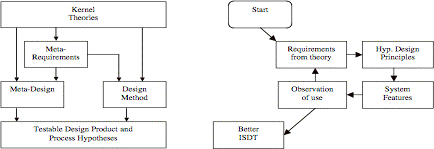

This version of the ISDT is over 6 years old and represents some early thinking. [This 2006 paper](/blog2/publications/the-formulation-of-an-isdt-for-e-learning/) offers a slightly updated and different perspective on the ISDT. The most up to date and complete version of the ISDT can be found in my [thesis](/blog2/research/phd-thesis/). Look at chapter 5 and the section describing the design theory, ignore most of the early guff in chapter 5.

David Jones, Shirley Gregor, An Information Systems Design Theory for e-Learning, Proceedings of ACIS’2004, Hobart -- Nominated for best paper

## Abstract

This paper presents an information systems design theory (ISDT) intended to guide the design, development and maintenance of an information system to support e-learning. The ISDT draws on a number of kernel theories to specify an information system that supports the level of variety and change inherent in the practice of e-learning within a University context. The ISDT has been formulated over an eight-year period where the resulting instantiation has provided thousands of course sites and associated services used by hundreds of staff and thousands of students.

**Keywords** e-learning, Information Systems Design Theory, Design Science, Systems Development

## Introduction

In American institutions of higher education during 2002 11% of students took an online course, 97% of public institutions offered at least one online or blended course, 49% offered an online degree program, and 67% considering e-learning a critical long-term strategy for their institution (Allen and Seaman, 2003). The questions about e-learning have become "how", "why" and "with what outcomes" questions (Hitt and Hartman, 2002). There is evidence that existing e-learning systems are not particularly innovative, demonstrate limited quality, have limited integration, tend to limit future possibilities and have a high likelihood of failure (Alexander, 2001, Paulsen, 2002).

Theories from education, psychology and related fields have been used to provide guidance for the design of certain features, aspects and applications of e-learning. However, there has been limited theory-based guidance for the design and support of the underlying information systems infrastructure. Theory is needed because the design and implementation of such systems is difficult: they are complex systems that incorporate a variety of organisational, administrative, instructional and technological components (Avgeriou et al., 2003).

Use of the Information Systems Design Theory (ISDT) described here leads to an information system that offers a greater variety of features, allows greater flexibility in the choice of applications, greater integration within the organization and encourages greater staff and student usage than alternate approaches. Unlike much design research, where constructed artefacts are rarely full-grown information systems that are used in practice (Hevner et al., 2004), the ISDT presented here has been confirmed through use of an instantiation of the ISDT, the Webfuse system, by hundreds of staff and thousands of students. An earlier paper (Jones et al., 2003c) provided an introduction to an early version of the ISDT for an audience with an educational background. This paper adds to previous work by describing the full ISDT in detail.

The paper begins with an overview of design research, information systems design theories (ISDTs) and the research methodology used in this work. The paper then provides an overview of the formulated ISDT by describing each of its components. Due to space limitations an in-depth description of the ISDT is not possible. Statistics and experience gained through system usage are used to investigate the ISDTs design hypotheses. The paper concludes with some conclusions and suggestions for future work.

## Research Approach

The main aim of research in information systems (IS) is the study of the effective design, delivery, use and impact of IT in organisations and society (Keen, 1987). This work is an example of design research within the information systems field. Design research aims to make use of existing knowledge and theory to construct artefacts that improve some situation (Simon, 1996). In design research it is still important for a theory to explain a phenomenon, but it is less important than the instrumental use of a theory to build a system that is efficient and effective in the eyes of the potential users of the information system (Lee, 2000).

Design research within the information systems field has a long history but is often not highly visible (Burstein and Gregor, 1999). In recent years there has been an increase in interest with two articles (Markus et al., 2002, Hevner et al., 2004) in MISQ, the release of ISWorld's design research web site (Vaishnavi and Kuechleer, 2004) and the creation of a design science department within the Communications of the Association for Information Systems (Hevner and March, 2004). It has been suggested that design and the more traditional "natural" science are two complementary phases of research within the information systems field (Hevner et al., 2004).

One example of design research within information systems is the formulation of Information Systems Design Theories (ISDTs). An information systems design theory is an example of theory for design and action; of how to do something (Gregor, 2002). ISDTs, first explicated by Walls, Widmeyer & El Sawy (1992), are prescriptive theories developed to provide solutions to specialized classes of IS design problems (Markus et al., 2002). For practitioners ISDTs are beneficial because they increase development reliability and the likelihood of success by providing principles, derived from kernel theories, that limit the range of system features and development activities to a more manageable set (Markus et al., 2002). As a theory the principles generated as part of an ISDT are also open to empirical testing and thus can form a basis for further research.

The left-hand side of Figure 1 is a representation of the components of an ISDT as identified by Walls et al (1992). ISDTs are an integrated prescription consisting of a particular class of user requirements (meta-requirements), a type of system solution with distinctive features (meta-design) and a set of effective development practices (design method) (Markus et al., 2002). Each component of an ISDT can be informed by kernel theories, either academic or practitioner theory-in-use (Sarker and Lee, 2002) that enable the formulation of empirically testable predictions about the outcomes of the design theory (Markus et al., 2002). While there are questions about whether or not there are more complete representations for ISDTs (Gregor and Jones, 2003) this work will be based on the representation described by Walls et al (1992) and used by Markus et al (2002).

Figure 1: Components of an ISDT (Walls et al, 1992) and an iterative process for developing an ISDT (Markus et al., 2002)

### Research Methodology

The literature on design research describes a number of research methodologies (Nunamaker et al., 1990-1991, March and Smith, 1995, Markus et al., 2002). The approach used in this work approximates best with the iterative, action- research-like process described by Markus et al (2002) and shown in the right-hand side of Figure 1. In this process theory is used to generate design principles used to generate an information system that is then put to use. Observation of use, possibly with some review of the informing theory, informs possible revision of the underlying principles and consequently the information system. Subsequent iteration around the cycle seeks to further improve the ISDT.

The process for this ISDT has been underway since mid-1996 with the initial design and development of the Webfuse system (Jones and Buchanan, 1996, Jones, 1999). Since 1996, and thanks to an organisational restructure, this system has been used to support e-learning for two separate academic units at Central Queensland University (CQU). Since 1998 the system has supported e-learning within the Faculty of Informatics and Communication (Infocom) that has a diverse discipline base including information technology, information systems, mathematics, multimedia, journalism, communications and cultural studies. Since 1996 there have been three identifiable research and development cycles each drawing on a different set of kernel theories to address specific shortcomings. Table 1 provides a summary of the three cycles.

| Period | Title | Description |
| --- | --- | --- |
| 1996- | Hypermedia templates (Jones and Buchanan, 1996, Jones, 1999) | The generation of requirements and use of hypermedia templates to fulfil them. Produced a working system that received limited use.   |
| 1999- | Scaffolding and Diffusion (Jones and Lynch, 1999, Jones et al., 2003b) | Increase use of the system by modifying the development and support processes with insights from diffusion theory, design patterns and pattern mining. |
| 2000- | Emergent development (Jones, 2000, Jones et al., 2003c) | Increase the agility of the system to change to encompass features from emergent and agile development methodologies. Use design patterns to increase flexibility of the system architecture. |

## The Information Systems Design Theory

Drawing on the components of an ISDT shown in Figure 1 each of the following sections provides a high level description of the formulated ISDT.

### Kernel Theories

Kernel theories provide the foundation knowledge on which other aspects of the ISDT are built. Table 2 provides a summary of the kernel theories used to inform the components of this ISDT. Further explanation of the role played by each kernel theory is provided in subsequent sections.

| ISDT Component | Kernel Theories |
| --- | --- |
| Meta-requirements |   Work system framework (Alter, 2002); e-learning literature   |
| Meta-design |   Hypermedia templates (Catlin et al., 1991, Nanard et al., 1998), Software wrappers, (Bass et al., 1998), COTS (Braun, 1999), Enterprise Integration (Hohpe and Woolf, 2003), Design patterns (Fowler, 2003)   |
| Design method |   Emergent development (Truex et al., 1999), Lightweight methodologies (Highsmith and Cockburn, 2001), Diffusion theory (Rogers, 1995)   |

### Meta-requirements

For the purposes of this work e-learning is defined as the use of Information and Communication Technologies (ICTs) to enable and enhance the teaching and learning process within institutions of higher education. This definition recognises that teaching and learning requires administrative support and, furthermore, that contemporary learning environments should integrate academic and administrative support services directly into the students' environment (Segrave and Holt, 2003). Consequently the definition of e-learning requirements is expanded to include support for any and all tasks required to encourage efficient and effective teaching and learning.

The formulation of the initial state into an effective representation is crucial to finding an effective design solution (Weber, 2003). Representation has a profound impact on design work (Hevner et al., 2004) particularly on the way in which tasks and problems are conceived. The work system framework (Alter, 2002) was used to develop a conceptualisation of the initial state facing an existing University adopting e-learning (Jones, 2004). The major finding of this conceptualisation is that great diversity - through the huge variety of disciplines, pedagogical beliefs, requirements and other factors - and continual change - caused mostly by the observation that e-learning is still unfolding and no-one really knows its future form (Zemsky and Massy, 2004) - are inherent requirements that any information supporting e-learning should address.

The meta-requirements for this ISDT have been divided into two categories common in the software engineering literature (Sommerville, 2001) : non-functional and functional. Non-functional requirements are constraints on and qualities of the services offered by the system. Functional requirements are statements of the services the system should provide. Table 3 summarises the functional and non-functional meta-requirements developed as part of this ISDT.

| Non-functional requirements |  | Functional requirements |
| --- | --- | --- |
|   Variety - handle differences in technology, pedagogy, approaches, beliefs, strategies etc.   |  |   Information distribution - distribution, value-added conversion and creation of information by all parties   |
|   Change - handle continual change in all aspects of the information system   |  |   Communication - support for one-to-one, one-to-many, many-to-one and many-to-many communication and collaboration   |
|   Integration - be able to integrate diverse, information systems and practices   |  |   Assessment - methods for evaluating the progress and experience of students   |
|   Personalization/customisation - enable, where possible, all users to modify, adapt or opt out of the system based on their preferences   |    |   Management/Administration - the clerical, administrative and support tasks necessary to ensure that e-learning operates efficiently   |
|   Be attractive to use - people should wish to use the system rather than it be compulsory   |  |   Design - the process of analysing, planning and implementing specific approaches to e-learning   |

A number of the non-functional criteria (change, variety and integration) were recognised in the original designs (Jones and Buchanan, 1996) . Others were added in later iterations in response to experience and further study of the e-learning literature.

The task related requirements build on four basic tasks required for e-learning (McCormack and Jones, 1997, Avgeriou et al., 2003). Experience has shown that support for an additional task, design, is required for a successful e-learning system. The need for design support is a major issue within e-learning due to the growing problem of poor design of instructional materials within e-learning (Frizell and Hubscher, 2002).

In order to use information technology to improve learning processes, the pedagogical assumptions underlying the design of information technology for educational purposes must be understood (Leidner and Jarvenpaa, 1995). It is not uncommon for e-learning information systems to be designed to encapsulate assumptions taken from a specific learning theory. And yet, as stated above, the requirements for this ISDT make no explicit mention of specific learning theories.

Support for any one learning theory is seen as breaking each of the non-functional requirements. There is a large variety of possible learning theories with different theories being more appropriate depending on the context and individuals involved (Leidner and Jarvenpaa, 1995). This ISDT suggests that an IS for e-learning should offer support for this variety, enable integration amongst different theories, enable individual academics to adopt learning theories they deem most suitable and handle changes in preferred learning theory as experience and knowledge expand.

### Meta-design

The meta-design component of this ISDT encapsulates a range of features or design principles intended to fulfil both the functional and non-functional requirements identified above. Tables 4 (non-functional requirements) and 5 (functional requirements) list the requirements (left-hand column) and the accompanying design principles (right-hand column).

| Design principles | Non-functional Requirements |
| --- | --- |
|   Hypermedia templates (Nanard et al., 1998, Catlin et al., 1991) as software wrappers for COTS software (Braun, 1999)   | Variety, change, integration |
| Platform independence | variety, change, integration |
|   OO Design patterns (Gamma et al., 1995, Fowler, 2003, Hohpe and Woolf, 2003)   | variety, change, integration, customisation |
| Open source software | Change, integration |
| Scripting language (Ousterhoust, 1998) | Change, variety, integration |

Table 4: ISDT design principles to non-functional requirements

A key feature from the initial formulation of this ISDT was the recognition that reliance on any single organization, be it a software vendor or a local development team, to produce all the required services and tools for an e-learning information system would result in a number of limitations (Jones and Buchanan, 1996, Jones, 1999). To avoid these problems a major emphasis has been on developing an infrastructure that can integrate the widest range of existing and future e-learning tools and yet still provide a consistent user interface.

This flexible infrastructure was achieved through the use of hypermedia templates (Catlin et al., 1991, Nanard et al., 1998) as the primary system abstraction. The system's templates were designed to act as software wrappers (Bass et al., 1998) and provide a consistent abstraction around external software. This enables development to integrate the widest possible range of commercial off-the-shelf (COTS) products while providing a consistent user and system interface. This approach combines the original benefits of hypermedia templates - simplified authoring process, increased reuse, and reduced costs (Catlin et al., 1991, Nanard et al., 1998) - with the benefits of the COTS approach - shorter development schedules and reduced development, maintenance, training and infrastructure costs (Braun, 1999).

| Design principles/features | Functional requirements |
| --- | --- |
|   Authentication, Access control, File transfer, Versioning, Backups/restores, Usage tracking, Integration with organisational systems, Wiki   | Information distribution |
|   Discussion forums/lists, Chat rooms, Blogs, RSS, Wiki   | Communication |
|   Online quizzes, Online assignment submission/management, Assessment database, Peer review, Group management, Course barometers   | Assessment |
|   External integration, Temporary enrolment, Results processing, Review of grade processing, Teaching responsibilities database, "Flexible" mirrors, Student impersonation, Timetable   | Administration |
|   Minimum course sites, Site skeletons, Customizable appearance   | Design |

Table 5: ISDT design principles to functional requirements

To further enhance the flexibility of this approach templates were implemented through the use of a scripting language (Perl), with heavy use of object-oriented design patterns (Gamma et al., 1995) and wrapped around predominantly open source software. The use of open source software provides access to source code and removes the influence of a commercial vendor (Gerlich, 1998) at the cost of requiring increased technical skills. Scripting languages allow very rapid development of applications via the gluing together of existing applications, 5 to 10 times faster than through the use of traditional systems programming languages (Ousterhoust, 1998).

Table 5 provides a brief list of some of the specific task related features provided by the system during its 8-year history. These features are not the complete set of required features for all e-learning information systems. As will be shown in the following design method section this ISDT emphasizes the emergent development of specific features as part of a process of continual analysis and redesign. This results in a feature list that is tightly coupled with the requirements and nature of the particular, development context. Application of this ISDT within a different context would likely result in a different list of features.

### Design method

Table 6 provides an overview of the development practices (right-hand column) for this ISDT and the linkage with non-functional requirements (left-hand column) outlined above. These development practices reject or place less emphasis on most of the assumptions of traditional software development practices and instead adopt those of emergent (Truex et al., 1999) and agile (Highsmith and Cockburn, 2001) development methodologies. These practices are based on the assumption that there are a group of system developers who continually strive to achieve alignment between the organization and its information systems (duPlooy, 2003). Within this ISDT this characteristic means that the developers are embedded within the Faculty and are actively drawing on their observation of life within the Faculty to identify what new developments are required. Greater detail of these development practices and how they were applied is provided elsewhere (Jones, 2000, Jones et al., 2003c).

The ISDT recognises that the commitment and motivation of staff members are a critical success factor in the implementation of e-learning and that many staff (e.g. academics, instructional designers and managers) have considerable autonomy about how they perform tasks and often can and do resist the imposition of new technology and changes to routine (Jones et al., 2003a). To address this problem the ISDT draws upon diffusion theory (Rogers, 1995) to provide approaches to evaluate and design potential new features (Jones and Lynch, 1999, Jones et al., 2003b). The emphasis provided by diffusion theory is to concentrate on new or improved features that are the most attractive, on a practical level, to potential users of the information system.

| Requirement | Practice |
| --- | --- |
| Variety |   Where possible allow staff the choice to work outside the system.   Liase closely with innovative staff to implement and borrow new ideas.   Emphasize production of tools rather than rules.   |
| Change |   Maintain a close relationship between users and developers.   Features of agile and emergent development methodologies.   Read and contribute to the e-Learning and technology literature.   |
| Integration |   Make use of but don't rely on external systems.   Maintain relationships (often unofficial) with other parts of the organization.   Where possible adopt standards.   Integrate with and improve existing processes rather than require change.   |
| Customisation |   Allow staff to add and remove services to default course sites.   Structure, content and appearance of default course sites can be modified for single courses or groups of courses   Staff can choose to work outside the system and receive some support.   |
| Attractive to use |   Automatically produce default course sites for all courses.   Automate as many tasks as necessary.   Continuous evaluation of use and literature in search for new services.   New features choice driven by diffusion theory.   |

### Hypotheses

Drawing on principles from the kernel theories of this ISDT it is possible to pose a range of hypotheses that are open to empirical testing. Table 7 provides an overview of the testable design product and process hypotheses for this ISDT and an indication of which kernel theories the hypotheses are drawn from.

| Kernel Theory | Hypotheses |
| --- | --- |
| Hypermedia templates |   It is possible to construct an IS for e-learning using hypermedia templates as the main system abstraction.   |
|   Software wrappers, COTS, emergent development, design patterns, open source software   |   Use of this ISDT will produce an IS which is flexible, open and customisable.   |
|   Emergent/Agile development   |   Overtime the IS produced from this ISDT will become customized to the needs and requirements of the particular organization and consequently provide a possible source of strategic advantage.   |
| Diffusion theory |   A system built using this ISDT will be acceptable to users as demonstrated by regular and increasing use.   |

It is suggested that these hypotheses are important for a range of reasons. A major reason is that many current e-learning systems have significant problems including not being particularly innovative, demonstrating limited quality, having limited integration, tending to limit future possibilities and having a high likelihood of failure (Alexander, 2001, Paulsen, 2002). The majority of institutions have changed e-learning systems, plan to change systems or have operated additional systems (Paulsen, 2003). Teaching and learning are personalised sets of processes and any attempt at standardisation is likely to be radical, painful and problematic (Morgan, 2003). There is no "out of the box" solution; every "next-generation CMS" must evolve to meet the needs of the specific institution (Initiative, 2004). An ISDT which is flexible, customisable to individual and institutional requirements and encourages adoption can help aid these problems.

## Results

Each of the following sub-sections equate to one of the hypotheses described in Table 7 and seeks to demonstrate how the hypotheses have been empirically tested during the use and support of the Webfuse system.

### It can be constructed

Webfuse was designed and initially built in late 1996 (Jones and Buchanan, 1996) based around the hypermedia template abstraction. Since that time it has been described in the literature (Jones, 1999, Jones et al., 2003c), used by thousands of staff and students and undergone continual development. Webfuse has provided a broad range of features including, but not limited to, those described in Table 5. Table 8 provides additional detail about the usage of Webfuse.

### More flexible, open and customisable

Over eight years of use this system has been required to respond to a range of technical, organisational and social changes. Technically the system has changed significantly, for example, the use of three different database engines, use of four different discussion forums, different versions of the Perl language, and supporting changes in HTML standards from HTMLv2 through to XHTML. Organisationally the system has handled adoption of an ERP, various changes in institutional authentication practices, and organisational restructures. The system has also allowed the adoption of unique applications from the e-learning literature (e.g. Jones, 2002) and on-going evolutionary development of most services (Jones and Behrens, 2003, Jones et al., 2003c).

### Local customisation

Emergent development with selection of new development being driven by an emphasis on diffusion theory means that many of the features of this system are not present in commercial or open-source Course Management Systems and vice versa. The features of the system that are unique or existed long before they became available in commercial systems include, but are not limited to: a multi-campus timetable generator, Informal Review of Grade processing, plagiarism detection (programming code and essays), web-based access to institutional student records, course barometers, course groups facility, support for blogs, a results processing system, XML-RSS based course updates, online assignment submission and management, integration with multiple teaching responsibilities databases and mailing list mirrors. Many of these features were designed to fill the gaps between existing organisational systems and staff requirements. Some of these systems are described in more detail elsewhere (Jones, 2003, Jones, 2002, Jones and Behrens, 2003).

### Acceptable to uses

Table 8 draws on a range of usage statistics for the period 1998 through to June 30, 2004 to demonstrate the increasing acceptance of Webfuse amongst both staff and students. To usefully compare usage from all years, including 2004, the main figures shown in Table 8 are for the first half of each year. The figures for the entire year, where available, are shown in brackets.

|  | 1998 | 1999 | 2000 | 2001 | 2002 | 2003 | 2004 |
| --- | --- | --- | --- | --- | --- | --- | --- |
| Course Sites |  |  |  |  |  |  |  |
| \# of content requests per Infocom student |   (91)   |   (156)   |   (195)   |   (385)   |   (341)   |   (310)   | 289 |
| \# staff editing course sites |   (48)   |   (45)   |   (31)   |   (99)   |   (118)   |   (117)   | 148 |
| Student Portal |  |  |  |  |  |
| % of total Infocom students using the portal |   |   |   15.3%   (14.4%)   |   22.9%   (26.5%)   |   50.8%   (59.4%)   |   68.4%   (68.5%)   |   86.4%   |
| \# of portal requests per Infocom student |   |   |   1.4   (1.6)   |   4.5   (6.7)   |   9.1   (12.8)   |   16.4   (27.8)   | 23 |
| Staff Portal |  |  |  |  |  |
|   |   |   |   |   |   (357)   |   (737)   | 460 |
|   |   |   |   |    |   (24202)   |   (118351)   | 78298 |

**\*** January 1 to June 30, 2004

Since 1998 the number of students enrolled in courses with the Faculty of Informatics and Communication (Infocom) has grown from 6884 through 10739 in 2002 to an estimated 8190 in 2004. In order to account for this variance most of the figures in Table 8 are given as a percentage of total Infocom student numbers or as a ratio of requests per Infocom student. This has not been done for staff as there is no simple method for calculating the total number of staff working for Infocom at any particular time.

While some areas of the Infocom course websites are restricted to staff and students (e.g. mailing list mirrors, copyrighted material and assessment solutions) most areas are, by default, available to the public. This makes it difficult to identify exact numbers of staff and students using the course websites. Consequently Table 8 shows the number of "content requests" per Infocom student. A "content request" is a request to retrieve a file that contains course content. Images, CSS files and other files that form part of page design are excluded from this calculation. The total number of these requests has grown over 300% between the first half of 1998 and the first half of 2004.

Access to edit a course website page and access to the student and staff portals are examples of services that do require users to login. This makes it possible to identify exact numbers of people using these services. The student portal provides access to services including online assignment submission, timetable generation, and details about enrolled courses. As shown in Table 8 use of the student portal has grown from 15.3% of all ACME Faculty students in the first half of 2000 to 86.4% of all ACME Faculty students in the first half of 2004.

The staff portal provides Infocom staff with web-based access to student records data, course details and links to services such as online assignment management, results uploading and a grade review process. After a request in 2003 a cut down version of the staff portal was made available to non-Infocom staff. In the first half of 2004, 58% of the requests to the staff portal were from staff outside of the Infocom Faculty. The staff portal service was so attractive that it overcame traditional intra-organisational boundaries.

From its initial formation through to 2004 almost all e-learning within Infocom has been enabled using Webfuse. Starting around 2000 CQU did implement an institutional course management system, WebCT that was used by non-Infocom staff. In the early days of this system a small number of Infocom courses did experiment with WebCT but all returned to Webfuse after one offering with WebCT. Towards the end of 2003 CQU migrated to Blackboard as its institutional system. At this time there were 141 course websites within WebCT that were being migrated to Blackboard. In 2003 Infocom had 236 course websites online using Webfuse.

## Conclusions and Future Work

This paper has presented an Information Systems Design Theory (ISDT) for an information system to support e-learning within a University context. This design theory has been developed and empirically tested through the use and on-going evaluation of a single instantiation of the ISDT. It has been shown that this instantiation is flexible, customisable and encourages a significant level of adoption.

A further test of the ISDT would be to compare in more detail a system built using this ISDT with a system that incorporates, perhaps implicitly, some alternate theory. Such a comparison is beyond the scope of the present paper. It is interesting, however, to note that the Webfuse system, incorporating the ISDT, has much greater usage than an alternate system, which is also available. Without further analyses, however, it cannot be shown that the difference is due to the design theory alone: for example, one system may get more support than another. The difficulty of performing such comparisons and drawing firm conclusions highlights one of the difficulties in evaluating design theories. Instantiations are implemented in organizational contexts of great complexity, where many factors can affect the success or otherwise of a system. Further case studies and use of the design principles advocated here, however, can add to the evidence for their worth.

There are additional factors that could be investigated that are also beyond the scope of the present paper. It is argued that the ISDT presented here leads to systems that support variety, cope with change, allow for personalization and customization and are attractive to users. No claims have been made about other attributes of a system that are thought desirable, such as low initial and on-going cost, lack of dependence on specialized technical staff, integration with other systems and so on. Further work could also examine these factors.

## References

Alexander, S. (2001) E-learning developments and experiences. _Education and Training,_ 43**,** 240-248.

Allen, I. E. & Seaman, J. (2003) Sizing the opportunity: The quality and extent of online education in the United States, 2002 and 2003. Needham, MA, The Sloan Consortium.

Alter, S. (2002) The work system method for understanding information systems and information system research. _Communications of the AIS,_ 9**,** 90-104.

Avgeriou, P., Papasalouros, A., Retalis, S. & Skordalakis, M. (2003) Towards a Pattern Language for Learning Management Systems. _Educational Technology & Society,_ normal'> 6**,** 11-24.

Bass, L., Clements, P. & Kazman, R. (1998) _Software Architecture in Practice,_ Boston, Addison-Wesley.

Braun, C. L. (1999) A lifecycle process for the effective reuse of commercial off-the-shelf (COTS) software. _1999 Symposium on Software Reusability._ Los Angeles, ACM.

Burstein, F. & Gregor, S. (1999) The Systems Development or Engineering Approach to Research in Information Systems: An Action Research Perspective. _ACIS._

Catlin, K., Garret, L. N. & Launhardt, J. (1991) Hypermedia Templates: An Author's Tool. _Proceedings of Hypertext'91._ ACM.

duPlooy, N. F. (2003) Information systems as social systems. IN CANO, J. (Ed.) _Critical Reflections on Information Systems: A Systematic Approach._ Hershey, IDEA Group Inc.

Fowler, M. (2003) _Patterns of Enterprise Architecture,_ Boston, Addison-Wesley.

Frizell, S. & Hubscher, R. (2002) Supporting the Application of Design Patterns in Web-Course Design. _EdMedia'2003._ Denver, AACE.

Gamma, E., Helm, R., Johnson, R. & Vlissides, J. (1995) _Design Patterns: Elements of Reusable Object-Oriented Software,_ Reading, Massachusetts, Addison-Wesley.

Gerlich, R. (1998) Lessons Learned by Use of (C)OTS. _1998 Data Systems in Aerospace._ Athens, Greece.

Gregor, S. (2002) Design Theory in Information Systems. _Australian Journal of Information Systems_**,** 14-22.

Gregor, S. & Jones, D. (2003) The Formulation of Design Theories for Information Systems. _ISD'03 Twelfth International Conference on Information Systems Development._ normal'>Melbourne.

Hevner, A. & March, S. (2004) Editorial Statement: Information Technology and Systems (ITS) Department. _Communications of the AIS,_ 13.

Hevner, A., March, S., Park, J. & Ram, S. (2004) Design science in information systems research. _MIS Quarterly,_ 28**,** 75-105.

Highsmith, J. & Cockburn, A. (2001) Agile software development: Business of innovation. _IEEE Computer,_ 34**,** 120-122.

Hitt, J. & Hartman, J. (2002) Distributed learning: New challenges and opportunities for institutional leadership. Washington, American Council on Education.

Hohpe, G. & Woolf, B. (2003) _Enterprise Integration Patterns: Designing, Building and Deploying Messaging Solutions,_ Boston, Addison-Wesley.

Initiative, N. L. I. (2004) 2004 NLII Annual Review. Washington DC, Educase.

Jones, D. (1999) Webfuse: An integrated, eclectic web authoring tool. IN BETTY COLLIS, R. O. (Ed.) _Proceedings of EdMedia'99, World Conference on Educational Multimedia, Hypermedia & Telecommunications._ Seattle, Association for the Advancement of Computing in Education.

Jones, D. (2000) Emergent development and the virtual university. _Learning'2000._ Roanoke, Virginia.

Jones, D. (2002) Student feedback, anonymity, observable change and course barometers. IN PHILIP BARKER, S. R. (Ed.) _Proceedings of EdMedia'2002._ Denver, Colorado, AACE.

Jones, D. (2003) How to live with ERP systems and thrive. _2003 Tertiary Education Management Conference._ Adelaide.

Jones, D. (2004) Conceptualisations of e-learning: Lessons and implications. _to appear in Studies in Learning, Evaluation, Innovation and Development._ Rockhampton.

Jones, D. & Behrens, S. (2003) Online assignment management: An evolutionary tale. _36th Annual Hawaii International Conference on System Sciences._ Hawaii, IEEE.

Jones, D. & Buchanan, R. (1996) The design of an integrated online learning environment. IN ALLAN CHRISTIE, P. J., BEVERLEY VAUGHAN (Ed.) _Proceedings of ASCILITE'96._ Adelaide.

Jones, D., Gregor, S. & Lynch, T. (2003a) An information systems design theory for web-based education. _IASTED International Symposium on Web-based Education._ normal'>Rhodes, Greece, IASTED.

Jones, D., Jamieson, K. & Clark, D. (2003b) A model for evaluating potential web-based education innovations. _36th Annual Hawaii International Conference on System Sciences._ Hawaii, IEEE.

Jones, D. & Lynch, T. (1999) A model for the design of web-based systems that supports adoption, appropriation and evolution. IN SAN MURUGESAN, Y. D. (Ed.) _First ICSE Workshop on Web Engineering._ Los Angeles.

Jones, D., Lynch, T. & Jamieson, K. (2003c) Emergent development of web-based education. _Proceedings of Informing Science + IT Education._ Pori, Finland.

Keen, P. G. W. (1987) MIS Research: Current Status, Trends and Needs. IN BUCKINGHAM, R. A., HIRSCHHEIM, R. A., LAND, F. F. & TULLY, C. J. (Eds.) _Information Systems Education: Recomendations and Implementation._ Cambridge, Cambridge University Press.

Lee, A. S. (2000) Irreducibly Sociological Dimensions in Research and Publishing. _MIS Quarterly,_ 24**,** v-vii.

Leidner, D. & Jarvenpaa, S. (1995) The use of information technology to enhance management school education: A theoretical view. _MIS Quarterly,_ 19**,** 265-291.

March, S. T. & Smith, G. F. (1995) Design and Natural Science Research on Information Technology. _Decision Support Systems,_ 15**,** 251-266.

Markus, M. L., Majchrzak, A. & Gasser, L. (2002) A Design Theory for Systems that Support Emergent Knowledge Processes. _MIS Quarterly,_ 26**,** 179-212.

McCormack, C. & Jones, D. (1997) _Building a Web-Based Education System,_ New York, John Wiley & Sons.

Morgan, G. (2003) Faculty use of course management systems. Educause Centre for Applied Research.

Nanard, M., Nanard, J. & Kahn, P. (1998) Pushing Reuse in Hypermedia Design: Golden Rules, Design Patterns and Constructive Templates. _Proceedings of the 9th ACM Conference on Hypertext and Hypermedia._ ACM.

Nunamaker, J. F., Chen, M. & Purdin, T. (1990-1991) Systems Development in Information Systems Research. _Journal of Management Information Systems,_ 7**,** 89-106.

Ousterhoust, J. (1998) Scripting: Higher Level Programming for the 21st Century. _IEEE Computer,_ 31**,** 23-30.

Paulsen, M. F. (2002) Online education systems in Scandinavian and Australian Universities: A Comparative Study. _International Review of Research in Open and Distance Learning_ normal'>.

Paulsen, M. F. (2003) Experiences with Learning Management Systems in 113 European Institutions. _Educational Technology & Society,_ 6**,** 134-148.

Rogers, E. (1995) _Diffusion of Innovations,_ New York, The Free Press.

Sarker, S. & Lee, A. (2002) Using a Positivist Case Research Methodology to Test Three Competing Theories-In-Use of Business Process Reengineering. _Journal of the AIS,_ 2**,** online.

Segrave, S. & Holt, D. (2003) Contemporary learning environments: Designing e-Learning for education in the professions. _Distance Education,_ 24**,** 7-24.

Simon, H. (1996) _The sciences of the artificial_ , MIT Press.

Sommerville, I. (2001) _Software Engineering_ , Addison-Wesley.

Truex, D., Baskerville, R. & Klein, H. (1999) Growing systems in emergent organizations. _Communications of the ACM,_ 42**,** 117-123.

Vaishnavi, V. & Kuechleer, B. (2004) Design Research in Information Systems.

Walls, J. G., Widmeyer, G. R. & Sawy, O. A. E. (1992) Building an Information System Design Theory for Vigilant EIS. _Information Systems Research,_ 3**,** 36-58.

Weber, R. (2003) Still desperately seeking the IT artifact. _MIS Quarterly,_ 27**,** iii-xi.

Zemsky, R. & Massy, W. F. (2004) Thwarted innovation: What happened to e-learning and why. The Learning Alliance at the University of Pennsyvlania.

**COPYRIGHT**

<p© 2004. The authors assign to ACIS and educational and non-profit institutions a non-exclusive licence to use this document for personal use and in courses of instruction provided that the article is used in full and this copyright statement is reproduced. The authors also grant a non-exclusive licence to ACIS to publish this document in full in the Conference Papers and Proceedings. Those documents may be published on the World Wide Web, CD-ROM, in printed form, and on mirror sites on the World Wide Web. Any other usage is prohibited without the express permission of the authors.