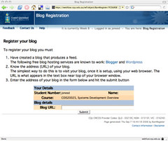
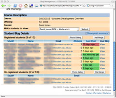
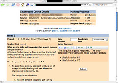

The [BIM](/blog2/research/bam-blog-aggregation-management/) (BAM into Moodle) tool is an activity module for Moodle that implements the same functionality as BAM, the tool discussed in this paper.

### Abstract

This paper examines the design and implementation of reflective journals as individual student blogs in a course with 276 students and 13 teaching staff. The academic aim was to encourage reflection, reduce plagiarism, increase student engagement and increase the visibility of students’ progress in the course. A technical aim was to experiment with an approach that uses a small and simple information system to integrate freely available blog services (e.g. Wordpress.com) with institutional systems and requirements. This paper reports on the learning design, technical implementation and outcomes (mostly positive) of the experience. While not without problems, both the employment of blogs for reflective journals and the technical approach used to implement them could be adapted for use at other institutions.

### Introduction

Web logs, commonly known as blogs, are an increasingly accepted educational technology tool that can be used by students for reflection (MacColl, Morrison et al. 2005). However, there has been some concerns expressed about the absence of blog tools in some existing e-learning systems and the quality of those tools when provided (Du and Wagner 2005). This paper examines a project to implement blogs in a course with 276 students and 13 staff spread over six geographically dispersed campuses and a small number of distance education students (i.e. students who never attend a campus). The aim of the project was to address specific issues with the course and also to experiment with an alternate approach to the provision of blog tools.

The paper begins by describing the context within which the project took place and the methods used to evaluate the project. It then examines the rationale and detail of both the learning and technical implementation designs for how blogs were used in the course. The paper concludes with an analysis of the project outcomes and implications for future work.

### Context and method

Systems Development Overview (SDO) is a Masters level course at CQUniversity (CQUni) Australia which is offered 3 times a year. This paper focuses on the Term 2 (T2 – July to October) 2006 offering of SDO, which can be accessed on the web at http://webfuse.cqu.edu.au/Courses/2006/T2/COIS20025. Course delivery of SDO, like many CQUni courses, is complicated by a range of factors including: a large number of students from non-English speaking backgrounds (NESB); delivery across multiple campuses and distance education; and the involvement of large numbers of academic staff, including casual staff. The T2, 2006 offering of SDO involved 276 students (over 98% of whom are NESB) studying at six campuses and via distance education being looked after by 13 staff. Of the 13 staff involved with the course, only four were full-time staff members. Three of the full-time staff members were teaching only staff and consequently had large teaching loads.

The complexity of the teaching model and diversity of student and staff backgrounds and experiences have contributed to a range of problems including: high failure rates; high levels of plagiarism; poor skills communication skills especially writing in English; limited opportunities for providing feedback to students; and the course coordinator having a limited knowledge of how students are progressing in the course until the first assignment has been marked. A strategy, previously adopted in this course to address these issues was the requirement for students to submit an assessment portfolio (worth 10% of the final mark) at the end of term. The portfolio was to be prepared after keeping a diary during the term. Students were to write their responses to a series of question prompts.

There were significant problems with this approach. The student diary was rarely if ever checked by on-campus teaching staff. Hence staff were not aware of student progress and the course coordinator, responsible for the overall course but based on a campus distant from the majority of students, had no method of monitoring student progress. The lack of visibility of the diaries contributed to a significant percentage of students not keeping a diary and approaching the assessment portfolio as a creative writing exercise performed at the end of the teaching term. There was little or no student reflection and the quality of the portfolios was poor. In Term 1 2006 the average mark for the portfolio assignment was a ‘Fail’.

The first author came to the course with a background an interest in e-learning, had first used blogs for student reflection in 2002, had an established interest in student reflection as an approach to improve learning and interaction (Jones 2006), and was interested in exploring e-learning technical solutions that moved beyond integrated learning management systems (Jones and Gregor 2006). It was decided to modify the assessment portfolio assignment into the keeping of a reflective journal using an individual student blog. The rationale and design of the new assignment is described in the next section.

The initial approach adopted was seen as an exploratory case study. The widespread use of individual student blogs and reflective journals within this course required the implementation of new systems within a fairly constrained teaching context. It was likely that there would be implementation problems, especially given the likely impossibility of implementing necessary changes in organizational practice. Consequently, the aim of this research was to explore what might be done and what happened within the course. This was achieved through a combination of methods including:

- A design workshop;  
    The initial prototype of the course and the supporting system was presented to a range of staff in a [design workshop](http://video.google.com/videoplay?docid=965377384627246106#3m50s) before the start of term. The aim was to generate suggestions for improvement. About halfway through the term [another session](http://video.google.com/videoplay?docid=961814934919323661#3m30s) was held to reflect on the experience so far and again generate suggestions.
- Emergent design (Jones, Lynch et al. 2003);  
    The supporting system was not designed before the start of term. It was developed during the term as required and its design was informed by insights gained and in response to experience.
- Focus groups and interviews; and  
    A research assistant travelled to the two campuses with the majority of staff and students and conducted a range of focus groups and interviews with staff and students.
- Student results, journals and system statistics.  
    A range of other data was drawn upon to identify student usage and correlations with results.

### Learning design

The aims behind the introduction of student blogs included:

- encourage regular reflection by students;
- enable staff to be aware of and respond to student reflection;
- implement some strategies to reduce the level of plagiarism in the course;
- minimize any increase in workload for academic staff.

The assessment portfolio assignment was transformed into a reflective journal assignment that required students make nine posts during a 12 week term. The posts were in response to the stimulus questions described in Table 1. The assignment was worth 10% of the final mark and students were required to make their posts on their own individual student blog on their choice of free, external blog service (Wordpress and Blogger were initial suggestions). The intent was that each journal would be the students' own personal reflection of their learning journey. The intent was not to encourage collaboration or discussion amongst students. Consequently, no part of the learning design sought to encourage students to find and comment on the blog posts of other students.

The marking criteria were designed to encourage student participation. If a student completed all the blog entries it was possible for him/her to receive up to eight extra percent toward his/her final grade. The full details of the assignment, including the marking criteria and the list of [weekly stimulus questions](http://webfuse.cqu.edu.au/Courses/2006/T2/COIS20025/Assessment/Item_3/) were provided to the students. Included in the assignment specification were a number of examples of potential student contributions. Each example was written to provide students with an understanding of what was required to complete the blog assignment.

The stimulus questions for each week were designed to specifically address an important aspect of the learning in the course. The entry for week two was designed to provide staff with some details about the background of the students and required the students to reflect on why they were undertaking this course. The production of a Gantt chart in week three was designed to make authentic use of a concept from the course through utilizing it to encourage the students plan out their learning and to take responsibility for keeping up-to-date with the course work. In weeks four, seven and 11 the minute papers were designed to give feedback to the instructors about how the students were coping with the course content (Angelo and Cross 1993). The blog entry for week six was another example of wanting to connect abstract concepts from the course to the students’ own experience. In weeks eight and 10 the blog entries were designed to reduce the rate of plagiarism. The former entry was to create an annotated bibliography of articles that could be drawn on to complete their second assignment. It was designed to ensure that the students had completed some relevant reading well before the submission date (Culwin and Lancaster 2001). For week 10 students were required to demonstrate skills in critical analysis and building an argument that could be used in addressing their second assignment (James, McInnis et al. 2002). The entry for week 12 was designed to reflect on: how well reality met their expectations with respect to this course; and how well their planning in week three helped them to meet the learning outcomes in this course.

| Week | Purpose |
| --- | --- |
| 2 | Find out about student knowledge and expectations |
| 3 | Have students plan their study using a Gantt chart (content knowledge from the course) |
| 4, 7 and 11 | Minute papers. Typically four questions along the lines of: What important concepts did you learn, why are they important, what concepts are causing you problems, how might you solve those problems? |
| 1, 5 and 9 | No questions – getting started in the term (week 1) or working on assignments (weeks 5 & 9) |
| 6 | Apply content knowledge from the course to evaluate a university information system |
| 8 and 10 | Implement strategies 6 and 23 of the 36 strategies suggested by James et al (2002) to minimize plagiarism |
| 12 | Reflection on course and on answers from weeks 2 and 3 |

[A rubric for marking](http://webfuse.cqu.edu.au/Courses/2007/T2/COIS20025/Assessment/Item_3/Criteria/) was created and made available to assist students to understand what type of entry would be marked as exceptional (four marks), good (three marks), acceptable (two marks) or not-acceptable (one or zero marks). The marks were to be tallied and divided by two to provide a final score out of 10. If students provided good or exceptional blog entries every week it was possible to score greater than 10. The ability to score higher than the allocated mark was designed to encourage students to spend the time to create high-quality blog entries. The marking scheme was also designed to be simple and easy for staff to mark.

### Implementation

At the time of the project the host university did not have available a blogging service, either stand-alone or within the LMS being used by the course. In addition, an aim of the first author was to experiment with an alternative approach with the provision of e-learning software. This section describes the operation and implementation of this alternative. First it examines the students' experience, then it explores the experience of the teaching staff and concludes with an examination of how the system was implemented. The university system designed to support this use of blogs is called BAM which is an acronym for Blog Aggregation Management.

#### Students

During the first week of the teaching term students were encouraged to create a new blog using an external blog provider. Some recommendations (Wordpress.com and Blogger) were given but students were free to choose any service that generated an RSS feed. Once they have created their blog, the students were asked to visit a university web page, login using their university credentials and register their blog by copying the URL into a form and hitting submit. From now on students were expected to post their responses to the stimulus questions to their individual blog. Some students received feedback or comments on their blog posts during the term from the teaching staff. At the end of the term, all students received a spreadsheet containing marks and comments for all posts.

  
**Figure 1 - The blog registration form**

#### Staff

A staff member would track and mark the posts of their students via the BAM Manage system accessible from the staff portal. This system allows the staff to see whether students had registered their blog, send an email to those who hadn't, view photos and other student details, go to the student's individual blog, view posts, view when the last post had been made by each student, track which students had answered which stimulus questions and mark student posts. Figure 2 is the "details" page used to see details about students, their blogs and which students had registered their blog. Figure 3 is the "posts" page, it shows the list of stimulus questions and which students posted answers to which questions.

  
**Figure 2 - BAM details page**

  
Figure 3 - BAM posts page

Figure 4 is the marking page that allows the staff member to mark and comment on the student posts. The detail entered on this page is intended to become part of the formal feedback to the student on the assignment. Teaching staff were encouraged, where appropriate, to use the commenting features on the students' blogs to provide formative and encouraging feedback to students during the term. The original aim was that staff would be marking and releasing formal comments on student posts throughout the term to increase interaction between staff and students. This regular feedback did not come about for a variety of reasons as explained in the Discussion section.

  
Figure 4 - BAM marking page

#### Implementation

BAM was implemented as three main components: register, mirror and manage. BAM Register provides a Web interface to take a URL from the student, check that it has a valid RSS feed and store the details in a university database. BAM Mirror maintains a copy of the students' blog data on a university computer. This removes concerns around loss of student data if an external service ceases to exist. Every two hours BAM Mirror cycles through all of the registered student blogs, checks to see if there are any new posts, and, if so, adds the new data to an RSS file on the university computer. BAM Manage provides the web-based interface for staff to track and manage student participation.

BAM was implemented as part of the Webfuse system, a locally created e-learning system (Jones and Gregor 2006). Using Webfuse enabled BAM and the use of blogs to be integrated into existing institutional practice and systems. BAM was available to staff via the Webfuse staff portal and was integrated with the university assignment management system, grade book and student records system. It was also loosely integrated with the institutional copy detection system. The university did not have to implement a blog service, only that software necessary to integrate the external blog services with its own requirements and existing administrative systems.

### Discussion

The implementation of blogs into the SDO course was deemed to be somewhat successful, though it was not without some problems. In terms of the stated aims of the project, the following can be said:

- encourage regular reflection by students;  
    Most posts met the marking criteria "meets standard response".
- enable staff to be aware of and response to student reflection;  
    Only a few staff used the awareness of student progress to take action, more discussion below.
- implement some strategies to reduce the level of plagiarism in the course; and  
    There was some reduction in plagiarism for the report assignment, however, there was also some plagiarism of blog posts, discussed below.
- minimise any increase in workload for academic staff.  
    While the systems helped reduce workload, the assignment design still required additional work from staff and this appeared to be a major problem.

What follows is an examination of the problems faced and solutions that have arisen; the successes of the project; and future developments.

#### Problems and solutions

Few of the students or staff were aware of blogs and how to use them. Early in the term this lack of knowledge increased concerns about the assignment, in particular the discovery by both students and staff that they were expected to contribute to this assignment throughout term. This led to increased levels of concern at the start of term and a need to implement strategies to address these concerns. Even with a provided PDF document illustrating example blog posts and the detailed marking rubric, students were still uncertain about what was required of them. For some students, the act of creating a blog on an external service and registering it with BAM were problematic.

Subsequent solutions to these problems have included:

- an exemplar student blog. With permission, exemplar blog posts from students in the first offering were used to populate an [exemplar student blog](http://examplestudentblog.wordpress.com/) and this was used early in term to provide students with an idea of the requirements for their blogs. Since it was created, the exemplar student blog has been viewed over 12,000 times. The peaks in usage match the beginning of a term.
- screencasts and additional instructions.  
    A range of additional instructions have been created. Most recently a number of screencasts ([e.g.](http://webfuse.cqu.edu.au/Blackboard/BAM/Register_for_Students/)) have been created to illustrate key tasks.

As mentioned previously, all but one of the teaching staff (the course coordinator) were either part-time or teaching only staff with large workloads. The novelty of blogs (almost all staff had not used blogs previously) and the requirement to track student progress during term and provide feedback created workload issues for staff. It was reported that two of the initial part-time tutorial staff from the Sydney campus left the course due to workload concerns associated with the marking. Other staff had to curtail or modify how and when they marked student blogs to fit within their workload. A significant number of staff did not read student posts until the end of term when they marked all the blog entries at the same time. This negated the potential of the blogs to allow a mechanism for identifying problems early in the term.

This led to some issues about the quality of reflection from some students. One tutor's perspective was

> I don’t think a lot of them are actually reflecting….\[they\] are treating this as any other assessment so they are trying to find resources which answer the question rather than using the knowledge they have gained during the lectures to reflect on it.

It is standard practice at the university that a part-time staff member employed to tutor a class is also responsible for marking assignments submitted by students in their class. This practice and the nature of the blog assignment did not work well together. Ann attempt was made to negotiate a modification of this organizational practice in order for tutors to be able to concentrate on the blog assignment and engage in discussion with students through their blogs. The marking of the remaining, more traditional, assignments was to be completed by other casual markers. This suggested change of practice did not eventuate owing to the complex processes which needed to be modified to effect this change within the institution.

There has also been concern raised about the ethical and legal considerations about requiring students to make their work public (Ellison 2006). The registration process in BAM allows students to use a pseudonym on their blog while still enabling teaching staff to identify which student owns which blog. However, 205 of the registered student blogs included some part of the student's name or student number in the name of the blog. In subsequent offerings of the course students were provided with specific advice to use a pseudonym, though this has not prevented students from registering blog names that include part of the student's number or name.

The utilization of free web services to host student blogs meant that all of the students' blogs were world readable. This openness generated a small number of comments by members of the public on student posts. On the other hand, it also enabled eight students to copy the blog entries of other students and attempt to pass them off as their own. These duplicate blog entries were identified by the automated copy detection process integrated into BAM.

In student focus groups the problem of other students copying blog posts was raised, especially if students posted early. This was a particular concern for those stimulus questions for weeks eight and 10 that were connected with the final assignment which was a report. It was thought other students could use these posts to follow the same procedure to complete their assignments. Another problem arising from student focus groups was concern about workload, the pressure of other assignments meant some students felt that they couldn't concentrate on their blog post each week.

#### Successes

From a technical perspective BAM was a success. The majority of students enrolled in the course engaged with the assignment and staff were able to track and mark the blog entries using BAM. While there were some teething problems, as might be expected from an exploratory project, the marriage of external and institutional services worked well. The project was included in the ELI Guide to Blogging (Coghlan, Crawford et al. 2007) released in 2007 which indicated that the marriage of Web 2.0 applications with institutional systems was a compelling part of this project and that it promised to give institutional systems greater efficacy and agility with reduced cost. At no stage in this project has it been necessary for the institution to create or buy a blogging service – thus saving the institution money. Over 2200 students in the last three years have been able to use their choice of external blogging service; though Wordpressis recommended (about 92% of students have used Wordpress, about 7% Blogger).

From an educational perspective the system did provide some benefit from increasing staff awareness of student progress. One staff member using the system commented in an interview

> Students tend to fall off the wagon…the major reason why the blog was created. So that we can keep track of students working week by week rather than…working the night before the assignment is due…in that respect it seems to have worked well.

A similar comment reported that monitoring blog posts led to “more students cross\[ed\] that line of a fail into pass”.

Experience in this project confirmed the finding of Du and Wagner (2005) that even with the absence of progressive feedback using blogs as an assessment item can still be a predictor of learning outcomes for high and low performing students. In this project there were nine high performing students on all of the non-blog assessment items. All nine of these students achieved similar high results on the blog assignment. Of the six students who did not register a blog, four failed every course they were studying that term. The remaining two students failed two of the three courses they were studying. 93 students scored less than 28% for their blog posts. Of those students: 31% achieved an overall result of less than 74%, almost 11% did not sit the final exam, and almost 57% sat the exam but failed the course.

Some students were also positive about the blog assignment, especially those who received feedback.

> I studied my undergrad externally at CQU and have to say this was the most structured and supportive course I have taken. This is the first time I experienced an assessment item like this blog. It is a great way to encourage and motivate learning of the key concepts.

Praise for the blog assignment that arose from student focus groups included that it helped improve their writing skills and helped with studies.

The success of the system can also be illustrated that improved versions of this assignment and the BAM system have been used in eight offerings of this course since the initial project. Seven of those eight offerings did not involve either of the original authors. In addition, BAM has been used in eight offerings of other courses, all of which are taught be staff other than the authors.

#### Future developments

The majority of the use and functionality of BAM has been for supporting staff in the management and marking of individual student blogs. This is but one approach to using blogs in learning and for using BAM. Some initial steps have been taken in using BAM to maintain class "blogs". This is where the posts of individual students are aggregated into a single location. This was done as part of an initial investigation into the concept of a Web 2.0 courses site (Jones 2007). This approach extends the idea of marrying institutional systems and requirements with the services and tools freely available on the Web and appears to have had some benefits.

In 2009 the future development of BAM is at a cross-road. By the beginning of 2010 the host institution will have implemented Moodle as an online learning infrastructure. At the same time the university is also undergoing a significant organizational restructure. If BAM is to continue it will need to be ported to Moodle and this raises a range of interesting questions about how well a “standard” LMS caters for a specific institutional context.

### Conclusions

This case study examined how individual student reflective journals were implemented using free external blogging services. It has outlined the changes to learning design of an assignment and how a system was designed and implemented to support staff in managing the organization and administration of the assignment. , BAM was successful enough to be used by other academic staff in a variety of different courses. This paper has demonstrated that reflective journals, even in the absence of feedback, can be a useful predictor of overall student performance. It has also established that large scale e-learning systems do not need to be built around technology owned and maintained by institutions, that there are alternate methods for structuring such e-learning systems.

### References

Angelo, T. and K. Cross (1993). _Classroom Assessment Techniques: A Handbook for College Teachers_. San Francisco, Jossey-Bass.

Coghlan, E., J. Crawford, et al. (2007). "ELI discovery tool: Guide to blogging." _ELI discovery tool_  Retrieved November 29, 2008, from [http://www.educause.edu/eli/GuideToBlogging/13552](http://www.educause.edu/eli/GuideToBlogging/13552).

Culwin, F. and T. Lancaster (2001). Plagiarism, prevention, deterrence and detection, Institute for Learning and Teaching in Higher Education, South Bank University, U.K. .

Du, H. S. and C. Wagner (2005). _Learning with Weblogs: An Empirical Investigation_. 38th Hawaii International Conference on System Sciences, Hawaii, IEEE.

Ellison, N. (2006). "Non-pseudonymous student blogging: Ethical and legal concerns."   Retrieved 5 December, 2006, from [http://blogsforlearning.msu.edu/blog/archives/2](http://blogsforlearning.msu.edu/blog/archives/2).

James, R., C. McInnis, et al. (2002). Assessing Learning in Australian Universities. Melbourne, Australia, Centre for the Study of Higher Education, The University of Melbourne for the Australian Universities Teaching Committee.

Jones, D. (2006). "Enhancing the learning journey for distance education students in an introductory programming course." from [/blog2/publications/enhancing-the-learning-journey-for-distance-education-students-in-an-introductory-programming-course/](/blog2/publications/enhancing-the-learning-journey-for-distance-education-students-in-an-introductory-programming-course/).

Jones, D. (2007, 7th Nov 2008). "CQU's first "web 2.0 course site" goes live."   Retrieved 29 April, 2009, from [/blog2/2007/07/11/cqus-first-web-20-course-site-goes-live/](/blog2/2007/07/11/cqus-first-web-20-course-site-goes-live/).

Jones, D. and S. Gregor (2006). _The formulation of an Information Systems Design Theory for E-Learning_. First International Conference on Design Science Research in Information Systems and Technology, Claremont, CA.

Jones, D., T. Lynch, et al. (2003). _Emergent Development of Web-based Education_. Proceedings of Informing Science + IT Education, Pori, Finland.

MacColl, I. D., A. J. Morrison, et al. (2005). Reflections on reflection: Blogging in undergraduate design studios. _Blogtalk Downunder conference_. Sydney.