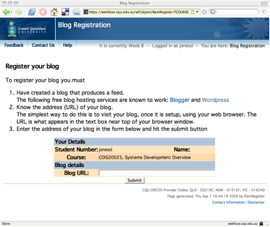
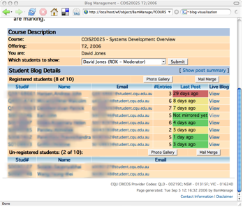
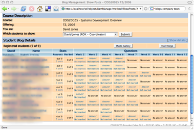
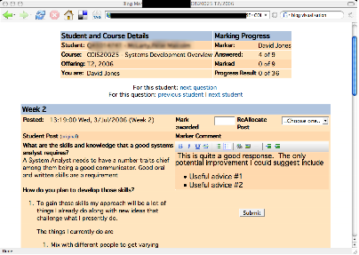

This paper was originally written for the [Blogs for Learning](http://blogsforlearning.msu.edu/) site. Additional information about the BAM project can be [found here](/blog2/research/bam-blog-aggregation-management/).

### Abstract

From June through October (T2) 2006 the 270+ students in the Central Queensland University course COIS20025, Systems Development Overview used individual blogs, hosted on their choice of blog service, as a reflective journal. The intent was to encourage reflection, reduce plagiarism and increase the visibility of student progress. The 15 academic staff responsible for those students made use of a locally produced tool to track student participation and to mark the journal entries. The tool integrated the students' choice of blog service with University information systems including student records, copy detection and assignment marking. Like anything new there were teething problems, but overall the experiment was reasonably successful. In particular, because of the promise it holds for enabling the early identification of students who may be having problems with the course.

### Why?

COIS20025, Systems Development Overview is a Masters level course ([http://webfuse.cqu.edu.au/Courses/2006/T2/COIS20025](http://webfuse.cqu.edu.au/Courses/2006/T2/COIS20025)) offered at [Central Queensland University](http://www.cqu.edu.au/) (CQU). Like many courses at CQU, course delivery is complex due to the diverse background of the students and the number of students, campuses and staff involved. Table 1 provides a summary of the complexity of the T2 offering of COIS20025 in 2006. This complexity and other factors have contributed to a range of problems including: high failure rates, high levels of plagiarism, limited feedback to students, and limited knowledge of student progress.

Table 1 - COIS20025: Students and staff \* - Same staff member – the course coordinator
| Campus | \# Students | \# Staff |
| --- | --- | --- |
| Brisbane | 17 | 2 |
| Fiji | 2 | 1 |
| Distance education | 5 | 1\* |
| Gold Coast | 12 | 1 |
| Melbourne | 97 | 3 |
| Rockhampton | 3 | 1\* |
| Sydney | 140 | 5 |

One strategy, previously adopted in this course, to address these issues was the requirement for students to maintain a reflective journal during the term. The journal was worth 10% of the students' overall mark. The original design of this approach required students to maintain a Word document that was submitted at the end of term. Students were provided with a range of questions to get their reflection going but were given significant leeway about the content. This approach meant that staff had no idea of how the students were progressing with this assignment. Consequently a number of students left it as a creative writing exercise performed in the days leading up to the due date.

Modifying this assignment to require students to maintain their reflective journal on a personal blog was designed to:

- Ensure students performed the task during the term.
- Allow staff to be aware of student progress.
- Implement some strategies to reduce the level of plagiarism in the course.
- Reduce the workload for teaching staff or at least make the work more productive.

### What?

The T2, 2006 offering of COIS20025 retained the same assessment as previous offering. This includes assignment 3 being worth 10% o the final mark and requiring students to maintain a reflective journal. There were, however, three changes to assignment 3 for the T2, 2006, including:

1. Students were required to maintain their reflective journal on an individual blog which they create on their choice of free blog service (Wordpress and Blogger were recommended).
2. Their journal entries had to be in response to nine specific weekly questions (Table 2) spread throughout the 12-week teaching term.
3. The marking criteria were modified to encourage participation. It was possible for students to receive up to 8 extra percent toward their final grade. Late entries would be penalised with a mark of -2. However, students could not receive a mark less than 0 for the assignment.

The full details of assignment 3 provided to students, including the complete marking criteria and list of weekly questions can be found on the web at [http://webfuse.cqu.edu.au/Courses/2006/T2/COIS20025/Assessment/Item\_3/](http://webfuse.cqu.edu.au/Courses/2006/T2/COIS20025/Assessment/Item_3/)

### How?

During week 1 of term students were encouraged to create a new blog on an external blog provider. A university blog service was not used because such a service did not exist, there were questions about the reliability and cost effectiveness of a university service in comparison to existing free services, a desire to increase each student's sense of ownership of their blog by using a non-University service, and an interest in starting to experiment with aspects of eLearning 2.0 (Downes 2005; Jones 2005)

Table 2 - Reflective journal questions for Term 2, 2006 offering of COIS20025
| Week | Purpose |
| --- | --- |
| 2 | Find ot about student knowledge and expectations |
| 3 | Have students plan their study using a Gantt chart (content knowledge from the course) |
| 4, 7 and 11 | Minute papers (Angelo and Cross 1993). Typically four questions along the lines of: what important concepts did you learn, why are they important, what concepts are causing you problems, how might you solve those problems? |
| 1, 5 and 9 | No questions – get started in the term (1) or work on assignments (5 & 9) |
| 6 | Apply content knowledge to a CQU information system |
| 8 and 10 | Implement strategies 6 and 23 of the 36 strategies suggested by James et al (2002) to minimise plagiarism |
| 12 | Reflection on course and on answers from weeks 2 and 3 |

Once their blog was created students had to register their blog (Figure 1) with the CQU Blog Aggregation Management (BAM) system. BAM was developed to retrieve, store and manipulate the RSS or Atom feeds (Parry 2006) of each student's blog and integrate this information with a range of CQU information systems including staff marking responsibilities, online assignment management, copy/plagiarism detection and student records system. BAM also provided an interface used by staff to manage (Figure 2), track (Figure 3) and mark (Figure 4) their students' journal entries. BAM also kept a mirror of the feeds for all student blogs on a CQU server.

**Figure 1 - Blog registration page**

**Figure 2 - BAM blog details page**

**Figure 3 - BAM show posts page**

**Figure 4 - BAM mark posts page**

### Outcomes

Overall, this initial experiment has provided evidence that this approach has some promise. A number of lessons were learned during this experiment and are being used to inform the on-going development of this approach in this course and its adoption in other courses. The next offering of COIS20025 is currently underway (Dec, 2006 to Feb, 2007) and is using a slightly tweaked version of the same assignment. Some of those lessons learned are discussed below.

### Issues

Few of the students knew what a blog was at the start of term. However, with appropriate support from staff the majority of students were able to create, register and use their blogs. For subsequent offerings an example student blog has been created ([http://examplestudentblog.wordpress.com/](http://examplestudentblog.wordpress.com/)) to help students better understand the requirements of the assignment.

Many staff were uncertain of what a blog was and most had significant reservations about the potential increased workload in marking student blogs. Especially given the emphasis on using the blogs for identifying students with problems. Due to this reluctance and the late development of the marking interface almost all the marking of blogs was performed at the end of term. A number of staff did track their student progress but few read blog posts and took proactive steps if problems were identified. To work effectively there may need to be a change in staffing or in how assignments are marked. Peer marking is one potential option.

### Blogs as a predictor

Even with the absence of progressive feedback there is evidence to support the claim that using blogs in this way can be a significant predictor of learning outcomes for high and low performing students (Du and Wagner 2005). In COIS20025, of the 9 students who achieved greater than 75% on all of the non-blog assessment items, 8 received 75% or greater and the other students received 72% on the blog assignment. Of the 6 students who did not register a blog, 4 failed every course they were studying. The remaining two students failed 2 of the 3 courses they were studying. 93 students scored less than 28% for their blog. Of those students,

- 4 achieved a final course result in the range 65-74%,
- 25 scored in the range 50-64%,
- 10 did not sit the final exam and consequently failed, and
- 53 sat the exam and achieved an overall result of less than 50%.

### Public, anonymous and plagiarism

By using free web services to host student blogs all of the students' blogs were world readable. Figure 5 is the result of a Technorati search for "COIS20025" during the course and has links to entries from a number of students. On the plus side, this openness generated a small number of comments by members of the public on student posts. On the negative side, it also enabled 8 students to copy the blog entries of other students and attempt to pass them off as their own. The automated copy detection process integrated into BAM identified these students.

The strategies to minimise plagiarism were aimed at the report students had to write for assignment 2. 18 students were found to have plagiarised the report. Not a significant reduction from the previous offering. The next offering of the course has adopted a range of additional measures in an attempt to limit the amount of plagiarism.

There has also been concern raised about the ethical and legal considerations about requiring students to make their work public (Ellison 2006). The registration process in BAM allows students to use a pseudonym on their blog while still enabling teaching staff to identify which student owns which blog. However, 205 of the registered student blogs included some part of the student's name or student number in the name of the blog. In the current offering students were provided with specific advice to use a pseudonym. In this new offering, 62 of the 136 blogs registered so far have names that include part of the student's number or name.

### Other resources

This work was discussed at two presentations given at CQU in May and September of 2006. The slides and video of those presentations is available on the web at http://cq-pan.cqu.edu.au/david-jones/Projects/BAM/Presentations/

**Figure 5**

### References

Angelo, T. and K. Cross (1993). Classroom Assessment Techniques: A Handbook for College Teachers. San Francisco, Jossey-Bass.

Downes, S. (2005). "E-learning 2.0." eLearn Magazine 2005(10).

Du, H. S. and C. Wagner (2005). Learning with Weblogs: An Empirical Investigation. 38th Hawaii International Conference on System Sciences, Hawaii, IEEE.

Ellison, N. (2006). "Non-pseudonymous student blogging: Ethical and legal concerns." Retrieved 5 December, 2006, from http://blogsforlearning.msu.edu/blog/archives/2.

Jones, D. (2005). "Five Building Blogs for the Future of IT in Learning and Teaching." Retrieved 5 December, 2006, from http://cq-pan.cqu.edu.au/david-jones/Publications/Presentations/Future\_Drivers/.

Parry, D. (2006, 5 December, 2006). "The Technology of Reading and Writing in the Digital Space: Why RSS is crucial for a Blogging Classroom." Blogs for Learning, from http://blogsforlearning.msu.edu/articles/view.php?id=6.