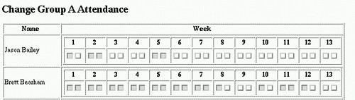
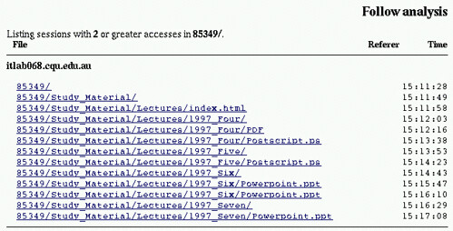

See also: [[blog-home | Home]]

David Jones, Colin McCormack, Class Management: The Forgotten Task, Hope Greenberg, Rik Hall (editors), Shortening the Distance to Education, Proceedings of the Third International North American Web Conference, Fredicton, Canada, pp 109-125.

## Abstract

All teaching and learning requires administrative support in the form of assessment management, student enrollments, student tracking, (Hansen and Frick 1997), student transfers, payment and a variety of other tasks. For some time most of these administrative tasks have involved the use of computers and more recently electronic data interchange and the World-Wide Web (Norris and Olson 1997). However the use of the Web for class management tasks has been mainly limited to institutional requirements and occur 'outside the classroom'. The use of the Web to assist individual educators in performing class management tasks 'within the classroom', such as assessment management and student tracking, is less common. This is despite the fact that the Web provides a number of advantages over existing practices and enables the adoption of new class management tasks that can significantly improve the learning experience for both students and teachers.

**Keywords:** World-Wide Web, Class Management, Class Administration

## Introduction

The use of the Web to support education can be thought of occurring in four areas: information distribution, communication, student assessment and class management (Hansen and Frick 1997, McCormack and Jones 1997). For most educators the initial emphasis has been on using the Web for information distribution (Jones 1996), communication (Fowler et al, 1996) and student assessment (Byrnes, Debreceny and Gilmour, 1995). Use of the Web to aid in class management tasks is still rare and yet if implemented appropriately can offer some considerable advantages to students, staff and institutions.

This paper will make a distinction between class management tasks that take place "outside a class" and those that occur within. Class management tasks which occur "outside a class" are generally the responsibility of the institution and includes tasks such as student registration, payment of fees, credit transfer and production of student transcripts. These tasks are generally performed by a centralized administrative division and occur either before or after a student takes a class. Class management tasks that occur "within a class" include recording student grades, assessment management, and tracking student progress. These tasks are usually the responsibility of the educator in charge of the class.

This paper starts by examining why you might consider using the Web to perform class management tasks, in particular it examines some of the generic problems introduced by current methods use to implement class management tasks. Next the paper provides examples of how educators are currently using the Web to perform class management tasks ("within the class") such as publicity, increasing interaction, assessment management and student tracking. Finally the paper makes some general observations on the issues involved with implementing Web-based class management.

## Why use the Web?

The majority of class management tasks deal with the storage, manipulation and distribution of information. The abilities of computers in storing and manipulating information makes the use of computers in class management tasks obvious and very common. For example, almost all institutional student records systems are based on large scale, commercial databases and many individual educators use spreadsheets and personal database systems to manage class results.

Since these tasks are already performed using computers why would you wish to integrate them with the Web? The following section describes three reasons:

1. Solving problems created by existing methods
2. Supporting Web-based education
3. Enabling new practice

The problems identified below are not new and there have been previous attempts to solve them through the use of technology. The section closes with a discussion of the differences between the Web and previous attempts to solve these problems.

### Solve problems with existing approaches

While computers are well suited to the role of storing and manipulating information the implementation and characteristics of traditional institutional systems raise a number of problems when performing class management tasks. All of the following problems originate from the closed nature of traditional institutional administrative systems that make catering to client needs and sharing of information difficult.

#### Inflexibility

The traditional administrative systems used by Universities can be characterized as closed, proprietary, controlled and secure (Jacobson 1995). These characteristics clash with a major aim of these systems, to make information available to the staff and students who require it. In particular most students view computing as pedestrian, public and wide-reaching (Jacobson 1995). The difficulties in retrieving or entering information into these traditional systems can frustrate clients and increase the time and resources required.

#### Variety

While a class is being taught educators are required to maintain information about the performance of students. This information is eventually used to calculate students? final grades. It is not an unusual requirement for this information to be updated and reviewed by a number of people involved in the grading of student work. The design and closed nature of institutional systems makes it difficult for them to be adapted to fulfill the needs of individual educators and classes.

As a result it is not unusual for different educators to record student information using a variety of different, individualised formats including paper-based, spreadsheets and personal databases. The resulting variety in information storage format makes it difficult to easily retrieve, share and analyze information. This means it is impossible for institutions to identify student trends and take appropriate action during a teaching period. Some examples include the ability to identify in the first few weeks which students have not attended a tutorial or submitted the first piece of assessment or track how well students are understanding particular concepts.

#### Duplication

Before the necessary analysis of student information can be performed the information maintained by individual educators must be entered back into the institutional system. Traditionally this has involved the following three steps:

1. Extraction  
    Information maintained by the educator usually contains extra information not required by the central system. The required information (e.g. student number, percentage and final grade) must be extracted.
2. Conversion  
    The format used by an individual educator usually doesn?t correspond with the format used in the institutional system. Therefore it must be converted into some interim format that both systems recognize.

4. Entry  
    The information must now be entered into the institutional system.

Given the variety of formats used by educators it is not uncommon for the standard format used to transfer information to be paper. In this situation the following occurs (this is what happens at Central Queensland University): educator copies (by hand) computer-based information onto a computer print- out produced by the student records system, that paper is returned to Student Administration where someone else manually enters the data from paper into the institutional system, another print-out is then produced for the educator to visually check to ensure no mistakes have occurred, any changes are returned to central student administration to be entered onto the computer. The extra handling by human beings significantly increases the chances of human error, increases the workload of the people involved and significantly slows down the process.

#### Distribution

The duplication of data entry problem comes about not only because of the closed nature of existing systems but also the inability of existing computer systems to share information electronically. As a result paper or other physical media must be used for information distribution. Apart from the duplication of data entry, this reliance on physical media also makes the distribution of information slow and could lead to the loss of information.

The distribution of assessment from student to marker and back again is one "in class" management task which suffers from the use of physical media. It is not uncommon for assignments to be given to the wrong grader or to sit uncollected in a postbox. Even if delivery goes off without a hitch it still takes some time for an assignment to travel from student to grader and back. This problem is magnified in distance education where students and grader can be located in different hemispheres.

#### Consistency

As a result of many of these problems it is not unusual for multiple copies of information to exit. For example, the institution's database will track which students are in a class, the person in charge of the class will also maintain a copy and each of the graders will maintain a copy. Each copy of this information will change in response to different events. The institution's copy will change as students add or drop the class while the grader's copy will change as they grade student assessment. Without automation attempting to maintain consistency amongst these different versions is a difficult and time consuming task which is prone to human error.

### Support the new environment

Whatever teaching medium is used, face-to-face, print-based distance education or Web-based education, the characteristics of the medium creates a requirement for administrative support that is specific to its needs. For example, face-to-face teaching requires the support of a room allocation system to time-table classes and print-based distance education requires editors, publication facilities and distribution mechanisms. The unique characteristics of the Web as a teaching medium creates a need for changes in existing administrative services and totally new ones. In many cases these new requirements can only be provided by appropriate use of the Web itself.

### Enable new practice

The combination of the computer's information processing power and the Web's information distribution abilities can be used not only to change the way existing administrative tasks are performed but also to make it possible to introduce totally new administrative tasks. As always new practice should be adopted because of the benefits it will provide rather than doing so just because the technology makes it possible.

### Why is the Web any different?

The problems with the use of computers in class management and administration identified above are not new. The people responsible for managing information within Universities have known about these problems for many years and have previously attempted to address these problems with Electronic Data Interchange (EDI), client/server computing and Distributed Computing Environment (DCE) (Shull, Arzt and Updegrove 1995). Each of these technologies has done little to address the problems faced by institutions and even less for the problems faced by individual educators. Why is the Web going to be any different?

There are a number of reasons why the Web is different including

- not proprietary  
    EDI and many types of client/server computing are proprietary. They are based on technology specific to a particular software manufacturer and are not widely used (relative to the Web) which generally increases the cost and decreases availability. The Web (most of the time) is based on widely accepted standards which are also widely implemented. DCE is based on a standard that has yet to achieve the market penetration of the Web.
- platform independence  
    A Web browser is available for almost every computer platform currently available and most new computers come with a Web browser already installed. It is no longer necessary to produce and distribute a client program with which people access the data, this in turn reduces the cost.

- ubiquitousness  
    The Web is almost ubiquitous, especially in the University sector. This means that the Web is generally accessible, cheap and familiar to most people. This helps reduce the cost of training.
- ease of programming  
    Previous solutions to these problems required significant programming effort. The Web significantly reduces this effort through a number of factors including the fact that the client application (the browser) already exists, there is a large quantity of good quality, free development tools and servers, and the client interface (HTML) is simple to program.

The Web provides all of the information distribution and sharing abilities of previous solutions without many of their problems and at a significantly lower cost.

## Examples of class management

The use of the Web for class management and administrative tasks is increasingly common within the University sector. For examples refer to Alderson and Granger (1995), Jacobson (1995), Bennet and Kannenberg (1996) and the Web site for 'Web Development for Higher Education Administration' ([http://webdev.indiana.edu/](http://webdev.indiana.edu/)). However the majority of these uses are for tasks which are 'outside the classroom'. Tasks such as enrollments, payment of fees and production of student transcripts are generally the responsibility of the institution rather than the individual educator. The use of the Web by educators to assist in their class management tasks is growing but is less common. The following provides examples of how some educators are using the Web to perform class management tasks.

### Class promotion

A Web-based class can generate interest from students throughout the world, especially if the institution provides the appropriate administrative support for a Web-based classroom and a global student population. Attracting students from throughout the world implies that students are able to find and are interested in the class. Finding a particular class on the Web is not straight forward. As some traditional Universities are still grappling with the implications of Web-based delivery the promotion of Web-based courses is often left to the individual educator. This section describes one simple method for increasing the profile of a Web-based course.

There are a number of methods through which people find a particular Web-based course. These include search engines (e.g. Infoseek, AltaVista), directory systems (e.g. Yahoo), mailing lists, newsgroups, topic specific areas (e.g. the Unix Guru Universe Web site for Systems Administration) and word of mouth. The common first step in promoting a Web-based class is registering with the appropriate search engines, directory systems and other associated areas. However, given the size of the Web this step often makes little difference.

For example, one of the authors teaches a course in Systems Administration (Jones 1996) which is entirely Web-based. In early 1997 a search of Infoseek ( [http://www.infoseek.com/](http://www.infoseek.com/)) using the terms "systems administration" generated a list of over eleven million documents. After searching the first 100 entries and not finding any mention of the author's course, interest waned.

Metadata (Miller 1996) can be used to improve this ranking as the algorithms employed by Infoseek and other search engines place increased importance on pages which make appropriate use of metadata. In the case of the author's course the following steps were performed

- add the following line to the class home page,

- resubmit the page to Infoseek, and
- wait a couple of days for the new data to be processed.

Three days after the first search, another search using the terms "systems administration" returned another list of over eleven million documents. However this time the author's class on Systems Administration was the first entry. Six months later, at the time of writing this paper, the entry for the author's course was no longer first, but was still in the top three entries.

### Increasing interaction and participation

Learning is an interactive experience where the quantity and quality of student/student and student/teacher interaction can significantly influence the quality of the experience. There are a number of factors that can limit the level of interaction and participation by students in a class. The following examples demonstrate how some educators are using the Web to address these problems.

#### Class Photo Album

The primary aim of the class photo album at Rochester Institute of Technology ( [http://www.cs.rit.edu/](http://www.cs.rit.edu/)) is to help faculty to learn the students' names and provide a easy way for students to get to know each other (Reek and Reek, 1996). The RIT photo album provides three different types of Web page. The lecture pages contain a list of the students and staff in a particular lecture group, each name provided a link to a personal sketch of the individual student or staff member. The laboratory page contains a list of names together with photos of the students and staff in a laboratory group. The aim for this type of page was to make it easier for staff to associate a student's name with their face. Finally, each person has a personal sketch page that includes a photograph and some background information on the individual.

#### Attendance Rolls

It is not uncommon for attendance at tutorials and practical sessions to contribute to students' final mark. This is usually done as an incentive to increase student participation and attendance. For this to work records of student attendance must now be maintained. The traditional approach is to maintain a paper- based roll that is updated during each session. Experience shows that this approach suffers from a number of problems including forgetting to bring the roll to a class or losing it. This is a particular problem when there are multiple instructors and even more so if they are geographically dispersed. A final problem with this approach is that it is often difficult for students to check their attendance outside normal class times.

Figures 1 and 2 show one solution to these problems, a Web-based attendance system that is part of the Webfuse system ([http://webfuse.cqu.edu.au](http://webfuse.cqu.edu.au)). This system stores the record of student attendance on the central Web server. This information can be updated at any location which has Web access via a password protected Web form. Similarly students could check their attendance from any Web browser (figure 2).

[](http://www.flickr.com/photos/david_jones/3154714257/ "figure1 by David T Jones, on Flickr")

Figure 1 - Web form for setting attendance

[](http://www.flickr.com/photos/david_jones/3155551204/ "figure2 by David T Jones, on Flickr")

Figure 2 - Web page for checking attendance

#### Bulk email

Many students are reluctant to approach educators to ask questions or report problems they are having. This can lead to these students feeling isolated, which increases their anxiety and decreases the effectiveness of their learning. Asking students if they are having difficulties in group situations, such as lectures or class mailing lists, may gain some response but many students still feel intimidated. An alternative approach, which has a much more personal nature, is to contact each student individually However the time consuming nature of this approach means it is usually not possible. Bulk email programs provide a solution that combines the efficiency of the lecture or mailing list with the personal touch of the individual contact.

Bulk email programs operate in a way similar to the mail merge facility of a word processor. These programs are provided with a list of email address, corresponding names and a message. They then proceed to send the message to each person on the list. The main different between a bulk email program and a mailing list is that messages from the bulk email program look as if they have been sent directly to the recipient instead of a mailing list.

This apparently personal touch can lead the student to feel more apart of a class and that the educator is actually taking an interest in their personal progress. Using bulk emailers to send a 'how are you going' message to all students early in a semester can help reduce a student's sense of isolation and keep them going through a touch time.

#### Evaluation and feedback

Class evaluations are one approach to identifying the problems or strengths in a particular class. Traditionally these evaluations are performed at the end of a class and use paper-based questionnaires. Performing these evaluations at regular intervals during a class may help the educator adapt class content or presentation in response to student feedback. However, the time required to prepare, distribute and analyze these questionnaires usually make it too expensive to become a regular part of a class. The use of Web forms in conjunction with computer-based analysis of the data can significantly reduce the cost of performing regular evaluations.

Current uses of Web-based forms include

- [http://www.sd.monash.edu.au/sft1101/](http://www.sd.monash.edu.au/sft1101/)  
    The Introduction to Software Development subject at Monash University (Australia), uses a completely anonymous feedback mechanism using a simple Web based form. In order to assure students that the process is anonymous the source code for the script and the feedback file are publicly available.
- [http://webclass.cqu.edu.au/Units/81120\_FOCT\_Hardware/](http://webclass.cqu.edu.au/Units/81120_FOCT_Hardware/)  
    The Fundamentals of Computer Hardware subject offered by Central Queensland University in both distance education and on-campus modes uses a weekly evaluation of the study guide to guide future development.

This technology could also be incoporated into a peer-assessment strategy where students anlayse and mark the work of other students. The Web-based forms could act as the primary interface for student comments.

### Assessment management

The resource intensive nature of assessment can often decrease the quality of the feedback provided to students (Oliver and Mitchell, 1996). However much of the process of performing assessment is mechanical, repetitious and a perfect candidate for the application of information technology. Appropriate application of information technology to reduce costs could make it possible to increase both the quantity and quality of assessment and feedback to students. This section examines the methods by which people are starting to use the Web and associated systems to assist the assessment procedure.

#### Methods being used

Assessment management is fundamentally about the distribution and manipulation of information in the form of student assignments, grades and comments. It is not unexpected to find that educators have been using computers and computer networks to perform this task. Assessment management can be said to have four components:

1. Submission system  
    The process by which pieces of assessment travel from student to grader and back again. Traditionally this has been done using paper but this is being replaced by email or Web-based submission.
2. Marking systems  
    Traditionally assessment is graded by the person grading the assessment physically writing on the assignment. The trend to electronic media has seen the development of computer-based systems such as PASE (Oliver and Mitchell, 1996) which has become CleverX ([http://www.cleverx.com/](http://www.cleverx.com/)) and Markin ([http://www.net-shopper.co.uk/creative/ education/languages/martin/markin.htm](http://www.net-shopper.co.uk/creative/education/languages/martin/markin.htm))
3. Storage  
    In a traditional paper-based assessment system it is not unusual for only the grades given to each student to be stored as assessment is usually returned to the student. Computer-based systems allow all assignments, comments and grades to be stored for later review or moderation.
4. Results distribution  
    A list posted to the educators door is the usual mechanism by which assignment grades are distributed.

In attempting to make use of information technology to aid in assessment management some educators are using a combination of unintegrated tools. For example, email might be used as the submission system, a word processor is used to annotate student assignments, storage is taken care of by a spreadsheet and a mail folder and a manually updated Web page is used to distribute results. Experience has shown that using a collection of systems with little or no integration and little administrative support can actually increase the workload involved in assessment management (Jones and Jamieson, 1997). This has led to the development of integrated systems that combine all four components of the assignment management process. The Webfuse system ([http://webfuse.cqu.edu.au/](http://webfuse.cqu.edu.au/)) includes an example of a completely Web-based assessment management system.

#### Desirable characteristics

Experience with three generations of Internet-based assessment management (Jones and Jamieson, 1997) has led to the development of a list of desirable characteristics for an assessment management system. These characteristics are

- no delivery delays  
    No time should be wasted in delivering assessment from the student to grader and back again. This is especially important in distance education where assessment may spend a number of weeks in transport. This requires that assessment be automatically routed to the appropriate person.
- automatic status display  
    Both students and staff need to know information about the status of assessment and marking. Students need to know the current status of their assignment, has it be successfully submitted, has it been graded and how does the grade compare to that of other students. Staff require information on how many assignments they have left to mark, how many assignments particular graders have marked and how well the students are performing on particular questions.
- centralized storage with distributed access  
    All information related to assessment must be stored centrally but must be accessible from anywhere. Different people will have different types of access. For example, students should only be allowed to access material about them while the educator in charge should be able to access all information. Central storage removes problems of duplicating data entry and maintaining consistency between multiple copies.

To achieve all of these characteristics requires an integrated approach with a significant level of automation. Ad hoc procedures using email of Web-based submission can significantly increase the amount of resources and effort required to manage assessment. This is particular true in classes with significant student populations.

#### Issues

In adopting an electronic assessment management process there are a number of issues to be considered including

- Lack of support for non computer-based assessment  
    Computer-based assessment submission requires that the assessment be in a computer-based format. However, not all assessment can be converted, or if it can is prohibitively expensive, into a computer format, examples include botanical samples and performance art.
- Access to the technology  
    Both students and the people grading the assessment must have access to the technology. This is a significant change for both students and graders.
- Marking online versus printing  
    Electronic submission of assessment gains many advantages by not using the print medium. However many graders are not comfortable with reading online and must instead print student assessment before marking. If this is necessary it does increase the resources needed for electronic submission of assessment.
- Incompatible file formats  
    To grade an assignment it must be able to be read. There are a number of reasons including strange applications and different versions of applications which may make it impossible to read a student's assessment.
- Virus infestation  
    It is not uncommon for computer files to be infected with a virus which may cause dameage to the computer. With a large group of people submitting computer files it is likely that at least some of those files are likely to be infected.
- Lack of administrative support  
    Traditional assessment management already has a large amount of administrative support that is missing in many forms of electronic assessment management. Educators making us of email submission of assessment, without any administrative support, are finding the process much more time consuming than traditional methods. For significant benefits as much of the assessment management process as possible must be integrated, automated and appropriately supported.

### Student participation and progress tracking

Traditionally many educators have relied on physical signals from students to gauge the interest, attendance and to some extent the understanding of students. How effective these traditional approaches are is questionable especially with the increasing variety in student backgrounds and increases in student numbers. For example,

> My first lecture as a student was a wretched experience. With 199 other students I counted myself lucky that I was in the main lecture theatre and not in the overspill room receiving closed circuit television. (Laurillard 1993, p1)

The increasing use of the Web as a learning medium means that this familiar ability may no longer be available (Goldberg 1996). This section examines some of the possibilities for student tracking that are possible within a Web-based classroom. If appropriately implemented this task can be performed more effectively and efficiently in a Web-based classroom than in a traditional classroom.

#### Why do it

Tracking student progress and performance allows the educator to make decisions on how successful past teaching methods or approaches have been, how much a particular resource is being used and provide some indicator of how well students are handling particular concepts. Student tracking can be done on an individual, student-by-student basis or it can be done to track trends in an entire class or student cohort. In the past student tracking has usually been done manually in the form of keeping attendance rolls or analyzing student performance on assignments and class tests.

In a Web-based classroom it is possible to record for every student the Web pages they visit, the messages they contribute, the quizzes they take and every other interaction they have with the Web-based classroom. If the appropriate analysis is performed this information can be put to a number of purposes including

- identifying problem areas  
    If students are constantly reviewing a Web page that describes a particular topic or all students answering a particular quiz question incorrectly this may point to some problems in understanding or delivery.
- identifying methods of use  
    Logs of how students interact with the Web-based classroom can provide ideas about their mental model of the Web-based classroom and whether or not it is suitable.
- a basis for assessment  
    Students may be expected to perform certain tasks in order to obtain marks. For example, contribute a certain number of messages to the conference.

#### Requirements

Any system which aims to track student participation and progress must include the following three components

1. Information collection and storage  
    Information about student participation and progress must be gathered and stored. Traditional approaches generally rely on manual recording of attendance and results. In a Web-based classroom where the majority of activity is computer-mediated this information can be automatically logged.
2. Information analysis  
    Raw information alone is of little use, the next step is to analyze the raw data to identify trends and generate useful information. Manually examining a large amount or raw information is a laborious, time consuming job that may not provide many benefits. However this is exactly the type of task computer programs can do efficiently.
3. Response  
    To make any difference to the learning experience the results of the analysis must be put to some use.

### Doing it in a Web-based classroom

The following section briefly describes the alternatives that exist for performing student participation and progress tracking within a Web-based classroom. The discussion is broken up using the three components identified in the previous section.

#### Information collection and storage

Almost all activity, be it accessing information on a Web server or communicating via email, in a Web- based classroom occurs via the services of a computer program such as a Web server or mailing list manager. The great majority of these programs are written to generate log files which record activity.

#### Analysis

There are a number of tools which can aid in analysis of student participation information in a Web-based classroom including

- Standard Web log analysis  
    Traditional analysis tools for the logs of Web servers provide information about how many people visited a site and how many times they visited each page. These tools are quite common, relatively simple to use and provide some interesting information. Pointers to a large number of such tools is available from Yahoo [http://www.yahoo.com/Computers\_and\_Internet/ Software/Internet/World\_Wide\_Web/Servers/Log\_Analysis\_Tools/](http://www.yahoo.com/Computers_and_Internet/Software/Internet/World_Wide_Web/Servers/Log_Analysis_Tools/)
- Session analysis of Web logs  
    A Web session can be defined as the sequence of pages a person visits on a particular Web site. In a Web-based classroom it can be useful to observe the sequence of pages a student visits including the order and the time they spend on each page. This type of analysis is usually not performed by traditional Web log analysis tools. One tool that does perform this analysis is Follow ([http://mnot.cyber.com.au/follow/](http://mnot.cyber.com.au/follow/)). Figure 3 is an example of the output produced by Follow. For each person who has visited the pages for a Web-based classroom, Follow extracts the sequence of pages and the times they visited them.  
    [](http://www.flickr.com/photos/david_jones/3154714447/ "figure3 by David T Jones, on Flickr")
    
    **Figure 3 - Example output of Follow analysis of log file**
    
- Analysis of email  
    MailWatch ([http://www.homeport.org/~shevett](http://www.homeport.org/~shevett/)) is a simple system for performing analysis of collections of email. The following provides an example of the output of MailWatch on the traffic on a particular mailing list. MailWatch provides information on the number of posts per individual, summaries of the date and time at which email is sent and the subjects of those messages.

```
 85321 Traffic Report                         Wed Apr 30 20:04:31 1997

 ======================================================================

 Report interval ------: Since Thu Apr 24  0:00:01 1997 (7.00 days)

 Oldest post ----------: Mon Jan 22 13:12:00 1996

 Most recent post -----: Thu Jul 18  0:05:00 1996

 Total posts ----------: 152

 Total unique posters -: 39

 Total unique subjects : 140

 ======================================================================

 Breakdown by day: (7 posts, average of 1.0 posts per day.)

 ----------------------------------------------------------------------

 Apr 30 | Apr 29 | Apr 28 | Apr 27 | Apr 26 | Apr 25 | Apr 24 | Apr 23

   0    |   1    |   1    |   1    |   1    |   1    |   1    |   1    |   1

 Top 10 Posters (Representing 77.0% of the total traffic.)

 ----------------------------------------------------------------------

 	51 (33.6 %)	David Jones

 	34 (22.4 %)	david@knuth.cqu.edu.au (David Jones)

 	8 (5.3 %)	Karl Auer

 	5 (3.3 %)	Ian Norley

 	4 (2.6 %)	Bruce Jamieson

 	4 (2.6 %)	"E. Tansley"

 	3 (2.0 %)	Lam

 	3 (2.0 %)	Greg Vinall

 	3 (2.0 %)	Glen Flower

 	2 (1.3 %)	(David Williams)

 Top 10 subjects (Representing 19.1% of the total traffic.)

 ----------------------------------------------------------------------

 	10 (6.6 %)	Suggestions

 	3 (2.0 %)	Suggestions (fwd)

 	2 (1.3 %)	Viewing the Study Materials Off-line

 	2 (1.3 %)	Viewing material offline

 	2 (1.3 %)	Use of Groups in Unix Systems Administration

 	2 (1.3 %)	Problems with Linux, Chapter 7, Verse 11

 	2 (1.3 %)	Problem about linux

 	2 (1.3 %)	NetScape

 	2 (1.3 %)	More problems downloading

 	2 (1.3 %)	Internet Explorer

 Hourly distribution of postings:

 ----------------------------------------------------------------------

 	                   1 1 1   1 1   1 1     1

 	 4 2 0 0 0 1 0 0 7 1 9 0 7 4 3 4 1 0 7 5 0 5 6 6

 	|---------- AM ---------|---------- PM ---------|

 ======================================================================

 MailWatch v0.34 by Shayde.            http://www.homeport.org/~shevett

 
```

Each of the tools mentioned so far are generic tools which can cater for the needs of educators. An example of an analysis tool designed specifically for education is the student tracking component of WebCT (Goldberg 1996). While this system draws on basically the same log files as the previous tools it provides information that is of interest to the educator including

- Recording the first and last time students access the class  
    Useful for identifying those students whom have not yet started or have not done work recently.
- Identifying the distribution of access Provides a breakdown of student access to the various sections of the Web-based class including participation in the class bulletin board.
- Page tracking Provides information on how particular pages within the class are used. How often do students visit? How long do they stay?

WebCT also allows individual students to access their personal usage information.

#### Response

Most implementations of student participation and progress tracking currently stop at the analysis stage. A response of any form usually requires the educator to view the analysis, make some value judgments and then carry out a number of tasks. The next generation of tools will include support for automating some responses. For example, it would be possible to automatically send an email message to students who have not yet started or haven't submitted a piece of assessment on time.

#### Next generation tracking systems

Student participation and progress tracking in the Web-based classroom is still in its early days. The next generation of tools will provide more educationally relevant analysis and integrate each of the three necessary components. As a result these tools will significantly reduce the amount of time required to perform student tracking and enable educators to closely monitor each individual student's progress. Further integration will allow student tracking to occur not only within individual classes but also to track a students progress across all of the classes they are taking.

## Discussion

While there are a number of benefits to be gained through making use of the Web in class management tasks there are also a number of issues that must be considered. This following section discusses some of these issues.

### A solution searching for a problem

There is an often cited, and very valid, concern about the use of technology

> Many a trail has been taken simply because the technology made it possible, not because we had any evidence of need or evidence of the actual benefits we would realise. (Rezmierski 1996)

Increasing the use of the Web in class management tasks is not an example of this misguided use of technology. As was detailed earlier there are a number of problems with existing approaches that need to be addressed. In addition University practice is being influenced by changes in the environment and in their students. Universities are now required to teach students from an increasing variety of backgrounds, in increasing numbers and to do so with decreasing funding. It is these changes and the previously identified problems which are driving the use of the Web in class management tasks.

### If you build it, they will not come

Many of the examples of 'in class' use of the Web in class management tasks have been by a single or small group of educators. These educators, and their students, have received some benefits from their use of the technology. However those benefits are small compared to those available if these systems are used by all of the educators in an entire department or institution.

In attempting to implement widespread use of the technology many institutions are falling into the trap of 'if we build it, they will come', assuming that by building the systems that the educators and students will start using the system. It has been found however (Kling and Allen, 1996), that implementing the technology, even implementing the technology well, is not a guarantee that the system will be used or be effective. Organizational issues such as whether or not people are rewarded for using technology, is the technology accessible and has it been integrated into work practices all influence the eventual success of a technology. These pressures are especially important in the use of the Web for administrative purposes where widespread benefits are only achieved if the system is widely accepted and existing practice changes.

### Problems to overcome

There are a number of problems to be overcome if you plan to use the Web for class management tasks. These problems do not generally outweigh the benefits which can be achieved with an appropriate implementation but they do require consideration. The problems include

- freedom of information  
    Do students have access to information you store about them? In Europe, students are entitled by law to see any information kept about them on computer and in some cases the response of educators has been to store information on paper. With some forms of technology individual access to personal data may be possible however on other systems this may be quite difficult and expensive to implement.
- privacy  
    Information about individuals should not be made public and so information stored in these systems needs to be restricted to specified people. It is common practice for educators to place a listing of student numbers and final results on their door or notice board. How does this practice change if the listing is placed on the Web?
- security  
    Related to privacy is the desire for the information in these systems to be kept secure from interception or modification. The technical solutions to these problems are relatively well known.
- acceptable performance  
    Any person who has used the Web is familiar with the performance difficulties that plague some sites. When using the Web for class management tasks it is important that the application perform at some acceptable level at all times.
- reliability and stability  
    One of the benefits of the Web-based approach to management tasks is that as an interface it can be available 24 hours a day rather than being restricted to business hours. To ensure that this benefit is available the technology must not be prone to regular crashes and may require out-of-hours technical support.
- accessibility  
    While a significant number of people in the University sector, especially on-campus, can access the Web there are still people who cannot. Until universal access can be guaranteed alternative approaches should be available to support those without access. This is some part conflicts with the need to totally replace old methods with the new in order to gain large benefits.

## Conclusions

Using the Web in class management tasks combines the information distribution advantages of the Internet/Web with the information processing and storage capabilities of a computer. This combination provides a platform that can significantly change and improve the effectiveness and efficiency of class management tasks by solving many of the problems with existing approaches to class management. This can be seen by the increasing use of the Web to provide access to information stored in institutional databases. Use of the Web for class management tasks by individual educators during teaching is still relatively rare and yet there are a number of interesting possibilities for such use. Successful implementation of Web-based class management tasks is not solely a technical problem, and requires both structural and cultural changes from the organization. Furthermore issues such as freedom of information, privacy, security, performance, reliability and accessibility also need to be considered.

## Acknowldgements

This paper is based on material originally published in 'Building a Web-based Education System' (McCormack and Jones 1997)

## References

David Alderson, Mary Ann Granger (1996), University of Maryland College Park's Experience in putting student services on the Web, Broadening Our Horizons: Information, Services, Technology -- Proceedings of the 1996 CAUSE Annual Conference, [http://www.cause.org/conference/cause96/c96.html](http://www.cause.org/conference/cause96/c96.html)

Cedric Bennet, Margo Kannenberg, Student Transactions via the Web, Broadening Our Horizons: Information, Services, Technology -- Proceedings of the 1996 CAUSE Annual Conference, [http://www.cause.org/conference/cause96/c96.html](http://www.cause.org/conference/cause96/c96.html)

Rod Byrnes, Roger Debreceny, Peter Gilmour (1995), The Development of a Multiple-Choice and True- False Testing Environment on the Web, Debreceny RS and AE Ellis, Ed. (1995). Innovation and Diversity - The World Wide Web in Australia. AusWeb95 - Proceedings of the First Australian World Wide Web Conference. Lismore, NSW, Norsearch Publishing [http://www.scu.edu.au/sponsored/ausweb/ ausweb95/papers/education3/byrnes/](http://www.scu.edu.au/sponsored/ausweb/ausweb95/papers/education3/byrnes/)

Thomas Fowler IV, Jean Gasen, Lowell Roberts, Steven Saltzberg, Collaborative Learning Using Technology: Issues and Approaches, Broadening Our Horizons: Information, Services, Technology -- Proceedings of the 1996 CAUSE Annual Conference, [http://www.cause.org/conference/cause96/c96.html](http://www.cause.org/conference/cause96/c96.html)

Murray W. Goldberg (1996), "Student Participation and Progress Tracking for Web-Based Courses Using WebCT", Proceedings of the Second International N.A. WEB Conference, October 5 - 8, Fredericton, NB, Canada. [http://homebrew.cs.ubc.ca/webct/papers/naweb/index.html](http://homebrew.cs.ubc.ca/webct/papers/naweb/index.html)

Lisa Hansen, Theodore Frick (1997), Evaluation Guidelines for Web-Based Course Authoring Systems, in Badrul H. Khan (editor), Web-Based Instruction, Educational Technology Publications, New Jersey, pp 299-306

Carl Jacobson (1995), Internet Tools Access Administrative Data at the University of Delaware, CAUSE/EFFECT, Fall 1995, pp 7-12, [http://www.cause.org/cause-effect/cem95/cem953.html](http://www.cause.org/cause-effect/cem95/cem953.html)

David Jones (1996), Solving some problems of University Education: A Case Study, Proceedings of AusWeb96, Southern Cross University Press, Gold Coast, Gold Coast, Roger Debreceny, Allan Ellis, pp 243-252, [http://www.scu.edu.au/sponsored/ausweb/ausweb96/educn/jones/](http://www.scu.edu.au/sponsored/ausweb/ausweb96/educn/jones/)

David Jones, Bruce Jamieson (1997), Three Generations of Online Assignment Management, to appear in the Proceedings of ASCILITE97, [http://info.curtin.edu.au/conference/ascilite97/](http://info.curtin.edu.au/conference/ascilite97/)

Rob Kling, Jonathan Allen (1996), Can Computer Science Solve Organizational Problems? The Case for Organizational Informatics, Rob Kling (editor), Computerization and Controversy, Academic Press, San Diego, pp 261-276

Diana Laurillard (1993), Rethinking University Teaching, Routledge, London

Colin McCormack, David Jones (1997), Building a Web-based Education System, John Wiley and Sons, [http://www.wiley.com/compbooks/catalog/19162-0.htm](http://www.wiley.com/compbooks/catalog/19162-0.htm)

Paul Miller (1996), Metadata for the masses, Ariadne: The Web Version, Issue 5, September, [http://www.ukoln.ac.uk/ariadne/issue5/metadata-masses/](http://www.ukoln.ac.uk/ariadne/issue5/metadata-masses/)

Donald Noris, Mark Olson (1997), Preparing for Virtual Commerce in Higher Learning, Cause/Effect, Spring 1997, pp 40-44

Brian Oliver, Geoffrey Mitchell (1996), Setting the PASE - The Value of Computer Aided Assessment, Proceedings of the First Australasian Conference on Computer Science Education, John Rosenberg (editor), pp 103-110

Margaret Reek, Kenneth Reek (1996), An Electronic Class Photo Album, SIGCSE Bulletin, 28(4), December 1996, pp15-19

Chris Shull, Noam Artz, Dan Updegrove, Blood, Sweat and Tears on the Distributed Computing Trail, CAUSE/EFFECT, Fall 1995, pp 5-6, [http://www.cause.org/cause-effect/cem95/cem953.html](http://www.cause.org/cause-effect/cem95/cem953.html)