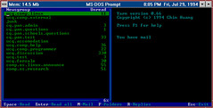

Brett Carter, Jason Lockwood, Sean O’Kelly, Chris Parry, Shane Atkinson, Terry Manderson, David Jones CQ-PAN: Putting Schools into Cyberspace, Information On-Line and On-Disk 95, Sydney

## Abstract

The Central Queensland University Public Access Network (CQ-PAN) is a research project within the Department of Maths and Computing of the Central Queensland University. As part of the project over 250 users from 8 schools from Rockhampton, Yeppoon and Gladstone have been provided access to the Internet for as little as 30 cents a day.

This paper will

- provide an introduction to how CQ-PAN provides Internet access,
- relate how Internet access has been used by the schools,
- list the Internet resources found to be useful by the school users,
- discuss the factors that effect the success or failure of Internet access in schools, and
- outline the future plans for CQ-PAN.

**_Presented at the Information On-Line and On-Disc conference. Sydney, January 1995_**

## Introduction

Information Super-Highway, Internet and Computer Mediated Communications (CMC) are terms that are being thrown at teachers at an ever increasing rate. At almost every turn teachers hear what a revolutionary effect this technology will have on the way they teach. Even if the Internet propaganda is true a teacher must face the tremendous hurdle of connecting their classroom or school to the Internet before seeing any benefit.

Many schools have neither the knowledge or the resources required to connect a school to the Internet. In metropolitan areas commercial Internet providers are springing up to service the needs of schools with the available funds. However schools in regional centres cannot make use of this option (even if they had the funds) as commercial providers are yet to reach regional centres.

Over 250 school users from 9 schools in Rockhampton, Yeppoon and Gladstone have Internet access at a cost of about 30 cents a day. The schools receive Internet access as part of the Central Queensland University Public Access Network (CQ-PAN) project. The design of the CQ-PAN Internet connection is such that it uses a school's existing computing equipment. In addition to the physical connection, CQ-PAN also provides the training and assistance necessary to get the most out of the Internet.

## What is CQ-PAN?

The Central Queensland University's Public Access Network (CQ-PAN) project is a research project within the Department of Maths & Computing at the Central Queensland University. The project has the following aims

- investigate and develop new methods of distributing information using computer mediated communications (CMC) and computer networks,
- make the advantages of CMC available to the Central Queensland community as inexpensively and simply as possible,
- research how this technology changes the people that use it, and
- provide the students studying the Department's Bachelor of Information Technology degree experience in developing and maintaining a computer system with a real application and users.

The project started in late 1993 when two Rockhampton teachers gained Internet access via a complex UNIX command line interface. Even with the extra difficulty one of the teachers found the Internet a tremendous professional and social resource (Boggs & Jones, 1994a).

The lessons learnt during 1993 led to the development of two simple and inexpensive Internet access methods. The two systems are

- an off-line system, and
The system used by whole school populations to gain access to Internet electronic mail and Usenet news.- a menu based on-line system.
This system provides access to all the Internet protocols available from a UNIX command line prompt but wraps the interface in a simple menu.

Table 1 summarises the variety of users that are currently using the CQ-PAN system.

| Community Sector | System | \# of Users |
| --- | --- | --- |
| Schools | off-line | 250+ users from 8 schools |
| School Teachers | on-line | 10 |
| Gladstone West Primary School | on-line | 12 |
| CQU Students | on-line | 160 |
| Retirement Village | on-line | 1 |

Table 1 - CQ-PAN User Community (Nov \`94)

## How schools are connected

The traditional method for using most forms of CMC is an on-line connection. With an on-line system the user must have a connection (usually via a modem) to some remote machine while performing any type of CMC. Most schools in the Central Queensland area have 600 plus students, one modem and a shared phone line for the modem. With these resources it is impossible to implement some form of on-line connection for use by an entire school.

The solution is to use an off-line system. In an off-line system all human interaction (reading mail messages, editing replies) takes place on a local computer with no connection to a remote machine. All information required by the users remains on the local machine. Occasionally the local computer connects with the remote machine to exchange information for all users. With the CQ-PAN system this connection requires little or no human interaction.

Connecting a school to the Internet using CQ-PAN follows these steps

- identify a teacher with significant interest in using the Internet to act as the school's CQ-PAN supervisor,  
    This teacher will be responsible for the school's off-line system and be expected to become the local Internet evangelist. At present most supervising teachers are the schools computing teacher.
- provide that teacher with an on-line account,  
    The aim is that the supervising teacher uses this to become familiar with the Internet and will be able to gain immediate access to the Internet in order to manage the school's off-line system effectively.
- provide documentation and set up the school's off-line system, and
- provide on-going support and assistance.

Once an off-line system is installed the teacher in charge is responsible for

- initiating connections with the University computer,  
    This is a simple process requiring the teacher to enter a password and a time at which to dial the University. The remainder of the process requires no human interaction.
- adding new school users and subscribing newsgroups, and  
    The school can control who has accounts and what newsgroups it receives.
- providing local assistance and training.

The system can be

- installed onto a single machine,  
    In this situation only one user can access their e-mail and news at a time
- installed onto many, unconnected machines, or  
    Some schools have multiple computers but do not have a LAN. These machines can provide multiple access points to e-mail and news by walking floppy disks, which contain information, between them. (Jokingly referred to as sneakernet.)
- installed onto the schools local area network (LAN).  
    Each school user can access their e-mail and news from anywhere on the school's LAN using their normal user account.

CQU computing students provide technical support as part of their degree program. The aim is that each school builds up their expertise in the area and can eventually use the system with minimal support from CQU.

## Why connect schools to the Internet?

CQ-PAN's school users have demonstrated that Internet access can be one of the greatest educational resources to become available to schools. If all goes well Internet access can fulfil the following roles for an educational institution

- an information retrieval tool,
- a communications tool,
- a professional development mechanism, and
- an administration tool.

The amount and variety of information available on the Internet is growing all the time. The information available on the Internet ranges from pictures of the Shoe-Maker Levy comet hitting Jupiter to discussion of environmental issues. CQ-PAN schools are finding that the Internet can supplement other existing information sources such as libraries.

The Internet is one of the greatest communication mechanisms known. School children in Central Queensland are exchanging electronic mail with some of the estimated 30 million people connected to the Internet. The nature of the net means that the content of the conversation is important not the appearance or physical location of the participants.

Contrary to the belief of some teachers, the people who gain the most from connection to the Internet are the teachers, not the students. The Internet provides two important features for teachers

- access to discussion groups on a variety of educational topics, and
- various other information sources on education and related topics.

Universal Internet access within an education system would be a very useful and inexpensive communication tool. Electronic mail could distribute information to all teachers within the system quicker and cheaper than existing dissemination methods.

## The Design of School Software

When deciding how to connect Central Queensland schools to the Internet the following issues were taken into account

- the difficulty of some Internet interfaces,
- limited school budgets, and
- the limited level of computer technology and knowledge in schools.

All of these issues effected the design and implementation of the CQ-PAN system.

### Difficult Internet Interfaces

The first school users of the CQ-PAN system gained their Internet access via a UNIX command line interface. The difficulty of this interface meant that one of the teachers stopped using the system soon after starting. The remaining teacher spent two or three months climbing a learning curve before completing any useful work.

The main users of the CQ-PAN system will be computer novices. This means that it must be have a very small learning curve. As a result the design of the CQ-PAN software used the following principles

- limit the knowledge required by the users, and  
    To access the Internet users need to know the basics of Internet addressing, how to behave on the Internet (netiquette) and how to use a text editor.
- make use of computer environments that are likely to be familiar.

The current system works and looks like any other text based MS-DOS application. An environment which most, if not all, school users are familiar.

Figure 1 - The CQ-PAN Off-line Interface (the YARN newsreader).

### Limited School Budgets

The Internet is a new technology and connecting to it can require a significant injection of resources, funds and time. Convincing school administration that a school should invest part of a limited school budget into an untried technology can be difficult.

All software used by CQ-PAN is freely available and designed to use existing school computer equipment. The only costs to the schools using the CQ-PAN system are

- a local phone call every day, and
- the time required by the users to learn about and use the Internet.

### Limited Computer Technology

The Internet in its latest, greatest multi-media form requires significant computer resources both in hardware and communications technologies. Schools in the Rockhampton area do not have the technology, resources or know how to support the latest technology. As a result the early CQ-PAN system does not attempt to provide access to the latest, greatest tools but instead concentrates on providing simple access.

The system installed into the schools by CQ-PAN will run on an IBM XT with as little as 5Mb of free disk space. The software will allow an entire school population to gain access to Internet e-mail and Usenet news with a modem as slow as 1200bps. The software will also work on most PC based local area networks (it is currently being used on Novell and Lantastic networks).

## The Software

The software development carried out as part of the CQ-PAN system has involved taking existing separate software packages and combining them into a simple working system. All software used in the CQ-PAN system is in the public domain and is freely distributable. The resulting combined software systems produced by the CQ-PAN project are also in the public domain.

Table 2 describes the separate software packages that make up the CQ-PAN system.

| Title | Purpose |
| --- | --- |
| Linux | operating system on the CQ-PAN server machine |
| Yarn | MS-DOS based e-mail and news reader |
| MS-Kermit | communications package used to transfer information between the schools and the University |
| lha | compression program for both MS-DOS and UNIX |
| uqwk | UNIX based program used to package a schools e-mail and news |
| MENU | a UNIX menu front-end used for the on-line system |

Table 2 - Software used in the CQ-PAN System.

## How it has been used

During 1994 school users have put the CQ-PAN system to the following uses

- professional development,
- used by students to communicate with peers from throughout the world, and
- specific projects between local and overseas classes.

### Professional Development

There is a feeling amongst many teachers that it is only the students that will benefit from the Internet. This is a misguided impression.

The teachers currently using CQ-PAN gain the same if not more advantage from their Internet connection than do the students. The Internet contains a number of virtual communities in which professionals from throughout the world gather to discuss their profession. The population of these communities and the expertise represented means that they form a wonderful professional development resource.

The following excerpt (Boggs & Jones, 1994a) provides an example of the type of professional development that is possible with the Internet.

> When preparing my semester planner for the new Maths B course, I was unable to find any pre-calculus applications of polynomials. I posted a request to the K12.ed.math newsgroup. In a few days I received a five page reply from a teacher in New Hampshire in the US. Wonderful!

Many of the teachers in charge of school off-line systems are also members of the Queensland Society for Information Technology Educators (QSITE). E-mail is now a useful communication mechanism for the Rockhampton QSITE branch as almost all members have an e-mail account.

### K12.chat.junior, K12.chat.senior and Social Interaction

K12.chat.junior and K12.chat.senior are two newsgroups generally inhabited by 13-17 year olds from throughout the world. Students use these newsgroups to discuss a large variety of topics ranging from Nintendo games to death. Over the last year these newsgroups, previously the playground of children from the United States, has seen the influx of contributors from Rockhampton and Yeppoon.

Whilst not used for curriculum purposes these newsgroups lead to the discussion of issues and the formation of keypal relationships. This social interaction introduces local students to different cultures and encourages the use of written communication.

### Specific Projects

Participating in or creating Internet projects that makes use of the Internet to add value to a curriculum project can provide some of the greatest benefits of Internet use. One such project is MathMagic. MathMagic involves teams of students from different countries working together to solve mathematical problems. Rockhampton students have participated in MathMagic using e-mail to work with team members in Illinios.

October 1994 saw the start of the first international Internet project originating from the CQ-PAN system. Year 9 geography students from Glenmore State High School are using the Internet to gain information on the topic "What can Indigenous People teach us about the environment?".

The students are using the Internet and a number of mailing lists to research selected indigenous people (see Table 3). The students post questions about the particular indigenous people to the appropriate mailing list that are answered by the other participants. People participating in the project include members of the indigenous populations being studied, University Professors, post-graduates and other interested people from throughout the world.

| Mailing List | Region and People |
| --- | --- |
| navajo | SouthWestern US, Navajo, Tohono O'odham |
| chinook | Northern US, Chinook, Ogalala Sioux and Tlingit |
| maori | New Zealand |
| hawaiian | Hawaii |
| guinea | West Africa |
| !kung | Africa |
| aboriginal | Australia |

Table 3 - Indigenous People Mailing Lists.

Instead of being restricted to text books borrowed from the library the students can communicate directly with a mentor. This project demonstrates that the Internet can add significantly to the existing curriculum.

## Reasons for the success and failure

Simply providing an Internet connection does not guarantee that its use within a school will be a success. There are a number of reasons that effect the success or failure of Internet connections. Not all schools using the CQ-PAN system are equally successful. Some of the factors that effect the success of connections include

- time,  
    Getting the link is only the first and often easiest part. Investing the time necessary for the Internet to become useful is equally as essential.
- the person involved, and  
    Having the right sort of person driving the use of the Internet is important.
- the technology available.  
    A schools connection to the Internet can die very quickly if the computer technology is hard to use or unreliable.

All schools where CQ-PAN has succeeded have done so because the school has a committed and capable person investing the necessary time and effort.

A previous paper (Boggs & Jones 1994b) relates in more detail the lessons learned in connecting schools to the Internet, including what factors control whether or not it is successful.

## Useful Internet resources

The greatest difficulty faced by many new Internet users is how to find interesting and relevant information sources. The following sections lists some of the Internet resources found to be useful by the CQ-PAN school users.

The type of Internet resources listed below provide some indication of the type of teacher that currently makes most use of the CQ-PAN system. They are typically mathematics or technology based teachers. Hopefully next year will see other teachers, particularly from the humanities, making more use of CQ-PAN.

### Newsgroups

| Newsgroup | Purpose |
| --- | --- |
| k12.math.ed | primary and secondary mathematics |
| sci.math | all things mathematical |
| rec.puzzles | for puzzle lovers of all type |
| comp.sys.novell.\* | technical newsgroup for Novell networks |
| comp.ai.\* | artificial intelligence |
| comp.society.futures | events in technology |
| comp.society.privacy | technology and privacy |

Table 4 - Useful Newsgroups.

### Mailing Lists

| Label | Address | Purpose |
| --- | --- | --- |
| NCTM-L | listproc@sci-ed.fit.edu | primary and secondary mathematics |
| Pre-Calc | listserv@ipfwvm.bitnet | pre-calculus education |
| The Geometry Forum | annie@forum.swarthmore.edu | anything related to geometry education |
| MathMagic | alanh@laguna.epcc.edu | math problem solving |
| EduPage | listproc@educom.edu | Educational newsletter |
| Daily Report Card News Service | listserv@gwuvm.bitnet | educational tidbits from around the world |
| Edtech | listserv@msu.edu | educational uses of technology |

Table 5 - Useful Mailing Lists.

## The Future

The future of CQ-PAN holds a number of exciting prospects including

- further development and improvement of the software being used,
- an increase in the variety of services offered,
- an increase in the size and geographical spread of the user population, and
- an increasing strain on the project's limited resources.

### Software Development

During 1995 the software used by the CQ-PAN project will hopefully undergo a complete rewrite. Software development currently on the drawing board includes

- a new on-line menu system with an improved interface,
- improvement of all components of the off-line system including a Windows based off-line mail and news reader, and
- the development of new methods for providing on-line access to services like World-Wide Web.

CQ-PAN will continue its policy of making all software freely available on the Internet.

### Increasing User Population

During 1995 the user population of CQ-PAN will be increased by

- a wider spread of users from existing schools,
- the addition of new schools from throughout regional Central Queensland, and
- the possible use of the system by the general community.

CQU has an integrated multi-campus structure with campuses situated at Bundaberg, Gladstone, Rockhampton, Mackay and Emerald. A permanent ISDN link connects most campuses back to the Rockhampton campus. By using the ISDN links residents of regional Central Queensland can access the central CQ-PAN machine (on the Rockhampton campus) by using modems situated at the campus closest to them. This helps reduce the communications cost for the more remote user.

By the middle of 1995 approximately 30 Central Queensland primary school students and small primary schools from the more remote areas of Central Queensland will gain access to the CQ-PAN system. The system will provide a more effective communication mechanism as well as providing access to the Internet's various information sources.

### Increased Services

The current off-line system limits school users to electronic mail and Usenet news. They cannot access on-line services such as ftp, gopher and World-Wide Web. During 1995 software available on the Internet will provide schools with access to the latest, greatest Internet retrieval tools, Mosaic and World-Wide Web.

The plan is to retain the existing off-line system as the main communications mechanism. In addition schools will gain SLIP access that will enable individual students and teachers to use the Internet as an information search and retrieval tool.

### Increasing Strain on Resources

Since the middle of 1994 the resources available to the CQ-PAN project have been under considerable strain. The number of modems and the size and power of the CQ-PAN computer are becoming increasingly inadequate.

CQU's Rockhampton campus currently has six modems handling incoming connections. This is an insufficient number for the purposes of CQU's staff and students let alone for an active and continually growing on-line community.

CQ-PAN's current server machine is a 486DX2-66 with 16Mb of RAM and 420Mb of hard disk space. For the majority of the last six months (and longer) disk usage on the machine has been running at least 90% full. During semester the average number of users during the day sits at around fifteen. A cheap 486 clone is not the best type of machine to handle this load.

## Conclusions

CQ-PAN is a research project within the Department of Maths & Computing of the Central Queensland University. A part of the project is providing cheap and simple Internet connections to schools within the Central Queensland area. The current CQ-PAN population includes over 250 users from 8 Central Queensland schools.

Connections to the Internet have become useful where the following problems have been overcome

- technical problems with modems and computers,
- the learning curve of the Internet, and
- the amount of time on the part of teachers to make it successful.

The experience gained from the project has shown that given the right environment the Internet can be an exciting and useful educational resource.

## Bibliography

Boggs, R. Jones, D (1994a). Cyberspace: The New Educational Frontier. QSITE State Conference. Rockhampton.

Boggs, R. Jones, D. (1994b). Lessons Learnt in Connecting Schools to the Internet. _Australian Educational Computing_, Volume 9 Number 2.