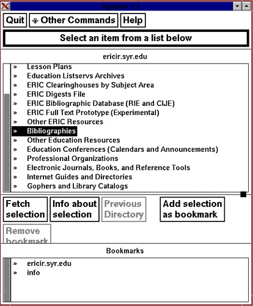
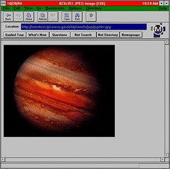

See also: [[blog-home | Home]]

Rex Boggs, David Jones. Cyberspace: The New Educational Frontier., Queensland Society for Information Technology in Education (QSITE) conference, Rockhampton, April, 1994.

## What is Cyberspace?

Many computing people will be familiar and possibly have experience with bulletin boards or other forms of Computer Mediated Communication (CMC) through the use of Keylink, Pegasus, Fidonet or some other system. In the past most of these systems have not been connected together. The residents of these isolated systems have been unable to communicate with each other. This separation has limited the usefulness of CMC.

Cyberspace is a term that was first mentioned in the novel Neuromancer by William Gibson. The term Cyberspace describes a virtual environment created by the connection of millions of computers into global networks. You can't touch or point to Cyberspace but this new environment is inhabited by millions of people world wide and contains vast amounts of information on every facet of life. Cyberspace is a new community in which anyone from anywhere in the world can join regardless of race, sex or creed (as long as they have a computer and a connection). Like any environment cyberspace has it's own rules and ways of life.

Cyberspace exists now in the form of the Internet. The Internet was initially developed by the American Department of Defence as an information network that could survive a nuclear war. Since then the Internet has developed into a research tool used by Universities and is now a medium now being utilised by the general public.

The growth rate of the Internet over the last few years has been phenomenal. The rate of growth means that any sort of statistics on participation is typically out of date pretty soon.

According to recent estimates, there are

- over ten thousand separate networks making up the Internet
- over two million computers connected to the Internet,
- over twenty million people taking part in the Internet
- 137 countries accessible via Internet e-mail

## What's out there in cyberspace?

What's out there in Cyberspace? People, information and conversation.

The major currencies of the Internet are information and communication. Information, free to use, is available in a plethora of different subject areas is stored in many different formats on most of the two million computers connected to the Internet.

Since the Internet makes no notice of physical location and isolation each of the ten million people from all over the world can communicate with each other using a variety of methods. These methods of communication fall into two basic categories

- interactively, Similar to a conversation over the phone but computer text replaces voice as the communication mechanism.
- non-interactively. The person receiving your message doesn't actually have to in the Internet at the time you send it. The next time they connect your message will be waiting for them. Similar to what happens when you make use of the postal service.

Both these categories are implemented by using different communication tools. Some of these tools keep the communication one on one. Other tools allow group participation in communication.

The rest of this section is taken up with brief descriptions of some of the resources and method for accessing them that exist in Cyberspace. During the actual workshop you will experience many of the following resources first hand.

## Your home address

Everyone in cyberspace has a home address. Your Internet home address allows the other residents of cyberspace to find you.

An Internet address will usually look something like

> my\_name@machine.site.domain

For example, david@aldur.ucq.edu.au

| Address Portion | Meaning | Example |
| --- | --- | --- |
| my\_name | A person's user name | david |
| machine | The machine used to connect to the Internet | aldur |
| site | The location of the machine | ucq |
| domain | The type of site and its country | edu.au |

TABLE 1 - INTERNET ADDRESS COMPONENTS.

The example address breaks down as follows. david is the user's name that is unique to the machine aldur. The machine aldur physically resides on the campus of the University of Central Queensland (UCQ) and is connected to the UCQ network. On the Internet the University is known as the site ucq.

The domain identifies what type of site it is and in which country it is located. Tables 2 & 3 give examples of some other site types and countries.

| Site Type | Meaning |
| --- | --- |
| com | A company (e.g. IBM) |
| gov | A government agency (e.g. the DPI) |

Table 2 - Example Internet Site Types.

| Country Code | Country Name |
| --- | --- |
| au | Australia |
| ca | Canada |
| uk | United Kingdom |
| fr | France |
| nothing | United States |

Table 3 - Example Internet Country Codes.

## E-Mail

The simplest form of communication on the Internet is electronic mail. E-mail is very similar to the normal postal mail (referred to by the denizens of the net as snail mail). Instead of sending a package or pieces of paper you send computer files. Instead of a postal address you use an Internet address.

## Mailing Lists

A mailing list is an e-mail distribution list. It contains the Internet addresses of numerous people. By sending an e-mail message to the mailing list all the people in the mailing list will receive that same e-mail message. Mailing lists are formed when a group of people want to discuss a particular topic. Table 4 lists some of the 5000 plus mailing lists that exist and the their topics of discussion.

Mailing lists typically have two addresses. One of these addresses is the administrative address and the other is the public address. Mail is sent to the administrative address to carry out some specific function e.g. join the list, obtain a list of all the people on the list, leave a list. Any mail sent to the public address is broadcast to the entire population of the list.

An e-mail message to a specific person is considered private. An e-mail message sent to a mailing list is public. Consequently you must be careful of what you say in a public forum.

| Mailing List Name | Topic |
| --- | --- |
| ednet | General discussion about education |
| iecc | International forum for finding e-mail project partners |
| precalc | discussion about the problems with teaching precalculus math students |

Table 4 - Example Mailing Lists.

**BE WARNED!!!!** The population of some mailing lists can be rather large. This means that there is likely to be a large number of messages coming from the mailing list each day. Going away on holiday and coming back to find 2000 mail messages waiting is not unheard of (ways exist for stopping the flow while you are on holiday).

## Usenet News

Usenet news is very similar to mailing lists. The main difference is that news postings are not sent to the e-mail boxes of individual users. They are instead distributed to central locations on all the machines that carry news. Users read or post articles to news groups by using a program called a news reader. The news reader access the central location on which news is stored.

There are over three thousand different news groups. Each newsgroup (like mailing lists) consists of discussion about one particular topic. Topics range from maths education in high schools to discussions of a more risque nature. Figure 1 provides a brief sample of some of the news groups.

| Newsgroup | Subject |
| --- | --- |
| k12.ed.science | Science curriculum in K-12 education. |
| k12.ed.soc-studies | Social Studies and History curriculum in K12 education |
| k12.ed.special | K-12 education for students with handicaps |
| k12.ed.tag | K-12 education for talented and gifted students |
| k12.ed.tech | Industrial Arts and vocational education |
| k12.lang.art | Language Arts curriculum in K-12 education |
| k12.lang.deutsch-eng | Bilingual German/English practice with native speakers |
| k12.lang.esp-eng | Bilingual Spanish/English practice with native speakers |
| k12.lang.francais | Bilingual French/English practice with native speakers |
| k12.lang.russian | Bilingual Russian/English practice with native speakers |
| aus.culture.china | China discussions. \[Australian\] |
| soc.culture.french | French culture, history, and related discussion |
| aus.jokes | Jokes, humour, and boring trivia. \[Australian\] |
| soc.politics | Political problems, systems, solutions. |

Figure 1 - Sample Newsgroups and Topics.

## Internet Relay Chat (IRC)

E-mail and Usenet news are not interactive. You send a mail message and at sometime in the future someone will respond. IRC on the other hand is totally interactive.

At anytime of the day or night there can be thousands of people across the world talking using IRC. Discussion groups in IRC take the form of channels. Each channel is set up for a particular reason and can have hundreds of people all viewing and contributing to the same conversation.

When you are using IRC almost everything you type is seen by everyone else in your channel and you see almost everything typed by them.

## File Transfer Protocol (FTP)

Across the Internet there are thousands (millions) of anonymous FTP sites. An anonymous FTP site is a computer that contains public domain or shareware computer programs, picture files, sounds and other information that is available free of charge for anyone on the Internet. There is gigabyte upon gigabyte of information available ranging from Japanese word-processors, education software, the latest pictures from the Hubble space telescope, the text of the bible and games.

To obtain copies of the available software a special protocol called FTP is used. FTP tools allow you to connect to FTP sites and transfer information from the site to your computer. There are a number of different interfaces to FTP including difficult to use command-line interfaces and simple graphical user interfaces.

## Gopher

Gopher allows you to traverse the information contained on the Internet by choosing options from a menu or by pointing and clicking with a mouse. These options allow you to travel between gopher servers and gain access to almost every type of service and resource available on the Internet.

Like FTP there are both text and graphical interfaces that allow you to use gopher to navigate cyberspace. The graphical interfaces allow you to display pictures or play sounds that you find on the Internet.

## World Wide Web (WWW).

World-Wide Web is another front end to the Internet that allows makes it easier for you to navigate in Cyberspace. Instead of presenting a menu type interface like gopher, WWW uses a hypertext, multi-media interface to the Internet.

WWW presents you with a series of pages that can contain text, icons and pictures. Highlighted words and the icons are used as links to other WWW pages. By selecting these links you can connect to other WWW pages. A WWW page could contain pointers to software, pictures, sound and even animation. Figure 3 is an example WWW page.

WWW allows you to access almost all of the information sources on the Internet. The fact that use of WWW has increased by 360 000% in the last year demonstrates its usefulness!

Figure 2 - The AskERIC Gopher Menu.

Figure 3 - A Windows based WWW Client called Netscape.

## Connecting schools to the Internet

The Department of Maths & Computing at the University of Central Queensland is currently providing access to the Internet to schools in the local Rockhampton area (expansion to the entire Central Queensland area is planned). This work is being carried out via a project called the University of Central Queensland's Public Access Network (CQ-PAN).

School Internet connections can be achieved using a variety of technologies. The technology ranges from a cheap (almost free), off-line connection to an expensive permanent connection.

## The Initial System

The aim of the initial system is to provide the students and teachers with a taste of the Internet. It demonstrates the educational usefulness of the Internet at little or no cost to the school. Once the advantages of the Internet have been demonstrated it should be easier for the schools to justify the additional cost in having a more expensive, better equipped connection

The need to keep the system inexpensive means that the first system will provide access to the off-line Internet resources e-mail and Usenet news only.

## Equipment and Software

To use the initial system the schools must have an IBM PC clone with some hard drive space, a modem and a phone line to connect it to (the modem only needs to be connected for an hour or so each day). The recurring cost of this Internet connection amounts to the cost of a local phone call every day.

The CQ-PAN project team will provide the software, documentation and training necessary to use the connection. The documentation will include information from school teachers that relates how they have used the Internet with their classes. The documentation will include pointers to educationally useful Internet resources.

## How it works

The Department of Maths and Computing will supply a large IBM PC clone running Linux (a free Unix operating system). This machine is connected full time to the Internet. It is the machine that the schools dial up and when they want to obtain all their new mail and news.

Everyday one teacher at each school will prepare the school computer, modem and phone line for the connection. This will be different for every site depending on setup and resources. Once ready they enter the command getnews, and enter a password. This starts up a program that uses the entered password to connect to the University Unix computer. The program will

- automatically dial the University modem at a time set by the teacher
- if the UCQ modem is busy it will wait and try again later
- eventually connect to the UCQ computer
- transfer all the mail and news files for all the school users from the UCQ computer to the school computer
- transfer all the mail replies and news postings being sent by the school's users from the school's computer to the UCQ computer
- disconnect for the UCQ computer

The whole process is non-interactive. Once the password has been entered the teacher may walk away.

Once mail and news for all the school's users has been downloaded a decision must be made. How will the users will read their mail and news? The simplest method involves every school user reading their mail and news from the machine that obtained the mail and news.

To do so the users type the following command.

> setuser _username_

Where _username_ corresponds to their Internet username.

If users wish to read their mail and news on a computer other than the computer that dialled the University. They must first transfer their mail and news to the required computer and then execute the setuser command. Methods for easily distributing the mail and news for specific users to other computers, whether they be connected to a local area network or not, are being developed.

## Future Plans

There are two major aims we are working towards

- providing this system to as many schools in the Rockhampton and the greater Central Queensland area as possible.
- providing schools with an on-line service by which they can have access to the interactive tools like IRC, FTP, Gopher and WWW.

## Expanding the scope of the System

The current system costs participating schools one local phone call per day. In the future we may be able to extend this local call system to schools within local call range of Bundaberg, Emerald, Gladstone and Mackay. UCQ has branch campuses exist in each of these towns. Each branch campus is connected to the UCQ network.

The plan for the future schools is that schools in the Central Queensland area would dial the closest branch campus and then connect to the CQ-PAN central computer by using the UCQ network. Thereby maintaining the systems daily cost of a local phone call.

## Providing an On-Line Connection

The initial system provides the schools with an off-line connection to the Internet. At no time do the school's users interact directly with the Internet. This means that Internet resources such as FTP, IRC, WWW and Gopher are unavailable. We want to remedy this situation.

To do so is not an inexpensive business. An on-line connection would require the following

- A phone line between the school and the University dedicated only to the connection.
- High speed modems at either end (at least 9600 bps but preferably 14 400, 19 200 or faster).
- A server type machine at the school end.
- Additional skills and knowledge on the part of the school person maintaining the link.

The aim of this system would be to place in each school a machine similar to the current central CQ-PAN computer. This machine would be connected full-time to the Internet via the schools direct link to the University. It would have to be at least a reasonably large 486 type computer.

The direct link would have to be as fast as possible. A 14 400 bps modem would be the minimum for such a link. The faster the link the better the service that could be provided. The link would have to be implemented at both the school and the University. The University would have to have one link per school.

We are hoping to at least test such a connection before the end of the year. This is of course dependant on obtaining the resources necessary. This is not a certain thing.

## How the Internet can be used by schools

The best way to demonstrate the usefulness of the Internet to teachers and students is to have a teacher relate their # 'his', since the sex of the person is known (I hope) # personal experience with the Internet.. The following relates the experience of Rex Boggs during his first six months of using the Internet. Rex is a maths teacher at Glenmore State High School in Rockhampton and was the initial guinea pig used by the Department to discover the prospects of this project.

## Education in Cyberspace- Linking Students through the Internet

Thanks to David Jones at the UCQ, I have had access to Internet since September of last year. I dial the UCQ using either my school's modem, or my modem at home, log in and the Internet world is at my fingertips. I correspond with friends and colleagues around the world, listen to or partake in some lively, at times even volatile discussions, and download shareware programs and pictures. I usually have a daily Internet session, often in the late evening so I am not tying up my own telephone line. l find it the Internet stimulating and fascinating, but also very addictive and very time-consuming. Be warned!

Below are the most useful Internet facilities that I have accessed. They are roughly in order of merit (though don't ask me what criteria I used)!

## Email and Mailing Lists

Email is the heart and soul of Internet. Every person connected to the Internet has a unique email address. Mine is rex@aldur.ucq.edu.au. Anyone on the Internet can write to me and vice versa. Kids, teachers, classes and experts from all around the world can share experiences and ideas, plan joint projects, discuss, argue, ask questions and learn from each other.

When I first was given an email address, I had no one to write to. And no one wrote to me. I was like a person with a telephone but no telephone book. Eventually I made a few contacts through some educational networks in the US. But the real world of email was only opened up to me when I found out about mailing lists.

Mailing lists allow people with a common interest to post their thoughts, ruminations, requests for help, questions and responses. Each mailing list has a central focus, and the postings revolve loosely around that topic.

There are over 5000 mailing lists currently available, and the number is growing daily. All of these are available to anyone with Internet access. To join a mailing list, all you have to do is send a message to the list coordinator (or to his computer) asking if you can 'subscribe' to that list. Subscriptions, like most things on the Internet, are FREE. Very soon, often within a few minutes, you get a reply saying that you have been added to the list, and a letter that explains the procedures and 'netiquette' for using that list.

From then on, any messages that are sent to the list are automatically posted to the email address of every person on the mailing list. For example, I wrote a letter to the EdNet mailing list with the subject line 'Internet on a Shoestring', explaining that we had full Internet access but only a single 2400 baud modem that shares a phone line with the fax machine, and which is not linked up to our network. I asked how we could best utilise such limited facilities with a staff of 60 teachers and a student population of 700 students. The query went out to about 1000 people around the world (though the majority are in the US). Within half an hour I started getting replies, and they trickled in for a couple of weeks. I received heaps of encouragement and good advice from some pretty knowledgable folks.

I currently subscribe to five mailing lists :-

- EdNet Initially for discussions about the educational use of the Internet, but it has now become a general discussion centre for any issues relating to education;
- KidSphere Teachers from kindergarten to university ask for advice, and chat about things educational;
- IECC International Educational Computer Conference. This list was set up for teachers to post proposals for Internet educational projects. It has now been split into a number of mailing lists - one for posting project proposals, one for general discussion, etc;
- Physics Forum For discussions on physics and physics education.
- MathMagic Teams of students from Glenmore High School will link with other teams from elsewhere in the world and work cooperatively to solve open-ended maths problems. There are problems for all year levels from year 1 to year 12 Since Internet is text-based, students must communicate their results very clearly.

All messages posted to these mailing lists come to my email mailbox. On average there are about eighty messages in total generated by these mailing lists each day. Many of the postings are of little interest to me, so I scan the first few lines and then delete them. Others I read through and then delete. With any that I wish to retain, I append them to a file and can then access them later. I find browsing through these postings to be very stimulating.

Much of what is posted to these mailing lists is not of interest to me but may be of interest to other teachers at Glenmore High School. I save these postings, in separate files for English, Languages, SOS, etc. About once a week I print out the postings for a particular subject area and drop them into a pigeonhole. Hopefully over this coming school year, a number of Glenmore teachers will become involved in an Internet project with classes from other parts of the world

Here are a few examples of some of the ways that I have used email with the Internet :-

- Last year my 9 Extension Maths class was involved in a maths problem email exchange with a school in Ohio. We sent introductory letters, questions about the school, town and environment and swapped our favourite maths puzzles. We also set up email penfriends between individual students and groups of students. We are still corresponding.
- I posted a request by our language teachers asking if anyone would be interested in having email penfriends who would correspond in either French or Japanese, the two languages taught at Glenmore. Within a few hours I had my first responses - one from Canada and one from Japan. More responses have arrived since then. I have also been given directions on how to locate a shareware Japanese word processor on the Internet.
- When preparing my semester planner for the new Maths B course, I was unable to find any pre-calculus applications of polynomials. I posted a request to the K12.ed.math newsgroup. In a few days I received a five page reply from a teacher in New Hampshire in the US. Wonderful!
- A junior school social studies teacher in the US asked if classes from around the world would send data on the times of sunrise and sunset in their home town, as well as their longitude and latitude. She was using the data to illustrate to her students that the length of the day was a function of latitude. She received over 100 replies, summarised them, and posted the results back to the mailing list for others to use. I downloaded the data to use at a later stage with my Maths A kids.

One of the more intriguing educational services available on the Internet is ASKERIC. ERIC is the Educational Resources Information Center (ERIC), an information system that provides access to an extensive body of education-related resources. AskERIC is an Internet-based question-answering service for teachers, library media specialists, and administrators, and others involved in K-12 education. The hallmark of AskERIC is the human on the other end of the connection. They claim to deliver information resources within 48 working hours.

I posted my first requests to ASKERIC - I am looking for a secondary mathematics education mailing list, and information on how to find a class of students studying the Japanese language who would want to become penfriends. I received a reply from ERIC within two working days, and a request to ask more questions!

## Newsgroups

Newsgroups are kissing cousins to mailing lists. Messages to mailing lists are posted directly to the email address of every person on the list. Messages to newsgroups are posted to a central bulletin board. To access newsgroups, you log into the bulletin board, read the discussions that are taking place, add your bit of wisdom if you wish, save the articles that you want to save and then log out.

I tend to read newsgroups about once a week, while I read my mail every day. Because of this, newsgroups are less immediate than mailing lists. They are easier to manage, though; if you go on holidays for a week and don't shut off the flow of messages, your emailbox can be stuffed with hundreds of postings when you return!

As with mailing lists, newsgroups are subject-specific. The UCQ currently 'subscribes' (again, at no cost) to about 1600 newsgroups, out of the approximately 3000 available (unfortunately they don't subscribe to the newsgroup alt.sex.hamsters.bondage, but them's the breaks). I personally subscribe to about four newsgroups, which is about as many as I have time to read.

There is a collection of newsgroups devoted to K-12 education. For example there is K12.Ed.Art, K12.Ed.Science, K12.Ed.Social.Science, and so on. Some of these newsgroups are more active than others, with Computer Studies, Maths and Science having the most postings. Others are fairly quiet, eg Art and Manual Arts. But they all get postings from time to time.

## Anonymous FTP

Through anonymous FTP (File Transfer Protocol), you can find and download shareware and public domain software, GIF (ie picture) files and text files. It allows you to log into thousands of computers around the world, browse through their public directories and download anything that you find of interest. I only learned how to use anonymous FTP over the school holidays. I immediately became a software junkie, cruising the Internet looking for useful software.

Here are some of my experiences :-

- I was curious how 'holusions' (those posters that you look cross-eyed at and see a 3-D picture) worked, and wondered if anyone knew the theory behind them and if there were any holusions or holusion software for DOS computers. This question came up in the Physics mailing list, was bandied around for a while, until someone posted an article that explained the theory very thoroughly. The article also said if you want additional information or software, just FTP to University of Waitangi. So I did. I found an academic paper on holusions, software for viewing holusions on your computer screen, and even a simple little drawing program that allows you to make your own holusions.
- I have been on the scout for a shareware version of Logo for months. Using FTP I found both a DOS and a Windows version, and downloaded them both.
- Not long after the astronauts on the Shuttle fixed the Hubble telescope, the physics mailing list had a posting that gave an FTP address (the Jet Propulsion Laboratory) that contained the pictures from the new telescope. They were available just a few hours after they were made public. I immediately downloaded them. Tremendous!
- Finally, you can pull yourself up by the bootstraps, so to speak. There are numerous electronic books and articles on how to effectively use the Internet, available through Anonymous FTP. 'The Big Dummy's Guide to the Internet', 'Let's Go Gopherin' ' and 'Mining the Internet' are just a few.

## The Gopher

The Gopher gives you easy, user-friendly access to a huge mass of information, right around the world. Potentially the Gopher is even more useful than anonymous FTP. When you access a Gopher server, you are presented with a menu. Make a choice and you are then presented with a submenu. Make another choice, any you are presented with the next menu. And so on. Eventually you will reach a level where the menu consists of data files, either text or binary. You can read the text files, post the text files to your own emailbox for later perusal, or save text or binary files to your computer.

All Gopher servers are linked, so if you have access to one Gopher, you have access to every Gopher server in the world. If I want to access the Gopher at the University of Virginia, for example, I would follow a path through the menus similar to this: Gophers Around the World / North America / USA / Virginia / University of Virginia.

I could then move through the menus on the U of V Gopher, read text files or a summary of the binary files and download anything that I wish.

David has only put a Gopher client on his computer recently. Prior to that I was using a public Gopher client. Using a public client, I could mail text files to my mailbox, but I couldn't download files to my directory at UCQ. Because of this restriction, I haven't done much with the Gopher to date.

## Setting Up a Project

Much of the current educational use of Internet seems to be educators talking to educators about education. This is certainly true on the EdNet and KidSphere mailing lists, and the K12.Ed newsgroups. It is very valuable discussion. But the real benefit to schools and kids will come from actual projects that involve the kids directly.

Roughly, projects come in two forms. Some are organised by an external group and involve a large number of schools around the world. An example is MathMagic. Teams of four students register (for $12 US, the only charge on Internet that I've ever been requested to pay) to be part of a maths competition. They are buddied with a team from another school, probably in a different part of the world. An open-ended maths problem is posed. The two teams have to work together, discuss, argue, justify their arguments and produce a joint solution to the problem, which they then post to the mailing list. Cooperation, being able to justify a decision and communicate mathematically are some of the valuable skills that the students learn while being involved in the project.

The other type of project is one that is set up between individual schools. A teacher posts a project proposal to a mailing list or a newsgroup, say a joint study of coral reefs by kids in different parts of the world. Any other teacher that is interested replies privately to that teacher. Once the objectives, procedures and timeline of the project are agreed upon, then its up and away.

Some very creative projects have been devised. A project taking place on March 2 is called 'A Day in the Life of...'. Students who wish to participate keep a diary of how they spent that day. The information is sent to the organising school who will collate it and re-post it. It will be very interesting to see how students in different parts of the world spend an average school day.

When a 'newbie' (network-ese for a neophyte) starts developing their first project, it most likely is something that could have been done using existing communication facilities, though possibly not as easily. Swapping maths problems between classes could be done using a fax machine, for example. It takes some experience and some creative thinking (and maybe some mates and a bottle of scotch) to devise projects that couldn't have been done prior to the Internet. A collaborative project between a number of schools all around the world (eg doing a littering survey in their hometowns and collating the results) would have been near impossible a few year ago, both to initiate and administer.

## Problems and Frustrations

Surfing the Internet is not ALL a joy. For example, the main method of communicating is via a keyboard, which is very s.....l......o...... w...... for most of us. David and I have done a lot of communicating by email in the last six months. Often it may have been more productive to discuss things over the phone instead. When we really need to talk, we usually get together face to face. So the Internet is certainly not a replacement for more traditional means of communication, it just complements those that already exist.

My interface with the Internet is essentially a Unix prompt, so I have had to learn a few Unix commands to get me by. Also each of the facilities of Internet has its own unique set of commands. For example, let's say I want to move up 'one level' in whatever program I'm using. To move to my home directory in Unix, I type 'cd'. When reading mail, to change up to the index, I must type 'i'. Moving up a level in newsgroups, I type 'q'. When using anonymous FTP, I type 'cdup'. And moving up to the previous menu using Gopher, I press 'u'. Unfortunately this lack of standardisation is very common.

I use the vi line editor to compose messages for Mail and Newsgroups. I am told by knowledgeable people that it is very powerful. I'm sure that it is. It is also bloody hard to use. Any of you dinosaurs who used WordStar for CPM back in the early days of personal computers would know the sort of program I'm talking about. The program is command-driven, so if you forget a command, you are stuck. There seems to be little relationship between the keys you press to invoke a command and what the keypress does. For example, H moves the cursor left, X deletes a character, DD deletes a whole line, $ moves the cursor to the end of the line, O inserts a blank line after the current line, and so on. Yuck.

When I download files using anonymous FTP, or save messages from email or newsgroups, all of that data is stored in my home directory on a Unix computer which sits in the corner of David's office. To transfer that information to my own PC, for example binary files such as .zip files, I use a data exchange protocol called Kermit. Kermit is not fast. Using my 14400 baud modem, downloading a 500K file takes about an hour. What I have been doing recently is storing the files on David's computer until I have about three megabytes to download (eg a bunch of .ZIP files). Then in the late evening, I type the appropriate command and set the program running. The next morning, bingo, all the files have been transferred.

Putting out a call for a project partner and getting a response from the other side of the world is a thrill. Getting the first lot of email messages from kids in another country is even more exciting. But even with enthusiastic teachers, careful planning and generous timelines, there are bound to be some hiccups with email projects. Time zones and differing holidays are some of the problems. The reality of limited Internet access can rear its ugly snout. Actually sending emails from one Internet address to another only takes a few seconds. But the entire process may take much longer.

If a school has only one Internet link, which is accessed by just a single person such as the computer coordinator, then sending a message and receiving a reply can take up to a week. A message may go from teacher A to computer coordinator B, across the Internet, to computer coordinator C to teacher D. Teacher D reads the message, maybe discusses it with the kids, and composes a reply. The reply then follows the reverse path. Direct access to the Internet by the teachers or the students markedly speeds the communication process.

Some day all teachers will have direct Internet access through the computer on their desk (?). In this ideal world, the time to reply to would be reduced from days to just seconds. Until then, all computer projects must take into account the current state of Internet access in schools, and the human beings on each end of the very speedy Internet link.

## Surfing the Internet - Catching the Next Wave

What's available on Internet now is primitive to what will be available in the future. At the moment, my interaction with the Internet is text-based, and pokes along at 14400 baud. When the information super highway becomes a reality, the volume of data that will be accessible will supersede what's available on the Internet today, in the same way that a dragline has superseded a man with a shovel. But as a method of making the world smaller, and promoting cultural understanding, the Internet for me, right now, is still marvellous, bloody marvellous.