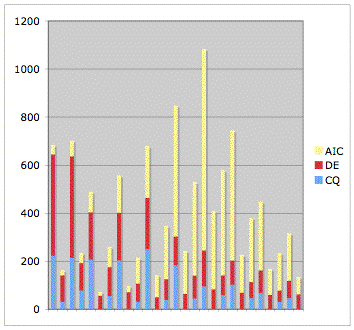

## Abstract

This paper describes the context, justification and design of a set of changes intended to enhance the learning journey of distance education students enrolled in a course called Procedural Programming at Central Queensland University. The changes are designed to reduce the transactional distance (Chen, 2001) experienced by these students, by increasing the level of dialog, and consequently increase the completion rate of the group. The changes include the appropriate use of student web logs (blogs), online assignment submission, computer-assisted marking and podcasting of on-campus lectures and tutorials.

## Context

Learning the fundamentals of how to design and implement computer programs is a core skill for all computing professionals (Shackelford _et al_., 2005). Since 1996, students in Central Queensland University's (CQU's) Bachelor of Information Technology degree have been taught these skills in the two-course sequence currently known as COIT11133, Programming Fundamentals and COIT11134, Procedural Programming. This paper is targeting the first offering of Procedural Programming during the 2006 academic year. This offering starts in early March and finishes in late June.

Procedural Programming builds on the basic programming concepts taught in Programming Fundamentals in order to introduce students to more complex topics including structured design, object orientation, dynamic memory, searching and sorting and compound data structures. Since 1996 students have reported perceptions of a significant leap in the difficulty of the content between the two courses.  A telephone survey of distance education (DE) students who failed Procedural Programming in the first offering of 2005 found that 82% of students found Procedural Programming more difficult than other courses (Agar-Wilson, 2005). In an analysis of the Bloom rating, a measure of the cognitive difficulty of the assignments and exams, of six courses at CQU – Programming Fundamentals, Procedural Programming and four at second and third year level – Procedural Programming was found to have the highest Bloom rating (Oliver, Dobele, Greber, & Roberts, 2004). That is, the assessment of Procedural Programming was found to be cognitively the most difficult of the six courses that were analysed.

CQU's origins date back to the creation of a Rockhampton-based campus of the Queensland Institute of Technology in 1967 (CQU, 2004). CQU offered its first computing course by distance education in 1974 (Hintz, 1977). During the late 1980s CQU established campuses in the Central Queensland (CQ) cities of Mackay, Gladstone, Bundaberg and Emerald to teach local students (CQU, 2004). There was a further expansion of CQU in the 1990s when a number of campuses were created to teach international students at offshore locations and in cities on the Eastern seaboard of mainland Australia (CQU, 2004).

In the past, Procedural Programming has been one of the largest and most complex courses in terms of delivery modes (face-to-face, distance education etc), number of campus and number of times the course was offered per year. Since 1996, the course has usually been offered three times a year via most of CQU's delivery modes. Figure 1 summarises enrolment in Procedural Programming during the period 1996-2005. In this figure students are placed into three main categories: 1) AIC – students at CQU's Australian International campuses in Brisbane, Gold Coast, Sydney, Melbourne, and also at CQU's Fiji campus; 2) DE – distance education students; 3) CQ – students at CQU's CQ-based campuses (Rockhampton, Mackay, Gladstone, Bundaberg and Emerald). 

Figure 1 - COIT11134 enrolment breakdown 2002-2005

Enrolment in Procedural Programming peaked at just over 1000 students in 2002. In the main offering of the course in 2005 there were 316 students. Table 1 illustrates the change in the cohorts within Procedural Programming between 1996 and 2005. To estimate expected student numbers Table 2 compares enrolment in the Procedural Programming in the first offering of 2006 (as of 2nd February 2006) with enrolment in the first offering in 2005 at 2nd February 2005 and at the start of that term. A rough, simple estimate, based on the figures in Table 2, suggests that there will be around 12 distance education students and 11 CQ students for the first offering of Procedural Programming in 2006.

| Student Type | 1996 | 2005 |
| --- | --- | --- |
|   AIC   |   6%   |   62%   |
|   CQ   |   32%   |   15%   |
|   FLEX   |   62%   |   23%   |

Table 1 – Changing cohorts in Procedural Programming (% of total enrolment)

| Student Type | Enrolment for first 2006 offering at 2nd Feb, 2006 | Enrolment for first 2005 offering at 2nd Feb 2005 | Enrolment for first 2005 offering at term start |
| --- | --- | --- | --- |
|   AIC   |   1   |   1   |   79   |
|   CQ   |   8   |   17   |   24   |
|   FLEX   |   8   |   26   |   41   |

Table 2 – Comparison of enrolments in Procedural Programming between first offerings in 2005 and 2006

Since 2002, each offering of Procedural Programming has been supported by an average of 13 teaching staff.  Overall responsibility for the course has been assigned to the course coordinator (CC), who is usually located at one of the CQ campuses. The CC is usually responsible for ensuring that all study material, including lecture slides, study guide, course profiles and the course website, are available to other staff. The CC will not always be the developer of the course materials. In some cases another person who is not involved in the teaching of this course has been assigned to develop the course materials.

The CC is responsible for managing the assessment, moderating the marking of assessment items and uploading results onto the student records system. Typically, the CC has been directly responsible for the teaching and support of distance education students and the students located at the same campus as the CC.  Students enrolled at the AICs and, since 2005, the other CQ-based campuses have local staff who are responsible for providing face-to-face lectures and tutorials.

The assessment for Procedural Programming has normally consisted of two assignments worth between 30-35% and a final exam with 65-70%.  In the first offering of the course in 2006 this assessment will be supplemented by online quizzes.  One quiz, worth 5%, is due early in the term.  The remaining five quizzes are for self-assessment and do not contribute to the final mark.  In recent offerings, students have been allowed to work in groups of two or three to complete the two programming assignments. In addition, on-campus students have been given the option to submit answers to selected tutorial problems worked on during tutorial sessions instead of completing the second programming assignment.  This option is not available to distance education students.

Each week, on-campus students are expected to attend two hours of lectures, a one-hour tutorial and a one-hour computing laboratory session. It is expected that all lecturing staff will use the same lecture slides and tutorial sheets.  However, there is some leeway to allow these staff to respond to the needs of local students.

For distance education students there are no formal classes. They use a print-based study guide and the textbook as their learning materials. When problems arise distance education students usually contact the CC via telephone or email.  Since the early 1990s both distance and on-campus delivery modes have been supplemented through the use of online resources such as mailing lists, discussion forums, online quizzes, online assignment submission and course websites. In the last two offerings of the course in 2005 there was a trial of an initiative using student mentors to assist distance education students.

### Limitations

For the first offering of Procedural Programming in 2006 the author of this paper will be the course coordinator and has not been involved with the preparation of assignments, changes to the assessment, the selection of the new set textbook, or changes to the study guide. The CC will be expected to teach the course using these resources and any planned innovations will not be able to modify the course content, the order in which the content is presented, the assignments, study guide or textbook. The CC, for the first 2006 offering of the course, is also responsible for setting the exam, looking after the course website and will be directly responsible for both the Rockhampton campus students and the distance education students. The CC has taught the course before and has significant experience with supporting e-learning and other learning and teaching innovations.

## The Problem – Limited DE student completion

The limited completion rate amongst distance education students in Procedural Programming is the problem of interest in this work. The _Completion in Procedural Programming_ section provides a summary of the completion rates for students in Procedural Programming. The _Completion Elsewhere_ section puts these figures into the context of the first year programming and distance education literature. The _Completion –what and why_ section draws on a range of literature to provide a deeper understanding of the issues surrounding completion. This understanding is used to identify transactional distance as a major factor influencing completion.  The concept is introduced in the _Transactional distance – a major contributing factor_ section and _The Proposition_ section outlines how it forms the foundation on which this work is based.

### Completion in Procedural Programming

The main intent of this project is to increase the completion rate for distance education students in the first offering of Procedural Programming for 2006. This paper defines completion rate as the percentage of students enrolled in the course who achieve a passing grade at the end of term. There has been a persistent concern for at least 15 years about the performance of students in first-year programming courses at CQU (Oliver, Dobele, Greber, & Roberts, 2004). Table 3 lists the average completion rate for Procedural Programming since 1996. The table uses the three categories of students from Figure 1 and Tables 1 and 2. Figure 2 shows the completion rate for all students in all offerings of Procedural Programming from 1996 through 2005.

  

| Completion Rate | Category | Description |
| --- | --- | --- |
|   29.3%   |   DE   |   Distance education students   |
|   37%   |   CQ   |   Students at the Mackay, Rockhampton, Emerald, Gladstone and Bundaberg campuses   |
|   40.4%   |   AICs   |   Students at the Brisbane, Gold Coast, Sydney, Melbourne and Fiji campuses   |

Table 3 - Average completion rate for Procedural Programming since 1996

Figure 2 – Completion percentage for all students in Procedural Programming: 1996-2005

### Completion Elsewhere

While the completion rates in this course are not ideal an examination of the distance education and introductory programming literature indicates that these rates are somewhat typical.  It is common for US-based Universities, usually with a student cohort better suited to the computing discipline, to report withdrawal, failure and D-grade (WFD) rates reaching 50% (Forte, 2003; Guzdial & Soloway, 2003). One report from Finland indicates a 45% drop out rate in first year programming (Nuutila, Torma, & Malmi, 2005). It has been established that distance education suffers from higher student attrition than on-campus education (Simpson, 2004). The pass rates for the United Kingdom Open University's 300 or so distance education courses cover a wide range from around 35% to 95% (Simpson, 2004).

There are a range of other factors which may have contributed to the poorer completion rate in Procedural Programming. It is a challenge to develop, deliver and assess large courses that include a mixed cohort of internal and distance, and domestic and international students (Kehoe, Tennent, & Windeknecht, 2004). Increasing pressure to research, the perceived limited availability of assistance in support of teaching innovations, little recognition of changing needs through changes in institutional policies and procedures, and decreasing funding have all contributed to teaching staff having significantly less time and motivation for teaching (Jones, 1999).  It remains easier for academics within higher education to follow accepted practices than to carve out new paths (Roberts, 2005). The extra work involved, the physical absence of distance education students and the lack of rewards in providing quality distance materials often leads to a decreased service to distance students, the out of sight, out of mind problem (Caladine, 1993).

### Why just distance education students

It has been decided to concentrate on the distance education students, rather than the entire cohort, for several reasons. These include:

- distance education students have the lowest completion rate;

- the small enrolment of distance students in the first offering of the course in 2006 will make it easier to trial innovations;
- distance education students have been asking for changes for a considerable period of time;
- a range of other innovations, mostly around the adoption of practices to encourage more active and reflective learning in lectures and tutorials have already been implemented for Rockhampton students, and finally;
- there is a limit to how much the coordinator can influence the adoption of innovations by academic staff at the AICs and other campuses.

The following quotes from distance education students taking Procedural Programming during 2005 illustrate the type of requests for change that have been made.

> I feel that there needs to be another approach to teaching external students because as I have found it is too hard to teach yourself.
> 
> I really needed to work with someone else, it just blew my mind
> 
> More resources and examples are required for this subject. It is not good enough to expect external students to try to find examples and further explanation on the topics elsewhere..Examine how much assistance an internal student receives with lectures, tutorials and personal one-on-one and try to package as much of this into an external study pack as possible.
> 
> Directions and instructions are too "wishy washy", a flex student doesn't know what's expected of him
> 
> Residentials are needed for flex students, Brisbane campus should provide tutoring
> 
> Download of lectures, video-stream with verbal explanations of the concepts More time to get it done, I spent hours of frustration getting very little progress
> 
> The Uni is not teaching current skills, not engaging the student, not getting people interested

### Completion - what and why

Over recent times there has been an increasing interest amongst Universities in student attrition, retention and completion rates. Somasundaram, Bowser and Danaher (2005) provide a list of the factors contributing to this increasing level of interest.  In this context, perhaps the most important is the use of attrition and progression statistics by Australia's Department of Education, Science and Training.

A variety of terms have been used to describe non-completion and these terms have been defined in different ways in different education sectors (McGivney, 2004). Gallie (2005) defines attrition as the number of students at the start of the course minus those who complete the course. This paper seeks to concentrate on the completion rate, the percentage of students commencing a course who receive a passing grade.

Both these definitions are representative of an institutional view since they focus on an indicator of importance to the institution or its academic staff. Ashby (2004) identifies three dimensions: institutional, student and employer. Using an institutional focus non-completion has often been characterised as failure, as being synonymous with academic non-success (Diaz, 2002), of losing the student.  Consequently, from an institutional perspective, non-completion is often seen as a pathological event which requires treatment to improve performance (Woodley, 2004). Non-completion, however, when measured using either student or employer dimensions, may indicate successful completion of goals (Ashby, 2004; Woodley, 2004) which may not match those of the institution.

All researchers emphasize that non-completion is a complex issue where it is usual for a combination of interacting reasons to contribute to people deciding to withdraw from a course (McGivney, 2004). In a phone survey of 16 distance education students who failed to complete the first offering of Procedural Programming in 2005, 50% of students attributed their failure to course problems, 25% attributed their failure to personal issues and 25% to time management issues (Agar-Wilson, 2005). The value of these types of survey are somewhat questionable since when students are asked why they have failed to complete they often only respond with a subset of the contributing factors or they prefer to provide reasons which are perceived to be "acceptable" (McGivney, 2004).

While it will be formidably difficult to construct a grand predictive or explanatory theory for retention and persistence it is more feasible to use an awareness of existing theory and empirical findings to inform the design curriculum and pedagogy (Yorke, 2004). The theory of transactional distance (Moore & Kearsley, 1996) is one approach that is helping to provide a richer understanding of the distance learner (Chen, 2001).

### Transactional distance – a major contributing factor?

Transactional distance within distance education defines transactions as the interplay between teachers and learners in an environment in which they are geographical separate and as a consequent involve a special set of teaching and learning behaviours (Chen, 2001). The distance in transactional distance refers to a pedagogical distance rather than a geographical distance.  The pedagogical distance may lead to a communication or psychological gap which leads to potential misunderstandings (Chen, 2001).

Moore (1973) identified two key factors in independent learning:

1. Structure – how responsive the educational program is to the learner's individual need.
2. Dialog – the extent to which the learner and teacher are able to respond to each other.

A course high in structure, such as a lecture-only course, will generally be low in dialog and consequently transactional distance will be high.  A course high in dialog, such as a one-on-one Socratic approach, will have low structure with a resulting low transactional distance. The role of dialog in decreasing transactional distance has been confirmed in a number of studies (Bischoff, Bisconer, Kooker, & Woods, 1996; Chen, 2001; Saba & Shearer, 1994; Stein, Wanstreet, Calvin, Overtoom, & Wheaton, 2005). 

It can be argued that distance education students within Procedural Programming experience a high level of transactional distance. The course design has a high level of structure in that students are expected to work through a print-based study guide and associated exercises using the same sequential process regardless of their individual characteristics or understanding. Distance education students also have very low levels of dialog with interactions typically limited to assignment feedback and ad hoc student initiated contact with teaching staff. While Internet mailing lists and web-based discussion forums have been made available during offerings of this course active participation amongst distance education students is generally low. One potential explanation for this may be the tendency for this type of reactive contact to be used mostly by the more confident students, exactly that type of students who are likely to least need it (Simpson, 2004).

Gaille (2005) found early evidence that increasing the amount of online interaction and the number of opportunities for student activity, discussion and feedback may have significant effects on student retention. Rekkedal (1983) found that by reducing the median turn-around time on assignments from 8.2 days to 5.6 days, course completion increased from 69% to 91%. Holmberg (2005, pp. 37-43) describes a range of approaches to distance education which employ a high level of dialog with students to attain positive results. A number of these, including Holmberg's own empathetic teaching-learning conversation theory, have been tested via empirical investigations.

The first three of the six postulates on which Holmberg's approach is based are particularly relevant to the question of completion amongst distance education students.  These three postulates are (Holmberg, 2005, p. 38):

1. Feelings of a personal relation between the learning and teaching parties promote study pleasure and motivation.
2. Such feelings can be fostered by well-developed self-instructional material and communication at a distance.
3. Intellectual pleasure and study motivation are favourable to the attainment of study goals and the use of proper study processes and methods.

### The Proposition

The working proposition of this paper is that the low levels of dialog and high levels of structure inherent in the approach used to teach distance education students with Procedural Programming contributes to a high level of transactional distance experienced by those students.  It is suggested that this high level of transactional distance is a major factor in the limited completion rates of the distance education students in Procedural Programming. The effects of high transactional distance in this course are emphasised because of the established difficulties around first year programming and the high level of cognitive difficulty of the course.

The aim is to adopt an approach similar to Holmberg's empathetic teaching-learning conversation theory (Holmberg, 2005, p119) to help reduce structure, increase dialog and ultimately decrease the transactional distance experienced by distance education students.  It is hoped that this will in turn help increase the completion rate amongst these students.

## Desires

The authors teaching practice has, for some time, been informed by the seven principles for good practice in undergraduate education proposed by Chickering and Gamson (1987). These principles are:

1. Encourage contact between students and faculty.  
    Frequent, effective student-faculty contact is the most important factor in student motivation.
2. Develop reciprocity and cooperation among students.  
    Working with others, sharing ideas and responding to those of others helps sharpen thinking and deepen understanding.
3. Encourage active learning.  
    Students do not learn much by listening or reading instead they must talk and write about their learning, relate it to past experiences and apply it.

5. Give prompt feedback.  
    Students need frequent opportunities to perform and receive suggestions for improvement.
6. Emphasize time on task.  
    Where possible students should spend time on activities that improve their understanding. Time should not be wasted on activities that do not contribute to learning.
7. Communicate high expectations.  
    Expecting more will generate better results, especially when teachers and institutions hold high expectations for themselves and make extra efforts.
8. Respect diverse talents and ways of learning.  
    Different folk learn different ways. No-one approach is suitable for all. Where possible multiple methods should be made available. Students should have the opportunity to learn via means that work for them.

Any potential solution will be evaluated against these seven principles, how well it reduces transactional distance and how well it supports an empathetic conversation based approach.  As well, any approach will need to fit within the constraints on this offering as described in the _Limitations_ section above.  

The seventh of the good practices is particularly relevant to this context. Experience at CQU (Jones, 1996) and elsewhere (Tait, 2004) suggests that distance education students value their flexibility. They do not want, nor can their schedules be, dictated by the University (Jones, 1996) or the chosen pedagogies.

## Possible initiatives

A number of different initiatives have been considered.  This section examines each of these initiatives and describes why they will or will not be adopted. The _Implementation Plan_ section describes how it is planned to implement the selected combination of initiatives and examines potential problems that may be faced.

### Innovations in Introductory Programming Courses

Given that high failure rates are common in introductory programming courses there is a collection of literature describing various approaches that have been adopted to address this problem. This has included modification of course content to cover any one of the following choices: depth versus breadth; "traditional" versus object-based versus object-oriented; and functional versus procedural (Astrachan & Reed, 1995). Lister (2001) suggests a modification to content sequence so that fits better with Bloom's taxonomy and offers students a gentler start.

A significant portion of the literature has focused on the problem of making the content more relevant and motivating for students. Feldgen and Clua (2004) describe the use of a games based approach to introductory programming that has improved student motivation and had a significantly positive result on retention. Media computation (Forte & Guzdial, 2004) is an approach to introductory programming, for students who are not majors in a computing discipline, where they are taught to create programs that manipulate their own digital sounds, pictures and movies. The approach has resulted in average completion rates over three offerings of 89% (Guzdial & Forte, 2005) and has been adopted by other institutions.

Poindexter (2003) evaluates the successful use of various approaches to encourage active and peer learning. Nuutila et al (2005) report on an approach the incorporates problem-based learning, portfolios and programming assignments which reduced average drop-out rate from 45% down to 17%. Huet et al (2004) describe an approach where all students must attend a three hour laboratory session where pairs of students work collaboratively. Barker, Garvin-Doxas and Sieber (2005) suggest the adoption of practices used by courses in the fine arts including:

- mechanisms through which students hear each other articulate what they are learning,

- beginning lectures by telling students about the practical application of the coming abstract information, and
- requiring students to display their solutions to the class and requiring that their classmates give them feedback.

In this context it is not possible to make changes to the content or assessment. Some of the pedagogical suggestions will be adopted for use. Indeed, some of them are integral to the teaching-learning conversation approach desired. 

### Collaborative Learning

Luca and McLoughlin (2004), are just one of many groups, that describe the use of online discussion forums to encourage collaboration, social responsibility and decision making. A specific contribution of Luca and McLoughlin (2004) is their description of a framework for the design of online learning environments that include consideration of learning tasks, supports and resources that are reflective, self-directed and authentic. In this context, the framework is difficulty to apply since most of the resources and tasks have already been created and few, if any, of these resources or tasks are particularly authentic or encourage reflection. Luca and McLoughlin benefit somewhat from their course being a final year multimedia industry project course as opposed to a first year programming course.

As mentioned previously, while Internet mailing lists and web-based discussion forums have been used previously in this course there has not been widespread participation from distance education students. Luca and McLoughlin (2004) describe how they allocated 15% of the overall course mark for individual student contributions to the discussion forum in order to encourage participation. Since the assessment of Procedural Programming is already set this is not currently possible.

While collaborative learning strategies are exciting they still require critical inspection to the same level as traditional pedagogies (Hopper, 2003). Problems with collaborative learning can be broken down into three categories: those directly related to the students and the learning process; those affecting the instructors; and those occurring because of the influence of other stakeholders (Roberts, 2005). Experience indicates that distance education students studying computing at CQU are used to, and many choose distance education because of, the independence and flexibility it provides (Jones, 1999). Many forms of collaborative learning reduce that flexibility.

### Blogs

Weblogs, blogs for short, are a web site where content consists of periodic posts displayed in reverse chronological order (Su, Wang, & Mark, 2005). Blog tools that can be installed locally and free blogging services provide easy to use web-publishing that does not include the need to learn HTML.  Blogging is accessible to all types of people (Su, Wang, & Mark, 2005). Based on the number of online lookups, blog was Merriam-Webster's number one word in 2004 (Merriam-Webster, 2005). Technorati, a search engine that tracks blogs, is currently tracking almost 27 million blogs with around 70,000 being added each day and about 29,100 blog posts per hour (Technorati, 2006).

Through their ease-of-use and the ability for just about anyone to comment on a blog posting, blogs are blurring the line between producers and consumers. A number of, somewhat recent technical features and a range of other characteristics are making it possible for blogs to aid in the creation of interlinked communities of interest. Some of these technical features include:

- web feeds,  
    Web feeds are an approach to publish and receive a running list of the latest content items posted to a web site, such as a blog. Web feeds, from numerous sources, can be read, combined and manipulated in a variety of means via an increasingly diverse array of software applications.
- trackbacks, and  
    Initially comments on blog posts were made either on the original blog post or on the blog of the person making the comment.  Making the comment in the original blog kept the discussion in the one place.  The alternative placed the comment in the context of the owner's blog and hence provided more information about the person making the comment. Trackbacks combine the two approaches. When an author uses his or her blog to make a comment on another blog post it will appear on their blog and the trackback feature will automatically notify the blog system of the original post so that it can display a link to the comment.

- tags.  
    Are an increasingly popular method used to specify properties of an object using simple words. Tags can be used to find and organise objects. Attaching a tag (or tags) to a blog post allows software to mine and collect all posts associated with a particular tag.

Blogs are increasingly becoming of interest in educational circles because they provide approaches that help deal with feelings of frustration and isolation felt by those within a distance education environment (Dickey, 2004). Blogs enable a movement away from traditional authoritarian modes of learning towards more self-organised, collaborative learning (Fiedler, 2004).

Blogs offer a personal "owned" space in which to publish (Wrede, 2003). Blogs provide a context from which the student can publish in a personal voice which implies that greater attention is given to content, relevancy and connection with learning outcomes than a traditional journal submission (Reynard). The affordance of ownership seemed less useful when the blog environment is owned by the University, rather than the student (Anderson, 2006).

Due to the wide spread availability of blogs, their potential to create a community of personal writing spaces and possible ability to reduce isolation blogs will be used as the medium to encourage student/teacher and student/student conversation.

### Minute paper

The minute paper is one way to help promote meta-cognitive thinking amongst students and to provide academics with ungraded, anonymous, immediate feedback from their students in order to assess how well and how much they have learned (Murphy & Wolff, 2005).  Empirical tests have found that students completing minute papers scored higher than those who did not (Murphy & Wolff, 2005)_._ For academic staff, minute papers raise the awareness of student experience and misunderstandings and provide an opportunity to reflect on teaching. Also it is a mechanism through which the academic demonstrates respect for and interest in student opinion and encourages the student's active involvement in the learning process (Angelo & Cross, 1993). Unlike other forms of course evaluation the minute paper can be explained to students as a vehicle for improving their own on-going instruction rather that that of future students (Chizmar & Ostrosky, 1998).

A minute paper asks students to take a minute at the end of a class or topic to answer, traditionally on paper, a small number, usually one or two, of questions about the class. The most common two questions are:

1. What was the most important thing you learned during today's class?
2. What question(s) remain upper-most in your mind? Or, what is the muddiest point still remaining at the conclusion of today's class?

The anonymous student responses are handed into the academic who makes use of these responses to make some adjustment in the course.

If minute papers are overused or poorly used it can be seen by students as a gimmick or pro forma exercise in polling (Angelo & Cross, 1993). Murphy and Wolf (2005) found that as the semester progressed a few students became "bored" with the minute papers and gave rushed and trivial responses to the questions. It is difficult to prepare questions that can be easily understood and quickly answered (Angelo & Cross, 1993). Implementing the one-minute paper in an online form did not achieve the same response rate as a paper-based version but was superior in that students provided longer responses, provided the instructor with greater flexibility with replies and were automatically archived for future use (Murphy & Wolff, 2005).

The author has used minute papers in face-to-face teaching and found them to be useful. It is thought that asking distance education students to blog a minute paper each time they do some study will provide a minimal level of structure and help the coordinator be aware of how each student is progressing.

### Improving feedback on assessment

Receiving comments on assignments is one of the main forms of feedback given to distance education students in Procedural Programming. A large array of literature talks about the importance of providing constructive, useful and rapid feedback on assessment.  Chizmar & Walbert (1999) quote Light (1990), "students overwhelmingly report that the single most important ingredient for making a course effective is getting rapid response on assignments and quizzes". Rekkedal (1983) reports an increase in retention by 22% by decreasing turnaround time on assignment feedback by a few days. The good practices for undergraduate education include giving prompt feedback. Through appropriate application of information technology it is possible to reduce costs and increase both the quantity and quality of assessment and feedback to students (Jones & McCormack, 1997).

Online assignment submission via the OASIS (Online Assignment Submission, Infocom System) has become one of the most widely used applications of online learning within the faculty offering Procedural Programming. 72% of the students studying courses within this faculty have used OASIS (Behrens, Jamiesion, Jones, & Cranston, 2005). The average turnaround time on OASIS assignments during 2004 and 2005 was 23 days. The best reported result so far has been the return of 72 assignments within 3 days (Jones & Behrens, 2003).

A survey of staff using OASIS identified the difficulty of online marking as the biggest barrier to the perceived usefulness of OASIS (Jones, Cranston, Behrens, & Jamieson, 2005). Limited modification of the marking process after moving to online assignment submission has been found to create a number of problems including slow turnaround times and limited feedback (Jones, 1999). With appropriate modifications to marking it is possible to reduce turnaround time.

Computer Assisted Marking (CAM) is one approach that can help reduce poor marker consistency and improve the quantity and quality of feedback by automating many of the laborious and repetitive marking tasks (Baille-de Byl, 2004). A variety of CAM approaches have been described in the literature but most have been standalone systems which are different to integrate. The CAMP system is a prototype CAM tool that uses a modified version of the IMS Question and Test Interoperability standard to enable interoperability (Clark & Baillie-de Byl, 2005).

It has been decided to integrate the CAMP and OASIS systems in an attempt to significantly reduce turnaround time on assignments and increase the quantity and quality of feedback while limiting any increase in workload.  The intent is to return all assignments from distance education students within two days of the assignment due date. 

### Coursecasting

Distance education students in Procedural Programming are generally limited to text, either in a physical or electronic form, as the sole medium for their learning. CQU students have reported that video-streamed lectures help eliminate feelings of isolation (Kehoe, Tennent, & Windeknecht, 2004). Jones (1999) lists a number of other advantages of online lectures including increased flexibility, accessibility, variety and consistency. Comments about online lectures from CQU students include (Jones, 1999):

> the online lectures with audio are the best way to understand the material being able to listen to David go over the concepts is very helpful in fact if you don't get it first time you can go over it again
> 
> I do attend lectures occasionally at the Rockhampton campus they are not a patch on being able to sit at home in comfort and keep going over the material until you do understand it
> 
> Additional study material is always helpful for distance ed students. Audio provides way more info than purely written stuff can.
> 
> Listening to a voice was excellent - hearing the lecture instead of just reading it on the screen was the best part.

Increasingly academics are turning to technology to record their lectures and distribute them to students in what is being called "coursecasting" (Read, 2005). Implementation is typically in the form of a podcast. A podcast is a web feed of audio or video files available through the Internet to which anyone can subscribe and receive the content. People can listen or view these files on portable devices, such as iPods, or via their computer. During 2005 and early 2006 the use of podcasting to support University education is increasingly widespread to such an extent that both many academics (Read, 2005) and the popular media is asking why students would go to lectures (Silverstein, 2006).

CQU has in place a video-streaming project that makes it somewhat straight forward to produce online video and audio of lectures. Recent advances in software and hardware simplify the process of recording and producing podcasts via laptop computers. The increasing simplicity, availability of institutional support, previous positive experience at CQU and the need to give lectures anyway means that an attempt will be made to podcast both lectures and tutorials.

### The Program on Course Redesign

The Program on Course Redesign (PCR) was a project intended to demonstrate that technology could be used both to increase quality and reduce costs in higher education (Graves & Twigg, 2006). The results of this project include (Graves & Twigg, 2006; NCAT, 2005c):

- 25 of 30 diverse universities improved learning outcomes in the redesigned course as compared to the traditional course.
- The other 5 showed equivalent learning.

- Of 24 institutions measuring retention, 18 demonstrated increases.
- All 30 institutions demonstrated cost savings ranging from 20% to 77% (average 37%).

The PCR had a specific emphasis on using technology, where it makes sense, in high-enrolment, multi-section courses to reorganise instruction to achieve better learning outcomes via a more cost effective means (Graves & Twigg, 2006). The five distinct course redesign models (NCAT, 2005a) and a replicable methodology (NCAT, 2005b) that arose out of the PCR are available on the web.

The constraints on the redesign proposed in this paper mean that it is not possible to adopt the PCR approach.  Such an approach would require significantly wider buy-in and current limitations around how course delivery occurs at CQU's Australian International Campuses may limit which of the PCR models are appropriate. There is, however, a connection with what is proposed here and the PCR. That connection is made through the good principles for undergraduate education (Chickering and Gamson, 1987) as shown in the following quote (emphasis added).

Good pedagogy in itself has nothing to do with technology, and higher education has known about good pedagogy for years. Proven pedagogies like _encouraging active learning_, _giving prompt feedback_, _encouraging cooperation among students_, and _emphasizing time on task_—all techniques that are used in the course redesigns—have been implemented without using technology. (Graves & Twigg, 2006)

## Implementation Plan

It is intended to use a combination of student blogs, minute papers, podcasting and online assignment submission and computer assisted marking to reduce the transactional distance experienced by distance education students. These tools will be used to support a pedagogy that encourages active learning, respects diverse ways of learning, communicates high expectations and attempts to create a empathetic conversation between learner and teacher.

The following sections describe only the innovations intended to address the problem of completion rates for distance education students. A range of other approaches will be used in the course.  These include the availability of a web-based bulletin board for reactive feedback, traditional lectures and tutorials at campuses other than Rockhampton, semi-regular contacts with distance education students, and the use of a print-based study guide and textbook. As with any innovation there is the likelihood that it will not work as planned.  The _Potential Problems and Solutions_ section discusses some of the likely problems and how they may be addressed.

### Blogs and minute papers

Each distance education student will be asked, though not required, to maintain a blog. Either using an existing blog, if they have one, or by creating a new one either using a University supported platform or any one of the many free blog services on the Web. As well as using the blog in any way they see fit students will be asked to complete a "minute paper" blog entry each time they do some study for the course.

The format for this entry will include details of what they were studying (e.g. chapter 1 of the study guide, concept of pointers etc) and answers to the questions:

1. What was the most important thing you learned while studying?
2. What is the muddiest point still remaining after finishing your studying?

Students will be asked to email the coordinator the URL of the web feed for their blog. The coordinator will use an aggregator to created a private web feed in order to observe posts to all student blogs and use these to initiate appropriate conversations with individual students. Students will also be given the option to add their blog's web feed to a public class web feed. It is hoped that this public class web feed will enable more student/student conversation or at the least enable students to view the experience, process and progress of other students.

In order to encourage blog use distance education students will be told that those who regularly post to their blog can expect the coordinator to read all posts and respond appropriately. These students will also be offered the opportunity to receive a pre-submission check of their assignments

Depending on the size of course enrolment, it may be possible to expand this offer out to on-campus students at both the Bundaberg and Rockhampton campuses.

### Podcasting

The lectures and tutorials given to the Rockhampton students will be recorded and made available as podcasts. The design of both lectures and tutorials will be seek to encourage active participation by the Rockhampton students in order to allow distance education students to hear the questions and progress of other students. The material covered in these sessions will also be modified in response to blog posts. The podcast will be made available via the class RSS feed.

### Assignment Feedback

It is intended to use OASIS and CAMP to return the assignments submitted by distance education students within two days.  CAMP will be used to significantly increase the quantity and quality of the feedback provided while minimising the required effort.

### Possible Problems and Solutions

As with any proposed change there are certain to be limitations, problems and unexpected surprises. This section seeks to predict some of the likely problems and explain how they might be addressed.

**_Reducing transactional distance does not significantly influence completion._** As indicated earlier it is not uncommon for distance students to withdraw due to personal problems or time management issues which may not be influenced by increased dialog. At the very least, it is hoped that a closer relationship between students and teacher will make it possible to identify these issues earlier and advise the effected students to re-consider their options. In the best case, it is hoped that the relationship will provide sufficient support for the student to work through these issues and, from an institutional perspective, succeed.

**_Most, if not all, of the students do not use their blogs._** It is believed that this will usually come down to a subjective, cost/benefit analysis on the part of the students. It is hoped that the generally higher level of IT skills and interest amongst these students combined with the simplicity and publicity around blogs will help reduce perceptions of complexity.  Communication about the benefits will be designed in an attempt to fit the potential students and will be developed with input from recent students.

**_Problems occur with technical services and infrastructure._** Both blogs and podcasts are not applications specific to higher education.  There are a number of free and commercial services that provide the infrastructure and software necessary to provide these services. This reduces the risk associated with relying on a single vendor or source of support. CQU's video-streaming infrastructure will be used, however, if problems occur there are alternatives. Both CQU's video-streaming system and OASIS are used by numerous other courses and have full-time employees responsible for ensuring their correct operation.

**_The integration of OASIS and CAMP will not be particularly straightforward._** While not a hugely difficult task the integration will be performed by two academics with other commitments.  If it does not happen then the marking will be done using other means.  The author, who will be doing this marking, has significant experience with online marking. When combined with the relatively small numbers in the course this will not be a significant issue.

## Experience

**_To be completed after implementation_**

## Summary and Future Directions

**_To be completed after implementation._**

## References

Agar-Wilson, M. (2005). _Programming B, COIT11134, interviews conducted by CQU Student Services_. Rockhampton: Central Queensland University.

Anderson, T. (2006). Teaching a distance education course using educational social software.   Retrieved January 6, 2006, from http://terrya.edublogs.org/2006/01/02/teaching-a-distance-education-course-using-educational-social-software/

Angelo, T., & Cross, K. (1993). _Classroom Assessment Techniques: A Handbook for College Teachers_ (2nd ed.). San Francisco: Jossey-Bass.

Ashby, A. (2004). Monitoring student retention in the Open University: definition, measurement, interpretation and action. _Open Learning, 19_(1), 65-77.

Astrachan, O., & Reed, D. (1995). _AAA and CS1: The applied apprenticeship approach to CS1._ Paper presented at the 26th SIGCSE Technical Symposium on Computer science education, Nashville, Tennessee.

Baille-de Byl, P. (2004). An online assistant for remote, distributed critiquing of electronically submitted assessment. _Education Technology and Society, 7_(1), 29-41.

Barker, L., Garvin-Doxas, K., & Sieber, D. (2005). _What can computer science learn from a fine arts approach to teaching._ Paper presented at the 36th SIGCSE Technical Symposium on Computer Science Education, St. Louis, Missouri, USA.

Behrens, S., Jamiesion, K., Jones, D., & Cranston, M. (2005). _Predicting system success using the Technology Acceptance Model: A case study._ Paper presented at the Australasian Conference on Information Systems'2005, Sydney.

Bischoff, W., Bisconer, S., Kooker, B., & Woods, L. (1996). Transactional distance and interactive television in the distance education of health professionals. _American Journal of Distance Education, 10_(3), 4-19.

Caladine, R. (1993). _Overseas experience in non-traditional modes of delivery in higher education using state-of-the-art technologies: A literature review_. Canberra: Department of Employment, Education and Training.

CQU. (2004). The history of Central Queensland University. Retrieved 5th February, 2006, from http://www.cqu.edu.au/about/history.htm

Chen, Y. (2001). Transactional distance in World Wide Web learning environments. _Innovations in Education and Teaching International, 38_(4), 327-338.

Chickering, A. W., & Gamson, Z. F. (1987). Seven principles for good practice in undergraduate education. _AAHE Bulletin, 39_(7), 3-7.

Chizmar, J., & Ostrosky, A. (1998). The one-minute paper: Some empirical findings. _Journal of Economic Education, 29_(1), 3-10.

Chizmar, J., & Walbert, M. (1999). Web-based learning environments guided by principles of good teaching practice. _Journal of Economic Education, 30_(3), 248-264.

Clark, D., & Baillie-de Byl, P. (2005). _Enhancing the IMS QTI to better support computer assisted marking_. Toowoomba: Department of Mathematics and Computing, University of Southern Queensland.

Diaz, D. (2002). Online drop rates revisited \[Electronic Version\]. _The Technology Source_. Retrieved January 11, 2006 from http://technologysource.org/article/online\_drop\_rates\_revisited/.

Dickey, M. (2004). The impact of web-logs (blogs) on student perceptions of isolation and alienation in a web-based distance-learning environment. _Open Learning, 19_(3), 279-291.

Feldgen, M., & Clua, O. (2004). _Games as a motivation for freshman students to learn programming._ Paper presented at the 34th Annual Frontiers in Education Conference, Savannah, GA.

Fiedler, S. (2004). _Introducing disruptive technologies for learning: Personal web publishing and weblogs._ Paper presented at the Ed-Media 2004, Lugano, Switzerland.

Forte, A. (2003). _Programming for communication: Overcoming motivational barriers to computation for all._ Paper presented at the IEEE Symposia on Human-Centered Computing Languages and Environments, Auckland, New Zealand.

Forte, A., & Guzdial, M. (2004, January 5-8). _Computers for communication, not calculation: Media as a motivation and context for learning._ Paper presented at the HICSS-2004, Hawaii.

Gallie, K. (2005). Student attrition before and after modifications in distance course delivery. _Studies in Learning, Evaluation, Innovation and Development, 2_(3), 68-75.

Graves, W., & Twigg, C. (2006). The future of course redesign and the National Center for Academic Transformation: An interview with Carol A Twigg \[Electronic Version\]. _Innovate_, 2. Retrieved 2 February, 2006 from http://innovateonline.info/index.php?view=article&id=218&action=article.

Guzdial, M., & Forte, A. (2005). _Design process for a non-majors computing course._ Paper presented at the 36th SIGCSE technical symposium on computer science education, St Louis, Missouri, USA.

Guzdial, M., & Soloway, E. (2003). Computer science is more important than calculus: the challenge of living up to our potential. _ACM SIGCSE Bulletin, 35_(2), 5-8.

Hintz, T. (1977). _Teaching computing subjects externally_. Paper presented at the Conference on Research in Mathematics Education, Melbourne.

Holmberg, B. (2005). _The Evolution, Principles and Practices of Distance Education_. Oldenburg: Bibliotheks- und Informationssystem der Universitat Oldenburg.

Hopper, K. B. (2003). In defense of the solitary learner: A response to collaborative, constructivist education. _Educational Technology, 43_(2), 24-29.

Huet, I., Pacheco, O., Tavares, J., & Weir, G. (2004). _New challenges in teaching introductory programming courses: a case study._ Paper presented at the 34th Frontiers in Education Conference, Savannah, GA.

Jones, D. (1996). _Computing by distance education: Problems and solutions._ Paper presented at the Integrating Technology into Computer Science Education, Barcelona, Spain.

Jones, D. (1999). _Solving some problems with university education: Part II._ Paper presented at the Ausweb'99, Balina, Australia.

Jones, D., & Behrens, S. (2003). _Online Assignment Management: An Evolutionary Tale._ Paper presented at the 36th Annual Hawaii International Conference on System Sciences, Hawaii.

Jones, D., Cranston, M., Behrens, S., & Jamieson, K. (2005). _What makes ICT implementation successful: A case study of online assignment submission._ Paper presented at the ODLAA'2005, Adelaide.

Jones, D., & McCormack, C. (1997). _Class Management: The Forgotten Task._ Paper presented at the NAWEB'97, Fredricton, New Brunswick.

Kehoe, J., Tennent, B., & Windeknecht, K. (2004). The challenge of flexible and non-traditional learning and teaching methods: Best practice in every situation? _Studies in Learning, Evaluation, Innovation and Development, 1_(1), 56-63.

Light, R. J. (1990). _Explorations with students and faculty about teaching, learning and student life_. Cambridge, Mass.: Harvard Graduate School of Education and Kennedy School of Government.

Lister, R. (2001). Objectives and objective assessment in CS1. _SIGCSE Bulletin Inroads, 33_(1), 292-296.

Luca, J., & McLoughlin, C. (2004). _Using online forums to support a community of learners._ Paper presented at the World Conference on Educational Media, Hypermedia and Telecommunications.

McGivney, V. (2004). Understanding persistence in adult learning. _Open Learning, 19_(1), 33-46.

Merriam-Webster. (2005). Merriam-Webster's words of the year 2004.   Retrieved 2nd February, 2006, from http://www.m-w.com/info/04words.htm

Moore, M. (1973). Towards a theory of independent learning and teaching. _Journal of Higher Education, 44_(9), 661-679.

Moore, M. G., & Kearsley, G. (1996). _Distance Education: A Systems View_: Wadsworth Publishing Company.

Murphy, L., & Wolff, D. (2005). Take a minute to complete the loop: using electronic Classroom Assessment Techniques in computer science labs. _Journal of Computing Sciences in Colleges, 21_(1), 150-159.

NCAT. (2005a). Five models for course redesign.   Retrieved 2nd February, 2006, from http://www.thencat.org/PlanRes/R2R\_ModCrsRed.htm

NCAT. (2005b). How to do it.   Retrieved 2nd February, 2006, from http://www.thencat.org/howtodoit.htm

NCAT. (2005c). NCAT's Frequently Asked Questions.   Retrieved 2nd February, 2006, from http://www.thencat.org/FAQ.htm

Nuutila, E., Torma, S., & Malmi, L. (2005). PBL and Computer Programming - The Seven Steps Method with Adaptations. _Computer Science Education, 15_(2), 123-142.

Oliver, D., Dobele, T., Greber, M., & Roberts, T. (2004). Comparing Course Assessments: When Lower is Higher and Higher, Lower. _Computer Science Education, 14_(4), 321-341.

Poindexter, S. (2003). Assessing Active Alternatives for Teaching Programming. _Journal of Information Technology Education, 2_, 257-265.

Read, B. (2005). Lectures on the go \[Electronic Version\]. _The Chronicle of Higher Education_, 52, A39. Retrieved 2nd February, 2006 from http://chronicle.com/free/v52/i10/10a03901.htm.

Rekkedal, T. (1983). Enhancing student progress in Norway. _Teaching at a Distance, 23_, 19-24.

Reynard, R. Blogs in Higher Ed: Personal Voice as part of Learning \[Electronic Version\]. Retrieved January 11, 2006 from http://www.campus-technology.com/news\_article.asp?id=10473&typeid=156.

Roberts, T. (2005). Computer-Supported Collaborative Learning in Higher Education: An Introduction. In T. Roberts (Ed.), _Computer-Supported Collaborative Learning in Higher Education_ (pp. 1-18). Hershey, Pennsylvania: Idea Group Publishing.

Saba, F., & Shearer, R. (1994). Verifying key theoretical concepts in a dynamic model of distance education. _American Journal of Distance Education, 8_(1), 35-56.

Shackelford, R., Cross, J., Davies, G., Impagliazzo, J., Kamali, R., LeBlanc, R., et al. (2005, 30 September 2005). Computing Curricula 2005: The Overview Report.   Retrieved Jan 20, 2006, from http://www.acm.org/education/curric\_vols/CC2005\_Final\_Report2.pdf

Silverstein, S. (2006, 25 January 2006). Why go to class? Just go online_. The News & Observer_.

Simpson, O. (2004). The impact on retention of interventions to support distance learning students. _Open Learning, 19_(1), 79-95.

Somasundaram, J., Bowser, D., & Danaher, P. A. (2005). Guest editors' introduction to special theme issue: Retaining attrition? _Studies in Learning, Evaluation, Innovation and Development, 2_(3), i-vi.

Stein, D., Wanstreet, C., Calvin, J., Overtoom, C., & Wheaton, J. (2005). Bridging the transactional distance gap in online learning environments. _American Journal of Distance Education, 19_(2), 105-118.

Su, N., Wang, Y., & Mark, G. (2005). _Politics as usual in the blogosphere._ Paper presented at the 4th International Wor kshop on Social Intelligence Design (SID 2005).

Tait, J. (2004). The tutor/facilitator role in student retention. _Open Learning, 19_(1), 97-109.

Technorati. (2006). About Technorati.   Retrieved 2nd February, 2006, from http://www.technorati.com/about/

Woodley, A. (2004). Conceptualizing student dropout in part-time distance education: pathologizing the normal? _Open Learning, 19_(1), 47-63.

Wrede, O. (2003). _Weblogs and Discourse._ Paper presented at the Blogtalk'2003, Vienna, Austria.

Yorke, M. (2004). Retention, persistence and success in on-campus higher education, and their enhancement in open and distance learning. _Open Learning, 19_(1), 20-32.