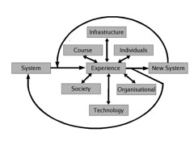

David Jones, Sandy Behrens, "[Online Assignment Management: An Evolutionary Tale,](http://www2.computer.org/portal/web/csdl/doi/10.1109/HICSS.2003.1174347)" Hawaii International Conference on System Sciences, vol. 5, no. 5, pp. 156c, 36th Annual Hawaii International Conference on System Sciences (HICSS'03) - Track 5, 2003.

## Abstract

Due to the benefits it can provide there has been widespread interest in the use of online assignment submission and management (OASM). However, must of the work reported in the literature is limited to small scale use usually in courses taught by innovative staff. This paper draws on experience with OASM in a growing number of courses taught by a number of different staff from different disciplines. It aims to investigate the process by which OASM is adopted across an organisation and identify the factors which influence its growth, adoption, and adaptation. In particular the paper demonstrates that the introduction and successful use of OASM requires changes in practice, ability to cater for a wide range of requirements, and a continual questioning of the appropriateness of the resulting practice.

## Introduction

The assessment for many University courses includes some form of assignment which students complete, individually or as groups, and submit for marking. Assignment management involves collection, date stamping, redistribution to tutors for marking, collation of results, and return of assignments to students (Darbyshire, 2000). Tregobov (1998) breaks the process down into four stages: submission, recording, marking, and return. Online assignment submission and management (OASM) involves the use of the World-Wide Web, the Internet and computers to aid this process.

There are a number of problems with traditional approaches to the submission and management of student assessment, especially in a distance education setting (Jones and Jamieson, 1997). Application of these technologies promise to address many of the problems of traditional approaches and offers the potential to adopt a wide range of new practices. Consequently, there has been widespread interest in OASM (Oliver and Mitchell, 1996; Price and Petre, 1997; English and Siviter, 2000; Davies, Hansen, Salter, and Simpson, 1999). However, much of that literature is of a limited nature. Usually describing the features, characteristics and initial use of these systems in a limited number of courses taught by a small number of innovative staff who are usually the authors of the subsequent papers.

Implementing technology, even implementing technology well, provides no guarantee that the system will be used or be effective (Kling and Allen, 1996). There is a long history of failed technology-based innovations in education (Reeves, 1999). Many such projects fail due to the innovators underestimating the consequences of new technologies (Sproull and Kiesler, 1991) and failing to accommodate environmental and contextual factors affecting implementation (Jonassen, 1998).

This paper seeks to contribute to the understanding of OASM by proposing a model which encapsulates the issues, challenges and opportunities encountered when OASM is adopted by a wider range of faculty. This model has grown out of the use of OASM within the Faculty of Informatics and Communication (Infocom) at Central Queensland University (CQU). An important aspect of the model is that the adoption and use of OASM is an on-going, evolutionary tale that is continually driven by these issues, challenges and opportunities. Any decision which limits that evolution can limit future benefits and adaptation.

The paper commences with a summary of previous work with OASM. It then introduces the model which seeks to explain the factors driving the evolution of OASM. The following section uses the model to describe Infocom's experience with OASM since 1994.

## Previous work

All teaching and learning requires administrative support (Jones and McCormack, 1997). Much of this administrative support is to some degree transparent but if performed inefficiently become immediately obvious and can distract students and staff from the learning process (Darbyshire, 2000). Online Assignment Submission and Management (OASM) is one administrative task that can consume much of a course coordinator's time (Darbyshire, 2000).

Reducing the amount of time consumed, addressing other problems, and benefiting from new advantages are some of the reasons which have driven many staff to adopt and use OASM. Darbyshire (2000) reports finding over 6000 hits from web search engines for pages describing online assignment submission procedures to students. In addition there is a large amount of literature written on the topic. This section outlines some of the reasons driving the adoption of OASM and provides an overview of much of this previous work.

### Reasons for using OASM

The most obvious advantage offered by online assignment management is that it offers faster transportation of assignments than traditional, physical methods. In a study focusing on the use of online assignment management in a programming course Price and Peter (1997) found that students reported a decrease in assignment turnaround time from 2 weeks down to 5 to 7 days. Chi-Sang et al (1999) report a reduction in the assignment submission cycle from 2-3 weeks to 1-2 hours. The best result achieved through OASM at CQU resulted in the return of 72 assignments from students throughout Australia and South-East Asia within just over 3 days (1 working day).

The resource intensive nature of assessment can often decrease the quality of the feedback provided to students (Oliver and Mitchell, 1996). Much of the marking process is mechanical, repetitious, and a perfect candidate for the application of information technology. Through appropriate application of information technology it is possible to reduce costs and increase both the quantity and quality of assessment and feedback to students (Jones and McCormack, 1997). One Infocom course coordinator reports the following form his experience of using OASM:

> Students are very happy with that, they get plenty of feedback and it's doable by the markers. No negative feedback from markers or students.....some students were saying this is the best feedback I've had in any course..

When supported appropriately with resources, experience, and minimal automation it has been found that marking online assignments takes 20-30% less time than marking traditional assignments (Jamieson and Jones, 1997). Summons et al (1997) report tutors marking being reduced by an average of 67% by using a semi-automated marking process. The greater the automation used the greater the reduction in marking time.

For a number of reasons achieving accuracy in assessment is vital (Preston and Shackleford, 1999). Any problems, perceived or otherwise, with the accuracy of assessment reduces student confidence. A CQU student reports:

> I had 2 assignments marked incorrectly and another one the results were not recorded at all (this went unnoticed till I saw my final result), it makes me wonder just how many other errors are slipping by unnoticed.

Appropriate reporting mechanisms combined with online assignment management increase the transparency of the marking process by allowing students to view the progress of their assignment. Systems with built-in automatic logging of the process increases accountability (Price and Petre, 1997). Automation of manual processes such as transcription of results can help reduce errors. Electronic marking of assignments also removes problems associated with the illegibility of handwritten marker comments (Price and Petre, 1997).

A CQU staff members reports on another type of problem:

> a tutor in Melbourne went missing, this was a paper based submission, and just disappeared with about ten assignments and I had no marks and I had no assignments either. If they had been electronically submitted it would have been really easy just to pull it off the webpage and send it down to the other marker...

And another

> Just the flexibility, you know, if a marker makes a real hash of things we can jump in and do it ourselves or get someone else to do it......

Upon graduation most CQU graduates from the regional campuses move away to capital cities. This means that there is a limited population of qualified graduates in regional areas. This can make it very difficult to find appropriate markers for advanced level courses. Use of OASM offers a solution to this problem as one Infocom staff member discovered.

> another advantage is that one of my students is now a graduate. He's now working in Canberra. He's keen to help me out from that distance, so he's going to do some marking for me.

Large class sizes make it necessary to introduce a large number of markers. Maintaining consistency between multiple markers is a major problem in large classes (Preston 1997). Mason and Woit (1999) believe that online marking of assignments can lead to improved marking consistency and integrates well with online mark reporting. This problem is made worse at CQU where markers at the AICs are geographically distant from the course coordinator which makes communication about marking criteria difficult. OASM can help in the moderation process as two Infocom staff found.

> ...an electronic copy of their assessment is really, really handy because I can do parallel moderation with the marker, so the marker can be away marking and I can be moderating or assessing what I think the marks would be, and I can actually look at the difference, so there's no lag to the moderation.

OASM enables a single submission process that can be used by all students regardless of physical location. As one Infocom staff member found

> It creates an equality between on-campus students and flex students no matter where they are because they all want to be able to submit at the same time. So there’s nothing like as long as your assignment is post-marked by Monday you will be accepted in when the assignment was due in by Friday afternoon. There is an equality in that, it will be Friday afternoon, your assignments are here instantaneously, no excuse otherwise. And I think that they detect that as well, they all know that they’ve all got the same deadline. So that’s good.

Paper-based submission introduces a number of other problems as two Infocom staff report

> also just not dealing with stacks of paper, you stick it on a disc and take it home, that's your marking on a disc and you can take it home rather than this great pile of rubbish.

> Yes, well there's still assignments upstairs that the student's haven't collected. In fact, there are still a heap left over in that box there from Winter term, people never bothered to come back and collect them. At least when you email them all back, they're gone.

A study by the Center of Academic Integrity at Duke University in 1999 found that 68% of the 2,100 students polled said that they had committed at least one academic offense such as plagiarizing (Quan, 2001). CQU academics like many around the world believe the ease of access to information provided by the World-Wide Web, along with a number of other factors, is increasing the levels of student plagiarism.

> Definitely, definitely there is a general feeling that we have problems, plagiarism problems, on the International campuses where we are identifying a number of incidents.......So, I'm sure we're all looking for methods for dealing with that problem.

However, using the information processing capabilities of computers, drawing on electronic copies of student assignments submitted via OASM, and using access to Web search engines detecting plagiarism can be a relatively straight forward task. There is a growing range of available systems, both commercial and free, that enable staff to perform plagiarism detection (Young, 2001).

Apart from detecting plagiarism OASM also offers the potential to avoid it. With support from the technology and appropriate assignment design it is possible to generated individual specialised assignment items that allow students to collaborate without fear of plagiarism (English and Siviter, 2000).

All of the reasons for adopting OASM from above can be related to one of the following three characteristics of the technology used in OASM.

1. Almost uniformly quick transmission of assignments providing geographic independence for students and staff.
2. The digital format of assignments and the inexpensive nature of computer storage enabling the creation of a single central storage place for student assignments and related data.
3. The information processing capabilities of computers that allow for a wide range of analysis, manipulation and reporting.

### The Literature

With all these possible advantages it is not surprising that it has been widely adopted. This section provides a brief overview of much of the literature covering OASM. As stated previously this literature is of a limited nature in that it covers only small aspects of the adoption, use, and adaptation of OASM within an educational organisation. As Table 1 Shows it is possible to group the literature discussed here into two separate categories on the basis of the purpose of each paper. Those two catagories are:

1. **System descriptions and initial use.** By the far the most prevalent type of paper found these describe the features of a particular system, which generally differ on the basis of technical characteristics and capabilities, and the initial use of the system within a small group of courses.
2. **Investigations of electronic marking.** Given the time consuming nature of marking it is not surprising that the next most popular paper category examines the use of computers to fully or semi-automate the marking process.

4. **A feature of a course management system.** Most of the systems described in category 1 are stand alone systems developed by a small group. Recent years has seen the advent of integrated course management systems which attempt to offer all features for Web-based education including online assignment submission. Papers in this category describe the features of such course management systems including brief coverage of its online assignment submission features.
5. **Part of an online teaching experience.** Experience with OASM is described as part of a paper which examines the experience of teaching a course with online technologies.

|   **Purpose**   |   **References**   |
| --- | --- |
|   System descriptions and initial use   |   Hassan, 1991; Nicastri, 1996; Thompson, 1988; Boysen and Van Gorp, 1997; Tregobov, 1998; Roantree and Keyes, 1998, Byrnes and Lo, 1996; Darbyshire, 2000; Joy and Luck, 1996; Jones and Jamieson, 1997; English and Siviter, 2000; Jackson, 2000   |
|   Investigations of electronic marking   |   Olivery and Mitchel, 1996; Price and Petre, 1997; Preston and Sackleford, 1999; Palmer, Williams and Dreher, 2002   |
|   A feature of a course management system   |   Chi-Sang et al, 1999; Burnett and Burnett, 1999; Laws, 1999;   |
|   Part of an online teaching experience   |   Jones, 1996; Jones, 1999; Young, McSporran, and Dewstow, 2000;   |

_Table 1  
OASM Literature Summary_

The rest of this paper describes the model which has been developed on the basis of experience of using OASM within Infocom as it has grown in use from an individual faculty to a range of faculty members with different characteristics. It is this model and the attempt to describe the factors which contribute to and hinder organizational adoption of OASM that set this paper apart from the reminder of the literature.

## The Model

Drawing on existing publications (Jones, 1996; Jones and Jamieson, 1997; Jones, 1999), results of student surveys, interviews with staff, and system statistics a range of factors have been identified as influencing the evolution of OASM within Infocom. Those factors have been categorized and the model shown in Diagram 1 is an attempt to represent their relationship.

_Diagram 1. 
Evolutionary Model of OASM Development_

The rest of this section briefly explains each of the components of the model in Diagram 1. The factors identified in diagram 1 interact in a complex and interdependent way to influence the evolutionary development of OASM.

The model proposes that existing assignment submission and management (OASM) processes, be it online or more traditional methods, are the starting points of the evolutionary development. The experience gained with the existing system that creates the need to look for alternate methods. If previous experience has highlighted little or no problems as perceived by the individual staff and students then there is no requirement for alternatives.

It is the assumptions, conceptions, perceptions of the individual faculty which are a primary factor in development and use of OASM. The characteristics of the individual staff which influence whether or not they will use OASM. Staff who are not familiar with technology or prefer traditional methods will not adopt OASM. In many cases the perceptions of individual staff will be influenced by the characteristics and experience of the students in their courses.

The characteristics of the courses including, amongst other factors, delivery modes, pedagogy, and assessment methods, also influences the decision to adopt OASM. A course offered entirely to on-campus students has less of a need to use OASM than a distance education class. A pedagogy based around live presentations (e.g. a drama class) is not conducive to using OASM.

Whether or not OASM can be adopted or changed depends largely on the available technology and infrastructure and requirements of the organisation and larger society within which the course is offered. The absence of simple and ubiquotous network technologies in the days before the World Wide Web made it much more difficult to use OASM. The absence of sufficient servers, network bandwidth, or technically competent support staff also inhibit the adoption of OASM. Policies and legal requirements set by organizations and the society can also inhibit or encourage OASM developments.

## Evolutionary Development of OASM

OASM has been used in various forms at CQU since at least 1994. In that time it is possible to identify five separate, evolutionary stages in the development of OASM. The following sections explains each of those stages by drawing on categories (indicated by bolding) identified in Diagram 1.

### Traditional to Manual Email (1994-1995)

This stage was the initial transition in a a single course (Systems Administration) from traditional assignment submission to an optional system allowing distance students to submit assignments as attachments to email messages.

- **Experience,** The traditional system suffered from a number of problems that increased workload and increased turnaround time (Jones and Jamieson 1997). The main driving factor was the to remove the 4 to 6 days an assignment for a distance education student could spend travelling to and from the student.
- **Course.** The course was an advanced level computing course in Systems Administration with 54 distance students and 45 on-campus students. Provision and maintenance of Internet-based services was part of the content for the course and students were required to have access to a computer. All of the assessment for the course involved the production of computer files.

- **Technology.** In 1995 SLIP/PPP connections to the Internet were only becoming available. Internet service providers were not common and most students relied on long distance phone calls to University modems. The primitive nature of email programs and huge variety in encoding styles for attachments made submitting computer files somewhat problematic. Only 20 distance students use OASM and most of them were using text-based email programs.
- **Individuals.** Both students and staff in this course had significantly greater familiarity and access to computer technology than the general and university population. A large percentage of the class were distance students had suffered from slow turnaround time on assignments. The casual marker employed was relatively inexperienced with the technologies and had some difficulties.
- **Society.** During the 1995 offering of this course the major Australian telecommunications company introduced a special long distance rate for phone calls late at night that made Internet access considerably cheaper for students.
- **Infrastructure.** The course coordinator had a personal UNIX server already hosting email lists for the department which was used to host mail folders.
- **Organizational.** Individual academics had the freedom to innovate and experiment within their courses which allowed the adoption of email based assignment submission.

### Manual Email to Automated Email (1995-1996)

Like many others the experience gained using online assignment submission by email attachment was at best difficult at best. Consequently the 2nd half of 1995 saw a move to an OASM based on automated email supplemented with a web page that reported progress.

- **Experience.** Some of the problems experience with manual email submission was similar to that reported by Young, McSporran, and Destow (2000) including students using the wrong address, vulnerablity to virus infection, duplication of administration effort, and significant administrative burden for the lecturers who had to confirm receipt by email. Additional problems were due to the primitive nature of the technology in 1995. The major problem was that even with only 20 students using the manual email submission system the amount of work for academic staff was significantly greater than the traditional approach (Jones and Jamieson, 1997). This workload was increased by the primitive nature of the technology and resulting problems. As a result the average turnaround time on four assignments was 25 days a little bit worse than the average turnaround time for the traditional approaches..
- **Course.** Use of this system was optional in the 2nd half of 1995 in another advanced computing course (Operating Systems) with 250 students. It was made compulsory in the 1st half of 1996 in the Systems Administration course as part of an entirely online approach to teaching.

- **Technology.** During this time GUI-based Internet tools were becoming available and interest in the Web was becoming more prevalent. The combination of increasing numbers and increasing Internet access led to over 50 students using the system.
- **Individuals.** The course Operating Systems is a pre-requisite for Systems Administration. So the majority students using this system in 1996 had used the system previously. The course coordinator now had increased experience with online assignment submission and a new marker with greater familiarity with technology was employed.
- **Infrastructure, Organisational, and Society.** Remained the same.

### Automated Email to Unintegrated Web support (1996-1997)

The use of email, even with automation, was for various reasons problematic. With the increasing presence of the Web the OASM system moved entirely onto the Web. This system was not integrated with any organizational system so students used just their student number for assignment submission.

- **Experience.** With the automated email system and a capable marker it was possible to return the average turnaround time to 9 days (including weekends). The average turnaround time for the traditional submission method in other courses at this time was 20+ days. The form of automation still left too much freedom for students to make mistakes like using the wrong subject and message structure and attaching files in the wrong format. The use of both OASM and traditional method created extra work for the marker. Due to problems with email attachment formats and the non-standard and primitive nature of the tools marking online assignments was taking 2 to 10 minutes longer than marking traditional assignments. A report page which allowed students to see how they were progressing compare to other students was well received.
- **Technology.** This is moving into the second half of 1996. The Web and GUI browsers likes Netscape are starting to become prevalent. In the first half of 1996 76% of students in the Systems Administration course had Internet access from home. Around about this time the first Word viruses became prevalent and forced a move to the submission of RTF files rather than Word documents. Early versions of the Internet Explorer browser did not support the file upload standard. Students using Internet Explorer had to revert to email submission. Significant effort was expended ensuring that the server was available 24/7.
- **Course.** Both courses now had large web sites. OASM was made compulsory.

- **Individuals.** Staff and students are becoming more familiar with the Web and related technology. The marker in particular now had two or three semesters experience with online marking. By 1997 all students had access to the Internet from home or work. In the second half of 1996 the coordinator had time relief to develop web-based tools and systems for the Faculty. The new and compulsory nature of OASM caused some resentment amongst on-campus students who did not see the benefits of OASM since there was no submission delay for them. 25% of students still submitted the wrong file types.
- **Organizational.** The organization is starting to recognize the importance of Internet technologies. Along with time relief money is spent on a departmental web server. However, no long term funding is provided for maintenance. There are growing numbers at new “international” campuses which are run with a commercial joint venture partner. A new Vice-Chancellor arrives and reorganizes the faculty structure.
- **Society.** Many small Internet Service Providers (ISPs) are becoming available.

- **Infrastructure.** A new faculty server is available. There is growing problems with the number of University provided dial-up modems available for students. Students slowly start moving towards using ISPs.

### Non-integrated web to Integrated web (1997-2001)

- **Experience.** Student use of OASM peaked at over 100 student assignments. Turnaround time was reduced to 8 days for all assignments using the non-integrated web system. One assignment had an average turnaround time of 2 days. Marking online assignments was found to be 20-30% faster than paper-based assignments even with 25% of students submitting the wrong file type. Distance students extremely positive about the fast turnaround time with some disquiet amongst on-campus students. There started to be a problem with privacy due to the absence of a username/password system.

The next evolution of the OASM system was to integrate it with CQU's student record system. This integration enabled the system to know which courses a student was enrolled in and also to make use of a global username/password available to all students.

- **Courses.** In the early days the course was still only being used in the same courses. However, these courses were growing in size with one of the courses peaking at over 300 students. In the second half of 2000 OASM was used in 6 courses including for the first courses not taught by the creator of the OASM system.
- **Individuals.** Other academic staff became involved for the first time. In one instance another staff member took over the Operating Systems course and in 2000 a number of other staff made use of OASM. These new staff and their markers did not have the experience with the system. During this time the creator of the OASM system spent time on a number of other projects during which little work was done on the OASM system after its initial integration with the CQU student records system. The marker involved in the 1996-1997 OASM system joined CQU's central Information Technology division working on CQU's student record system.
- **Organizational.** A good relationship existed between the academic staff and CQU's central Information Technology division. This relationship made it much easier to negotiate access to their databases. Gaining permission from the data owner was more problematic and after many formal approaches was achieved by interupting the head of that division at lunch. The faculty (Infocom) employed a webmaster and expended more money on a larger Web server. All Infocom courses have a generic website. The integration of OASM with University systems was performed as a project. Numbers at “international” campuses grow until they eventually provide more than 50% of all students in courses. Consequently there are more staff, both teaching and markers, involved with courses.

- **Society.** The small Internet Service Providers (ISPs) are being replaced by larger companies. Local call access to the Internet becomes available to all parts of Australia.
- **Technology.** By 2001 a student without Internet access in computing courses becomes the exception. The Web has arrived has a major tool for students and the general society with the ease-of-use of the available tools increasing dramatically over the early days.
- **Infrastructure.** During this time University infrastructure was being pushed to the limit. Very limited numbers of dial-up modems forced most students to move to ISPs. The bandwidth of the University's Internet connection was starting to cause problems and was increased. The amount of use of Web services started to overload the available web servers.

### Evolutionary Development of Integrated Web (2001 to now)

- **Experience.** A growing number of staff are wishing to use OASM. However, the system still doesn't provide the necessary facilities for these staff to manage the process. In particular it is necessary to support courses which have more than 10 markers. Infrastructure problems in terms of bandwidth and server load cause significant negative experiences for many students. The semester with the largest use of the integrated system OASM was used in 6 courses with over 1800 assignments submitted. Average turnaround times ranged from significantly less to somewhat more than turnaround times for traditional methods with the end result heavily dependent on the individual staff associated with each course.
    
    By this stage the basic structure of the system was in place. On-going development has involved the creation of additional services onto the existing system.
    
- **Organisational**. The initial creator of OASM is no longer teaching. Instead has been given a position to help other staff make innovative use of technology to aid their teaching and learning. This is a move by the Faculty Dean and enables further development. A presentation about OASM is made to one of the schools within the faculty at the invitation One of the head of that school. This encourages more staff to adopt OASM. The multi-campus operations of CQU start to cause significant administrative problems for staff, particularly in terms of moderation of marking. CQU adopts a new student records system which requires significant changes to the OASM system which has to be integrated with the new system. The requirement that staff at international campuses mark their student's assignments is written into contracts and thus must be supported by OASM. The distance learning support division purchases WebCT and supports it use amongst staff.
- **Courses.** In the 2nd half of 2002 OASM was used in ??? courses ranging from 1st year courses in computer programming and web development, through 2nd year Multimedia design and Human Computer Interface courses, to post-graduate courses in database design.

- **Individuals.** Greater than 50% of the students in most Infocom courses have English has a second or third language. The use of OASM in first year and non-computing courses means that some students are novice computer users. More work is required to improve the interface and operation of OASM. Staff have growing concerns about plagiarism. Students are found selling past assignment solutions on E-Bay. Each staff member that adopts OASM brings with them their own vision of how assignment management, marking and return should be performed.
- **Infrastructure.** Uni purchase large server. Bandwidth increased. Still problem to Fiji
- **Technology.** Availability of copy detection software and virus detection software. Use of RTF starts to cause problems with the inclusion of OLE objects and images.
- **Society.** Australian government strengthens reporting requirements for full fee paying overseas students (those studying at CQU's international campuses) to include a requirement that the University must be able to identify students who have not submitted assessment. This requires the addition of a reporting mechanism for administrative staff.

### The Future

- **Experience.** OASM use in the second half of 2002 peaked at ??? courses with ??? assignments. ?? courses used copy detection software and has been very useful as a simple way to detect copies.

Immediate development plans for OASM include increasing the integration with various other services, the provision of additional management facilities for staff, and improvements to the interface and flexibility of the system.

## Discussion

As can been seen from the development of OASM within Infocom there are a wide range of factors which can influence the requirements of an OASM system. An OASM system must be able to evolve in response to these factors in order to better serve the needs of students, staff, and the organisation. Such evolutionary development can only occur with sufficient resources and if it isn't hindered by features such as organizational structure or inflexible technology.

This raises questions about the suitability of integrated course management systems such as WebCT and Blackboard. These systems are more difficult to adapt to local requirements. There is a question about the degree of functionality provided by these integrated systems with appropriately resources in-house products able to provide more functionality (Darbyshire 2001). Since no company will adequately address all the possibilities for online assessment it is critical that such system have “open system” architectures that support interoperable modules (Hopper, 1998). Course management system vendors are recognizing this fact by adopting some form of more open architecture.

The need for evolutionary development of OASM is not limited to the technology and its features. Experience with OASM has shown that faculty initially attempt to recreate existing practice with the new technology. Often because changing practice and medium is often too difficult. However, as experience grows staff begin questioning basic assumptions and look at using the characteristics of OASM to adopt more innovative approaches. If OASM systems accommodate only “classical” approaches they will constrain instructors and not allow the development of more innovative approaches (Hopper 1998). A system that only accommodates "innovative" approaches will not allow staff to adapt gradually (Hopper 1998).

## Conclusions

Drawing on experience with online assignment submission and management (OASM) since 1994 this paper has developed a model which encapsulates seven factors which have contributed to the evolutionary development of OASM. It has used that model to show how OASM within an individual organisation has changed from submission via email in a single course by 20 students to an integrated, web management facility incorporating support for copy detection and distributed markers used in ?? courses by ?? students.

## References

Paul Darbyshire, Distributed Web-Based Assignment Management, Web-Based Learning and Teaching Technologies: Opportunities and Challenges, Anil Aggarwal (ed), pp 198-215

Boysen, P & Van Gorp, M.J (1995), ClassNet: Automated Support of Web Classes, Paper presented at the 25th ACM SUGUCCS Conference for University and College Coputing Services, Monterey, California, USA.

Byrnes R & LO B (1996), A computer-aided assignment management system: improving the teaching-learning feedback cycle (Web Page), Southern Cross University, [http://www.opennet.new.au/cmluga/byrnesw2.htm](http://www.opennet.new.au/cmluga/byrnesw2.htm)

Byrnes R, Lo B, Dimbleby J (1995) Flexible Assignment Submission in Distance Learning, Paper presentated at the IFIP World Conference on Computers in Education VI, WCCE'95

Darbyshire P, Wenn A (1998) Cross Campus Subject Management Using the Internet, Paper presented at the International Resource management Association, IRMA '98, Boston MA

Godfrey B (1997) Problems with Email Assignments, Department of Information Systems, University of Tasmania, [http://www.infosys.utas.edu.au/people/individuals/bob\_godfrey/seminars/dec97/emailagn.html](http://www.infosys.utas.edu.au/people/individuals/bob_godfrey/seminars/dec97/emailagn.html)

McCandless, G (1997) Are Software Publishers in Touch with Higher Ed Needs? CAUSE/EFFECT, 20(2), 53-54

Nicastri C (1996) Asisgnment Submission system - SUBMIT, [http://www.uow.edu.au/commerce/microlabs/submit.html](http://www.uow.edu.au/commerce/microlabs/submit.html)

Sclaroff, S (1996) Electronic Submission of Program Assignmetns, [http://cs-pub.bu.edu/faculty/sclaroff/course/cs113/homework/submit.html](http://cs-pub.bu.edu/faculty/sclaroff/course/cs113/homework/submit.html)

Thompson, D (1988) WebFace Overview and History, http://mugca.[cc.monash.edu.au/~webface/history.html](http://cc.monash.edu.au/~webface/history.html)

Brian Oliver, Geoffrey Mitchell (1996), Setting the PASE - The Value of Computer Aided Assessment, Proceedings of the 1st Australiasion Conference on Computer Science Education, John Rosenberg (editor), pp 103-110

Mak John Chi-sang, Yuen Kin Sun, Chung Siu Leung, Chow Linda, The Electronic Learning Environment for IT-based course in Hong Kong, Proceedings of EdMedia'99, pp1384-1385

Gary Burnett, Kathleen Burnet, Integrated Onlien Course Delivery System: Flordia State University School of Information Studies, Proceedings of EdMedia'99, pp 1511-1512

Richard Dwight Laws, Totally Integrated Internet Courses, Proceedings of EdMedia'99, pp 787-791

Stuart Young, Mae McSporran, Ross Dewstow (2000), Suffering Remotely: Challenges when teaching on-line, Proceedings of EdMedia'2000, pp 1590-1591

John Palmer, Robert Williams, Heinz Dreher, Automated Essay Grading Applied to a First Year University Subjeect - How can we do it better?, Proceedings of Informing Science, InSITE - "Where Parallels Intersect", June 2002

Mary Hopper, Assessment in WWW-Based Learning Systems: Opportunities and Challenges, Journal of Universal Computer Science, 4(4), pp 330-348