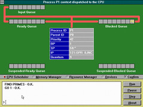

Ron Chernich, Bruce Jamieson, David Jones, RCOS: Yet another teaching operating system, Proceedings of the First Australasian Conference on Computer Science Education.

## Abstract

Ron Chernich's Operating System (RCOS) is a portable, multi-tasking operating system (OS) designed to demonstrate general operating system principles through controlled animation, and to allow simple modification and experimentation with OS data structures and algorithms. It was conceived and built during 1993 and 1994 as an undergraduate and honours level project following unsatisfactory experience with a similar tool and evaluation of existing systems. In early 1996 a reimplementation of RCOS using the Java programming language was commenced.

This paper describes the rationale behind the design of RCOS, its structure and abilities. It will discuss how RCOS has been used and detail feedback from students who have used RCOS. It will also provide information on the continued development of RCOS and pointers to RCOS information on the Internet.

## Introduction

Over the years, numerous methods have been used to teach the principles of operating systems to computing students including

- a purely theoretical and text book based approach \[11\]\[8\],
- separate unrelated projects \[12\],
- a simulated or cut-down operating system \[9\]\[3\], or
- a complete operating system \[6\].

Comparisons of these different approaches have been carried out previously \[1\]\[12\]. Past experience has shown that, if implemented correctly, the use of a simulated operating system (OS) can provide some definite benefits.

A simulated OS can illustrate underlying concepts and permit students to make modifications, enhancements and comparisons between a range of different algorithms. Such an approach offers the advantage of improving conceptualisation while limiting the complexity inherent in modifying a "real" operating system.

## Why RCOS?

The need for a "simulated" operating system such as RCOS stems from the operating systems subject offered by the Department of Mathematics and Computing at Central Queensland University. The Department's operating systems subject, 85349, is a core subject of the Bachelor of Information Technology degree and is taught in both on-campus and distance modes.

All distance students are expected to have access to an IBM PC compatible computer and all subjects must be designed for that platform. Distance students rely on text books and print-based study guides as their sole source of learning. Experience has shown that distance students have difficulty grasping some of the theoretical concepts without interaction with a lecturer or practical examples of the theory.

To address this problem previous offerings of 85349 have used Minix \[6\] and PRMS \[4\]. The use of Minix was not a great success because of the steep learning curve in installing and becoming familiar with the system. PRMS whilst simpler to use, suffered from a number of problems \[1\] including

- limited to simulation of process and simple resource management,
- inconsistent design conventions,
- a high level of coupling between components, and
- insufficient documentation.

The approach used by PRMS, a simulated operating system with graphical animation of operating system data structures and algorithms, was seen as a useful learning tool, especially by distance students. Drawing on the lessons learnt during the use of PRMS and a wish list of desired features it was decided to build RCOS during 1993 with further development occurring during 1994. Early 1996 saw the redesign of RCOS for the Java programming language.

Similar tools, OSP \[7\] and Nachos \[3\], were not considered. The two primary reasons for not using either were

- they could not run under MS-DOS, the standard CQU computing platform, and
- neither provided animation of the operating system's algorithms or data structures.

The second feature was considered essential in order to provide assistance to distance students in understanding these concepts. Other features that were considered desireable included

- a conceptual separation of hardware and operating system concepts, one of the difficulties faced in the use of PRMS,
- enable simple modification of algorithms and data structures by students,
- compiler and hardware independence,
- implemented in C++, and
- the ability to perform as a real operating system.

## The features of RCOS

### Overall Structure

RCOS is a message-driven, multi-tasking operating system simulation that executes p-code programs. The operating system runs inside a supervisor shell that in turn runs under an overall host operating system. The host operating system provides all the necessary services required by the supervisor to graphically animate and control the operation of RCOS.

The supervisor shell provides the graphical animation (Figure 1) and user control of the operating system. The supervisor shell follows the CUA guidelines \[5\] that are familiar to Microsoft Windows users.

The services of the host operating system are accessed through a platform abstraction layer (PAL) that provides a standard application programmer's interface (API) for graphics, I/O and timing functions. Porting RCOS to a new platform is achieved by implementing the PAL on the new platform. Some additional work might be required to deal with the different interpretations of the C++ language performed by some compilers.

**Figure 1 - The RCOS CPU Scheduler Screen**

### The supervisor interface

The supervisor interface is divided into four separate screens (one is pictured in Figure 1) and provides

- animation of the movement of processes between the various queues and the CPU,
- animation of the disk drive and its associated queue,
- a devices screen that provides a representation of user terminals (the number of terminals is controlled by an initialisation file) for the display of process output,
- an operator's console (the white rectangle at the bottom of Figure 1) that can be used to issue commands to create, start, suspend and kill processes, and
- a number of radio and push buttons that can be used to control the display and operation of the operating system.

### Operating system structure

RCOS is designed using the micro-kernel/message-passing approach that is becoming popular in modern operating systems. The kernel of RCOS provides the basic message passing facility that is used by the other components of the operating system to communicate. The remaining functionality of the operating system is implemented using separate modules that respond to pre-defined messages. Figure 2 shows the hierarchy and interaction between the components of RCOS.

**Figure 2 - RCOS Structure**

The operating system modules currently implemented include

- a simple disk drive (DskModel) that accepts physical characteristics as a parameter,
- a file system based on the CPM file system (CPMFs),

User programs access the file system services through a standard interface (FsIface) which means the file system can be replaced without effecting user programs.

- semaphores and shared memory (IPC),
- CPU management and process scheduling (Exec),
- memory management (MMUP), and

The current implementation uses a simple fixed partition memory management algorithm.

- a terminal and line protocol device driver.

### Extensibility and modification

A primary design aim of RCOS was to provide a system where the students could modify the operating system's algorithms and data structures. Examples would include modifying the CPU scheduling or memory management schemes to implement much more complex algorithms.

One of the major problems with PRMS was that modifying parts of PRMS resulted in unexpected side effects in other sections. RCOS was designed to solve these problems using

- the high degree of modularity offered by C++ objects,
- the low level of coupling offered by message passing,
- and an almost total absence of global variables.

The RCOS C++ code also uses a type calculus known popularly as "Hungarian Notation" that provides some assistance in modifying the code. In addition, study of the source code has the side-benefit of providing an exposure to this widely used convention.

### RCOS Programs

The programs that RCOS executes are written and compiled under the host operating system and not under RCOS. The current source language used for the RCOS programs is called "Pascal Like Language Number 2" (PLL/2). At the time RCOS was developed the language CQU students were most familiar with was Pascal. PLL/2 is a subset of Pascal with the major ommision being the absence of complex data structures (PLL/2 only supports integers).

The PLL/2 compiler, written in Pascal, is based on a series of articles that appeared in Byte Magazine during 1978 \[2\] and produces pseudo-code for a simple stack oriented, virtual hardware machine. Extensions to the original language have been implemented to provide basic inter-process communication facilities, via semaphores and shared memory, and sequential disk I/O.

The compiled programs are "executed" by a p-code interpreter that is included as part of RCOS. Modifications of the p-code interpreter can be used to extend the simulated hardware to support systems like virtual memory that requires specialised hardware support.

### Portability

CQU distance computing subjects are designed for the MS-DOS platform. This meant that RCOS was originally targeted for that platform. However the expectation that the future of the MS-DOS platform was short lived led to an emphasis on portability in the development of RCOS. All platform dependant code is restricted to a platform abstraction layer. The major component of moving RCOS to a new platform is the porting of the PAL.

In early 1995, RCOS was ported to the UNIX/X11 platform to test its portability. It was found that while an initial port was reasonably straight forward, there were some problems reconciling the differences between the MS-DOS platform and UNIX/X11.

Portability between platforms has not been a major problem due to the fact that most CQU students use the IBM/MS-DOS platform. However, portability between different versions of compilers, in particular the Borland compilers, has lead to a number of problems. Different compilers recognise different C++ syntax and provide different mechanisms for accessing the low level features required by RCOS. Additional problems arose due to the incompatibilities of so called IBM PC compatibles.

These problems with portability have contributed to the development of RCOS.java.

## The use of RCOS

RCOS has been used in the 1993, 1994 and 1995 offerings of the CQU operating systems subject. RCOS has been used in a number of different ways including

- a learning tool to aid explanation of OS concepts,
- concurrent programming exercises using semaphores and shared memory, and
- the analysis, modification and comparison of algorithms and data structures.

### A learning tool

RCOS' ability to graphically animate operating system algorithms makes it easier for students, especially distance students to grasp theoretical concepts. At CQU, concepts such as mutual exclusion, concurrency, starvation and multi-tasking have all been demonstrated using the animation capabilities of RCOS.

### Concurrent programming

A traditional part of an OS subject is a section on concurrency and mutual exclusion. Students with computing experience limited to MS-DOS computers can find these concepts difficult to comprehend without practical experience. The semaphore and shared memory services provided by RCOS provide the ability for students to create programs that implement concurrency and mutual exclusion and observe their interaction.

A previous approach used at CQU has been to use the shared memory and semaphore capabilities of UNIX. This approach suffers from a number of problems including the student's lack of familiarity with the UNIX environment, compilers and editing facilities. An additional problem with this approach is the difficulty of providing distance students access to a UNIX computer.

### Modification, comparison and analysis of algorithms

Having access to the RCOS source code means that students can

- read a text book describing an OS concept, algorithm or data structure,
- examine the RCOS source to view one implementation of that concept,
- modify the implementation, and
- compare the behaviour of different implementations.

The standard process scheduling algorithm used by RCOS is a priority-based round robin algorithm. One assignment described the problem of starvation, allowed students to observe starvation in action and then required them to modify the RCOS algorithm to prevent starvation. This gives the student "hands-on" experience in modifying the operating system with the ability to fully test the modifications by "viewing" the internal operations of RCOS through the graphical environment.

### Student feedback

At the end of 1995, students were surveyed on their opinions on RCOS. Students were asked whether or not they agreed with the following two questions

1. Do you agree that RCOS helped in understanding concepts introduced in this subject?
2. RCOS was difficult to use?

The 39 responses are summarised in Table 1.

| Response | Question 1 | Question 2 |
| --- | --- | --- |
| Strongly Agree | 7 (18%) | 4 (10%) |
| Agree | 22 (56%) | 7 (18%) |
| No opinion | 4 (10%) | 13 (33%) |
| Disagree | 4 (10%) | 11 (28%) |
| Strongly disagree | 2 (5%) | 4 (10%) |

### Student feedback on RCOS

When asked if RCOS helped them to understand the concepts introduced in 85349, 74% either agreed or strongly agreed with this statement.

When asked if RCOS was difficult to use, 28% either agreed or strongly agreed with this statement. This can be mainly attributed to the difficulties students had in recompiling RCOS as was further stated in the survey.

When asked what features of RCOS they liked, students made the following comments:

- Quite user friendly.
- The CPU Scheduler screen allowed greater insight into what was happening and as RCOS can run under Windows I could use it in my lunch breaks at work.
- Overall design very user friendly and easy to understand.
- It demonstrated CPU Scheduling well.
- Simple and easily illustrated the working components of an OS.
- It was simple to use (generally). I liked the fact that it is its own operating system, and that we could write programs for it (even though the compiler was quirky) and run multiple processes.
- The concepts such as Semaphores are far easier to follow with a graphic representation.
- Graphical representation of process scheduling Etc.
- The graphical representation of the "movement" of the process.
- Graphical representation of concepts.
- When it worked it proved to be informative.

## The future of RCOS

Areas in which RCOS could be improved include

- animation of memory management,
- development of a network simulation including the ability to run multiple versions of RCOS which can communicate with each other (similar to the ability of Nachos),
- the ability to provide greater I/O peripheral support including printers, graphical displays, mice and other devices,
- the addition of a guided tour feature where students are introduced to an OS concept via a combination of text, audio and RCOS animation,
- continued improvement of RCOS documentation including tutorials,
- improved single step operation,
- keeping journal and accounting information (for algorithm analysis and comparison),
- a more complex file system, and
- creation of a C like language for RCOS.

At this stage development of RCOS has ceased. The above improvements and all future development will be carried out on RCOS.java.

## RCOS.java

In early 1996 it was decided to reimplement RCOS using the Java programming language because of

- the transition of CQU computing students from the MS-DOS platform to other platforms including Windows '95, NT, Linux and the Macintosh, and
- the increasing use of the WWW as a medium for the distribution of learning material.

In addition Java also provides a number of other benefits including

- the potential for multimedia integration, and
- improved functionality, including in-built support for the development of GUI and multi-threaded applications.

### Current status

As of April 1996, a fully functional prototype of RCOS.java is available on the WWW at http://euler.cqu.edu.au/rcos/

The current version includes

- a primitive user interface using Java's GUI classes.
- completely redesigned structure for the RCOS OS, and
- the separation of animation and CPU execution into different threads.

Currently only the process scheduler, the kernel, terminals and semaphore support have been integrated, and only the process scheduler has been represented graphically. A paged memory manager, shared memory support, a CP/M file system and simulated disk drive have been written but not incorporated into the current version.

Over the course of 1996 work on RCOS.java will include

- complete integration of all existing components including graphical representation
- implementation of most of the improvements and extensions planned for RCOS
- improving the GUI of RCOS.java, and
- increased use of Java's multimedia capabilities.

## The availability of RCOS

Further information and RCOS itself is available on the World-Wide Web. The RCOS WWW home page is located at the following URL, [http://cq-pan.cqu.edu.au/david-jones/Projects/rcos/](http://cq-pan.cqu.edu.au/david-jones/Projects/rcos/)

RCOS.java (development version) can be found at: [http://cq-pan.cqu.edu.au/rcos.java/](http://cq-pan.cqu.edu.au/rcos.java/)

## Conclusions

Ron Chernich's Operating System (RCOS) is a simulated operating system designed to assist in the teaching of operating systems concepts. RCOS

- works like a "real" operating system,
- provides the ability to experiment with semaphores and shared memory,
- provides a conceptual representation of operating systems issues,
- can graphically represent and animate the algorithms and data structures of an operating system, and
- can be ported to new computing platforms.

The RCOS source code and support documentation are freely available from the Internet via both FTP and WWW. The RCOS WWW home page is located at the URL

[http://cq-pan.cqu.edu.au/david-jones/Projects/rcos/](http://cq-pan.cqu.edu.au/david-jones/Projects/rcos/)

## References

\[1\] Chernich, R., Jones, D.. (1994). The Design and Construction of a Simulated Operating System. Proceedings of Asia Pacific Information Technology In Teaching and Education '94, Brisbane. pp 1033-1038,

\[2\] Chung Kin-Man and Yuen H (1978): A "Tiny" Pascal Compiler, Byte Magazine, Byte Publications Inc., Petersborough N.H., USA, Volume 3, Numbers 9, 10, 11, September, October, November 1978.

\[3\] Christopher, W.A., et al. (1993). The Nachos Instructional Operating System". Proceedings of the Winter 1993 Usenix Technical Conference, 481-489.

\[4\] Hayes J H, Miller L R, Othmer BA and Saeed M (1989): Simulation of Process and Resource Management in a Multiprogramming Operating System, Proceedings of the 21st ACM Technical Symposium on Computer Science Education, February, 1990, p125.

\[5\] IBM (1989): System Application Architecture; Common User Access: Advanced Interface Design Guide, International Business Machines Corp., Document Number: SY0328-300-R00-1089, 1989.

\[6\] Kavka, C. et al. (1991). Experiencing Minix as a Didactical Aid for Operating System Courses. ACM Operating Systems Review, 25(3), .

\[7\] Kifer, M. Smolka, S. (1992). OSP An Environment for Operating System Projects. Operating Systems Review, 26(4), pp 98-99.

\[8\] Lister, A.M. Eager, R.D. (1988). Fundamentals of Operating Systems (fourth edition). London: Macmillan Education Ltd.

\[9\] Ramakrishnan, S. Lancaster, A. (1993) Operating System Projects: Linking Theory, Practice and Use. Proceedings of the 24th ACM Technical Symposium on Computer Science Education, 256-260.

\[10\] Tanenbaum, A. S. (1987) Operating Systems: Design and Implementation. Englewood Cliffs, NJ: Prentice Hall.

\[11\] Stallings, W. (1992). Operating Systems. New York: Macmillan Publishing.

\[12\] Withers, J.M. Bilodeau, M.B. (1992). An Examination of Operating Systems Laboratory Techniques. ACM SIGCSE Bulletin, 24(3), 60-64