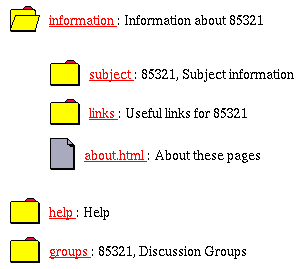
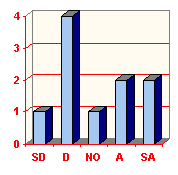
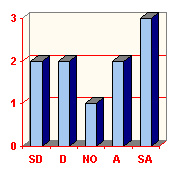

This is an old paper from 1996. Many of the links below are broken as the websites no longer exist.

David Jones, Solving some problems of University Education: A Case Study, Proceedings of AusWeb96, Southern Cross University Press, Gold Coast, Gold Coast, Roger Debreceny, Allan Ellis, pp 243-252

Keywords: World-Wide Web, University Education, Distance Education, Collaborative Learning

## Introduction

Traditional university education, in both on-campus and distance education modes, suffers from a number of problems (Laurillard 1993, Jones 1996). This paper describes an attempt to address these problems using a collaborative, online teaching method within the subject [85321 Systems Administration \[HREF13\]](http://mc.cqu.edu.au/subjects/85321/) offered by the [Department of Mathematics & Computing \[HREF2\]](http://mc.cqu.edu.au/) at [Central Queensland University (CQU) \[HREF3\]](http://www.cqu.edu.au/).

85321 is taken by both on-campus and distance students. In 1996 85321 was taught without any on-campus lectures and limited print based distance material. Almost all learning material, including the subject's textbook, was distributed via the World-Wide Web, all students participated in small group, collaborative work facilitated by face-to-face meetings and Internet mailing lists and assignments were submitted via email.

Early experience at CQU has shown that an online, collaborative learning approach using the Internet offers solutions to many of the problems plaguing university education. This is especially true where students are mature learners, comfortable with independent learning and computers. To be successful the implementation of such a learning approach requires significant technical and educational skills and experience.

This paper starts by outlining the problems suffered by University education that are addressed by this approach. A description of the subject, its students and the teacher will demonstrate why this subject is a perfect candidate for online education. Discussion will then turn to the design and implementation of the teaching method including an examination of the tools developed to implement the learning approach. Finally conclusions will be drawn based on the experience and early student feedback.

## Problems with University Education

All computing subjects offered by the Department of Mathematics & Computing at CQU are taken by both on-campus and distance students. Traditionally on-campus and distance students are taught using totally different teaching methods. Both methods suffer from a number of distinct problems. Combining the two methods introduces additional problems. This section examines those problems.

### On-campus problems

On-campus university teaching makes excessive use of lectures and other didactic approaches to teaching (Candy 1994). Laszlo and Castro (1995) quote Leonard as observing that the lecture is the best way to transfer information from the notes of the teacher to the notes of the student without it passing through the student's mind (a later modification implies that the information doesn't pass through the mind of the teacher either). Laurillard (1993, p107) points out that lectures are not interactive, adaptive and do not allow students time for reflection.

The success of a lecture requires the lecturer to be aware of the capabilities of all students and for all students to have a similar background (Laurillard 1993, p108). The economic pressures and the tendency to open access in today's Universities results in subjects having large enrollments including students from all walks of life. In combination these factors make the lecture a particularly inappropriate teaching method.

Traditional university science teaching does not promote a sense of community and assumes that students work in isolation This reliance on individual work is contrary to the requirements of many professions. This is a particular problem for computing where collaborative, group work is a major part of the profession.

### Distance education

Distance education poses a number of problems caused by the characteristics of the students, the academics, the institution, the medium used to transmit learning and the field of study (Jones 1996). CQU is a second generation distance education institution (Nipper 1989). Second generation distance education is characterised by its reliance on print as the primary teaching medium (some subjects make limited use of other media). The major objective of second generation distance education is the production and distribution of learning materials, little emphasis is given to learning as a social process requiring communication and collaboration.

With print-based materials the primary distribution mechanism must be the postal service. Given the increasingly global nature of distance education the time taken to distribute learning material can lead to significant difficulties including

- the late arrival of distance material,

- inability to respond to errors in study material or the requirements of individual students,
- a lack of immediate feedback on student progress for both students and teachers, and
- a general lack of student/student and student/teacher communication that can lead to feelings of isolation (Jones 1996).

Distance education students are disadvantaged by both geographical and transactional distance. Transactional distance is the psychological space between the learner and the teacher and is a function of the extent of the dialogue between student and teacher, and the responsiveness of the subject to an individual learner's needs (Caladine 1993). The static, print-based nature of second generation distance material limits both student/teacher dialogue and subject responsiveness, which results in a large transactional distance for distance students.

At CQU the production of print-based distance materials is organised by the Division of Distance and Continuing Education (DDCE). The resulting centralised approach to distance education leads to a number of problems including

- large lead times in development,
- little control by academics over style and presentation, and
- an inability to handle change (Jones 1996).

The speed with which appropriate feedback is provided to students is essential to learning. For example, Rekkedal (1983) found that by reducing assignment turnaround time from 8.3 days to 5.6 days, course completion was increased from 69% to 91%. The traditional delivery mechanism for a CQU distance student's assignment is the postal service. Using the postal service can result in assignment turnaround extending to a number of weeks or the assignment being lost due to human error. Students must often submit an assignment before a previous assignment has been marked and returned. The amount of time taken to return assignments also means that students may not receive any feedback on concepts introduced late in a semester (Buchanan 1995).

### Dual mode delivery

At dual-mode institutions, like CQU, staff must teach the same subject twice: the development of print-based distance materials a number of months prior to the start of semester and the same subject is then taught again to on-campus students using the traditional lecture/tutorial approach. The extra work involved, the physical absence of distance students and the lack of rewards in providing quality distance materials often leads to a decreased service to distance students, the out of sight, out of mind problem (Caladine, 1993).

The length of time between the development of distance material and the presentation of on-campus lectures can also lead to problems of consistency. Developments during on-campus teaching may result in on-campus students receiving different material. These differences between on and off campus versions of the same unit pose major problems in the current environment which claims that the credentials of students studying via on and off campus modes are the same.

## The Subject, the Students and the Lecturer

The topics covered by 85321, its history, its students and the background of the teacher all contribute to making the subject an appropriate test bed for a collaborative, online learning method.

### The subject

85321 Systems Administration is a third year, core unit within the Systems Services stream of CQU's Bachelor of Information Technology. The purpose of the subject is to introduce advanced computing students to the concepts involved in managing a multi-user computer system with practical emphasis on the UNIX operating system.

The history and development of 85321 has resulted in the production of an introductory text that is the main learning resource for distance students. The copyright of this text belongs to CQU. This enables the entire text to be made available via the WWW. In addition there are significant collections of Internet based resources that can and are being used in the subject.

TCP/IP and the development of the Internet are closely tied with the content of the subject with at least two weeks of the subject dealing with connecting and managing an Internet connected UNIX computer. Using the Internet in 85321, a subject that is concerned with computing and communications technology, provides an opportunity for situated learning.

### The students

The 1996 85321 student population included

- 26 students at CQU's Rockhampton campus,
- 62 distance students spread throughout Australia,
- 9 distance students based in Singapore, and

- 1 distance student based in Rome.

Figure 1 is a photograph of a 1995 85321 student who was based in Cyprus. He's receiving some extra motivation in his study.

**Figure 1  
A 1995 85321 student  
studying from Cyprus**

Most 85321 students are competent and experienced computer users and in many cases they have an interest in and are already using the latest developments in computing. For example, 91% of the 85321 distance students in 1996 had access to CD-ROM drives and 74% had Internet access prior to starting 85321.

Florini (1990) identifies the need to train students and the question of equity of access as two of the major problems with computer-mediated communication. The nature of the 85321 students and the wide spread availability of Internet access means that these problems are minimised.

### The teacher

The 85321 teacher has been using the Internet for over 5 years and teaching distance computing subjects for 6. The Internet, mailing lists and the WWW have been used a number of times in previous subjects. Other research interests include a project that is providing Internet access to Central Queensland schools and CQU students (Jones 1995). This means that the 85321 teacher is comfortable and capable with technology. In fact the 85321 learning method is only possible due to this background.

## The teaching method

The teaching method designed for 85321 was aimed at solving the problems with University education using an online, collaborative learning approach. The final teaching method included

- all learning material distributed via the WWW,

- no on-campus lectures,  
    Considerable effort is required to produce quality distance education study materials. The existence of quality 85321 study material and the problems with the lecture based approach led to the decision to cancel on-campus lectures.
- small group collaboration, and  
    Collaboration is an important part of the computing profession and it can also be an effective learning method. In order to urge students to collaborate and actively construct knowledge all students were placed into small discussion groups. Group communication was performed either through face-to-face discussion or through individual group mailing lists.
- assignment submission via email.  
    
    Systems Administration is learnt by doing. As a result the assessment for 85321 consists of four assignments worth 60% and a final exam worth 40%. In order to speed up assignment turnaround time the submission of assignments was performed using email. An automatic system was used to manage and track the submission of email assignments.

## Designing a subject for the WWW

In designing the capabilities and the look and feel for the 85321 WWW pages, it was decided to

- use "good" WWW design principles,
- use the multimedia capabilities of the WWW,
- develop a tool to provide a graphical overview of the subject's WWW hierarchy,
- provide archives of the 85321 WWW pages that could be downloaded and viewed offline, and
- develop a tool to aid in the production of WWW based study material.

### Good WWW design

Due to its reliance on the WWW for delivery, it was essential that all the 85321 material reflect "good" WWW design practice. This includes the layout and appearance of individual pages and the organisation and structure of the 85321 hierarchy. There is abundant literature on the design of WWW pages. Comber (1995) provides a useful check list on HTML design most of which were incorporated into the design of the 85321 WWW pages. Nielsen and Sano (1995) was also found to be a useful resource.

### Multimedia capabilities

One of the advantages of the WWW over traditional print-based distance material is its ability to handle full colour photos, audio clips and movies. This can add considerably to the value of learning material. The 85321 material used

- full colour diagrams,
- full colour photographs of common equipment used by Systems Administrators,
- audio clips to aid in the pronunciation of terms.  
    
    One example is how to pronounce Linux. The 85321 study material included an audio clip of Linus Torvalds, the creator of Linux, explaining how he pronounces Linux.

It was also decided that the look and feel of the 85321 pages would make significant use of graphics. The aim was to increase student interest without significantly increasing access time.

### The overview system

Getting lost is a common problem with navigating through large collections of WWW documents, the lost in hyperspace problem (Kappe 1996). In an attempt to solve this problem a system that simulates the Hyper-G collection browser was developed using a Perl script. The appearance and operation of this system is similar to the Windows file manager, a metaphor that is familiar to most computing students.

**Figure 2  
The 85321 interactive overview system**
|    Before |    After |
| :-: | :-: |

### Viewing offline

As expected the majority of 85321 distance students accessed the Internet through commercial Internet Service Providers (ISPs). This means that access for most students is via a modem and charged by the hour. As a result viewing the 85321 WWW pages, while online, could not only be slow but it could also be expensive.

To increase the speed and decrease the cost to the students a compressed archive of the 85321 WWW pages was produced at the start of the semester. Students are able to download the archives, uncompress them and view the 85321 WWW pages from their local hard-drive. A major problem creating the archives was translating the filenames of the WWW pages from their original UNIX format into the 8.3 format used by MS-DOS.

### Producing a hypermedia text book

A previous experiment with placing a chapter of a study guide on the WWW, feedback from students and personal use of the WWW led to the development of a number of characteristics for the 85321 hypermedia text book including

- full use of the hypermedia capabilities of the WWW,
- simple to print,

- a table of contents, and
- an index.

When completed the 85321 hypermedia textbook included over 900 individual WWW pages. Producing and maintaining a large collection of WWW pages that also exhibit the above characteristics is extremely difficult and time consuming. A search for an appropriate authoring tool was unsuccessful. As a result a Perl script was written to provide the necessary functionality.

Each chapter of the 85321 text book was written as a single HTML file. Special tags were used to

- divide a chapter into sections,  
    <!-- SECTION TITLE="the title"> <!-- /SECTION>
- divide each section into a number of pages,  
    <!-- PAGE TITLE="the title"> <!-- /PAGE>
    

- to indicate the location of a term to index, and  
    <A NAME="INDEX\_item to index">
- link to a particular page.  
    <a href="#page title">
    

Once written, each chapter was run through the script which produces

- a [table of contents \[HREF4\]](http://mc.cqu.edu.au/subjects/85321/study-guide/chap1/),

- a copy of the [chapter \[HREF5\]](http://mc.cqu.edu.au/subjects/85321/study-guide/chap1/intro.html), divided into many small WWW pages all cross-linked,
- a [copy of the chapter \[HREF6\]](http://mc.cqu.edu.au/subjects/85321/study-guide/chap1/chapter1.html), as a single WWW page ready to be printed, and
- an [index \[HREF7\]](http://mc.cqu.edu.au/subjects/85321/study-guide/index/), for all chapters in the study material.

The look and feel of the pages are controlled by two files, header.html and footer.html. By modifying these files it is possible to generate an entirely different look and feel without modifying the original chapter.

### Communication

A major requirement for 85321 was simple and effective communication and collaboration between small groups of students. This requirement could be supported by a number of different Internet applications. For 85321 it was decided to use mailing lists due to problems with other Internet communication mechanisms. Systems not considered included

- synchronous systems,  
    A major feature of distance education is flexibility any form of compulsory, synchronous communication is unsuitable for distance education because it removes this flexibility. This means that IRC, MUDs and synchronous WWW chat systems were not considered. Some 85321 students did make use of IRC for group communication but this was their decision not something forced on them.
- Usenet news, and  
    
    Historically newsgroups have been the primary group communication mechanism in CQU distance subjects. However this was in the days when distance students gained their Internet access by obtaining accounts on CQU's mainframe computers. The recent paradigm shift means that almost all distance students gain their Internet access through local Internet Service Providers. There have been significant problems in making local CQU newsgroups accessible to people outside of CQU. This difficulty has reduced the use of Usenet news.
- conferencing systems,  
    A number of conferencing systems have been ported to the Internet. While these systems provide better support for group work and collaboration they suffer from a number of problems including
    - they are not in the public domain,
    - they are not as familiar as email, and
    
    - there is limited cross-platform support.

85321 students were using a number of different operating systems including Windows 3.1, Windows 95, Windows NT, OS/2, Linux, Solaris, HP-UX and OSF. Conferencing systems cannot compete with the cross-platform support enjoyed by Internet email.

A further advantage of mailing lists is that mail clients, like Eudora, allow students to reduce costs by reading and replying to email offline.

The 1996 offering of 85321 used 11 mailing lists, one list was used for all students in the subject. The remaining ten were used for individual small groups. The mailing lists were managed by Majordomo and [Hypermail \[HREF14\]](http://www.eit.com/software/hypermail/) was used to produce WWW based archives of discussions on each list.

### Assessment

The majority of the time taken to submit and return the assignments of distance students is due to the speed of the postal service. Electronic mail and its instantaneous delivery is an obvious method for reducing turnaround time. Experience in the 1995 offering of 85321 showed that simply using email for assignment submission can increase the workload of the academic and not provide any considerable reduction in turnaround time.

In second semester 1995 an automated management for the submission of assignments via email was developed. The system works as follows

- students email assignments to assignments@mc.cqu.edu.au
- a Perl script accepts all mail submitted to that address and then
    - checks the validity of the assignment submission, if there are any problems it immediately notifies the student,
    
    - if valid an acknowledgment is emailed back to the student,
    - a copy of the assignment is archived,
    - a [WWW results page \[HREF15\]](http://mc.cqu.edu.au/subjects/85321/assessment/results/results.html) is modified to indicate receipt,
    - the assignment is forwarded to the appropriate marker
    
- the marker unpacks the assignment and marks the assignment,
- the marked assignment is returned via the address solutions@mc.cqu.edu.au
- another Perl script accepts marked assignments and then
    
    - archives a copy of the marked assignment,
    - updates the WWW results page [\[HREF15\]](http://mc.cqu.edu.au/subjects/85321/assessment/results/results.html) with the assignment mark,
    - sends an acknowledgment to the marker, and
    - forwards the marked assignment to the student.
    

#### Problems

This system only automates the submission and return process. It does not address the problem of marking assignments in an electronic form. A major problem encountered with the system was the plethora of formats students used to submit assignments including different encoding methods (MIME, binhex, uuencode) and different word processor formats.

A direct result of the immediate delivery of assignments is that students expect the assignments to be marked immediately. Previously a marker would wait until a large collection of assignments had been received before marking. Marking methods will have to change to suit the medium.

#### Advantages

Advantages of using the system include

- students can compare their progress with other students,  
    
    The WWW results page [\[HREF15\]](http://mc.cqu.edu.au/subjects/85321/assessment/results/results.html) contains the number of assignments submitted and returned and also the lowest, highest and average marks for each assignment. Students can now find out whether 9 out of 15 is a good or a bad mark.
- reduced cost in handling print based assignments,
- immediate acknowledgment of safe assignment receipt, and
- the overall speed of submission.

#### Future work

Plans for improvements include

- integrating automated marking of multi-choice, true/false and other simple assessment methods,

- use of digital signatures and encryption to increase the security of the process,
- using the new form based file upload supported by Netscape 2.0 for submission of assignments,
- an improved interface to allow simple modification of results, and
- addressing the problem of how to mark and annotate online assignments.

### Other tools

In implementing 85321 a number of existing tools available on the Internet were used including

- [Majordomo \[HREF16\]](http://www.greatcircle.com/majordomo),

- [Hypermail \[HREF14\]](http://www.eit.com/software/hypermail), and
- [FFW, \[HREF17\]](http://www.nta.no/produkter/ffw/ffw.html) the search engine.

## 

Was it a success

Towards the end of the semester an initial [feedback form \[HREF18\]](http://mc.cqu.edu.au/subjects/85321/feedback.html) was placed on the WWW and students were encouraged to complete it. At the time of writing 45 students had responded including 35 distance and 10 on-campus students.

The results of the feedback included

- 28% students did not print the text book,
- 64% of students felt lost,
- Internet access cost less than $5 an hour for 87% students,
- 76% of students accessed the Internet from home

Students were also asked whether or not they strongly disagreed, disagreed, had no opinion, agreed or strongly agreed with the following statements

- I needed more help at the start of the subject on how to use the Internet.
- The new approach in 85321 is better than the normal learning method.

The graphs in Figures 3 and 4 summarise the response.

**Figure 3  
I needed more help**
| On-campus students |  |
| --- | --- |
| Distance students |  |
| All students |  |

**Figure 4  
New approach is better**
| On-campus students |  |
| --- | --- |
| Distance students |  |
| All students |  |

Free form comments from students have included

- This is definitely the way to go!!!!..... I strongly feel that a good thing is evolving with this subject.
- I don't believe it is necessarily BETTER, it depends on the type of learner one is; but I definitely think it is the way of the future and something we all (as students) have to get used to. Both the normal learning method and the internet way have their good and bad points. David is the saving grace of offerring the subject this way - he is very quick to respond to any calls for help etc etc. I think this type of learning will only work for lecturers as "into it" as David is.
- Useful parts: All of it, more subjects should be like this one. The Main areas I like are the Study Material, because its well laid out, and nicer to view than the old Black and White Study Guides. The other is the Mail list archive system, makes it easier to communicate, and theres a record kept on the Web of each group. Problem parts: Having to wait 10 minutes to download the Web pages :) But seriously, there hasn't been any problems for me.

- I don't think online learning is a bad idea. It's just that in my current circumstances I'm not finding it as convenient as I thought.
- Problem parts: Downloading materials for offline viewing. Improvements: Should have a plain text copy of study guide or text book for download.
- Useful parts: the fact that an external student can get (near) instant feedback and help; and that the material can be updated
- Useful\_parts: contact with the "lecturer" contact with other students (via list server, and direct) Problem parts: access to the Internet when I'm not in the office,

The feedback identified and reinforced a number of problems with the implementation including

- text book availability limited flexibility,  
    Each chapter of the 85321 text book was not available until the beginning of the week in which it was used (due to the fact that it was being written during the semester). This meant distance students could not work ahead. This was a major problem.
- there were problems printing the text book,

- more training in using the Internet and tips on how to use the 85321 systems are required,
- significant effort is needed to enable group work,  
    Group participation raises a number of problems especially in distance education. There are a number of strategies that can be used to enable group work which need to be implemented.
- 85321 has a large initial learning curve  
    85321 students must install Linux and become familiar with using the Internet before they can even begin studying. To the uninitiated these are very significant tasks and a number of students may have dropped out because of this early difficulty.

## Observations

### Natives versus the Immigrants

John Perry Barlow [\[HREF8\]](http://www.musicwest.com/barlow.html) talks about cyberspace natives and cyberspace immigrants. This apt categorisation of people applies to students, teachers, support staff and management. Students who are cyberspace natives obtain immense pleasure and advantage out of the 85321 teaching method. The cyberspace immigrants can struggle and strain before seeing any benefit.

The 85321 student who obtained the most benefit from the online learning aproach can be characterised as

- being familiar with the Internet,
- having simple, cheap Internet access without any problems, and
- being comfortable with independent learning.

The group of students who had the most difficulty with the online learning approach were on-campus students. While on-campus students generally had simple, free Internet access many were not familiar with the Internet and were not familiar or comfortable with independent learning.

It has been said that anyone over 25 is a cyberspace immigrant which includes almost everyone above lecturer level. This means the people making the decisions at Universities have no idea of the impact of online learning or the revolutionary changes necessary to make online learning happen. This is the single biggest factor holding back online learning.

### You can't please all of the people

Different people have different tastes, different backgrounds, different learning styles, network connections with different speeds and WWW browsers with different capabilities. A WWW page that looks good to one person might look horrible, be too slow to load or use HTML not supported by another person's browser. WWW style is subjective and what good WWW style is depends on who you are. The fact that there is no one WWW style that is the best is lost on many people.

### It's a lot of work

The development of the new 85321 teaching method was performed as part of normal subject development with no additional funding or official assistance. A number of people did however volunteer their time and energy. The design and rendering of the 85321 graphics was done by Matthew Aldous [\[HREF9\]](http://cq-pan.cqu.edu.au/admin/matthew-aldous/), a CQU computing student. A number of the tools and computers used were developed and maintained by Brett Carter [\[HREF10\]](http://mc.cqu.edu.au/staff/brett-carter/), Mary Cranston [\[HREF11\]](http://mc.cqu.edu.au/staff/mary-cranston/) and Andrew Newman [\[HREF12\]](http://cq-pan.cqu.edu.au/admin/andrew-newman/).

The content specialist, technical support, programming, instructional design and teaching roles were all fulfilled by the author with some additional teaching assistance provided during the semester.

## Conclusions

University education, in both on-campus and distance modes, suffers from a number of problems. The semester 1, 1996 offering of the CQU subject 85321 used an online, collaborative learning approach in an attempt to address these problems. The use of the WWW and the Internet are particularly appropriate due to the nature of the subject and the characteristics of the students and the teacher.

The advantages of collaborative, online learning are well documented (Harasim 1990, Davie 1991). However the problems of the restriction to text, the requirement of training staff and students and the question of equity have presented hurdles in the past. The experience in the subject 85321 has shown that the development of user friendly, GUI based Internet applications, the widespread availability of Internet access, and growing student familiarity with the Internet has addressed these problems, but not entirely solved them.

Early indications are that the 85321 learning approach provides significant advantages over traditional teaching methods. This is especially true for distance education. On-campus students struggled with the new learning approach but this can be attributed to their lack of familiarity with independent learning.

If the use of online learning is to become widespread there must be significant change in the funding, organisation, skills and methods used in University education.

## References

R Buchanan, and P Farrands, "Can Simulations Help Students Understand Programming Concepts - A Case Study", Learning with Technology: The Twelfth Annual Conference of the Australian Society for Computers in Learning in Tertiary Education, Melbourne, December, 1995, pp 50-56.

R Caladine (1993) "Overseas Experience in non-traditional Modes of Delivery in Higher Education using state-of-the-art Technologies: A Literature Review", Department of Employment, Education and Training, Occasional paper series.

P Candy, G Crebert, J O'Leary (1994), "Developing Lifelong Learners Through Undergraduate Education", NBEET Commisioned Report No. 28, Australian Government Publishing Service, Canberra.

T Comber (1995) "Building Usable Web Pages: An HCI Perspective", [\[HREF19\]](http://www.scu.edu.au/ausweb95/papers/hypertext/comber/) Proceedings of AusWeb95.

L Davie, and R Wells (1991), "Empowering the Learner through Computer-Mediated Communication", American Journal of Distance Education, 5(1):15-23

B Florini (1990) "Delivery Systems for Distance Education" in Michael Moore (ed) "Contemporary issues in American Distance Education", Pergammon Press, pp227-289

L Harasim (1990) "Online Education: An Environment for Collaboration and Intellectual Amplification", in Online Education: Perspectives on a New Environment, Linda Harasim (ed), New York: Praeger, pp 39-64

D Jones (1996) "Computing by Distance Education: Problems and Solutions", to appear in the Proceedings of the ACM SIGCSE/SIGCUE Conference on Integrating Technology into Computer Science Education, Barcelona, [\[HREF20\]](http://cq-pan.cqu.edu.au/david-jones/papers/papers/1996/acm.html)

D Jones (1995), "1000 Users on a 486", Proceedings of AUUG'95 and Asia-Pacific World Wide Web '95 Conference, Sydney, pp105-120, [\[HREF21\]](http://cq-pan.cqu.edu.au/david-jones/papers/papers/1995/auug.html)

F Kappe (1996), "The need for second-generation hypermedia systems" in Hyper-G is now HyperWave The Next Generation Web Solution, H Maurer (ed), Addison-Wesley [\[HREF23\]](http://hyperg.iicm.tu-graz.ac.at/hgbook), pp 88-102

D Laurillard (1993), "Rethinking University Teaching: A Framework for the Effective use of Educational Technology", Routledge.

A Laszlo, K Castro (1995), "Technology and Values: Interactive Learning Environments for Future Generations", Educational Technology, 35(2), March/April 1995, pp7-13.

R Mason and T Kaye (1990), "Toward a New Paradigm for Distance Education", in Online Education: Perspectives on a New Environment, Linda Harasim (ed), New York: Praeger, pp 15-38.

J Nielsen and D Sano (1995?) "SunWeb: User Interface Design for Sun Microsystem's Internal Web" [\[HREF22\]](http://www.sun.com/sun-on-net/uidesign/sunweb/)

S Nipper (1989), "Third generation distance learning and computer conferencing", in Mindweave: Communication, Computers and Distance Education, Robin Mason and Anthony Kaye (eds), Pergamon Press.

T Redkedal (1983), "Enhancing student progress in Norway", Teaching at a Distance 23, pp 19-24

* * *

## Hypertext References

HREF1

http://cq-pan.cqu.edu.au/david-jones/ - the home page of David Jones.

HREF2

http://mc.cqu.edu.au/ - the Department of Mathematics & Computing home page.

HREF3

http://www.cqu.edu.au/ - the Central Queensland University home page.

HREF4

http://mc.cqu.edu.au/subjects/85321/study-guide/chap1/ - table of contents page for chapter 1 of the 85321 study guide.

HREF5

http://mc.cqu.edu.au/subjects/85321/study-guide/chap1/intro.html - 85321 study guide, chapter 1, introduction

HREF6

http://mc.cqu.edu.au/subjects/85321/study-guide/chap1/chapter1.html - 85321 study guide, chapter 1, print copy

HREF7

http://mc.cqu.edu.au/subjects/85321/study-guide/index/ - 85321 study guide, index

HREF8

http://www.musicwest.com/barlow.html - John Perr Barlow, A Cyberspace Independence Declaration

HREF9

http://cq-pan.cqu.edu.au/admin/matthew-aldous/ - home page of Matthew Aldous

HREF10

http://mc.cqu.edu.au/staff/brett-carter/ - home page of Brett Carter

HREF11

http://mc.cqu.edu.au/staff/mary-cranston/ - home page of Mary Cranston

HREF12

http://cq-pan.cqu.edu.au/admin/andrew-newman/ - home page of Andrew Newman

HREF13

http://mc.cqu.edu.au/subjects/85321/ - the 85321 home page.

HREF14

http://www.eit.com/software/hypermail/ - Hypermail.

HREF15

http://mc.cqu.edu.au/subjects/85321/assessment/results/results.html - the 85321 results page

HREF16

http://www.greatcircle.com/majordomo - Majordomo

HREF17

http://www.nta.no/produkter/ffw/ffw.html - the FFW home page.

HREF18

http://mc.cqu.edu.au/subjects/85321/feedback.html - the 85321 feedback page

HREF19

http://www.scu.edu.au/ausweb95/papers/hypertext/comber/ - Building usable Web pages: an HCI perspective

HREF20

http://cq-pan.cqu.edu.au/david-jones/papers/papers/1996/acm.html - Computing by distance education: problems and solutions.

HREF21

http://cq-pan.cqu.edu.au/david-jones/papers/papers/1995/auug.html - 1000 users on a 486

HREF22

http://www.sun.com/sun-on-net/uidesign/sunweb/ - SunWeb: User Interface Design for Sun Microsystem's Internal Web

HREF23

http://hyperg.iicm.tu-graz.ac.at/hgbook - Hyperwave, the next generation web solution

## Copyright

David Jones 1996. The authors assigns to Southern Cross University and other educational and non-profit institutions a non-exclusive licence to use this document for personal use and in courses of instruction provided that the article is used in full and this copyright statement is reproduced. The authors also grants a non-exclusive licence to Southern Cross University to publish this document in full on the World Wide Web and on CD-ROM and in printed form with the conference papers, and for the document to be published on mirrors on the World Wide Web. Any other usage is prohibited without the express permission of the author.