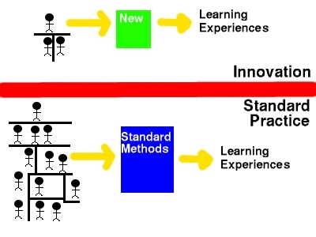

David Jones, Sharonn Stewart, The case for patterns in online learning, Proceedings of Webnet’99 Conference, De Bar, P. & Legget, J. (eds), Association for the Advancement of Computing in Education, Honolulu, Hawaii, Oct 24-30, pp 592-597

## Abstract

The current practice of online learning, especially at an institutional level, can be characterised as being complex and expensive with limited sharing of ideas and experience leading to a large amount of reinvention. Patterns, simple and elegant explanations which capture solutions that have developed and evolved over time, are abstractions being used to increase reuse and quality in a variety of fields including architecture, software engineering, hypermedia, and teaching/learning. This paper will introduce the concept of patterns and discuss what (if any) application patterns may have in the practice of online learning.

## Introduction

Central Queensland University (CQU) is a multi-campus regional institution with four branch, three interstate, and several international campuses. Fifty percent of CQU's students learn using a primarily print-based distance education approach. As with many other institutions CQU is ‘going online’.

Diagram 1 is a representation of the current implementation of online learning at CQU. The innovators and standard practitioners are separated by a wall which represents the lack of appropriation by the majority of innovations in teaching and learning. The innovators, also individually separated by walls, are creating learning experiences individually with limited sharing and reuse of experience. Likewise, the standard practitioners are producing standard learning experiences again with little or no collegial sharing of experience and ideas. This paper offers patterns as a possible solution to the lack of reuse and appropriation in the practice of online learning.

## Current practice and the problem

Current practice of developing online courses falls into one of two categories, either one-off custom initiatives or the application of cookie cutter moulds. The one-off initiatives are usually funded by special grants or driven by innovators and are normally not appropriated throughout the organisation as a whole hence due to the difficulty of replication. Cookie cutter mould developments are those using commercial development products such as WebCT or TopClass, standard designs and an outside support unit. Each course is placed into the mould with little chance of adapting the mould for the particular requirements of the students, staff or context of the course. Table 1 outlines the positive and negative points for both approaches.

| Approach | Positives | Negatives |
| --- | --- | --- |
| Cookie-cutter mould |   - Effective way for putting large number of courses online - Consistent quality     |   - Lack of academic ownership - Lack of customisation to individual course requirements - Inability to handle change (Jones 1996)  - Requires expensive infrastructure (GAL 1997, Ryan 1998)   |
| One-off |   - Flexible  - Designed for specific needs   |   - Very expensive - Large amounts of duplication and reinvention  - Inconsistent quality   |

Both approaches face problems with appropriation. One-off developments are enacted primarily by lone rangers, individual staff members who are energetic, early adopters of innovations, and who are motivated by a desire to improve the accessibility and quality of their teaching (Taylor 1998). However with a lack of institutional support and a failure to institutionalise the outcomes amongst others, this innovation is only produced at the level of particular course offerings (Taylor 1998). The implementation of cookie-cutter approaches is often driven by "management" and implemented by outside support units with limited input from academics. This results in a limited sense of ownership and contributes to online learning not becoming an central or normal component of practice. Most staff continue using their traditional practice while online learning is seen as an add-on provided the outside unit. This is partly because with little organisational support, innovative developments are not being used in the standard organisation practices (Taylor 1998; Mendes & Hall 1999).

Both teaching and support staff at CQU are experienced practitioners of teaching and learning using existing approaches, either face-to-face or print based distance education. Faced with the prospect of an entirely new medium, online learning, these staff are faced with the challenge of discerning what works and what doesn't in the new environment . Typically there has not been a simple environment in which existing practitioners could discover, discuss and share in the experience of others already moving into this medium (Mendes and Hall 1999).

Therefore the problem is to provide a method for implementing online learning which captures and reuses the knowledge and experience of innovators in such a way that is usable by the majority of staff. Importantly this approach should allow the innovators to continue leading while reducing the amount of reinvention and duplication which occurs.

A possible solution is to provide a common language which enables collaboration and sharing of ideas in a collaborative, independent and flexible way. The provision of a common language facilitates the process of understanding and may decrease the amount of reinvention. If everyone involved is speaking the same language it facilitates the process of understanding. However, providing a common language is not enough. An environment which emphasises the discovery, collaboration and reflection in which to use this language is also required. We suggest that ‘patterns’ and their appropriate application may be the answer.

## History of patterns

Christopher Alexander appears to have first proposed the idea of patterns in architecture in the late 60s early 70s. In the late 80s early 90s programmers struggling with object oriented programming discovered the concept of design patterns and adopted them for use in designing object-oriented programming systems. Patterns have since exploded into a wide range of different fields including: pedagogy (Erickson and Leidig 1997; Manns Sharp Prieto and McLaughlin 1998); analysis (Fernandez 1998); hypermedia (Nanard, Nanard and Kahn, 1998; Rossi Garrido and Carvalho 1996); structuring organisations; re-engineering systems; project planning; and a range of other different areas.

## What is a pattern

A pattern is “a generic approach to solving a particular problem that can be tailored to specific cases. Properly used, they can save time and improve quality” (Fernandez 1998). As Alexander (1977) puts it: "Each pattern describes a problem which occurs over and over again in our environment, and then describes the core of the solution to that problem, in such a way that you can use this solution a million times over, without ever doing it the same way twice". At a simple level, a pattern is a way to record the knowledge and experience of experts. A way of reusing best practice and taking into account the lessons others have already learned.

The use of patterns provide a number of benefits including making it easier to reuse successful designs, make proven techniques more accessible to developers, enable choice between alternatives, and improve the documentation and maintenance of existing systems (Gamma, Helm, Johnson and Vlissides, 1994). Gamma et al (1994) describe four essential elements for a pattern

1. A pattern **name** which describes the problem, solutions and consequences in a word or two.

3. A **problem** which describes the specific problem the pattern provides a solution for and the context in which it should be applied.
4. The **solution** which describes the elements that make up the design including their relationships, responsibilities and collaborations. This is not a specific concrete implementation of the pattern. Instead it is a abstract description of the components of a solution which enables an infinite variety of actual implementations.
5. The **consequences** describe the results and trade-offs of applying the pattern.

In practice, a particular pattern format is used to describe the decisions, alternatives and the trade-offs which contributed to the development of the pattern. The use of consistent format for the description of patterns makes it easier to learn, compare and use patterns (Gamma, Helm, Johnson and Vlissides, 1994). There are a number of common formats which have been used to describe patterns in different applications.

## Qualities of a pattern

According to Lea (1994), qualities of a well written pattern include; encapsulation, abstraction, openness, variability, generativity, composability and equilibrium.

- Encapsulation – A pattern encapsulates a well-defined problem and solution in a domain. It should target a particular problem and propose a particular solution to that one problem. It is not meant to be an all encompassing solution that addresses a range of problems.

- Abstraction – A pattern embodies knowledge and experience at varying levels of granularity. It is meant to abstract experience not be only a description of experience.
- Openness – Patterns are continually applied, one after the other. They need to be open for extension or used with other patterns to produce a larger pattern.
- Variability – A pattern does not specify only one particular way of implementation, it is able to be implemented in an infinite variety of ways. Patterns are meant to be variable dependent upon the context and how you wish to implement them.

- Generativity – Patterns are generative. Each successive pattern constructs a context which steps towards a complete solution.
- Composability – Patterns do not work by themselves, they need to be composed and work together with other patterns, both linearly and at different levels of granularity.
- Equilibrium – Patterns are designed to achieve a balance amongst the forces and constraints in which they work, an equilibrium.

## Writing a pattern

Writing a pattern is a difficult, creative**,** and usually collaborative process. A major contributor to the difficulty of writing a pattern is extracting and abstracting expert knowledge and experience from a situation. Additionally, actually achieving the qualities of a well written pattern can be extremely difficult. The process usually starts with pattern mining, that is, searching for patterns to document. This could be undertaken by searching the literature, attending conferences, or reflecting upon personal practice to abstract practices which work. The pattern author is not necessarily the original innovator, although that can be the case.

### Writers workshop

Patterns are usually developed in a writers workshop, a practice adapted from creative writing. Writers workshops are a collaborative way of producing and improving upon patterns. A writers workshop is a positive, friendly and collaborative group process led by a moderator with the author actively participating at designated times. In short, the group forms a circle, reads the pattern, offers positive comments then suggestions for improvement, finally the author asks for clarification.

At some point in the future the author rewrites the pattern based on the writers workshop. Once a pattern has been identified, written and moved through a writers workshop it is then stored in a pattern catalogue. A pattern catalogue is a collection of good patterns.

Typically, at least in programming and a number of other fields, conferences are held where writers workshops are conducted. Pattern Languages of Programming (PLoP) design conferences are one of the key areas where programming design patterns are produced. There is non-anonymous review and careful editing. PLoP conferences are held around the world annually EuroPLoP (http://www.argo.be/europlop), PLoP USA (http://st-www.cs.uiuc.edu/~plop/plop99/ ), Chilli PloP (http://www.agcs.com/patterns/chilliplop). Additionally, at regular intervals PLoP conferences produce edited books of the best patterns from conferences (Coplien and Schmidt 1995; Vlissides, Coplien and Kerth 1996; Martin, Riehle and Buschman 1997).

### The mystical aspects of patterns

It could be argued that patterns are basically just a special format for a paper produced using a collaborative process. Patterns, particularly when they are grouped together in a pattern language (described below), are intended to be much more. Three of the aspects of patterns which make it more than a specially formatted paper are: generativity, piecemeal growth, and the quality without a name (QWAN).

### Generativity

Patterns are not simply descriptions of good systems, they are meant to generate new systems. When a pattern is applied the system moves from one particular context to a new context. Ideally, by the continual applications of related and well designed patterns a living structure is generated capable of dynamically adapting to changing needs and demands. Using an analogy from architecture, patterns are designed so that rather than building only a single room, it can be added to and generate a new environment which can be adapted to different means. The intent is that as a number of small patterns are applied, the well designed pattern language will move the user to a larger solution addressing larger problems.

### Piecemeal growth

Piecemeal growth is the assumption that every environment whether it be for a building, a learning environment or a computer program is continually changing. Piecemeal growth is the opposite of traditionally practice, particularly in architecture, which relies on design for replacement. For example a building is created with one purpose in mind. Twenty years later when there are more people it is torn down and replaced with a different building which better suits the current context.

Piecemeal growth is an approach which emphasises design for repair, not replacement. As the environment changes new patterns are selected and applied continually moving the design from one context to another, replacing older designs with more appropriate designs. An example of this is the story about the most beautiful house in the world (Rybczynski 1990). Rybczynski, a professor of architecture, sets out to build a dwelling in which to house the construction of a boat. However, as building proceeds the environment changes and the purpose of the dwelling changes. Eventually, rather than using it to build a boat the structure becames a place to live. This is an example of piecemeal growth, continually applying patterns to achieve something that you probably would not have predicted in the beginning.

### Quality without a name (QWAN)

The QWAN of a pattern is the incommunicable beauty that gives immeasurable value to the structure. Again using the architecture analogy QWAN is that experience of walking into a room that is well designed and it just ‘feels’ right. The quality is without a name because it is meant to include concepts such as beauty and order, recursive centres of symmetry and balance, life and wholeness, resilience, adaptability, durability, comfort, satisfaction, and resonance (emotionally and cognitively). These concepts form QWAN as described by Alexander (1979) for architecture. QWAN for online learning may include some of these qualities but may also add more specialised qualities.

QWAN is one of the three foundation concepts for the pattern based approach to architecture proposed by Alexander (1979). The other two foundation concepts are "the gate" and "the timeless way". In summary, "the gate" (a pattern language, described below) provides the path by which you can use "the timeless way" (piecemeal growth)’ to achieve QWAN.

## Pattern languages

A pattern language is more than just a pattern catalogue (a collection of patterns). It is a cohesive collection of patterns and rules (guidance) on how to combine these patterns into a style or philosophy that enables you to achieve the QWAN. A pattern language is not meant to be a simple to follow prescription or recipe. Instead it is a language which enables an infinite variety of solutions limited only by the creativity and ability of the user of the pattern language. A good pattern language guides the designer toward useful or ’good’ architectures ( Coplien 1996).

### Theories, Golden Rules, Patterns and Templates

Nanard, Nanard and Kahn (1998) talk about the relationship between golden rules, patterns and constructive templates in relation to using design patterns in hypermedia. In designing a hypermedia application there are collections of patterns that can be used which have been influenced by the golden rules. For example short term memory effectively holds seven plus or minus two entities, this is a golden rule in interface design. Therefore when interfaces are designed they should only have seven plus or minus two choices on screen.

Constructive templates are approaches or ways in which patterns could be implemented. Remember patterns are meant to be abstract whereas constructive templates are more descriptive enabling patterns to be put into practice. Typically a pattern may be related to numerous constructive templates due to the variability of a good pattern.

The authors would like to expand the Nanard, Narnard and Kahn (1998) model to include a higher principle relating to the education field, that is the philosophical stance that the educator brings to the entire experience. This is the set of beliefs the educator has about how teaching and learning occur, for example the constructivist philosophy. It is suggested that the beliefs an educator has will inform the golden rules which in turn inform the patterns that are implemented using the constructive templates.

## The demise

A misconception that arises when discussing an issue such as this is the possible demise of experts. If there is a pattern catalogue available to novices which describes how to design a good system, surely the experts will no longer be necessary? The reason this may not occur is that applying patterns requires a great deal of knowledge and creativity. To create and apply patterns in online learning a knowledge of the context of application is required in addition to a familiarity with the environment and the implications of actions. For example a knowledge about the students’ situation and the learning content is essential.

There also needs to be an understanding of patterns and creativity in their application and combination. The application of one pattern will not solve all problems, by their very essence they are meant to encapsulate one issue. Further, continually creating patterns requires a community of experts contributing to and evaluating patterns. Therefore patterns are not a way to eradicate expensive professionals, rather they “channel creativity; they neither replace nor constrain it (Coplien 1996). Importantly, once experts start using pattern languages they are not straight-jacketed into a regime. Patterns and pattern languages are designed such that there is enough variability that they can be applied them creatively in an infinte number of ways.

## Patterns and online learning

The authors believe a pattern language for online learning is a long way in the future. However, a pattern catalogue, a more achievable aim, is an approach that will provide a number of advantages. A pattern catalogue could make it easier to discover new and proven solutions by allowing people to search the catalogue, using a number of criteria, to find a proven solution to a problem they are facing. The standard format/language used by a pattern catalogue could also provide a method to compare and contrast successful approaches. A particular pattern can be compared based on the context that feeds into it and the resulting context in combination with the examples of those patterns in practice.

A pattern catalogue could also provide a resource for training. The object oriented programming community are using patterns to teach people how to become object oriented designers (Manns, Sharp, Prieto and McLaughlin 1998). One of the approaches being used is to have novices in the field increase their understanding by participating in a study group which reflects on patterns and their implications. It is suggested that the collaborative and reflective process of generating the pattern catalogue would also be a learning/training experience.

A pattern catalogue also offers a number of advantages to the practice of creating online learning envirionments. Its presence could make it easier design such experiences, significantly reduce the need to reinvent the wheel and enable more people to learn from the experience of others. Patterns can channel creativity into more innovative channels. The results of this innovativeness can in turn be fed back into the pattern catalogue for the benefit of colleagues.

Diagram 2 is a modification of the earlier diagram and shows how patterns might be applied to the production of online learning. The basic constructs are the same: the small number of innovators continue to do their own thing while the majority use existing practice. The difference is that what the innovators are doing is being pattern mined. Somebody, whether it be the innovators themselves or somebody else, is looking at, reflecting on and evaluating what the innovators are doing and trying to construct patterns. In a further modification constructive templates would also be created to enable the easy implementation of patterns.

As the patterns are being constructed they are being fed into a catalogue. Theoretically most people would now draw upon the wealth of abstract knowledge and experience in the catalogue when designing learning experiences. This application of patterns will generate new ideas and new findings that are also fed back into the pattern catalogue. At some stage patterns will be retired based on the continual reflection that occurs throughout the process.

In short, patterns are a basis for codifying and using innovation. The innovators are able to continue what they are doing. Hopefully the continual reflection and generation of new patterns based on experience will enable the system to adapt to changes in the environment. Eventually, when a pattern language for online learning has been produced, it may be possible to generate an online learning experience which demonstrates the quality without a name.

## Current work

This paper is the result of an initial presentation at CQU about patterns and online learning. During that initial presentation a "dummy" writers workshop was run to investigate and provide a taste of the process (http://webclass.cqu.edu.au/Patterns/Publications/case2/). The positive response from the (approximately 30) people in attendance has further reinforced the possibilities that the application of patterns can bring to online learning. Plans have now moved on to include the development of a patterns study group to further reflect upon online learning patterns and their implications. Simultaneously, it is planned to introduce the approach shown in Diagram 2 into the current redesign of the use of online learning within the Faculty of Informatics and Communication at CQU. This work is expected to generate numerous questions and ideas for further work. The CQU patterns group can currently be found on the Web (http://webclass.cqu.edu.au/Patterns/).

## Conclusions

Patterns have proved useful in a number of fields, architecture, object oriented design. The authors are proposing that patterns may aid in the re-use and appropriation of innovation and experience in online learning enabling continual improvement through the application of piecemeal growth (the continual application of patterns from a pattern language) which may enable the attainment of the quality without a name. Now we have to find out if this is the case.

## References

Alexander C, Ishikawa S, Silverstein M, 1977, A Pattern Language: Towns, Buildings, Construction, Oxford University Press

Alexander C, 1979, The Timeless Way of Building, Oxford University Press

Coplien J, 1996, Software Design Patterns: Common Questions and Answers, ftp://st.cs.uiuc.edu/pub/patterns/papers/PatQandA.ps

Coplien J, Schmidt D, 1995 Pattern Languages of Program Design, Addison Wesley, Reading, Massachusetts.

Erickson C, Leidig P, 1997 A pedagogical pattern for bringing service into the curriculum via the web in ACM SIGCSE Bulletin Vol. 29, No. 3 Sept. 1997 pp54-56 in: ITiCSE '97. Proceedings of the conference on Integrating technology into computer science education.

Fernandez E B 1998 Building systems using analysis patterns in ISAW ’98. Proceedings of the third international workshop on Software Architecture pp37-40

Global Alliance Limited (GAL), 1997, Australian higher education in the era of mass customisation (Appendix 11), In: Learning for life: Review of higher education funding and policy (R. West), Canberra: Australian Government Publishing Service.

Gamma E, Helm R, Johnson R, Vlissides J, 1994 Design Patterns: Elements of Reusable Object-Oriented Software, Addison Wesley, Reading, Massachusetts.

Jones D 1996 Computing by Distance Education: Problems and Solutions, ACM SIGCSE Bulletin, Vol 28 No SI pp139-146 in ITiCSE ’96. Proceedings of the Conference on Integrating Technology into Computer Science Education

Lea D, 1994), Christopher Alexander: an Introduction for Object-Oriented Designers, ACM Software Engineering Notes, http://gee.cs.oswego.edu/dl/ca/ca/ca.html

Lyardet R, Rossi G, Schwabe D, 1998 Using Design Patterns in Educational Multimedia Applications in “ Proceedings EDMedia'98” Freiburg, Germany.

Manns M L, Sharp H, Prieto M, McLaughlin P, 1998 Capturing Successful Practices in OT Education and Training, in Journal of Object Oriented Programming, Vol 11 No (1) pp29-34.

Martin R, Riehle D, Buschman F, 1997 Pattern Languages of Program Design 3 Addison Wesley, Reading, Massachusetts.

Mendes M, Hall W, 1999 Hyper-authoring for education: a qualitative evaluation in Computers and Education Vol 32 pp51-64

Nanard M, Nanard J, Kahn P, 1998, Pushing reuse in hypermedia design: golden rules, design patterns and constructive templates, Proceedings of the 9th ACM Conference on Hypertext and Hypermedia, pp11-20

Ryan Y, 1998, Time and tide: Teaching and learning online, Australian Universities Review, 41(1), pp14-19.

Rybczynski W, 1990, Most Beautiful House in the World, Viking Press

Stevens P, Pooley R, 1998 Systems reengineering patterns in ACM SIGSOFT Software Engineering Notes Vol. 23, No. 6 Nov. 1998, Pages 17-23 in: SIGSOFT '98. Proceedings of the ACM SIGSOFT sixth international symposium on Foundations of software engineering.

Taylor P, 1998, Instituional Change in Uncertain Times: lone ranging is not enough, Studies in Higher Education, 23(3), pp269-278

Vlissides J, Coplien J, Kerth N, 1996 Pattern Languages of Program Design 2, Addison Wesley, Reading, Massachusetts.