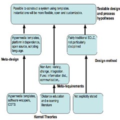
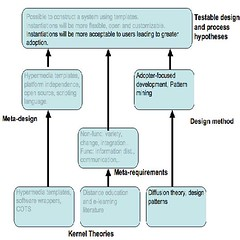
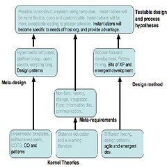
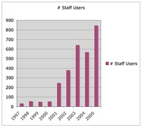

David Jones, Shirley Gregor, The formulation of an ISDT for e-learning, Paper presented at the 1st International Conference on Design Science Research in Information Systems and Technology

> _Note:_ A significantly modified and expanded version of this ISDT and its formulation are [described in my thesis](/blog2/research/phd-thesis/).

### Abstract

This paper describes the formulation of a design theory for an information system to support learning and teaching within an institution of higher education. The design theory has been tested via an instantiation that is about to enter its tenth year of operation and has been used by thousands of people. This real-world instantiation has provided significant benefits including identifying unexpected directions for research, providing significant supporting evidence and enabling a complementary research cycle between design-science and behavioural-science research. This paper describes the evolutionary development of the ISDT, how it has helped improve an existing information system and examines some questions about the practice of information systems design science research which arose from the process.

### Introduction

The importance of information and communication technologies and e-learning in promoting open, distance and flexible education in contemporary universities cannot be denied (deFreitas & Oliver, 2005). Allen and Seaman (2004) report on estimates that by October, 2004 over 2.6 million students will be studying online courses at US-based universities and add that over 50% of institutions agree that online education is critical to their long-term strategy. The questions about e-learning have become how, why and with what outcomes (Hitt & Hartman, 2002).

Many institutions are adopting Course Management Systems (CMSs) as the solution to the "how to implement e-learning" question. There is, however, evidence to suggest that this answer is not particularly innovative, may limit the incentive to innovate, is limited in quality and may restrict the ability to integrate with other systems (Alexander, 2001; Anonymous, 2004; Paulsen, 2002). Even institutions selected as best practice by the vendors of commercial CMSs report little more than 50% adoption by faculty (Sausner, 2005). Scholars in Information Systems can offer vision on structures and processes to effectively implement technology-mediated learning initiatives (Alavi & Leidner, 2001). There is a need for theory to support the design and implementation of these systems as they are complex and incorporate a variety of organisational, administrative, instructional and technological components (Avgeriou, Papasalouros, Retalis, & Skordalakis, 2003).

This paper describes the formulation process for an Information Systems Design Theory (ISDT), as described by Walls, Widmeyer and El Sawy (1992; 2004), for information systems used to support e-learning within institutions of higher education. The process is based on work started in 1996 with the intent to develop an integrated information system to enable use of web-based learning and provide a distinct advantage over competitors (Jones & Buchanan, 1996). An iterative, action-research process has been used to evolve the system and the associated ISDT through three distinct generations over the last ten years. Table 1 summarises the three generations that contributed to the formulation of the ISDT.

| Period | Title | Description |
| :-- | :-- | :-- |
| 1996-now | Build it and they will come | The generation of requirements and use of hypermedia templates to fulfil them. Produced a working system that received limited use. |
| 1999-now | Give them a reason to come | Increase use of the system by modifying the development and support processes with insights from diffusion theory, design patterns and pattern mining. |
| 2000-now | Build what they want, faster | Increase the agility of the system to change by encompassing features from emergent and agile development methodologies. Use design patterns to increase flexibility of the system architecture. |

##### Table 1 – The three generations of ISDT formulation

Unlike much design-science research, where constructed artefacts are rarely full-grown information systems that are used in practice (Hevner et al., 2004), this work has been instantiated in a real-world information system (Webfuse) that has been used by thousands of staff and students. This instantiation demonstrates that using this ISDT leads to an information system that offers a greater variety of features, allows greater flexibility in the choice of applications, greater integration within the organization and encourages greater staff and student usage (Jones & Gregor, 2004). Previous papers have described an earlier version of the ISDT to an education audience (Jones, Gregor, & Lynch, 2003) and summarised a more complete ISDT for an information systems audience (Jones & Gregor, 2004).

The first three sections of the paper describe each generation's _what and why_ (the ISDT), details of the _instantiation_ of the ISDT, and the _results_ of that instantiation. After describing these three past generations the paper offers a brief description of the potential fourth generation of the ISDT. Finally, the paper reflects on what this experience has suggested with respect to the practice of design science research within the Information Systems discipline.

## Generation 1: Build it and they will come

### What and why

Central Queensland University (CQU) has been offering courses in computing via print-based distance education since 1975 (Jones, 1996). By 1996, there was growing recognition that web-based learning would become increasingly important and that existing systems to support the use of the web were inappropriate for a majority of academics (Jones & Buchanan, 1996). Consequently, one academic grouping of the University gave a single academic (the first author) a semester off teaching to develop a system, Webfuse, to support the use of web-based learning in all of its courses (Jones & Buchanan, 1996) and also to implement and support the entire website for this academic grouping.

Based on experience with web-based education and with reference to the literature an initial set of non-functional and functional requirements was identified. Non-functional requirements of the system included: flexibility and the ability to adapt to change, platform independence, use of Internet and other widely accepted standards, maximising the choice and flexibility provided to students and teachers, providing the tools not the rules, minimising online time, minimising the new skills required to use the system, not reinventing the wheel, and being freely available (McCormack & Jones, 1997). The emphasis on flexibility and choice sought to provide support for the unique characteristics of individual disciplines, courses, academics and students (Jones & Buchanan, 1996). From the start, an ability to handle the diversity and continual change inherent in web-based learning (Jones, 2004) was seen as the key requirement of any web-based learning system.

The focus on flexibility and diversity implied that a single set of functional requirements would not be appropriate, instead, a general set of functional requirements was developed. These were based on the recognition that learning and teaching includes tasks associated with information distribution, communication, assessment, administration and design (Jones & Gregor, 2004; McCormack & Jones, 1997).

Due to the emphasis on flexibility and diversity there was recognition that it would be difficult, if not impossible, for any single organization, be it a software vendor or a local development team, to produce all the required services and tools for an e-learning information system (Jones, 1999). To address this limitation the meta-design of the system was based around the abstraction of hypermedia templates (Catlin, Garret, & Launhardt, 1991; Nanard, Nanard, & Kahn, 1998) where the templates were designed to act as software wrappers (Bass, Clements, & Kazman, 1998, p. 339) around commercial off-the-shelf (COTS) products. This approach combined the original benefits of hypermedia templates – simplified authoring process, increased reuse, and reduced costs (Catlin, Garret, & Launhardt, 1991; Nanard, Nanard, & Kahn, 1998) – with the benefits of the COTS approach -shorter development schedules and reduced development, maintenance, training and infrastructure costs (Braun, 1999).

To further support these goals almost all the COTS software used was open source software. While this provided access to source code and removed the influence of a commercial vendor (Gerlich, 1998), it did increase the level of technical skills required. Additionally, the system was written in the Perl scripting language. Such languages allow rapid development of applications via the gluing together of existing applications, 5 to 10 times faster than through the use of traditional systems programming languages (Ousterhoust, 1998).

Table 2 summarises the components of an ISDT identified by Walls et al (2004; , 1992). Figure 1 shows the relationship between these components and also details these components for the first generation of the ISDT. As shown in Figure 1, at this stage of the formulation of the ISDT little explicit consideration had been given to the design method. A naïve "build it and they will come" approach was adopted and consequently there were limitations to any instantiation of the ISDT.

| ISDT Component | Description |
| :-- | :-- |
| Kernel theories | Theories that support and guide the design by contributing to each of the remaining components |
| Meta-requirements | A description of the specific goals applicable to any system of the type to which the theory relates |
| Meta-design | Principles that specify the features to fulfil the metarequirements |
| Design method | The procedures used to implement and support the system |
| Testable hypothesis | Hypotheses about the system that are open to empirical testing |

Table 2 – Components of an Information Systems Design Theory (ISDT)

Figure 1 – 1st generation of ISDT

### Instantiation

Development of Webfuse, one instantiation of this ISDT began in late 1996 with the implementation of a "kernel" of services and a simple hypermedia template facility, called page types. At this stage of the web's development, HTML support for tables had just been made available and CGI scripts were the main method for server-side programming. The services provide by the "kernel" included authentication, access control, HTML validation, data storage, version control and presentation.

Page types (hypermedia templates) wrapped around existing open source software and also some university specific software. Open source software included, amongst others, a Java chat room, a web-based bulletin and software to provide a web-interface to email list archives. University specific page types included a simple quiz system, an online assignment submission system and simple display of content. Each page type stored specific data (e.g. configuration data for the Java chat room) in data stores, usually text files or a relational database.

Production of a web page required using the page type to transform its specific data into HTML and combining that HTML with a "style". The "styles" were designed to separate, where possible, presentation from content and to enable the same page type to produce different appearances. A website was produced by combining a collection of page types into the desired structure.

Few, if any, academics were willing or interested in designing a course website from scratch. Instead a standard course website was designed and a facility implemented to draw on existing organisational data to automatically generate a website for every course. Individual academics could then modify their course websites by modifying data via the page type facility.

The instantiation work occurred over a period of about 12 months and was performed by an academic and a small number of project students while they were learning the somewhat primitive web development technologies of 1996. Little or no thought was given, nor could it be due to the limitations of the technology and the skill sets of the implementers, to good quality interface design. From 1997 through 2000 system support was provided by a small number of staff. Little or no modification of the system and its capabilities occurred during this time.

### Results

By 1999, Webfuse had been used by almost 100 staff to maintain over 150 course websites containing over 100,000 separate web pages (Jones, 1999). In one 1998 semester over 83% of the content on course websites was for a single course. In 1998/1999, 49% of all requests for course content were for two courses taught by the developer of Webfuse. By 1999, of the 60 full-time staff employed by the organization only 5 are making significant use of the Web in learning and teaching (Jones & Lynch, 1999). Due to growing interest in the web, the growing ease-of-use of Web editors and a number of local factors there was a small, but growing, number of staff feeling limited by the default course site approach.

## Generation 2: Give them a reason to come

### What and why

Reflection on the previous generation identified the developer-based focus of the design method used as a major contributing factor to the limited use of the system (Jones & Lynch, 1999). The assumption was that web-based learning, as the new approach, would automatically replace the existing, inferior, face-to-face approach. The developers assumed that staff and students would see the benefit of the new system and take the steps to change their practices in order to adopt the system. While problematic in many contexts this approach is particularly unsuited for higher education. In higher education, many staff have considerable autonomy about how they perform tasks and often can and do resist the imposition of new technology and changes to routine (Jones, Gregor, & Lynch, 2003). It remains easier for academics within higher education to follow accepted practices than to carve out new paths (Roberts, 2005).

To address this problem a more adopter-based approach was implemented, where the focus was on the human, social and interpersonal aspects of the diffusion of the new system (Surry & Farquhar, 1997). The resulting process model drew on the theory of the diffusion of innovations (Rogers, 1995) and suggestions (Nanard, Nanard, & Kahn, 1998) to use the practice of pattern mining to identify new ideas for hypermedia templates (Jones & Lynch, 1999). Diffusion theory provided guidance on how to evaluate and design potential new features (Jones, Jamieson, & Clark, 2003) and how to communicate information about those features (Jones & Lynch, 1999). Pattern mining suggests that the evaluation of how innovators are using the system can help guide the development of new patterns which can in turn be abstracted into constructive templates (Nanard, Nanard, & Kahn, 1998).

This process led to the second generation of the ISDT shown in Figure 2. This generation added diffusion theory and design pattern related components to the first generation. The design method becomes much more adopter-focused and includes the use of pattern mining to identify potential new hypermedia templates by observing system usage by innovators. It is hypothesised that this change in the design method will result in an instantiation that is more acceptable to staff and students and consequently will achieve higher levels of adoption.

Figure 2 – 2nd generation of ISDT

### Instantiation

Diffusion theory contributed two changes in the design method. The first was a change to the channels and the people who were communicating information about Webfuse. The second involved a change in how choices were made about what modifications were made to the system. Pattern mining, through the close observation and analysis of innovative usage of the system, also contributed ideas for new page types.

A focus of diffusion theory is how information about an innovation is communicated through channels to members of a social system (Rogers, 1995). Diffusion theory suggests that different types of communication channels are more appropriate to different situations. During this generation of the instantiation communication channels changed to include less large group or broadcast communication channels and more individual or small group channels. Diffusion theory also suggests that the source of the information contributes to the likelihood of adoption. During this generation, staff using Webfuse, as opposed to Webfuse developers, began communicating positive information about their experience with parts of the system.

Some of these changes came about through conscious decisions made by the Webfuse developers as they were informed by diffusion theory. Other changes, however, arose quite naturally out of the actions of other members of the social system. For example, the academic leader of one group of staff organised an agenda item at that group's regular meetings to discuss the online assignment submission system and to urge all staff to adopt this innovation.

With online learning decisions about what change to implement next can often be guided by direction from management or by belief in a particular learning theory. The changes in the ISDT's design method meant that these types of decisions for Webfuse were, instead, guided more by the actions or requirements of the end-users.

The Webfuse development team kept a close eye on how individual staff, particularly those considered to be innovative, were using the system. Ideas or approaches that were deemed appropriately valuable were abstracted into page types. Consequently, these innovative approaches were easily available to other users of the system.

Whether or not a new feature was appropriate was judged primarily on estimations about whether or not a majority of academic staff would perceive the new feature to provide high relative advantage, have high compatibility with existing practice and be low in complexity. These are the three characteristics of an innovation most likely to influence adoption. Overtime a more complex model was developed (Jones, Jamieson, & Clark, 2003) to help the development team to increase their awareness of potential implementation issues, estimate the likelihood of reinvention and predict the amount and type of effort required to achieve adoption of a potential innovation.

As a result of this focus on the perceptions of the potential adopters of the system there was little or no effort placed on fixing some of the technical limitations of the system, unless absolutely necessary. For example, in order to fix performance problems the quiz system was rewritten using a server-side programming approach that was more efficient than CGI scripts. The design and implementation of page types and the "kernel" did not change significantly during this time.

Diffusion research is believed by some, including McMaster and Wastell (2005), to be based on a philosophy of determinism and positivism where outcomes can be predicted on the basis of a small number of tightly defined variables. The use of diffusion theory to guide the design method used in this ISDT does not share this philosophy. Instead, the findings of diffusion theory were used as a guide in an on going, dynamic, contextualised and complex process of improving Webfuse to better suit the needs of its users.

Diffusion theory has also been criticised for having a pro-innovation bias that, amongst other effects, can separate members of a social system into the superior innovators group and the inferior recalcitrants group (McMaster and Wastell, 2005). There were certainly times during Webfuse development when the existence of these groups was perceived by many of the potential Webfuse users. The initial use of developer-focused methods during the first generation helped encourage this view.

The move to a more adopter-focused method, informed by diffusion theory, and a sequence of latter events did, however, lead to the type of situation which McMaster and Wastell (2005) comment upon favourably.

> Here we would argue that the innovation succeeded due to internal development, through a participative process involving strong local leadership, engaged staff and the fortuitous occurrence of a series of local crises that aligned all stakeholders around the need for change. (McMaster and Wastell, 2005 p392)

### Results

This generation of the design theory was formulated during 1999 and used somewhat from 1999 to 2001. At this time, however, the Webfuse development team was very small and consequently the possible changes, while there, were quite small. The process accelerated in 2001 when additional resources became available and enabled a greater reliance on these principles. These new resources were also a major factor in the formulation of the 3rd generation of the ISDT. Consequently the results of the 2nd generation cannot be easily separated from that of the 3rd generation and so the results of these two generations have been combined in the next section.

## Generation 3: Build what they want, faster

### What and why

The third generation of the ISDT was initiated by the recognition that neither the metadesign nor the design method provided sufficient flexibility to respond quickly to user requirements. The addition of more developers in 2001 only emphasized these shortcomings. Consequently, the third generation of ISDT development focused on modifying both the meta-design and design method to better support rapid response to user requirements.

The meta-design was modified to adopt a more modern, technically advanced approach to web development. This involved moving beyond what was essentially a collection of procedural CGI scripts, to a meta-design based around object orientation and design patterns (Gamma, Helm, Johnson, & Vlissides, 1995). The approach used is very similar to that described by Weiss (2003) and Hohpe and Woolf (2003). This combination significantly increased the flexibility of the system by decreasing the workload involved in responding to change and enabling better support for diversity. For example, the use of a patterns based approach to user authentication and access control in the instantiation of the ISDT has supported five major generations and currently supports three different authentication systems.

It was obvious that the traditional SDLC-based development methodologies were not a good fit for this development team and how it was expected to perform. Around this time literature introducing emergent (Truex, Baskerville, & Klein, 1999) and agile (Highsmith & Cockburn, 2001) development became more widely available and was used to identify and develop necessary changes to the design method. These approaches were, in part, attractive because they are based on the assumption that there are a group of system developers who continually strive to achieve alignment between the organization and its information systems (duPlooy, 2003). This assumption matched the view of the Webfuse development team formed during the second generation of the ISDT.

Figure 3 illustrates the components of the third generation of this ISDT and the changes from the second generation. Due to the changes in design method and meta-design a new hypothesis was proposed. Since the development process focuses on responding to very contextual requirements it is suggested that over time any instantiation, based on this ISDT, would become less generic and more specific to the host organisation and consequently potentially provide a point of differentiation and advantage to that host organisation.

Figure 3 – The third generation of the ISDT

### Instantiation

In 2001, the design method was modified to adopt many of the practices associated with extreme programming (Beck, 2000). The adopted practices included the planning game, small releases, system metaphor, simple design, continuous testing, refactoring, continuous integration, coding standards and collective code ownership. Pair programming was used where possible but this was not often. Since not all of the practices of extreme programming were adopted it cannot be (strictly) claimed that the design method used was extreme programming (Beck, 2000). Additionally, there are numerous examples where the development team was unable to maintain the discipline extreme programming requires.

From 2001 onwards, new page types and a range of new services were developed using a new object-oriented, patterns-based approach. Both the new meta-design was designed and implemented so that it could co-exist with the initial meta-design. System components designed using the initial meta-design were only re-written if they were to be required in the longer term.

### Results

Jones and Gregor (2004) describe how the instantiation of this ISDT in the Webfuse system has generated evidence to support each of the ISDT's four proposed hypotheses. This section describes additional evidence generated since that publication and concentrates on evidence that supports the incorporation of diffusion theory, emergent/agile development and design patterns into the ISDT.

The application of the second and third generation ISDTs within the Webfuse instantiation has generated a significant increase in system use as shown in Figure 4. It is suggested that the dip in the number of staff users in 2004 is largely due to on-going uncertainty about the long term future of Webfuse.

Figure 4 -Growth in number of individual staff using Webfuse, 1997-2005.

From its inception Webfuse was funded and used by a one of many academic units within Central Queensland University (CQU). Webfuse was not seen as a University system and in many quarters was seen as a shadow system (Jones, Behrens, Jamieson, & Tansley, 2004). In late 2004, due to an organisational restructure and related changes it appeared that the academic unit would not be able to continue funding Webfuse and that the long term future of Webfuse was extremely limited (Jones, Behrens, Jamieson, & Tansley, 2004).

During 2005, however, the perceived benefits of Webfuse and the sense of ownership of Webfuse felt by a significant number of staff has resulted in a reversal of this trend. In 2005, over 400 staff from outside the academic unit which developed Webfuse, made use of Webfuse. At the start of 2006 Webfuse is now considered to be a University system, is being funded, in part, by the central IT organisation and is being used by staff from all parts of the University.

Over 91% of students (11138 of 12280) and 87% (399 of 461) of all teaching staff from the academic unit supporting Webfuse made use of Webfuse during 2005. In comparison, Sausner (2005) reports on four cases studies of CMS adoption by Universities. Each of these cases was volunteered as best practice by the vendors of the relevant CMS. None of these cases report greater than 55% adoption by faculty.

During 2005 a research project (Behrens, Jamiesion, Jones, & Cranston, 2005) was initiated to investigate perceptions of the online assignment submission and management component (OASIS) of Webfuse. During 2005 the OASIS system became the most widely used online learning tool within Webfuse. Using the Technology Acceptance Model the research found that both users and non-users of OASIS had very positive perceptions of the usefulness and ease of use of the system (Behrens, Jamiesion, Jones, & Cranston, 2005).

The following staff comments are from this and other research during 2004/2005.

> I identify myself as coming from the technophobic extreme of the faculties (I have an Arts background) but even I find the systems the team have set out relatively easy to use
> 
> ..the precedent of other IT systems made available in Infocom (…) suggests that it would be extremely user friendly for people with very limited computer competence/confidence.
> 
> my positive experience with other Infocom systems gives me confidence that OASIS would be no different. The systems team have a very good track record that inspires confidence
> 
> The key to easy use of OASIS is that it is not a off the shelf product that is sooooo (sic) generic that it has lost its way as a course delivery tool.

### The need for a fourth generation

A range of organisational, social, technical and other factors are contributing to the need to think about the next generation of the ISDT. Some of these arise from greater understanding of previous experience, some from new knowledge, technical capability or perspectives and others from limitations with the current instantiation.

The existing design method, while it draws from emergent development still relies on development being performed by a development team. The original hypermedia template system (Catlin, Garret, & Launhardt, 1991) provided methods by which end users could develop new templates. This enabling of end-user development could significantly improve the system's ability to support diversity and respond to change.

In 2006, the instantiation of this ISDT will start to be used across multiple, different organizational units. While the original single organizational unit had considerable diversity it was still somewhat possible to support the varying requirements. There is, however, an open question about whether or not the design method will scale across different groups with different aims. Especially given concerns about the scalability of agile methods.

For various reasons associated with the organisational context most of the innovations within the current instantiation has focused on administrative tasks and supporting existing pedagogical practice. A major benefit of technology mediated learning, yet to be fully unleashed through this work, is the potential to develop innovative pedagogical practices.

There is a growing interest in the concept of Web 2.0 (O'Reilly, 2005) and how this may influence the future of e-learning systems (Downes, 2005). It is currently thought that a meta-design based around the concepts of tagging, micro-content and structured blogging may offer a range of advantages.

### Questions about design science research in IS

During the formulation of the ISDT presented in this paper a range of questions arose about the practice of design science research within the information systems discipline. This section raises these questions and provides some very tentative thoughts about what possible answers may be.

### Real world or prototype instantiations?

The artefacts produced by design-science research are rarely full-grown information systems used in practice (Hevner, March, Park, & Ram, 2004). This may be because of the high cost of developing and supporting real-world instantiations combined with the difficulty of finding an organisation to agree to trial the instantiation. Why then develop a real-world instantiation?

It is acknowledged that perceptions and fit with an organization are crucial to the successful development and implementation of an information system (Hevner, March, Park, & Ram, 2004). Testing the instantiation of an ISDT within a real organisational setting reveals perceptions, issues and problems that are not readily visible when limited to a prototype or theoretical instantiation. Real-world deployment involves people, people who have agendas and goals that differ vastly from those of the organization (Markus, 1983). For this, and other reasons, the organisational context within which information systems are instantiated is non-deterministic (duPlooy, 2003). An instantiation that is considered adequate in technical or theoretical terms will not necessarily work in practice (Kasanen, Lukka, & Siitonen, 1993).

Many fields have a growing gap between practitioners and researchers that is bound to grow as an increasing number of academics are involved in the modelling of simplified and unrealistic situations or testing of non-instrumental empirical hypotheses (Mattessich, 1995) or who fail to evaluate their ideas in a practical setting before advocating them (Glass, 1996). An influx of design-science research work is one way to close the gap between researcher and practitioner (David, Gerard, & McCarthy, 2000). Testing design-science research with real-world instantiations assists in closing this gap.

Most importantly this work is a response to the call to align design-science research within information systems with real-world production experience (Hevner, March, Park, & Ram, 2004). This provides an opportunity to engage in a complementary research cycle between design-science research and behavioural-science research (Hevner, March, Park, & Ram, 2004). This call mirrors the call made by Brooks (1996) to computer scientists to see themselves as toolsmiths collaborating with other disciplines to solve real world problems. Such an approach targets relevant, rather than toy-scale, problems; requires understanding of the whole problem rather than just the easy parts; and by tackling the hard parts of the problem lead us to learn or develop new knowledge in our own discipline (Brooks, 1996). The experience gained in developing a real-world instantiation of this ISDT has generated behavioural-science research in both information systems (Behrens, Jamiesion, Jones, & Cranston, 2005; Behrens & Sedera, 2004; Jones, Behrens, Jamieson, & Tansley, 2004) and other disciplines (Jones, Luck, McConachie, & Danaher, 2005; McConachie, Danaher, Luck, & Jones, 2005).

Using a real-world instantiation enables research to respond to and be influenced by the unexpected events only visible when the instantiation is used in a real-world context. This in turn can take the research in new and more relevant directions. For example, Bailetti, Weiss and McInnis (2005) report on a project to develop a online learning system by using web services to provide software wrappers. In this work the research interest is focused on the role of shared representation between these multiple products and how the Semantic Web and ontology can provide assistance with solving the problem (Bailetti, Weiss, & McInnis, 2005). The experience gained from supporting a real-world instantiation of the ISDT presented in this paper identified a different question, "how to encourage adoption and respond to diversity and change?".

### What can be IS design science research

It has been suggested that the limited discussion about the philosophical assumptions underlying IS design science research and about what should be included or excluded from such research are two major issues around IS design science research (Carlsson, 2005). It has been suggested that the IS design science research emphasis on things at the expense of context may be due to its positivist origins (McKay & Marshall, 2005). McKay & Marshall (2005) suggest that what separates IS from computer science (located firmly in the machine domain) and psychology (located firmly in the human behaviour domain) is the 'situatedness' of the machine in the social system. They agree with Carlsson (2005) and others (Boland & Lyytinen, 2004) to position design activity within IS in a sociotechnical context where any attempts to separate out the technical artifact alters the sociotechnical system.

March and Smith (1995) suggest that an aim of design-science research is to create things that serve human needs and includes the acts of building and evaluating constructs, models, methods and instantiations. Walls, Widmeyer and El Sawy (2004) offer a alternate view and suggest that it is the aim of design practice to create things that serve human needs, while design-science research should seek to create the theoretical foundations for design practice. McKay and Marshall (2005) suggest that the view of March and Smith (1995) confuses 'doing' (building and evaluating) with research into the 'doing'. They suggest that design researchers should not be merely designing an artifact to solve a problem but should also be conducting research into some aspect of the design activity relevant to the particular problem space (McKay & Marshall, 2005).

### Conclusions

This paper has provided a description of the three stages in the evolutionary development of an information systems design theory (ISDT) for information systems to support e-learning within institutions of higher education. This ISDT has been tested and shaped by over ten years of real-world use of an instantiation of the ISDT. The ISDT results in systems with a range of advantages over published best practice.

The development of such a large, long-term instantiation has required significant effort but in return has provided improved understanding of the problem area, taken the research in unexpected directions, and greater evidence to support the design theory. The fully-grown instantiation has made it possible to engage in a complementary research cycle between design-science and behavioral-science research.

### References

Alavi, M., & Leidner, D. E. (2001). Research commentary: technology-mediated learning -a call for greater depth and breadth of research. _Information Systems Research,_ _12_(1), 1-10.

Alexander, S. (2001). E-learning developments and experiences. _Education and Training,_ _43_(4/5), 240-248.

Allen, I. E., & Seaman, J. (2004). _Entering the mainstream: The quality and extent of_ _online education in the United States, 2003 and 2004_. Needham, MA: The Sloan Consortium.

Anonymous. (2004). Mixed skies ahead: What happened to e-learning and why. _Change,_ _36_(2), 55-58.

Avgeriou, P., Papasalouros, A., Retalis, S., & Skordalakis, M. (2003). Towards a Pattern Language for Learning Management Systems. _Educational Technology & Society,_ _6_(2), 11-24.

Bailetti, T., Weiss, M., & McInnis, G. (2005). _An open platform for customized learning_ _environments._ Paper presented at the International Conference on Management of Technology (IAMOT).

Bass, L., Clements, P., & Kazman, R. (1998). _Software Architecture in Practice_. Boston: Addison-Wesley.

Beck, K. (2000). _Extreme Programming Explained: Embrace Change_: Addison-Wesley.

Behrens, S., Jamiesion, K., Jones, D., & Cranston, M. (2005). _Predicting system success_ _u__sing the Technology Acceptance Model: A case study._ Paper presented at the Australasian Conference on Information Systems'2005, Sydney.

Behrens, S., & Sedera, W. (2004). _Why do shadow systems exist after an ERP_ _implementation? Lessons from a case study._ Paper presented at the 8th Pacific Asia Conference on Information Systems, Shanghai, China.

Boland, R. J., & Lyytinen, K. (2004). Information systems research as design: identity, process and narrative. In B. Kaplan, D. Truex, D. Wastell, T. Wood-Harper & J. DeGross (Eds.), _Information systems research: Relevant theory and informed_ _practice_. Boston: Kluwer Academic Publishers.

Braun, C. L. (1999). _A lifecycle process for the effective reuse of commercial off__\-__the__\-__shelf_ _(COTS) software._ Paper presented at the 1999 Symposium on Software Reusability, Los Angeles.

Brooks, F. (1996). The Computer Scientist as Toolsmith II. _Communications of the ACM,_ _39_(3), 61-68.

Carlsson, S. (2005). Developing Information Systems Design Knowledge: A Critical Realist Perspective. _Th__e Electronic Journal of Business Research Methodology,_ _3_(2), 93-102.

Catlin, K., Garret, L. N., & Launhardt, J. (1991). _Hypermedia Templates: An Author's_ _Tool._ Paper presented at the Proceedings of Hypertext'91.

David, J., Gerard, G., & McCarthy, W. (2000). _Design Science: Building the Future of_ _Accounting Information Systems._ Paper presented at the SMAP 2000.

deFreitas, S., & Oliver, M. (2005). Does e-learning policy drive change in higher education? A case study relating models of organisational change to e-learning implementation. _Journal of Higher Education Policy and Management_, 27(1), 81-95.

Downes, S. (2005). E-learning 2.0 \[Electronic Version\]. _eLearn Magazine_. Retrieved 26 October,2005 from http://www.elearnmag.org/subpage.cfm?section=articles&article=29-1.

duPlooy, N. F. (2003). Information systems as social systems. In J. Cano (Ed.), _Critical_ _Reflections on Information Systems: A Systematic Approach_. Hershey: IDEA Group Inc.

Gamma, E., Helm, R., Johnson, R., & Vlissides, J. (1995). _Design Patterns:_ _Elements of_ _Reusable Object__\-__Oriented Software_. Reading, Massachusetts: Addison-Wesley.

Gerlich, R. (1998). _Lessons Learned by Use of (C)OTS._ Paper presented at the 1998 Data Systems in Aerospace, Athens, Greece.

Glass, R. (1996). The Relationship between Theory and Practice in Software Engineering. _Communications of the ACM, 39_(11), 11-13.

Hevner, A., March, S., Park, J., & Ram, S. (2004). Design science in information systems research. _MIS Quarterly, 28_(1), 75-105.

Highsmith, J., & Cockburn, A. (2001). Agile software development: Business of innovation. _IEEE Computer, 34_(9), 120-122.

Hitt, J., & Hartman, J. (2002). _Distributed learning: New challenges and opportunities_ _for institutional leadership_. Washington: American Council on Education.

Hohpe, G., & Woolf, B. (2003). _Enterprise Integration Patterns: Designing, Building_ _and Deploying Messaging Solutions_. Boston: Addison-Wesley.

Jones, D. (1996). _Solving Some Problems of University Education: A Case Study._ Paper presented at the AusWeb'96, Gold Coast, QLD.

Jones, D. (1999). _Webfuse: An integrated, eclectic web authoring tool._ Paper presented at the Proceedings of EdMedia'99, World Conference on Educational Multimedia, Hypermedia & Telecommunications, Seattle.

Jones, D. (2004). The conceptualisation of e-learning: Lessons and implications. _Best_ _practice in university learning and teaching: Learning from our Challenges._ _Theme issue of Studies in Learning, Evaluation, Innovation and Development,_ _1_(1), 47-55.

Jones, D., Behrens, S., Jamieson, K., & Tansley, E. (2004). _The rise and fall of a shadow_ _system: Lessons for enterprise system implementation._ Paper presented at the Managing New Wave Information Systems: Enterprise, Government and Society, Proceedings of the 15th Australasian Conference on Information Systems, Hobart, Tasmania.

Jones, D., & Buchanan, R. (1996). _The design of an integrated online learning_ _environment._ Paper presented at ASCILITE'96, Adelaide.

Jones, D., & Gregor, S. (2004). _An information systems design theory for e__\-__learning._ Paper presented at the Managing New Wave Information Systems: Enterprise, Government and Society, Proceedings of the 15th Australasian Conference on Information Systems, Hobart, Tasmania.

Jones, D., Gregor, S., & Lynch, T. (2003). _An information systems design theory f__or web__\-__based education._ Paper presented at the IASTED International Symposium on Web-based Education, Rhodes, Greece.

Jones, D., Jamieson, K., & Clark, D. (2003). _A model for evaluating potential web__\-__based_ _education innovations._ Paper presented at the 36th Annual Hawaii International Conference on System Sciences, Hawaii.

Jones, D., Luck, J., McConachie, J., & Danaher, P. A. (2005). _The teleological brake on_ _ICTs in open and distance learning._ Paper presented at the Conference of the Open and Distance Learning Association of Australia'2005, Adelaide.

Jones, D., & Lynch, T. (1999). _A Model for the Design of Web__\-__based Systems that_ _supports Adoption, Appropriation and Evolution._ Paper presented at the First ICSE Workshop on Web Engineering, Los Angeles.

Kasanen, E., Lukka, K., & Siitonen, A. (1993). The constructive approach in management accounting research. _Journal of Management Accounting Research,_ _5_, 241-264.

March, S. T., & Smith, G. F. (1995). Design and Natural Science Research on Information Technology. _Decision Support Systems, 15_, 251-266.

Markus, M. L. (1983). Power, politics and MIS implementation. _Communications of the_ _ACM, 26_, 430-440.

Mattessich, R. (1995). _Critique of Accounting: Examination of the Foundations and_ _Normative Structure of an Applied_ _Discipline_. Westport, Connecticut: Quorum Books.

McConachie, J., Danaher, P., Luck, J., & Jones, D. (2005). Central Queensland University's Course Management Systems: Accelerator or brake in engaging change? _International Review of Research in Open and Di__stance Learning, 6_(1).

McCormack, C., & Jones, D. (1997). _Building a Web__\-__Based Education System_. New York: John Wiley & Sons.

McKay, J., & Marshall, P. (2005). _A review of design science in information systems._ Paper presented at the 16th Australasian Conference on Information Systems, Sydney, Australia.

McMaster, T., & Wastell, D. (2005). Diffusion -or delusion? Challenging an IS research tradition. _Information Technology & People, 18_(4), 383-404.

Nanard, M., Nanard, J., & Kahn, P. (1998). _Pushing Reuse i__n Hypermedia Design:_ _Golden Rules, Design Patterns and Constructive Templates._ Paper presented at the Proceedings of the 9th ACM Conference on Hypertext and Hypermedia.

O'Reilly, T. (2005, 30 September, 2005). What is Web 2.0: Design patterns and business models for the next generation of software. Retrieved 15 October, 2005, from http://www.oreillynet.com/pub/a/oreilly/tim/news/2005/09/30/what-is-web-20.html

Ousterhoust, J. (1998). Scripting: Higher Level Programming for the 21st Century. _IEEE_ _Computer,_ _31_(3), 23-30.

Paulsen, M. F. (2002). Online education systems in Scandinavian and Australian Universities: A Comparative Study. _International Review of Research in Open_ _and Distance Learning_.

Roberts, T. (2005). Computer-Supported Collaborative Learning in Higher Education: An Introduction. In T. Roberts (Ed.), _Computer__\-__Supported Collaborative Learning in_ _Higher Education_ (pp. 1-18). Hershey, Pennsylvania: Idea Group Publishing.

Rogers, E. (1995). _Diffusion of Innovations_ (4th ed.). New York: The Free Press.

Sausner, R. (2005). Course management: Ready for prime time? _University Business_.

Surry, D., & Farquhar, J. (1997). Diffusion Theory and Instruction Technology. _Journal_ _of Instructional Science and Technology, 2_(1), 269-278.

Truex, D., Baskerville, R., & Klein, H. (1999). Growing systems in emergent organizations. _Communications of the ACM, 42_(8), 117-123.

Walls, J., Widmeyer, G., & El Sawy, O. (2004). Assessing information system design theory in perspective: How useful was our 1992 initial rendition. _Jo__urnal of_ _Information Technology, Theory and Application, 6_(2), 43-58.

Walls, J., Widmeyer, G., & El Sawy, O. A. (1992). Building an Information System Design Theory for Vigilant EIS. _Information Systems Research, 3_(1), 36-58.

Weiss, M. (2003). _Patterns for_ _Web Applications._ Paper presented at the Conference on Pattern Languages of Programming (PLoP).