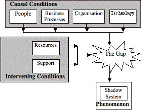

David Jones, Sandy Behrens, Kieren Jamieson, Elizabeth Tansley

## Abstract

In much of the enterprise systems (ES) literature shadow systems, although infrequently studied, are regarded as undesirable. They are believed to undermine ES implementation and as such should be eliminated. Using a theoretical framework that explains the motivation for the development of shadow systems within an ES context, this paper analyses a longitudinal case study of the eight-year rise and expected fall of a single shadow system. Results of the analysis indicate that shadow systems may be useful indicators of a range of problems with enterprise system implementation. It appears that close examination of shadow systems may help both practitioners and researchers improve enterprise system implementation and evolution.

## Keywords

Shadow systems; Enterprise Systems; Enterprise Resource Planning

## Introduction

One of the primary goals of an enterprise system\[1\] (ES) is the full integration of a business (Davenport, 1998). Integration of the functional and operational requirements of an organisation through an integrated information system is expected to provide many benefits including: cost reduction, increased growth, improved business processes, heightened productivity, and increased agility of the organisation as a whole (Davenport, 1998, Markus and Tanis, 2000). Perhaps due to these expected benefits, Enterprise Resource Planning (ERP) systems have gained significance in several ways, the most notable being their economic impact. The market for ERP systems is large with over $26.7 billion in revenue expected for 2004 (Callaghan and McCright, 2004).

One expected and desirable outcome of ERP system implementation is the elimination of **shadow systems** (Oliver and Romm, 2002, Strong and Volkoff, 2004). Shadow systems are "systems which replicate in full or in part data and/or functionality of the legitimate systems (the ES) of the organization" (Behrens and Sedera, 2004). In the IS/IT literature shadow systems have been declared an undesirable phenomenon (Oliver and Romm, 2002) that undermine ERP system implementation (Strong and Volkoff, 2004). Alternatively, there is literature which argues that the very nature of ERP systems is likely to introduce the fragmentation characteristic of shadow systems (Kallinikos, 2004).

It is the intention of this study to shed more light on the phenomenon of shadow systems. Are shadow systems necessarily undesirable? Do they offer some value? Is the presence of shadow systems symptomatic of other problems? This paper is our first step in answering the question, "What lessons may be learned from shadow systems?" Answers to this and related questions may offer value to both practice and research in increasing the successful implementation and long-term use of ERP systems.

We propose to answer this question through the use of a single, holistic case study carried out over a period of 8 years. Our case study covers almost the entire life cycle of a single shadow system, beginning with the decision to implement an ERP system, followed by the creation of the shadow system, its rise in use and popularity, through to the expected downfall of that shadow system. The paper starts with some conceptual background to the study and a description of the research methodology. Next is the presentation of our case study outlining the rise and fall of the shadow system. The paper then seeks to analyse this case study in an attempt to seek lessons that might be gained from the existence of the shadow system. The paper concludes with a summary and ideas for future work.

## Conceptual background

Shadows systems have generally been declared an undesirable phenomenon within the ES literature. In theory, any replication of ES data or functionality (a characteristic of shadow systems) undermines the ES's primary goal of centrally providing all the required functional and operational needs of the organisation. The major cost of a shadow system is associated with the replication effort and subsequent redundant workload and data integrity and quality problems (Behrens and Sedera, 2004). The motivation for shadow systems within the context of an ERP system can be explained through the theoretical framework provided by Behrens and Sedera (2004) presented in Figure 1.

This framework illustrates that shadow systems arise due to a construct termed the "gap". This gap is the separation between the requirements of the various stakeholders within an organisation and what the ERP system implementation provides. The extent of the gap is a combination of both causal and intervening conditions. Causal conditions - sets of events that influence the creation of the gap - include the characteristics of the people, business process, organisation and technology present when an ES is implemented. Intervening conditions - which mitigate or alter the impact of the causal conditions - include the availability of resources and support for the shadow system. This theoretical framework provides the lens with which we will analyse our case study.

Figure 1. Factors causing shadow systems in an ERP system context (adapted from Behrens and Sedera, 2004).

## Method

The research method employed in this study was of a single, holistic case study. A single case study is appropriate because the case is believed to be revelatory in nature (Yin, 1994). In discussing the research efforts relating to the general phases of an ERP lifecycle, Esteves and Pastor (2001) state that researchers have mainly concentrated on issues pertaining to the implementation phase, almost forgetting the other phases. There are few studies which have looked beyond implementation to tackle issues related to longer-term usage and the impacts of ES on organisations (Gosain, 2004). This particular study follows an ES instance through the phases of adoption, acquisition, implementation, use and maintenance and evolution over an 8-year period. To the authors' knowledge, there are no studies of this type examining the question of shadow systems within the ES literature.

To increase the accuracy and precision of judgements and thereby the results of our study we utilised multiple sources of evidence (Yin, 1994). These sources of evidence allowed a high degree of corroboration and augmentation of each individual piece of evidence. This study used evidence collected from documentation, interviews and participant observation. Documentation included communiqués such as email, mass media documentation including news clippings, administrative documents including formal business cases and externally-conducted formal evaluations and development documentation including source code repositories, system logs and development team discussion archives. Interviews conducted within this study were of an open-ended conversational nature. The authors participated in various roles during the case study including: developer of the corporate system replaced by the ERP, Technical Infrastructure Manager for the ERP implementation, lead developer of the shadow system, and as users of the replaced corporate system, the ERP system and the shadow system.

To further increase the construct validity of our study we asked key informants to review the draft case study report. These informants were people in key roles associated with both the shadow system and the ERP system.

## The case

Central Queensland University (CQU) is a multi-campus regional university with over 1200 staff and over 18000 students. CQU currently has a large number of campuses with the original campus at Rockhampton acting as the organisational centre. The original campuses are based in the same region as Rockhampton and enrol mainly local students. Newer campuses are located primarily outside the region in major population centres and are operated by a commercial partner and target full-fee paying, overseas students. A small number of remaining campuses are located off shore and are operated by commercial partners.

In the early 1990s CQU's student population was split between 50% on-campus students at the regional campuses and 50% distance students studying via print-based distance education. CQU's student numbers tripled from 6000 in 1990 to 18600 in 2003 with the majority of the increase generated by an increase in full-fee paying, overseas students studying at the newer campuses. 40% of CQU's student population are now international students from over 120 countries. These changes have had significant organisational repercussions, one of which was the perceived need for a university-wide ERP system.

### The rise part I : The decision to implement an erp

During the mid to late 1990s it was widely believed by the university's senior executive that CQU's existing student records system needed replacement. This perception was created by a series of events including the late delivery of distance materials, the perception that reports from the existing system were unreliable, and the general belief that the system was 'tired and worn out'. The Vice Chancellor was strongly in favour of integrating the university's administrative systems and reengineering better administrative procedures and practices. Specifically, the ability for students to enrol themselves online and to 'manage' their own personal details was seen as an essential strategic move for the university as existing paper-based enrolment and maintenance of student personal details were difficult to manage. Prompted by the failure of a national project aiming to develop a standard administration package for Universities in the previous year, the university issued in late 1998 a Request for Proposal (RFP) for the delivery of an administrative information system, an ERP system.

A number of vendors responded and performed on-site software demonstrations. An evaluation committee was formed to conduct a high level functional analysis of the alternative products. In March 1999, the university Council approved the purchase of the PeopleSoft Finance, Payroll and Student systems. Council also commissioned a detailed five-week consultancy with the implementation partner, Andersen Consulting (now Accenture), to prepare an Implementation Planning Study (IPS). The purpose of this study was to identify project priorities, develop the business case in respect to benefits and costs and to scope all deliverables. One deliverable that wasn't fully described or scoped was academic access to student records.

Prior to the adoption of the PeopleSoft ERP system, student records were maintained using an in-house developed collection of 4GL programs operating off a relational database. Access to these student records was mostly terminal-based, mostly restricted to on-campus users, and did not support ad-hoc querying for casual, non-administrative staff. While this was sufficient for many general staff users, academic staff wanted remote access, the ability to obtain 'live' student and class information, and the ability to upload end of term grades. A web-based interface called Infoweb had been developed to meet this need. Both general and academic staff used Infoweb to access student information, obtain class lists and to upload grades. The presence of Infoweb allowed staff to access this live information without needing to be on-campus, without the terminal interface and without having to submit a request for the information to either the Information Technology Division (ITD) or Student Administration divisions.

The RFP implied that a facility similar to Infoweb would also be available in the new ERP system. The deployment of such a facility was scheduled into the original IPS and there was a clear requirement that it "supports a web interface or deployment on the web". However, the somewhat vague wording of exactly what was to be deployed to the web and for whom was perhaps an indication of problems to come. The original RFP stated that:

> The system will be web enabled and allow student and staff interaction (change personal details; add or drop units; check enrolment details; results processing etc.) via the Web subject to security checking.

Specific features of existing academic access to the student records system were omitted from the Implementation Planning Study (IPS) or at best implied. The reasons for this were numerous. Firstly, the requirement for students to enrol online and manage their own details overshadowed all other web-based facilities. Secondly, there was a lack of understanding of what the ERP system would deliver for academics. There was a belief that the same facilities would be there, but not necessarily in the same form or access method. Thirdly, few actively teaching academics were involved in either the selection and scoping process or the IPS. Quite simply, the academic requirement for Infoweb-equivalent access to student records began to slip through the cracks.

As the ERP system implementation progressed, pressure to deliver equivalent academic access began to mount as it became obvious that the type of existing web-based facilities were not under consideration. While some limited "personal detail" information would be available to academics, the ability to obtain class lists, academic history data, and upload grades were not. The proposed alternative was that academic staff should use the PeopleSoft desktop interface. There was significant disquiet from academic staff regarding this for a number or reasons. Firstly, many academic staff used non-standard desktop software and operating system configurations for research and teaching purposes. To use the PeopleSoft product, users were required to conform to a strict Standard Operating Environment (SOE). This was impractical for many staff. Secondly, remote access was restricted to sites with relatively high band-width. This type of restriction was impractical for academics that often worked off-campus and relied on low-speed dial-up connections to access the university's intranet. Thirdly, there was little or no provision in the implementation rollout for the training of academic staff, commonly referred to as ad-hoc users.

Perhaps the most controversial issue was a facility for academics to electronically upload end of term grades. There was a significant outcry from academics when it became apparent that this feature would not be implemented. As some of this outcry originated from senior academic staff, a concession was made. However the tool was only to be implemented as a PeopleSoft program that could be executed from the desktop Standard Operating Environment (SOE).

This apparent lack of understanding between the ERP system implementation project and the substantive academic section of the user community can be explained by a number of factors. Firstly, the original problem of a lack of academic representation in the implementation process was still present. There were few members of the implementation team who understood the needs of academic users. Secondly, the primary focus of the ES implementation was to effect administrative and organisational change. The system was primarily intended to service the needs of students and administrative users. Thirdly, the implementation was not running as smoothly as expected. When the time came to make decisions regarding academic access to the ES, the ES implementation project had already slipped in time and budget. The senior executive of both the implementation project and the university were under pressure to prevent further slippages, so the development of additional web-based modules for the academic user base was not seen as a priority. This was despite warnings from some staff on the implementation project that the failure to implement these features would have a negative impact on long-term user acceptance.

### The rise part II - creation of the shadow system

The university's implementation of the student module of PeopleSoft Higher Education system went live in July 2001. At this time one of the university's five faculties, the Faculty of Informatics and Communication (Infocom), had an established web development team. This small team, whose membership varied between 2 and 5 part and fulltime staff over the period of the case study, are currently responsible for developing and maintaining the faculty's website and associated services. A primary service of the website was support for online teaching and learning (OT&L). The provision of OT&L depended on access to student enrolments and course offering data. Access to this information was provided, both pre and post implementation of the PeopleSoft student module, via restricted views of the student records database provided by the university's central IT support division.

By mid-October 2001, concern about academic access to the PeopleSoft Higher Education system, specifically the uploading of end-of-term grades, was growing. The process provided by the PeopleSoft desktop interface was perceived to be difficult, time-consuming, and offered no support for related faculty-specific tasks. After negotiations within the faculty a decision was made to extend the existing faculty OT&L services to include a results upload facility similar to that provided by the old Infoweb system. This facility was designed to be significantly simpler to use than the equivalent CQU PeopleSoft-based process, provide support for faculty specific requirements and integrate with the PeopleSoft Higher Education system. The facility was first used in November 2001, little more than a month after the implementation decision and has been used every term since. In that time over 126 staff have used the system to upload over 960000 course results for 21801 distinct students in over 740 course offerings.

By the end of 2001 the absence of a simple method for academic staff to gain access to student and course information was becoming increasingly problematic. The official process, which made use of the PeopleSoft desktop interface was time consuming, confusing and limited in terms of geography and computer platform requirements. For example, generating a list of details for all students in a course required a 26-step process using two separate applications (PeopleSoft desktop client and a Web browser) and knowledge of internal data representations not in common use by academics \[2\]. Some staff reports indicated that this process could take in excess of 20 minutes and could only be performed from computers using a specific version of the Windows operating system located on the university's network. Consequently for many academic staff the only way to access this information was to ask a member of CQU's general staff to retrieve it.

In early 2002 a new member of the Infocom web team was allocated the task of producing a simple web-based application to provide academic staff with access to the university's student records system. As a standard web application, with only a few screens based on information from an established database, this task was considered a simple but useful training task. The development of this interface, called MyInfocom, took under a month and was available early in April 2002. Table 1 provides a summary of MyInfocom usage since that time. MyCQU is a later, related system described in the next section.

| Statistics | 2002 | 2003 | 2004 |
| --- | --- | --- | --- |
|   MyInfocom Users   |   315   |   569   |   576   |
|   MyInfocom Requests   |   23952   |   69379   |   73348   |
|   MyCQU Users   |   15   |   221   |   161   |
|   MyCQU Requests   |   250   |   48972   |   102676   |

Table 1. Usage statistics for MyInfocom and MyCQU. \* January 1 to October 16, 2004

MyInfocom was designed to act as the Infocom staff portal and provide access to a range of faculty services beyond simple access to student records. MyInfocom drew on other faculty specific data, such as a teaching responsibilities database, to provide access to services including: online assignment management, the results uploading system and later a web-based review-of-grade facility. At the time of writing, none of these services are provided by the centralised PeopleSoft-based system.

### the rise part iii - becoming an institutional system - almost

In April 2002 a presentation was made to a meeting of the university's Faculty Deans regarding the results upload system and the interface to student records. This led to the formation of a working group led by the acting Deputy Vice-Chancellor Resources (DVC-R) and consisting of members from the Faculty of Informatics and Communication (Infocom) and the university's Corporate Information Systems (CIS) unit (responsible for supporting the PeopleSoft-based systems). The aim of the working group was to investigate how the two Infocom shadow systems could be expanded across the university. This working group became entangled in debates about whether or not the systems should be re-implemented using PeopleSoft technology. Before this debate was finalised the acting DVC-R left the university and the Corporate Information Systems people became heavily involved in finance and audit related projects. Due to a history of qualified audits these projects were deemed more immediately essential than expanding the use of the results upload system and the web-based interface to student records.

In late August 2002 a request was received from another faculty to gain access to MyInfocom. This request came not through official management channels but via a forum run by faculty staff and designed to discuss their needs. Due to MyInfocom's reliance on and integration with data and services specific to Infocom, providing members of another faculty with direct access to MyInfocom was not possible. Instead, a modified version of MyInfocom, called MyCQU, was created. MyCQU only provided web-based access to student records data and was made available in October 2002. Table 1 has statistics about the usage of MyCQU since that time.

There was some concern about the workload implications associated with the Infocom web team supporting a system used by non-Infocom staff. This was addressed in two ways. First, since MyInfocom is an object-oriented system with an architecture drawing heavily on design patterns (Gamma et al., 1995) the creation of MyCQU was straight-forward and made significant reuse of existing code. Due to code reuse and a general commonality of requirements amongst academics any changes requested by non-Infocom staff were likely to be required changes to MyInfocom. Secondly, a distributed support process was organised where responsibility for supporting the use of MyCQU by non-Infocom staff became the responsibility of support staff within their specific faculty.

### the RISE part IV - tensions with the centre

During late 2002 and early 2003 there were increasing indications that the university was leaning towards a more centralised approach to the provision of IT applications and support. The presence of a web development team localised within a faculty did not fit well with this centralised ideal and consequently there was reduced confidence about the long-term future of the Infocom web-team. A range of factors influenced this change including: changes at the senior executive level; a worsening in the university financial situation; increasing influence of the central IT support divisions; and a worsening in the relationship between the university's senior executive and the management of the Faculty of Informatics and Communication. There was a strong perception expressed in meetings and in other discussions that services provided by the Infocom web-team were a duplication of services already provided by central divisions.

In an attempt to demonstrate the value of the Infocom web team's work, a decision was made to expand use of MyCQU into other faculties. During May 2003 email, discussions and presentations were used to make other faculties aware of MyCQU, at this stage MyCQU was still primarily used only by staff from one other faculty. These presentations were made directly to the academics within faculties rather than making use of the official management channels. Two of the three remaining faculties expressed interest and were soon making use of MyCQU. The one faculty that chose not to make use of MyCQU was also the only faculty to have a technical support team of comparable size to the Infocom team.

### the fall Part I - the empire strikes back

By mid-2003, the university's central IT division and its supervisor - the Deputy Vice-Chancellor (Resources) (DVC-R) - were expressing discontent about MyCQU. The DVC-R was of the opinion that staff within faculties should not be providing and supporting corporate solutions. Some staff within the Corporate Information Systems (CIS) unit believed that the relocation of the Infocom web-team developers into their division would aid in addressing their workload. This belief grew as demands on the CIS unit increased.

During this time, there were requests to expand the functionality provided by MyInfocom/MyCQU to include information such as student exemptions for prior study. These services could not be provided because student exemption data was not part of the restricted view of the student records database provided to the Infocom web-team. Requests to expand this view had been submitted to the central IT support helpdesk in 2002. These requests, however, went unanswered for over a year primarily due to CIS group workload and the "non-corporate" nature of the request. In 2003 the requests were removed from the helpdesk queue, after consultation with the Infocom web-team, as part of a process to re-organise the helpdesk facility. Agreeing that these requests should lapse were due to a range of factors including: high Infocom web-team workload meaning that the data would not be used in the near future; various indicators implying that the requests were not likely to be fulfilled even if they remained in the system; and the identification of alternate means to access the data if required at some stage in the future.

In August 2003 the Vice Chancellor received a complaint from a senior staff member identifying a problem with the accuracy of information presented via MyCQU. On the 29th of August the DVC-R directed the Infocom web team to immediately shut down the student information services provided by MyCQU. In a subsequent meeting, the inaccuracy identified by the senior staff member was found to be the absence of student exemption data and a misunderstanding that information presented on MyCQU met the official definition of a student transcript. The meeting, which included the Vice-Chancellor, DVC-R, representatives from CQU's central IT division, representatives from other divisions, Infocom, and academics from other faculties, agreed on a number of simple steps to allow the continued use of MyCQU. One outcome of the meeting was recognition that the PeopleSoft interface 'was somewhat cumbersome and not very user friendly for casual users' and that there was 'an apparent high demand for the type of interface provided by systems such as MyCQU and MyInfocom.'

Additional meetings to address the long-term future of MyInfocom/MyCQU were then held among staff from Infocom, the university's IT division, and representatives from other faculties and divisions. Representatives from senior executive were not involved. These meetings led to a discussion paper suggesting the formation of a university-wide group, somewhat like the Infocom web-team, specifically responsible for encouraging the innovative use of IT to support teaching and learning. This solution reiterated a recommendation from the university's 2001 Information Technology and Telecommunications Strategic Plan. This paper was submitted to the university's strategic Information Technology committee for approval. The outcome of that submission was recognition, in principle, of the worth of the suggestion but to leave the final decision to the university's senior executive.

### The Fall part II - budget-induced concerns and restructures

In late 2003 the Dean of Infocom who had fully supported the development of MyInfocom/MyCQU was seconded to special projects and subsequently left the university in early 2004. Also in late 2003 came suggestions that the faculty budgets for 2004 would be significantly reduced as part of an overall reduction in university spending. Part of this push for cost reduction was an increased push for centralisation of services, which led to a further reduction in size of the Infocom technical team (which includes the Infocom web-team) and contributed to the resignation of the manager of the Infocom technical team. In early 2004 the lead developer of the Infocom web-team - an academic who had been on long-term secondment to the web-team - went on long-service leave. The end of this leave period coincided with the end of the secondment period and he returned to teaching.

During 2004 the university's Corporate Information Systems group commenced an upgrade and expansion of the PeopleSoft Financials. This project was to be initially staffed by seconded internal staff and one of the Infocom web-team members received an offer of secondment. At some, currently undefined, time in the next year or so CQU will be obliged to upgrade to a new version of the PeopleSoft Higher Education system. This new version will be entirely web-based and may well provide a suitable web-based interface for ad hoc users.

An organisational review of CQU reported in July 2004. In August 2004 a new Vice-Chancellor commenced work at CQU. Before the release of the review (review findings are still commercial-in-confidence) it was believed that a restructure of both faculties and support divisions was likely. It was thought that this restructure would lead to the disbanding of Infocom and include a push for further centralisation of services such as IT. Due to these factors the long-term future of MyInfocom/MyCQU appears to be extremely limited.

## analysis: Lessons from shadow systems

The intent of this work is to investigate if there are lessons to be gained for both practitioners and researchers from examining shadow systems in more depth. The following seeks to identify some of these lessons from the above case using the 'gap' framework and its conceptual conditions (Behrens and Sedera, 2004).

### Resources

Behrens and Sedera (2004) identify the availability of appropriate resources as an intervening condition in the development of shadow systems. Similarily, Oliver and Romm (2002) indicate that the ability for organisational business units to autonomously acquire software as a contributing factor. The MyInfocom/MyCQU systems were only possible due to the existence of the Infocom web team, its infrastructure and the availability of access to a restricted view of the student records database. The process of removing these resources, a common response to shadow systems, is currently underway at CQU as a return to a centralised IS development and procurement processes.

The increasing availability of end-user development tools, however, means that this move is unlikely to prevent the development of shadow systems. Much of the literature (e.g. Strong and Volkoff, 2004), suggests that shadow systems are primarily created with Excel, Access or similar tools by individual users. Knowledge about the existence of such shadow systems is unlikely to be known within the host organisational units let alone across organisational boundaries to the central IS development unit. Hence, removal of shadow systems developed with end-user development tools would prove difficult.

These "end-user" shadow systems are typically developed by non-professional developers and are thus more likely to exhibit the characteristic negative attributes of shadow systems including: requirement for duplicate data entry; provision of inconsistent information; and increased information systems investment as individuals across the organisation develop their own personal shadow systems. On the other hand, shadow systems developed by computing professionals collaborating with the centralised IT division, such as MyInfocom/MyCQU, are more likely to use good development practices and not exhibit these negative attributes.

Universities worldwide are facing an era of tight funding which is focusing attention on reducing costs (Oliver and Romm, 2002). This was one of the reasons behind the adoption of PeopleSoft and also one explanation provided for why the division responsible for maintaining PeopleSoft was not provided with all the staff it requested. At the same time the explosion in enrolments in Infocom courses meant that the faculty received a large increase in funding which enabled the creation and expansion of the Infocom web-team. The presence of shadow systems may indicate problems with allocation of resources within an organisation.

### Support

Another intervening condition for the development of shadow systems is the level of social encouragement given to the shadow systems (Behrens and Sedera, 2004). The existence of the Infocom web team is a direct example of the situation described by Schrage (2004) where the central IT division becomes more concerned with supporting strategic corporate objectives than creatively enabling annual line-of-business goals. In this environment, business unit managers (e.g. Faculty Deans) will avoid central IT restrictions by whatever means possible in order to address shortcomings (Schrage, 2004).

Initial support for MyInfocom came from the management and staff within Infocom because the system addressed specific problems faced by these groups. The lack of solutions or the inappropriateness of solutions from the central IT division generated a perceived need for the shadow system. Evidence of this need is further demonstrated by requests from another faculty to use the system. These requests came not via corporate IT channels but via a staff forum. Support for the presence of shadow systems, especially if it is across multiple organisational units, may indicate not only a limitation of the ES but also a limitation with how the organisation is currently identifying and responding to user needs.

### Organisation

In an attempt to understand how shadow systems evolve, it is important to reflect upon how organisations make decisions about ES adoption and implementation. Decision making refers to the process of choosing a course of action from alternatives (Hastie, 2001). Decisions such as the implementation of an ES would be classed as a strategic decision, one which is "important in terms of the actions taken, the resources committed, or the precedents set" (Eisenhardt and Zbaracki, 1992). Typically these are infrequent but critical to the organisation.

Shafir and LeBoeuf (2002) note that decisions often do not cohere, are not logical and depend systematically on factors such as context, mood and the method of presentation of data. They may suffer from any number of biases or influences that lead to irrational decisions. One such bias relevant to this case study is single outcome calculation (Duhaime and Schwenk, 1985). This bias is the restriction of decision alternatives to the 'most promising ones'. These are determined by shared beliefs of decision makers within the organisation at the time of the decision. This provides rapid convergence of options but restricts creative alternatives. This bias also causes the decision maker to focus on the negative aspects of other possible alternatives in order to quickly eliminate them from the option pool.

An example of this bias in this case study can be seen at the point at which implementing additional online modules for academics was rejected due to time and budget restrictions. The focus, or bias, was completing a system within budget to the satisfaction of students and administrative users. Thus, one of the shared beliefs of the decision makers was that the primary purpose of the ES was to benefit students and administrative users. This focus eliminated or restricted decision alternatives. Had the shared beliefs included an understanding that the system had to deliver equivalent services for academic users, the development of decision alternatives in the face of budget pressure could have been somewhat different.

A major objective of ES implementation is the enhancement of control over organisational processes (Hanseth et al., 2001). ES implementation, however, is better characterised as a careening juggernaut in which there is a push and pull of tensions, contradictions, and different influences (Hanseth et al., 2001). The presence of shadow systems may indicate an imbalance in this push and pull of tensions.

### People

Academics, a major component of the workforce within universities, are knowledge workers, individuals who have considerable autonomy about how they perform tasks. Such autonomy is somewhat inconsistent with the level of control inherent in ERP implementation. The replacement of an existing service (Infoweb) with a more difficult and restricted service is not a practice likely to encourage support amongst these staff.

Literature suggests that senior organisational actors develop decision situations with known objectives. They gather information to develop both alternatives and information about alternatives. When they gather enough information, they choose an alternative (March and Simon, 1958). However, this bounded rationality has limitations. Goals are often unclear, the information search is often opportunistic or haphazard, alternative analysis is limited and the final decision may just revert to standard operating procedures rather than as a result of thorough analysis. However, strategic decisions typically need to appear to display high levels of procedural rationality, the degree of which is defined as the extent to which decision makers collect, analyse and rely on information (Maritan, 2001 citing Dean & Sharfman). This apparent degree of rationality contrasts somewhat with the reality of complex decision making.

This is exemplified by the university's decision to 'starve' or suppress the shadow system. The apparent rationality of this action can be explained in terms of one of the original, rational justifications for an ES: the elimination of shadow systems. To have implemented an ES and then support a shadow system, however useful, would break with procedural rationality. However, from a user perspective, the decision to suppress the shadow system is both illogical and counterproductive.

### Business Processes

A contributing factor in the development of shadow systems is the ability for organisational business units to autonomously acquire software in response to the inadequacies of centralised legacy systems (Oliver and Romm, 2002). Misalignment between the functionality of an ES and the current work patterns in an organisation often leads to workarounds (Markus & Tanis, 2000). As mentioned the CQU ERP implementation's emphasis was on fulfilling the requirements associated with university level tasks such as student administration and finance. The term used to describe academic users of the ERP, "ad hoc users", is further indication of the lack of importance placed on those business processes.

In an increasingly complex environment CQU's faculties are being required to perform increasingly complex business processes that could benefit from IT support. Many of the services, including review of grade, aspects of results uploading and the teaching responsibilities database, were implemented in MyInfocom to support faculty level business processes. The presence of shadow systems may be indicators that the ES is not providing appropriate support for some business processes.

### Technology

Oliver and Romm (2002) identify the out dated interfaces of legacy systems as one of the conditions encouraging universities to adopt ERP systems. CQU's adoption of the PeopleSoft ERP system resulted in an improvement for administrative staff where a terminal-based interface was replaced with a Windows-based client/server interface. The problem, however, is that by the go-live date in 2001 of the student module the current "modern" applications interface was the web-browser. An interface which academic staff had been using to access student records since 1996 with the Infoweb system. ERP systems can constrain users into specific modes of interaction that may not match their preference (Gosain, 2004).

ERP systems are claimed to encapsulate best practice in terms of business processes. While this may be the case, some ERP systems do not encapsulate best practice in terms of technology or technical practices. Like many large information system the PeopleSoft ERP system consists of a range of kludges designed to shoe-horn legacy systems <span new markets. For example, PeopleSoft's origins as a human-resource management system are pointed to by the observation that the PeopleSoft student database uses the name EMPLID (employee identifier), for student numbers. Change management problems associated with ERPs can be traced back to the observation that they do not follow a technical best practice (de-coupling/modularisation - keeping software modules separate) that software developers have long known (Hanseth et al., 2001).

The lack of modularisation combined with the sheer size and complexity of ERP systems make modification and adaptation difficult. This difficulty may offer a partial explanation of why the functionality provided by MyInfocom/MyCQU has not been provided centrally. MyInfocom/MyCQU were developed using technology and a development process that enable rapid response (e.g. web-based access to student records provided by a trainee within a month) to requirements. The division supporting the ES at CQU use a heavy-weight development methodology which takes significantly longer to develop systems.

Successful ERP system implementation should eliminate the proliferation of systems and reward organisations with large increases in both efficiency and effectiveness (Strong and Volkoff, 2004). This common view amongst the literature and management is not without question. Increasingly there are questions being raised about the benefits of integration and the degree of integration that is desirable or practical (Singletary et al., 2003). It has been suggested that that very nature of ERP packages is likely to reintroduce the very fragmentation and sub-optimisation that they have set out to combat (Kallinikos, 2004). The presence of shadow systems may indicate inappropriate technology or technical practices.

### conclusions and future work

This paper has drawn on a longitudinal case study of the rise and fall of a shadow system during the implementation of an ERP system within a single organisation. The intent was to investigate whether there is more to shadow systems than the typical negative connotations suggested within the ES literature. Analysis of this case has shown that there are many lessons to learn from examining shadow systems. In particular, it has indicated that the presence of shadow systems may be a symptom of deeper issues within the organisation, its ERP system implementation and the nature of ERP systems in general.

This discovery has possibly significant implications for both practice and research. For practice, one implication is that shadow systems are not purely negative systems that should simply be eliminated. Instead organisations should seek to investigate and understand the contributory factors behind the development of shadow systems. It is through this understanding that the organisation may be able to improve its operation by addressing the root causes behind the development of shadow systems within their organisation.

For research, it seems that the predominantly negative view within the research literature of shadow systems may be somewhat limited. Wider study of shadow systems may lead to greater understanding of the problems faced during ERP system implementation and help to identify approaches which implementers and designers of ERP systems can adopt to improve the value of ERP systems. It may be that enabling the development of shadow systems that integrate appropriately with ERP systems can merge the benefits of both systems.

As a single case study there is a limit to how far the findings of this study can be applied. In future work we hope to be able to replicate this study in at least two ways: (1) across a range of similar organisations (other Australian universities), and (2) with different types of organisations. Beyond further descriptive research we aim to take the lessons from such research and apply it to design research.

### references

Behrens, S. & Sedera, W. (2004) Why do shadow systems exist after an ERP implementation? Lessons from a case study. IN WEI, C.-P. (Ed.) _The 8th Pacific Asia Conference on Information Systems._ Shanghai, China.

Callaghan, D. & McCright, J. (2004) ERP vendors battle for hearts and minds. eWeek.

Davenport, T. H. (1998) Putting the Enterprise into the Enterprise System. _Harvard Business Review_**,** pp.121-131.

Duhaime, I. M. & Schwenk, C. R. (1985) Conjectures on cognitive simplification in acquisition and divestment decision making. _Academy of Management. The Academy of Management Review (pre-1986),_ 10**,** 287-295.

Eisenhardt, K. M. & Zbaracki, M. J. (1992) Strategic decision making. _Strategic Management Journal,_ 13**,** 17-37.

Esteves, J. & Pastor, J. (2001) Enterprise Resource Planning Systems Research: An Annotated Bibliography. _Communications of the Association for Information Systems,_ 7.

Gamma, E., Helm, R., Johnson, R. & Vlissides, J. (1995) _Design Patterns: Elements of Reusable Object-Oriented Software,_ Reading, Massachusetts, Addison-Wesley.

Gosain, S. (2004) Enterprise information systems as objects and carriers of institutional forces: The new iron cage? _Journal of the Association for Information Systems,_ 5**,** 151-182.

Hanseth, O., Ciborra, C. & Braa, K. (2001) The control devolution: ERP and the side effects of globalization. _The DATA BASE for Advances in Information Systems,_ 32**,** 34-46.

Hastie, R. (2001) Problems for judgment and decision making. _Annual Review of Psychology \[H.W. Wilson - SSA\],_ 52**,** 653-83.

Kallinikos, J. (2004) Deconstructing information packages: Organizational and behavioural implications of ERP systems. _Information Technology & People,_ 17**,** 8-30.

March, J. G. & Simon, H. A. (1958) _Organizations,_ New York, John Wiley & Sons.

Maritan, C. (2001) Capital investment as investing in organizational capabilities: An empirically grounded process model. _Academy of Management Journal,_ 44**,** 513-532.

Markus, L. & Tanis, C. (2000) The Enterprise System Experience - From Adoption to Success. IN ZMUD, R. W. (Ed.) _Framing the Domains of IT Management._ Pinnaflex Educational Resources Inc.

Oliver, D. & Romm, C. (2002) ERP Systems in Universities: Rationale Advanced for Their Adoption. IN HOSSAIN, L., RASHID, M. & PATRICK, J. D. (Eds.) _Enterprise Resources Planning: Global Opportunities and Challenges._ Idea Group Publishing.

Paulsen, M. F. (2002) Online education systems in Scandinavian and Australian Universities: A Comparative Study. _International Review of Research in Open and Distance Learning_.

Schrage, M. (2004) What goes on behind your back. _CIO Magazine._

Singletary, L., Pawlowski, S. & Watson, E. (2003) What is applications integration? Understanding the perspectives of managers, IT professionals and end users. _Ninth AMCIS._

Strong, D. & Volkoff, O. (2004) A roadmap for enterprise system implementation. _IEEE Computer,_ 37**,** 22-29.

Yin, R. (1994) _Case study research design and methods,_ Thousand Oaks, Sage.

### COPYRIGHT

© 2004. The authors assign to ACIS and educational and non-profit institutions a non-exclusive licence to use this document for personal use and in courses of instruction provided that the article is used in full and this copyright statement is reproduced. The authors also grant a non-exclusive licence to ACIS to publish this document in full in the Conference Papers and Proceedings. Those documents may be published on the World Wide Web, CD-ROM, in printed form, and on mirror sites on the World Wide Web. Any other usage is prohibited without the express permission of the authors.

* * *

\[1\] Following Gable, Sedera and Chan (2003) we use the terms enterprise system (ES) and enterprise resource planning (ERP) system interchangeably.

\[2\] Rather than use Term 2 (T2) 2003 the PeopleSoft Higher Education system uses the field STRM. STRM uses the format CYYT. Where T2, 2003 becomes 2032 and T3, 1999 becomes 1993.