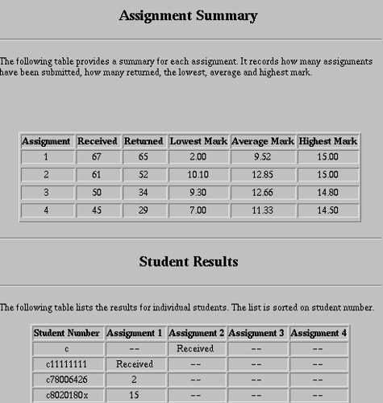

Further reflections on the work around online assignment submission are available in the following more recent publications

- David Jones, Mary Cranston, Sandy Behrens, Kieren Jamieson, (2005). What makes ICT implementation successful: A case study of online assignment submission, Presented at ODLAA’2005  
    
- David Jones, Sandy Behrens, (2003). [“Online Assignment Management: An Evolutionary Tale”](/blog2/publications/online-assignment-submission-an-evolutionary-tale/), Hawaii International Conference on System Sciences, vol. 5, no. 5, pp. 156c, 36th Annual Hawaii International Conference on System Sciences (HICSS’03) – Track 5, 2003.

David Jones, Bruce Jamieson, Three Generations of Online Assignment Management, Rod Kevill, Ron Oliver, Rob Phillips (editors),What Works and Why, Proceedings of ASCILITE’97, Perth, Australia, pp 317-323

## Abstract

There are a number of problems with traditional assignment management schemes that can be addressed by online assignment management using the Internet, email and the World-Wide Web. This paper reports on three years experience at Central Queensland University (CQU) with three different online assignment management systems. This experience has shown that online assignment management can address many of the problems associated with traditional methods, provide reductions in both marking and turn-around time and provide a number of new benefits. However, it has also demonstrated the importance of automation, appropriate training, reliable and appropriate technology, modifications in practice and administrative support in order to achieve significant benefits.

## Introduction

The resource intensive nature of assessment can often decrease the quality of the feedback provided to students (Oliver and Mitchell, 1996). Providing timely, meaningful feedback on student progress is essential and can influence student results. Problems associated with traditional assignment management approaches contribute significantly to assignment turnaround time while much of the process of performing assessment is mechanical, repetitious and a perfect candidate for the application of information technology. It is the combination of these factors that is driving interest in online assignment management systems by many educators and institutions throughout the world.

This paper describes experience at CQU with three generations of online assignment management over the last three years by on-campus and distance computing students. The paper starts by describing the problems associated with the traditional form of assignment management. The next section describes in some detail the experience of using each of the three online assignment management systems. In closing the paper describes the next generation system to be used at CQU.

## Problems with traditional methods

The move to an online assignment management system at CQU was driven by a number of problems with the traditional approach including

- packaging  
    One of the most laborious tasks in marking an assignment is dis-entombing the disks and print outs from assignment packaging (which can include removing staples from disks). At the other extreme are badly packaged assignments from which components fall out of during delivery.
- slow delivery time  
    A significant proportion of the turnaround time for distance students is the time taken to deliver assignments via the postal service.

- process duplication  
    CQU units are now being offered via a number of different modes including: traditional on-campus, commercial campus, distance and overseas campus. Each mode uses a different form of traditional assignment submission system. This variety makes it difficult to document the appropriate procedure for students to follow and to identify problems.
- moderation problems  
    There is a trend, especially for overseas campuses, for campuses to use local markers for all units. This leads to moderation and consistency problems.
- human error  
    The traditional assignment management process includes a very complex process that includes a large amount of handling by a number of different people. The complexity of the process increases the likelihood of errors.
- corruption  
    Many of the units offered by the Department of Mathematics and Computing requires that students submit programs on floppy disk. It is not unusual for these disks to be corrupted either by staples or other mistreatment during the delivery stage.
- storage and retrieval  
    It is not uncommon for a student to contact a lecturer to query a returned assignment. In most cases the only record of the assignment a lecturer will have is the final mark (if that). With only this information it is difficult to make meaningful comments.

- availability of markers  
    Central Queensland does not have a large computing industry that means that most CQU computing graduates move to capital cities to work. This means that the pool of qualified markers, especially for advanced level computing subjects, is very small.

## Three online methods

Online assignment management systems have been used within the Department of Mathematics and Computing at CQU since 1995, mainly in two advanced level computing units. The following section describes in detail the experience of using three different generations of the system. Due to space limits only three of the six semesters which have used online submission will be described. An overview of these semesters is shown in Table 1.

| Method | Course | Student numbers | Online assignments |
| --- | --- | --- | --- |
| Manual email | 85321, Systems Administration (1st half 1995) | 77 total   57 distance | ~20 |
| Automated email | 85349, Operating Systems (2nd half 1995) | 174 total   109 distance | ~50 |
| Automated Web | 85321, Systems Administration (1st half 1997) | 116 total   73 distance | ~100 |

**Table 1 - Summary of 3 semesters of online assignment management**

### Manual email

The first online assignment submission system was entirely manual, email-based and used by distance students only. The submission process consisted of the following steps

1. Student emails assignment to the lecturer.
2. Lecturer manually acknowledges receipt, saves the assignment and forwards a copy to the marker.
3. The marker marks the assignment and returns it to the student with a copy going to the lecturer for archival purposes.

In 1995 widespread use of the Internet was still rare and relatively primitive. For example 80% of assignments submitted using email were sent using text-based email programs with only 20% using graphical user interface (GUI) based tools such as Pegasus. Table 2 provides an overview of the performance of this approach.

|  |  | Turnaround time |  |  |
| --- | --- | --- | --- | --- |
| Assignment | \# Submitted online | Min | Avg | Max |
| 1 | 20 | 9 | 33 | 46 |
| 2 | 18 | 0 | 30 | 33 |
| 3 | 18 | 2 | 12 | 26 |
| 4 | 14 | 14 | 25 | 39 |

**Table 2 - Results of manual email assignment management**

As can been seen in Table 2 the turn-around time on assignments was far from good. The major cause of this was problems with the marker being unavailable due to personal reasons at important times during the semester. This influenced turnaround times for both online and traditional assignment management systems.

### Reflection

This initial foray into online assignment management led to the following observations

- the technology was new  
    Using this system was the first experience many students (and the marker) had of email attachments and sending large binary files by email. Inexperience with the technology led to students and the marker having to spend significant amounts of time working out how to perform simple tasks. Appropriate training would be necessary for future use of online assignment management.
- the technology was of low quality  
    The difficulty of using the text-based tools and the poor speed and quality of connections led to many frustrations on the part of students and the marker. It was hoped that the trend towards GUI-based tools would address this problem.
- automation is necessary  
    Even with only 20 students using the online system, the lack of automation in the process generated more work for the lecturer than with the traditional approach.
- expectations change  
    With traditional assignment submission it can be one or two weeks before students receive acknowledgment that their assignment has reached CQU. However, the immediate delivery provided by email led students to expect immediate acknowledgment - even on weekends!
- appropriate feedback is still important.  
    The level of comments on some of the assignments were minimal and led to student complaints.

## Automated email submission

While not a great success the first attempt did provide some promise of the benefits that a suitable system combined with appropriate support could offer. The next online assignment management system was entirely automated, using Perl scripts, but still relied on email for assignment submission. The process was:

1. Student sends the assignment to an email address using a specific format for the subject line of the email message.
2. A Perl script saves the assignment in an archive, forwards a copy to the marker, updates a results Web page (Figure 1) to indicate receipt and sends an acknowledgment back to the student.
3. Once marked the marker returns the assignment to the student with a copy going to another email address.
4. At this other email address a Perl script saves the marked assignment in an archive and updates the results Web page (Figure 1).

**Figure 1 - Results sheet automatically generated**

This process was used in the second half of 1995 and the first half of 1996. Table 3 provides a summary of the results from the first use of the system in 1995. Other changes from the manual online assignment management system included a new marker and the fact that all the online assignments were submitted using GUI email programs such as Eudora or Pegasus.

|  |  | Turn-around time in days |  |  |
| --- | --- | --- | --- | --- |
| Assignment | \# submitted online | Min | Avg | Max |
| 1 | 57 | 0 | 9 | 31 |
| 2 | 50 | 0 | 9 | 19 |

**Table 3 - Results of automated email system, 2nd semester 1995**

It should be noted that assignments submitted before the due date were not marked until the due date. This contributes somewhat to the turn-around times listed in Table 3.

### Reflection

Observations from the first use of this automated email system included

- appropriate computing resources are required  
    The marker had a number of problems due to insufficient or inappropriate computing resources. The email program used to mark assignments did not understand binhex or uuencoded messages and the limit on his email account had to be extended several times.
- students had too much freedom  
    Assignment submission involved the student placing an "information" string on the subject line of the email (e.g 85349: Q11111111, Assignment 1) and then attaching the actual assignment. Both these tasks entailed too much freedom of implementation by students. This led to the use of numerous, incorrect methods which made the extraction process quite complex and time consuming.
- online marking took longer the traditional marking  
    The online submission system ran in parallel with the traditional method. The combination of the two factors above meant that marking online assignments took between 2 and 10 minutes longer than traditional assignments.
- turnaround time was much faster  
    The online system provided much faster turnaround time on student assignments and there were a number of positive comments from the students who appreciated this.
- improving technology  
    The use of GUI based tools made the process much simpler for students and increased their positive feelings towards the approach.
- enabling new practice.  
    The Web page (Figure 1) automatically generated by this system was the first time most students were able to see where they were in relation to the rest of the class.

## Automated Web management

The advent of the file upload capability for Web browsers (introduced in Netscape version 2.0) led to the development of a completely Web-based assignment management system. This system has been used since the second semester of 1996. Table 4 provides a summary of the systems use during the first semester of 1997.

|  |  | Turn-around time in days |  |  |
| --- | --- | --- | --- | --- |
| Assignment | \# submitted online | Min | Avg | Max |
| 1 | 100 | 1 | 2 | 7 |
| 2 | 98 | 0 | 17 | 30 |
| 3 | 99 | 0 | 5 | 14 |

**Table 4 - Results of automated Web system, 1st semester 1997**

With this system assignment management consisted of the following steps

1. Student connects to a specific Web page, enters their student number and chooses the assignment to submit.
2. The system presents a page specific to the assignment that contains specific instructions and the correct number of file upload elements.
3. Student selects the location of the assignment files on their local computer and hits submit.
4. The files are placed onto the Web server (in a secure area) and the student sees a page that lists the size of the assignment files on the server (used by the student to ensure safe uploading).
5. A password protected Web page provides the marker with access to all student assignments.
6. After downloading an assignment, comments and marks are entered via another Web page.
7. Assignments are returned via another Web page.

Like the email system this system uses Perl scripts and maintains a results page similar to Figure 1.

### Reflection

During the use of this system and number of observations were made including:

- Word viruses  
    It was during this time that Word viruses became prevalent. To address this problem, students were instructed to submit assignments as Text, RTF or HTML documents, however a quarter or more were submitted in a word processed format. During the early stages of this problem it was policy to open documents if possible, requesting resubmits only as a last resort - this changed quickly.
- online marking was quicker than traditional marking  
    With three to four semesters of online marking experience, better resources and a better system which significantly reduced the overhead of online marking it was found that online marking was taking 20-30% less time than marking traditional assignments.
- still too much freedom  
    Even thought students received specific instructions about acceptable file formats (RTF, text and HTML) at least 25% submitted the wrong format. This was mainly because the system did not automatically prevent incorrect formats. This was the cause of a majority of the problems with this approach.
- technical problems  
    Technical problems with the server affected availability and caused the remainder of the problems encountered.
- hostility towards change and the perception of increased workload  
    
    It was during this stage that all students, both on-campus and distance students, were encouraged and in some cases required to use the online submission system. A fair proportion of the on-campus students exhibited hostility and resistance to the system. It was reported that it "involved too much work" to submit via email of the web or that it was "too hard"!!!
- positive feedback  
    Feedback from distance students, who had more to gain from the system, was excellent and nearly always positive. While a student may have only received 6/10 for an assignment, they often commented that it was great to get their assignment back so quickly with comments.
- privacy  
    The results page generated by this system includes a list of all students doing the unit including their student number and their assignment results. Second semester 1997 was the first time a student requested that his information not be made available in this way.
- increasing server requirements  
    Student assignments submitted using the online system consumed 106Mb of disk space. Widespread use of this system, especially in larger units, would require significant amounts of disk space. It is also necessary for the system to be available 24 hours a day, 7 days a week.
- Internet Explorer  
    It is only now (last half of 1997) that the latest versions of Internet Explorer support the file upload necessary to submit assignments. This has meant that students with Internet Explorer had to email their assignments to the lecturer who would then use a Netscape browser to submit the assignment.
- changing practice  
    Online assignment submission offers a system which can turn-around student assignments immediately. This system and the move to more flexible learning may mean that traditional practice, waiting until the due date and marking all assignments, will have to change.
- changing costs  
    A significant amount of the lecture?s time was spent ensuring that the server was available and working properly. Currently at CQU the Division of Distance and Continuing Education (DDCE) is funded to provide administrative support for the submission of assignments by distance students. With online assignment submission these services are no longer required. However new costs such as hardware, technical support and changing marking practices do require funding.

## The next generation

The system used at CQU is undergoing further development and expansion including

- increased security  
    Each student will have a unique username/password that will enable them to review and check on their assignments. Forms of encryption may also be included.
- automatic allocation of assignments to markers  
    Lecturer?s will be able to program the system to automatically channel assignments to appropriate markers. For example, a marker based in Hong Kong will receive all the assignments from Hong Kong students. This feature could be used to support peer assessment.
- automated event notification  
    This feature will automatically generate email messages to appropriate people in response to events including students not submitting assignments by the due date or markers taking too long to mark assignments.
- automated file checking  
    This feature would check the files submitted by students to ensure that they are the specified format and eventually that they are virus free.
- data mining  
    With all assignments stored on a central server it will be possible to perform numerous types of analysis to identify trends, student performance across degrees and plagiarism.
- automatic marking systems  
    There are a number of automated marking systems, such as Ceildh (http://www.cs.nott.ac.uk/~ceilidh), that could be incorporated into the system to further automate the system.
- improved assignment annotation  
    The current Web-based system uses a fairly primitive method to allow markers to make annotations on student assignments. Hypertext, Word templates (Price and Petre, 1997) or systems such as CleverX (http://www.cleverx.com/) and Markin (http://www.net-shopper.co.uk/creative/education/languages/martin/markin.htm) could be incorporated into the system to improve this.
- integration with other University databases.  
    While CQU uses a central database for student records, which includes a Web interface, transcription of student results into this database is still primarily done via paper and physical data entry. Integrating the assignment management system with these databases will greatly decrease the resources required and the possibility of human error during transcription.

The system being used and under development at CQU is part of Webfuse (http://webfuse.cqu.edu.au). A freely available system for creating and maintaining Web sites which runs on both UNIX and Windows NT/95 servers.

## Conclusions

As many expect, online assignment management makes it possible to reduce assignment turn-around time, can reduce the time taken to mark individual assignments and provide the opportunity to implement a number of new approaches to assessment. However achieving this is not a straight forward process and cannot be achieved without appropriate technical, training, and administrative support. It is important to note that the technical difficulties associated with online assignment management are simple in comparison to the organisational and administrative changes necessary.

## References

Brian Oliver, Geoffrey Mitchell (1996), Setting the PASE - The Value of Computer Aided Assessment, Proceedings of the First Australasian Conference on Computer Science Education, John Rosenberg (editor), pp 103-110

Blaine Price, Marian Petre, (1997), Teaching Programming through Paperless Assignments: an empirical evaluation of instructor feedback, Proceedings of Integrating Technology into Computer Science Education, SIGCSE Bulletin, 29(3), Gordon Davies (editor), September 1997, pp 94-99